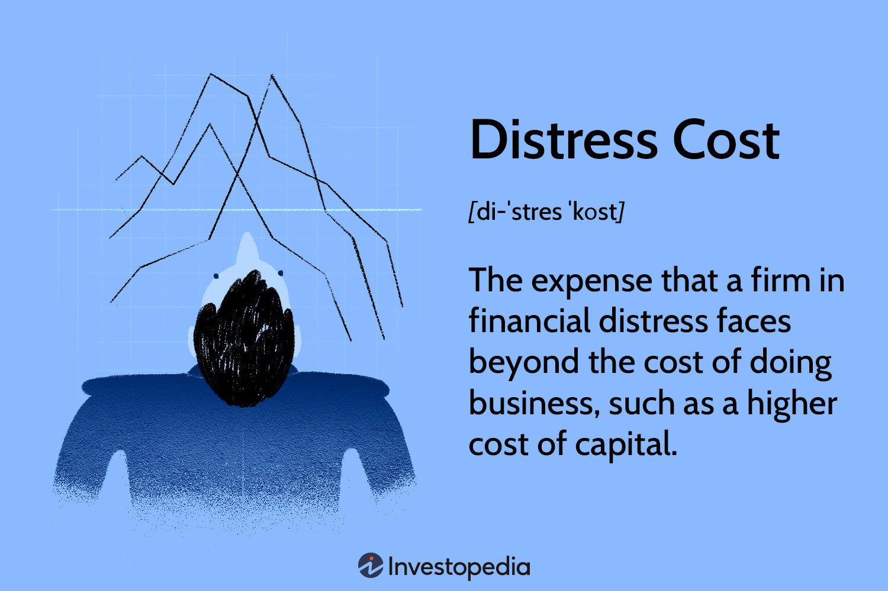

Understanding financial distress costs and the role of algorithmic trading is essential for investors and firms striving to maintain financial stability and optimize their financial strategies. Financial distress costs embody the expenses that a company faces when experiencing financial challenges. These costs can manifest as increased borrowing expenses, reduced operational productivity, and impaired strategic decision-making. Analyzing these costs provides insights into a firm's financial health, its ability to secure capital, and the implications for its operational continuity.

Algorithmic trading, a sophisticated technique leveraging computational algorithms to execute trading orders, has revolutionized the financial industry. This technology facilitates rapid trading at efficiencies beyond human capacity, influencing market dynamics in profound ways. By quantifying market data and employing statistical models, algorithmic trading offers a unique avenue for evaluating and potentially mitigating financial distress costs. For example, algorithms can analyze vast datasets to identify patterns in a firm's financial metrics that signify impending financial distress, allowing for preemptive adjustments.



The calculation of financial distress costs typically involves a detailed examination of financial statements, focusing on indicators such as negative cash flow and elevated interest payments. High debt levels and increasing interest rates often signal rising distress, necessitating careful monitoring. Through these analyses, firms can benchmark their distress costs against industry peers and gauge the profitability impacts associated with these financial burdens.

Harnessing the power of algorithmic trading enables firms to analyze these distress indicators with unprecedented accuracy. Algorithms can continuously monitor and interpret financial data, providing real-time insights into distress levels and enabling more agile strategic responses. This integration of advanced technology with traditional financial analysis represents a transformative approach to managing financial health.

In summary, this article highlights the critical intersection between financial distress costs and algorithmic trading. By understanding and utilizing these concepts, firms and investors can better navigate financial challenges, leveraging technology to enhance their analytical capabilities and strategic responses to maintain robust financial health.

## Table of Contents

## What Are Financial Distress Costs?

Financial distress costs are the expenses that a company incurs when it is experiencing financial difficulties, outside of routine operational expenses. These costs have a significant impact on the financial well-being and sustainability of a business, potentially affecting its ability to continue as a going concern.

Examples of financial distress costs include higher borrowing costs due to increased risk perceived by lenders. When a company is in financial trouble, creditors may impose higher interest rates to compensate for the elevated risk, leading to an increase in borrowing costs. Additionally, productivity may decline during financial distress as the firm might face operational disruptions, reduced morale among employees, and a diversion of management's focus away from core business activities.

Distress costs can be classified into two categories: ex-ante and ex-post costs. Ex-ante costs occur in anticipation of financial distress, such as costs associated with hedging financial risks and expenses incurred in securing more flexible debt arrangements. Ex-post costs arise after financial distress has set in. These include legal and administrative expenses linked with restructuring or bankruptcy processes and the loss in firm value due to market perceptions and stakeholder concerns.

Tangible distress costs involve direct financial losses that are quantifiable, such as legal fees, restructuring costs, and higher interest payments. Intangible distress costs, on the other hand, relate to non-quantifiable impacts like damage to business reputation, loss of customer trust, and diminished employee morale. Both tangible and intangible distress costs bear significant implications, as they can erode a company's competitive position and market value.

Financial distress can severely impact a company's ability to raise capital and maintain operations. The increased risk associated with distress can lead to deteriorating credit ratings, making it difficult or impossible to access external financing on favorable terms. In severe cases, the inability to secure necessary capital may lead to insolvency, forcing the company to cease operations or undergo restructuring. These scenarios underscore the importance of effective financial planning and management to mitigate distress costs and ensure long-term organizational resilience.

## Calculating Financial Distress Costs

Calculating financial distress costs involves a detailed analysis of a firm's financial statements to identify and quantify the expenses incurred during periods of financial instability. This assessment can provide crucial insights into a company's financial health and guide strategic decision-making.

A step-by-step approach to calculating financial distress costs begins with examining the key indicators visible in financial statements. One primary indicator is negative cash flow, which highlights a company's inability to generate sufficient cash from its operations to meet its obligations. Persistent negative cash flow can signal financial distress and lead to further complications such as increased borrowing or asset liquidation.

Additionally, high-interest payments are a significant concern. They signify the burden of debt on a company and its capacity to service that debt. Calculating the cost of these high-interest payments involves a comprehensive understanding of the company's total debt obligations and the interest rates applicable to each. An increase in interest payments reduces the net income available for reinvestment and growth.

The role of debt levels in evaluating financial distress costs cannot be overstated. High leverage ratios, such as debt-to-equity, indicate a heavy reliance on borrowed funds, which can exacerbate financial distress during volatile market conditions. Interest rates, both current and future expectations, further influence these costs. Rising interest rates can elevate the cost of existing debt and deter new financing.

To derive a company's distress costs compared to peers, analysts use benchmarking techniques. By comparing financial ratios and indicators with industry standards or direct competitors, analysts can assess whether a firm is experiencing above-average distress costs. Tools such as z-scores or the Altman Z-score can be employed to statistically evaluate a company’s risk of bankruptcy, offering a comparative measure of financial health.

Finally, the profitability impact of growing distress costs on business operations must be considered. As a firm incurs higher distress costs, profitability is likely to decrease. This relationship can be explored through the evaluation of net profit margins, return on assets (ROA), and return on equity (ROE). Diminished returns may indicate inefficiencies and necessitate restructuring efforts to mitigate distress impacts.

The meticulous calculation and analysis of financial distress costs through these methodologies enable companies to proactively manage financial challenges and refine their operational strategies.

## Algorithmic Trading Explained

Algorithmic trading, often referred to as algo-trading, is a method that uses complex algorithms and mathematical models to make high-speed decisions and transactions in financial markets. Its primary purpose is to leverage computational power and pre-defined instructions to execute orders more efficiently and effectively than manual trading. This kind of trading is extensively used in modern financial markets due to its ability to handle large volumes of trading at speeds much faster than a human trader.

The core components of trading costs in [algorithmic trading](/wiki/algorithmic-trading) include brokerage fees, the bid-ask spread, price impact, and opportunity cost. Brokerage fees are the charges levied by brokers for executing trades on behalf of clients. The bid-ask spread represents the difference between the highest price a buyer is willing to pay and the lowest price a seller is willing to accept, serving as a measure of market [liquidity](/wiki/liquidity-risk-premium) and transaction cost. Price impact refers to the effect that a trade has on the market price of the asset being traded. When large orders are executed, they can move the market price unfavorably, leading to higher costs. Opportunity cost is the potential gain lost when choosing one investment over another, often influenced by the time it takes to execute a trade.

Algorithmic trading serves as an important tool for analyzing these trading cost components to enhance trading efficiency. By employing algorithms, traders can optimize the timing and sizing of trades to minimize price impact and other transaction costs. Algorithms can assess market conditions in real-time, allowing for more precise decision-making and quicker execution, which is crucial in fast-moving markets.

In terms of optimizing and minimizing financial distress costs, algorithmic trading can play several roles. It can help in reducing borrowed capital costs by strategically timing and executing trades to minimize interest expenses associated with holding positions. Additionally, by improving the liquidity and reducing the [volatility](/wiki/volatility-trading-strategies) risk in a firm's stock, algorithmic trading can enhance a company's ability to raise capital, thereby directly impacting its financial distress costs.

Understanding algorithmic markets and their operational methodology is vital for investors and firms aiming to navigate financial markets effectively. A comprehensive grasp of how algorithms function, including their design and implementation, is crucial in exploiting their potential benefits while mitigating risks such as algorithmic errors or manipulations, which can adversely affect financial stability.

In conclusion, algorithmic trading stands out not only as a method for executing trading strategies more efficiently but also as a means of potentially reducing financial distress costs through strategic cost management and optimized trading operations.

## The Intersection of Financial Distress Costs and Algorithmic Trading

The integration of algorithmic trading in financial markets provides unique opportunities for identifying and analyzing financial distress costs. Algorithmic trading refers to the use of computer algorithms to automate trading strategies, capitalizing on market opportunities more rapidly than traditional methods. A significant benefit of algorithmic systems is their ability to process vast datasets and discern patterns indicative of financial distress, which might elude manual analysis.

### How Algorithmic Trading Aids in Identification and Analysis

Algorithmic trading systems employ sophisticated models to decipher financial health metrics from multiple sources, including financial statements, trading volumes, and market sentiment. By analyzing these indicators, algorithms can identify early signs of distress such as declining cash flows or unusual trading patterns.

#### Examples of Algorithms Used to Predict Financial Distress

Algorithms designed for predicting financial distress often incorporate [machine learning](/wiki/machine-learning) techniques, which enable them to improve predictive accuracy over time. A common approach is the use of logistic regression models, enhanced by machine learning techniques such as random forests or neural networks. These models can be trained on historical data to recognize distress indicators, such as high leverage, diminishing liquidity, or substantial deviations in key financial ratios.

Consider an example in Python utilizing a simple logistic regression model to predict distress:

```python
from sklearn.linear_model import LogisticRegression
from sklearn.model_selection import train_test_split
from sklearn.metrics import accuracy_score

# Sample dataset with financial indicators
# X = financial indicators (e.g., debt ratio, cash flow)
# y = binary distress indicator (1 for distress, 0 for healthy)
X_train, X_test, y_train, y_test = train_test_split(X, y, test_size=0.2, random_state=42)

# Train logistic regression model
model = LogisticRegression()
model.fit(X_train, y_train)

# Predictions
y_pred = model.predict(X_test)

# Evaluate accuracy
accuracy = accuracy_score(y_test, y_pred)
print("Accuracy of distress prediction model:", accuracy)
```

### Case Studies or Scenarios of Algorithmic Impact

In practice, several firms have benefited from using algorithmic trading to navigate financial distress. For instance, a distressed firm might use algorithms to optimize stock sales, minimizing costs and preserving cash flow by identifying the optimal times to execute trades based on predictive analytics. These strategies are particularly beneficial for companies in volatile industries, where distress signals can rapidly affect market valuation.

### Benefits of Integrating Algorithmic Trading with Distress Cost Analysis

The integration of algorithmic trading with distress cost analysis enhances decision-making by providing actionable insights quickly and accurately. Algorithms help quantify distress costs by evaluating their impact on market variables such as credit spreads and equity volatility. This allows firms to react more swiftly and effectively to financial stressors, potentially mitigating further financial fallout.

### Challenges and Limitations

Despite its advantages, the use of algorithmic trading to navigate financial distress faces several challenges. Algorithm development demands significant technical expertise and a comprehensive understanding of both market dynamics and distress indicators. Moreover, algorithms are not infallible; they may misinterpret data or be subject to biases based on historical trends that do not account for unprecedented market events.

Additionally, algorithmic trading systems require substantial computational resources and may impose setup costs, which can be prohibitive for smaller firms already experiencing financial strain. These systems also need constant updates and monitoring to remain effective in dynamically evolving markets.

In conclusion, while there are substantial benefits to employing algorithmic trading for the analysis and management of financial distress costs, these advantages must be weighed against the inherent complexities and resource demands of developing and maintaining such systems.

## Conclusion

Understanding financial distress costs is essential for organizations aiming to maintain robust financial health. Recognizing these costs enables firms to anticipate financial difficulties and adopt strategies to mitigate their impact. As businesses face distress costs like heightened borrowing expenses and reduced productivity, the thorough analysis of these costs is crucial to sustaining operations and securing capital effectively.

Algorithmic trading emerges as a powerful tool in mitigating financial distress. By leveraging advanced computational techniques, algorithmic trading can enhance the analysis and management of distress costs. It enables the identification of patterns and anomalies in financial data, providing insights that can help organizations preemptively address potential distress scenarios. Algorithms designed to predict financial distress can inform decision-makers, allowing them to implement timely corrective measures.

Proactive assessment and response strategies, facilitated by modern technology, are imperative. As the complexities of the financial markets grow, embracing technological advancements becomes indispensable. Organizations should consider integrating algorithmic tools that offer real-time risk assessments and adjust strategies accordingly. This proactive stance not only aids in reducing distress costs but also fortifies an organization's financial agility.

Looking ahead, algorithmic trading is poised to evolve, playing an increasingly pivotal role in navigating financial distress. Emerging trends such as machine learning and big data analytics are set to enhance algorithmic capabilities, offering more precise risk predictions and management solutions. These developments will likely render algorithmic trading an even more integral component of financial distress strategies.

Finally, the role of thorough analysis and adaptive strategies cannot be overstated. As financial environments fluctuate, businesses must remain vigilant, continuously refining their approaches to financial distress. Employing a blend of analytics, technology, and strategic foresight will not only mitigate distress costs but also foster sustainable financial health.

## References & Further Reading

[1]: Bergstra, J., Bardenet, R., Bengio, Y., & Kégl, B. (2011). ["Algorithms for Hyper-Parameter Optimization."](https://dl.acm.org/doi/10.5555/2986459.2986743) Advances in Neural Information Processing Systems 24.

[2]: ["Advances in Financial Machine Learning"](https://www.amazon.com/Advances-Financial-Machine-Learning-Marcos/dp/1119482089) by Marcos Lopez de Prado

[3]: ["Evidence-Based Technical Analysis: Applying the Scientific Method and Statistical Inference to Trading Signals"](https://www.amazon.com/Evidence-Based-Technical-Analysis-Scientific-Statistical/dp/0470008741) by David Aronson

[4]: ["Machine Learning for Algorithmic Trading"](https://github.com/stefan-jansen/machine-learning-for-trading) by Stefan Jansen

[5]: ["Quantitative Trading: How to Build Your Own Algorithmic Trading Business"](https://www.amazon.com/Quantitative-Trading-Build-Algorithmic-Business/dp/1119800064) by Ernest P. Chan