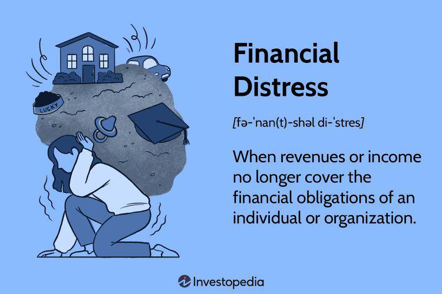

In today's financial landscape, maintaining financial health is essential for individuals and organizations alike. Financial health is a critical indicator of one's ability to manage and meet financial obligations without undue stress. However, financial distress, which is characterized by an inability to fulfill these obligations, can profoundly affect financial stability. This state can arise from various factors such as inadequate income, excessive debt, poor financial management, or unforeseen economic challenges. The repercussions of financial distress can be severe, leading to potential bankruptcy, inability to invest in growth opportunities, and diminished quality of life.

To address the challenges of maintaining financial stability, innovative solutions are gaining prominence. One such advancement is algorithmic trading (algo trading), which leverages technology and data-driven insights to navigate financial markets more effectively. In recent years, algo trading has emerged as a potential remedy to certain financial challenges, offering enhanced precision, speed, and the ability to capitalize on market opportunities that may otherwise be overlooked.



This article will explore the intricate dynamics of financial health and distress, shedding light on the indicators of financial distress and strategies to remedy this state. Additionally, it will examine the role of algo trading in achieving and maintaining financial stability. By understanding these concepts, individuals and organizations can better position themselves to tackle financial challenges and secure their financial futures.

## Table of Contents

## Understanding Financial Health and Distress

Financial health is a critical component of overall well-being for both individuals and organizations. It refers to a state wherein financial resources are stable, debts are manageable, and credit scores reflect good financial standing. The assessment of financial health is often based on several indicators such as net worth, debt-to-income ratio, credit usage, and the ability to meet financial obligations without excessive strain.

Financial distress, on the other hand, marks a condition where revenues or income fall short of covering financial obligations, which can potentially lead to severe consequences such as bankruptcy. The signs of financial distress often manifest as mounting debt levels, decreasing income, and a consistent struggle to pay bills on time. Understanding these early warning signals is crucial, enabling individuals and businesses to take preemptive measures before the situation escalates into a severe financial crisis.

Several factors can lead to financial distress. Poor management decisions, such as inadequate budgeting or ineffective financial planning, play a significant role. High leverage, where there is excessive borrowing relative to income, increases vulnerability to financial shortfalls, especially during economic downturns. Declining sales or revenue streams can also put pressure on financial stability, particularly when fixed costs remain constant.

One way to assess potential financial distress is through financial ratios. For instance, a high debt-to-equity ratio may indicate over-leveraging, while margin ratios can highlight the inefficiency in managing expenses in relation to revenues. Additionally, cash flow statements provide insight into [liquidity](/wiki/liquidity-risk-premium) and the ability to sustain operations over time.

Addressing financial distress requires timely recognition and strategic intervention. Implementing measures such as restructuring debt, improving management practices, and utilizing financial tools can help restore financial stability and health.

## Remedies for Financial Distress

Addressing financial distress effectively requires strategic approaches that focus on improving cash flow, reducing costs, and increasing income, combined with appropriate professional advice. One widely recognized solution is the restructuring of debt. By extending repayment periods and negotiating lower interest rates, individuals and organizations can alleviate immediate financial pressure and create a manageable path forward. For example, refinancing existing loans can potentially lead to reduced monthly payments, thus easing cash flow constraints.

Cash flow management is another critical pillar in the strategy for overcoming financial distress. Optimizing accounts receivables by ensuring timely collection of outstanding debts and strategically managing accounts payables to maximize the cash remaining in the business are essential actions. Effective cash flow management helps ensure that an organization or individual can meet regular expenses without additional borrowing.

Cost control measures significantly contribute to mitigating financial distress. Organizations can undertake a thorough analysis of their operational expenses to identify areas where spending can be reduced without affecting core operations. This might include renegotiating supplier contracts, reducing energy usage, or even downsizing facilities. Such measures are instrumental in preserving financial resources and ensuring the sustainability of operations.

Exploring opportunities to increase income is also a crucial aspect. Whether through additional employment opportunities, launching a side business, or strategic investments, increasing income can provide the necessary boost to stabilize financial situations. For individuals, participating in the gig economy or freelance work offers flexibility and the potential for supplemental earnings. For businesses, diversifying product lines or entering new markets can enhance revenue streams.

Professionals such as financial advisors and credit counselors play an invaluable role in guiding individuals and businesses through financial distress. These experts analyze specific financial situations and recommend tailored strategies that align with long-term financial goals. Their insights can help in devising comprehensive plans that encompass debt management, investment strategies, and budgeting advice.

In conclusion, addressing financial distress involves a multifaceted approach focusing on debt restructuring, cash flow management, cost control, income generation, and expert advice. By implementing these strategies effectively, individuals and organizations can regain financial stability and resilience.

 to Algorithmic Trading

Algorithmic trading involves the use of pre-defined computer programs to execute trades at high speeds, significantly transforming the landscape of modern finance. At its core, these algorithms leverage data-driven strategies to identify trading opportunities that are often missed by human traders due to the sheer [volume](/wiki/volume-trading-strategy) of available data and the speed at which the market moves. These programs analyze various market conditions, such as price, volume, timing, and other mathematical models, to make informed trading decisions.

The primary advantage of algo trading is its ability to minimize human error, which can often arise from emotional biases or fatigue. By automating the trading process, algorithmic strategies enhance precision and efficiency, making split-second decisions that can capitalize on small price movements. This is particularly beneficial in high-frequency trading, where the speed of execution is crucial.

Algorithmic trading has gained popularity among both retail and institutional investors. Institutional investors, like mutual funds and pension funds, use algorithms to manage large volumes of trade securely and efficiently. Meanwhile, retail investors can utilize these algorithms to implement intricate trading strategies that would be challenging to execute manually. This democratization of advanced trading strategies empowers a wider audience in the financial markets.

Python is a common programming language used to develop trading algorithms due to its robust libraries and community support. A simple example of a trading strategy in Python might involve using the Moving Average Crossover strategy:

```python
import pandas as pd
import numpy as np

def moving_average_crossover(prices, short_window=40, long_window=100):
    signals = pd.DataFrame(index=prices.index)
    signals['price'] = prices
    signals['short_mavg'] = prices.rolling(window=short_window, min_periods=1, center=False).mean()
    signals['long_mavg'] = prices.rolling(window=long_window, min_periods=1, center=False).mean()
    signals['signal'] = 0.0
    signals['signal'][short_window:] = np.where(signals['short_mavg'][short_window:] > signals['long_mavg'][short_window:], 1.0, 0.0)
    signals['positions'] = signals['signal'].diff()

    return signals
```

The code above calculates the short-term and long-term moving averages of a stock's price. It generates buy or sell signals based on the crossover of these moving averages — a common, straightforward strategy among traders. As traders become more sophisticated, they combine multiple algorithms and signals to devise complex strategies that allow for optimized portfolio performance.

In conclusion, [algorithmic trading](/wiki/algorithmic-trading) represents a significant advancement in trading methodologies, providing a toolset that allows investors to maximize returns while minimizing potential errors associated with manual trading. By leveraging technology and data-driven insights, algo trading continues to shape the future of financial markets.

## Benefits of Algo Trading in Remedying Financial Distress

Algorithmic trading (algo trading) offers several advantages that can play a pivotal role in remedying financial distress for both individuals and institutions. Firstly, algo trading enhances financial performance through the automation of trading strategies, leveraging speed and efficiency that manual trading often lacks. By utilizing algorithms, traders can swiftly identify and capitalize on market opportunities, executing trades at speeds unattainable by human traders. This precision and speed allow for the minimization of latency, thereby improving a trader's position relative to price changes.

A critical benefit of algo trading lies in its ability to improve liquidity. Markets are dynamic, with prices and volumes changing rapidly. Algorithms are designed to react instantaneously to these changes, ensuring that traders can modify positions or enter new trades based on real-time market conditions. This adaptability is crucial in maintaining liquidity and stabilizing a portfolio even in volatile markets, a common scenario during financial distress.

Algo trading also opens avenues for higher returns by facilitating the execution of complex strategies that would be challenging to achieve manually. These strategies include statistical [arbitrage](/wiki/arbitrage), market-making, [trend following](/wiki/trend-following), and mean reversion, among others. For instance, arbitrage strategies involve exploiting price differences of the same asset across different markets, which requires rapid execution that only automated systems can provide effectively. Python libraries like `pandas` and `numpy` are often employed to analyze and optimize such algorithmic strategies:

```python
import pandas as pd
import numpy as np

# Example: Simple Moving Average Crossover Strategy
def moving_average_strategy(prices, short_window=40, long_window=100):
    signals = pd.DataFrame(index=prices.index)
    signals['price'] = prices
    signals['short_mavg'] = prices.rolling(window=short_window, min_periods=1).mean()
    signals['long_mavg'] = prices.rolling(window=long_window, min_periods=1).mean()
    signals['signal'] = 0.0
    signals['signal'][short_window:] = np.where(signals['short_mavg'][short_window:] > signals['long_mavg'][short_window:], 1.0, 0.0)
    signals['positions'] = signals['signal'].diff()
    return signals
```

Moreover, algo trading democratizes the trading environment, allowing retail investors to participate using Securities and Exchange Board of India (SEBI)-approved algorithms. These built-in safeguards minimize the risks inherent in manual trading, such as emotional decision-making and operational errors. SEBI regulations also ensure these algorithms maintain a degree of risk management, protecting retail investors from potentially significant losses that could exacerbate financial distress.

Overall, while algorithmic trading is neither a panacea nor devoid of risks, its tailored use can foster improved financial health by providing precise, flexible, and scalable trading solutions that manual methods cannot replicate.

## Considerations and Challenges of Algo Trading

Algorithmic trading offers numerous benefits, but its successful implementation requires a nuanced understanding of the algorithms employed and the market environment they operate within. One essential step in algorithmic trading is performing extensive back-testing and live testing. Back-testing involves evaluating algorithms against historical data to verify their potential profitability. This process helps identify the viability of trading strategies before they are deployed in live markets. It is crucial to address aspects such as overfitting during back-testing, where a strategy might perform exceptionally well on historical data but fail in live scenarios due to inherent data peculiarities.

Live testing, often referred to as paper trading or simulation, is equally important. This step involves running the algorithms in real-time market conditions without financial risk, allowing traders to observe algorithms' performance and make necessary adjustments. It highlights discrepancies between theoretical performance and practical execution due to factors like market latency or data feed variances. 

Market conditions also play a significant role in the effectiveness of algorithmic trading strategies. Algorithms must adapt to diverse market situations, such as varying liquidity levels and [volatility](/wiki/volatility-trading-strategies), which can greatly influence trading outcomes. Understanding these conditions is critical to minimizing risks and enhancing the accuracy of trading algorithms.

Compliance with regulatory standards is another pivotal consideration. Different regions have specific guidelines governing algorithmic trading. For example, in India, the Securities and Exchange Board of India (SEBI) outlines criteria for fairness and transparency in algo trading. Investors and institutions must adhere to these regulations to avoid penalties and ensure ethical trading practices. This requires staying updated on regulatory changes and aligning algorithmic strategies with compliance requirements.

An often-overlooked aspect is the potential for substantial financial losses if algorithms are inadequately monitored. Despite their precision and speed, algorithms are not infallible and can generate significant losses if not continuously supervised. Factors such as erroneous data inputs, unexpected market events, or software bugs can lead to unintended trades. Hence, setting appropriate safeguards, including robust risk management protocols, is indispensable to mitigate potential impacts. 

Additionally, ensuring algorithms have the capability for dynamic adjustments is essential. Markets are inherently unpredictable, and trading algorithms must be designed with flexibility to modify their parameters based on evolving market data. Implementing fail-safes and stop-loss orders can limit exposure during unfavorable conditions.

In conclusion, while algorithmic trading presents opportunities for enhanced financial performance, traders must navigate a landscape replete with challenges. Mastery of back-testing, understanding market conditions, regulatory compliance, and vigilant monitoring are crucial components for leveraging the full potential of algorithmic trading systems.

## Conclusion

Achieving and maintaining financial health requires a comprehensive understanding of both risks and remedies associated with financial distress. Being aware of the early warning signs, such as mounting debts and decreasing income, allows for timely interventions. Recognizing these indicators helps individuals and organizations to implement effective strategies, such as restructuring debts or exploring new income sources, to avert severe financial consequences.

Algorithmic trading has emerged as a valuable tool in managing financial challenges. When executed effectively, it can enhance financial performance by leveraging automated, data-driven strategies that minimize human error and provide precise trading decisions. These algorithms can offer high-speed reactions to market fluctuations, thereby optimizing liquidity and maximizing potential returns. However, algorithmic trading requires careful oversight and expertise, including rigorous back-testing and real-time monitoring, to ensure reliability and compliance with regulatory standards.

To secure financial stability, investors should integrate traditional financial strategies with modern technological solutions like algo trading. This dual approach allows for a balanced management of financial risks and opportunities. Continuous learning and adaptation to evolving market conditions are crucial for sustaining financial health. In view of the dynamic financial environment, staying informed about new strategies and technological advancements is essential for effectively navigating financial challenges and ensuring long-term financial well-being.

## References & Further Reading

[1]: Bergstra, J., Bardenet, R., Bengio, Y., & Kégl, B. (2011). ["Algorithms for Hyper-Parameter Optimization."](https://dl.acm.org/doi/10.5555/2986459.2986743) Advances in Neural Information Processing Systems 24.

[2]: ["Advances in Financial Machine Learning"](https://www.amazon.com/Advances-Financial-Machine-Learning-Marcos/dp/1119482089) by Marcos Lopez de Prado

[3]: ["Evidence-Based Technical Analysis: Applying the Scientific Method and Statistical Inference to Trading Signals"](https://www.amazon.com/Evidence-Based-Technical-Analysis-Scientific-Statistical/dp/0470008741) by David Aronson

[4]: ["Machine Learning for Algorithmic Trading"](https://github.com/stefan-jansen/machine-learning-for-trading) by Stefan Jansen

[5]: ["Quantitative Trading: How to Build Your Own Algorithmic Trading Business"](https://www.amazon.com/Quantitative-Trading-Build-Algorithmic-Business/dp/1119800064) by Ernest P. Chan