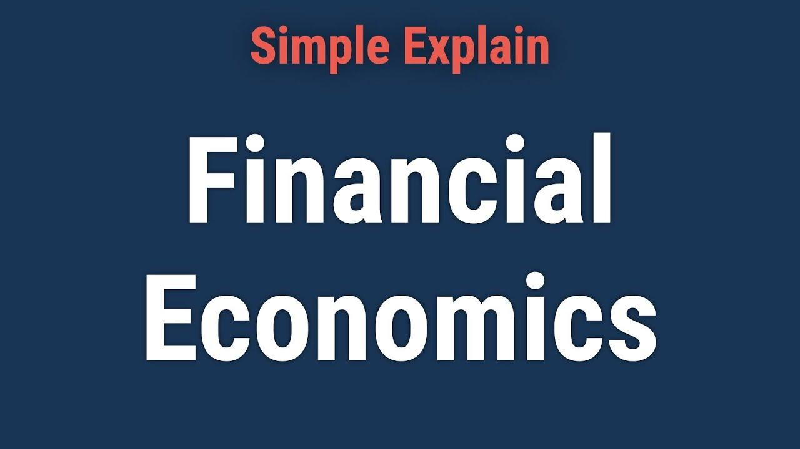

## Table of Contents

## What is financial economics and why is it important?

Financial economics is a branch of economics that focuses on how people use money, make investments, and manage financial risks. It looks at things like stock markets, interest rates, and how companies raise money. Financial economics helps us understand how financial markets work and how they affect the economy as a whole.

This field is important because it helps people and businesses make better decisions about money. For example, understanding financial economics can help someone decide whether to invest in stocks or save money in a bank. It also helps governments and policymakers create rules that make financial markets fair and stable. Without financial economics, it would be harder to manage money wisely and keep the economy running smoothly.

## What are the main topics covered in financial economics?

Financial economics covers a lot of important topics. One big topic is how people make choices about money. This includes things like deciding to save money or spend it, and choosing between different investments like stocks or bonds. Another topic is how prices in financial markets are set. This involves understanding supply and demand, and how information affects prices. For example, if a company does well, its stock price might go up because more people want to buy it.

Another key area is risk and how to manage it. Financial economics looks at different types of risk, like the chance that an investment might lose value. It also studies ways to reduce risk, such as diversifying investments or using insurance. A third important topic is how financial markets work together. This includes understanding how banks, stock markets, and other financial institutions interact and affect each other. All these topics help us understand how money moves around the economy and how to make smart financial decisions.

## How does financial economics differ from other branches of economics?

Financial economics is different from other branches of economics because it focuses on money, investments, and financial markets. While other branches like macroeconomics look at big things like unemployment and inflation, financial economics zooms in on how people and businesses manage their money. It studies things like stock prices, interest rates, and how companies raise money. This makes it very important for anyone who wants to understand how to invest or save money wisely.

Another way financial economics differs is that it pays a lot of attention to risk. Unlike microeconomics, which might focus on how individual businesses set prices, financial economics looks at the risks people face when they invest their money. It tries to figure out ways to manage these risks, like spreading investments across different types of assets or using insurance. This focus on risk and how to handle it sets financial economics apart and makes it crucial for understanding the ups and downs of financial markets.

## What are the basic methods used in financial economics research?

In financial economics research, one of the main methods used is data analysis. Researchers collect a lot of data about things like stock prices, interest rates, and how much people are saving or spending. They use this data to find patterns and understand how financial markets work. For example, they might look at how stock prices change when a company announces its earnings. By studying this data, researchers can make predictions about what might happen in the future and help people make better financial decisions.

Another important method is building models. These models are like simplified versions of the real world that help researchers understand how different parts of the financial system interact. For instance, a model might show how changes in interest rates affect the economy. Researchers use math and computer programs to create these models and test them with real data. This helps them see if their ideas about how financial markets work are correct and can be useful for making policies or investment choices.

Sometimes, financial economists also use experiments to learn more about how people make financial decisions. They might set up situations where people have to choose between different investments and see what they do. This can help researchers understand things like why some people are more willing to take risks than others. By combining data analysis, models, and experiments, financial economists can get a fuller picture of how money and markets work.

## Can you explain the concept of risk and return in financial economics?

In financial economics, risk and return are two big ideas that go hand in hand. Return is what you get back from an investment, like the money you earn from stocks or interest from a savings account. Risk, on the other hand, is the chance that you might lose money or not get as much return as you hoped. The basic idea is that the more risk you take, the higher the potential return could be. For example, investing in stocks can be riskier than keeping money in a savings account, but stocks can also offer higher returns.

This relationship between risk and return is important for making smart investment choices. If you want a safe place for your money, you might choose something with a lower return, like a savings account or a government bond. But if you're willing to take more risk, you might invest in stocks or start a business, hoping for a bigger payoff. Understanding this balance helps people and businesses decide how to invest their money, based on how much risk they're comfortable with and what kind of returns they're looking for.

## What role do financial markets play in the economy according to financial economics?

Financial markets play a big role in the economy by helping money move around. They are places where people can buy and sell things like stocks, bonds, and other investments. This helps companies get the money they need to grow and create jobs. For example, when a company sells stocks, it gets money from investors that it can use to build new factories or hire more workers. At the same time, people who buy the stocks might earn money if the company does well.

Financial markets also help people manage their money and plan for the future. By offering different kinds of investments, they give people choices about where to put their savings. Some investments are safe but don't grow much, like savings accounts. Others, like stocks, can be riskier but might offer bigger rewards. This variety helps people decide how much risk they want to take and how to save for things like buying a house or retiring. Overall, financial markets keep the economy running smoothly by making sure money goes where it's needed and helping people reach their financial goals.

## How are financial instruments like stocks and bonds analyzed in financial economics?

In financial economics, stocks and bonds are analyzed by looking at how much money they can make and how risky they are. Stocks are pieces of a company that people can buy. When you own a stock, you own a little bit of that company. If the company does well, the price of the stock might go up, and you could earn money. But stocks can also lose value if the company doesn't do well. So, financial economists study things like the company's earnings, how much it's growing, and what's happening in the world to figure out if a stock is a good investment. They use numbers and models to guess how much money a stock might make in the future.

Bonds are different. They're like loans that you give to a company or the government. In return, they promise to pay you back with interest over time. Bonds are usually safer than stocks because you know you'll get your money back as long as the borrower doesn't go bankrupt. But they usually don't grow as much as stocks. Financial economists look at things like how likely it is that the borrower will pay back the bond, how much interest it pays, and what's happening with interest rates in the economy. By understanding these things, they can tell if a bond is a good place to put money. Both stocks and bonds help people and businesses plan their money, and financial economists use a lot of information to figure out which ones are the best choices.

## What are some advanced quantitative methods used in financial economics?

In financial economics, one advanced method is called time series analysis. This is when researchers look at how things like stock prices or interest rates change over time. They use special math to find patterns and make guesses about what might happen next. For example, they might see that stock prices go up and down in a certain way and use that to predict future prices. This helps investors and companies make better choices about when to buy or sell.

Another method is called option pricing models. These models help figure out how much options are worth. Options are special kinds of investments that give you the right to buy or sell something at a set price. The most famous model is the Black-Scholes model, which uses math to calculate the price of an option based on things like how much the stock moves and how long until the option expires. This is really useful for traders who want to know if buying or selling an option is a good deal.

A third method is Monte Carlo simulation. This is a way to see what might happen in the future by running a lot of pretend scenarios. For example, if you want to know how much money you might have when you retire, you can use a Monte Carlo simulation to see many different possible outcomes. It helps people and businesses plan for the future by showing them what could happen under different conditions. These advanced methods help make financial decisions more accurate and help the economy run better.

## How does behavioral finance fit into the study of financial economics?

Behavioral finance is a part of financial economics that looks at how people's feelings and ways of thinking affect their money choices. Instead of assuming people always make perfect, logical decisions, behavioral finance says that people can be swayed by things like fear, excitement, or just not knowing enough. For example, someone might keep a stock that's losing money because they hope it will bounce back, even though selling it might be smarter. This kind of behavior can make financial markets act in unexpected ways, and understanding it helps us see why prices can go up and down so much.

In financial economics, studying behavioral finance helps explain why people sometimes do things that don't seem to make sense. It also helps find ways to help people make better money choices. For instance, if people tend to sell winning stocks too soon because they're afraid of losing money, financial advisors can teach them to hold on longer. By mixing the ideas of behavioral finance with traditional financial economics, we get a fuller picture of how markets work and how to make smarter investments.

## What are the current trends and emerging topics in financial economics?

One big trend in financial economics right now is the rise of fintech, which is short for financial technology. Fintech includes things like online banking, apps for investing, and even cryptocurrencies like Bitcoin. These new technologies are changing how people and businesses handle their money. They make it easier to do things like pay bills, save, and invest. Financial economists are studying how fintech is affecting the economy and what new risks and opportunities it brings.

Another emerging topic is sustainable finance, which focuses on how money and investing can help the environment and society. This includes things like green bonds, which are used to fund projects that are good for the planet, and socially responsible investing, where people choose investments based on their values. Financial economists are looking at how these practices can help fight problems like climate change and make the world a better place. They are also trying to figure out how to measure the success of these investments and how they affect the economy.

A third trend is the use of big data and [artificial intelligence](/wiki/ai-artificial-intelligence) (AI) in financial economics. With so much information available today, financial economists are using big data to make better predictions about things like stock prices and interest rates. AI is helping by finding patterns in this data that humans might miss. This can lead to smarter investment choices and better ways to manage risk. But it also raises questions about privacy and how to use this powerful technology responsibly.

## How do financial economists use empirical data to test theories?

Financial economists use empirical data to test their theories by looking at real-world numbers and facts. They collect data about things like stock prices, interest rates, and how much people save or spend. Then they use this data to see if their ideas about how financial markets work are correct. For example, if they think that good news about a company should make its stock price go up, they would look at data from many companies to see if this actually happens. By doing this, they can figure out if their theories are right or if they need to change them.

Sometimes, financial economists use special methods to make their tests more accurate. They might use something called regression analysis, which helps them see how different things are connected. For instance, they might use regression to find out how changes in interest rates affect stock prices. They also use experiments, where they set up situations to see how people react. By combining all this data and these methods, financial economists can get a clear picture of how money and markets work. This helps them make better theories and give good advice to people and businesses about managing their money.

## What are the major challenges and criticisms faced by financial economics as a field?

One of the big challenges in financial economics is that it's hard to predict the future. Even with lots of data and fancy math, financial markets can still surprise everyone. This is because markets are affected by things like people's feelings, unexpected news, and big world events. So, even the best theories and models can be wrong sometimes. Another challenge is that financial economics often focuses on numbers and forgets about things like how people feel or what they value. This can make it hard to understand why people do what they do with their money.

A major criticism of financial economics is that it sometimes makes too many assumptions. For example, it often assumes that people always make smart, logical choices, but we know that's not always true. People can be influenced by fear, excitement, or just not knowing enough. This can lead to theories that don't match what really happens in the markets. Another criticism is that financial economics can be too focused on short-term gains and not enough on long-term effects. This can lead to risky behavior and big problems, like financial crises. Understanding these challenges and criticisms helps financial economists make better theories and give better advice.

## What is Financial Economics: An Overview?

Financial economics is a branch of economics that focuses on how resources are allocated in financial markets. It examines the use and distribution of resources and how time, risk, and opportunity costs influence financial decisions. The core objective of financial economics is to understand the behavior of prices, interest rates, and financial instruments in the context of information and uncertainty.

An important aspect of financial economics is the evaluation of decision-making variables through sophisticated models. These models, often rooted in statistical and mathematical frameworks, help in determining the value of financial instruments and predicting market behavior. For example, the Capital Asset Pricing Model (CAPM) is widely used to assess the expected return on an investment, considering risk-free rates, the investment's sensitivity to market movements (beta), and the expected market return.

$$
E(R_i) = R_f + \beta_i \times (E(R_m) - R_f)
$$

where $E(R_i)$ is the expected return on the investment, $R_f$ is the risk-free rate, $\beta_i$ is the beta of the investment, and $E(R_m)$ is the expected market return.

Understanding financial economics is crucial for predicting market behavior and planning investments. It provides insights into how financial markets operate and how various factors, such as changes in interest rates or economic policies, can impact market conditions. By leveraging these insights, investors can make more informed decisions, optimize portfolio returns, and manage potential risks effectively.

For both individual and institutional investors, financial economics is vital in evaluating risks and returns. This field offers tools and methodologies to assess the potential outcomes of different investment strategies. Techniques such as diversification and risk management are foundational in minimizing losses and ensuring sustainable growth within one's portfolio. Diversification can be explained through Markowitz's Modern Portfolio Theory, which emphasizes the optimization of a portfolio's expected return for a given level of risk by carefully choosing the proportions of various assets.

Financial economics intertwines closely with financial markets, providing a framework for understanding how various financial instruments are priced and how market participants behave. This comprehensive understanding aids in navigating complex financial environments, contrasting significantly from traditional economics by emphasizing financial entities and market dynamics in its analysis.

## What are the methods used in Financial Economics?

Financial economics employs a variety of methods to assess and manage the financial value of investments. One fundamental technique is discounting, which is used to determine the present value of future cash flows. This technique helps investors understand the worth of future financial prospects in today's terms. The formula for discounting is:

$$
PV = \frac{FV}{(1 + r)^n}
$$

where $PV$ stands for present value, $FV$ represents future value, $r$ is the discount rate, and $n$ refers to the number of periods until the cash flow occurs. By applying this formula, investors can make more informed decisions about the value and viability of different investment opportunities.

Risk management and diversification are integral strategies in financial economics designed to minimize potential losses. Risk management involves identifying, assessing, and prioritizing risks followed by coordinated efforts to minimize and control the likelihood of those risks occurring. An essential tool in risk management is the Value at Risk (VaR) model, which quantifies the potential loss in the value of an asset or portfolio, given a specific time frame and confidence interval.

Diversification, on the other hand, involves spreading investments across various financial instruments, sectors, or markets to reduce exposure to any single asset's risk. The principle of diversification is based on the notion that a diversified portfolio typically yields higher returns and poses a lower risk than investing in individual assets. This strategy can be mathematically represented by the calculation of the portfolio's overall standard deviation, which assesses the [volatility](/wiki/volatility-trading-strategies) and thus the risk of the investment mix.

Together, these methods are vital for constructing resilient investment portfolios that withstand economic fluctuations. Investors who understand and apply these concepts are better equipped to navigate economic uncertainties, ensuring that they can mitigate risks while maximizing returns. Furthermore, the use of these financial economics methods aids in the development of robust financial policies and supports well-informed investment decisions, fostering long-term growth and stability in financial markets.

## References & Further Reading

[1]: Bergstra, J., Bardenet, R., Bengio, Y., & Kégl, B. (2011). ["Algorithms for Hyper-Parameter Optimization."](https://papers.nips.cc/paper/4443-algorithms-for-hyper-parameter-optimization) Advances in Neural Information Processing Systems 24.

[2]: ["Advances in Financial Machine Learning"](https://www.amazon.com/Advances-Financial-Machine-Learning-Marcos/dp/1119482089) by Marcos Lopez de Prado

[3]: ["Evidence-Based Technical Analysis: Applying the Scientific Method and Statistical Inference to Trading Signals"](https://www.amazon.com/Evidence-Based-Technical-Analysis-Scientific-Statistical/dp/0470008741) by David Aronson

[4]: ["Machine Learning for Algorithmic Trading"](https://github.com/PacktPublishing/Machine-Learning-for-Algorithmic-Trading-Second-Edition) by Stefan Jansen

[5]: ["Quantitative Trading: How to Build Your Own Algorithmic Trading Business"](https://www.amazon.com/Quantitative-Trading-Build-Algorithmic-Business/dp/1119800064) by Ernest P. Chan