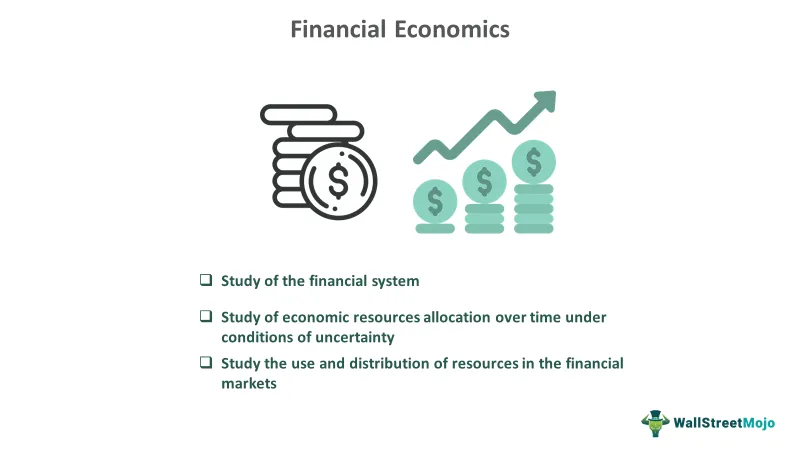

Understanding the intersection of economics and finance is crucial in today's complex market. In an era where financial markets are rapidly evolving, a grasp of economic methods, financial economics, and algorithmic trading is indispensable. This article explores these fundamental components, highlighting their roles and applications in modern financial markets.

Economic methods serve as the analytical foundation for deciphering market patterns and forecasting trends. These tools, encompassing both quantitative and qualitative approaches, are vital for interpreting macroeconomic and microeconomic dynamics. They offer insights into fiscal and monetary policies, enabling individuals and institutions to navigate the broader economic landscape more effectively.

Financial economics focuses on the allocation of resources and how economic principles impact financial decisions. It examines the interplay between time, risk, and opportunity costs, utilizing advanced models to predict market behaviors and optimize investment strategies. The distinction between financial economics and traditional economics lies in its specificity to financial contexts, concentrating on aspects such as asset valuation, risk management, and financial instruments.

Algorithmic trading represents a leap forward in executing trades with precision and speed unattainable by human efforts alone. By integrating financial economic theories and state-of-the-art algorithms, this approach has redefined high-frequency trading, bringing enhanced efficiency and liquidity to financial markets.

By understanding these essential economic concepts and their applications, readers will be better equipped to participate successfully in today's intricate financial environment. Through a comprehensive exploration of economic methods, financial economics, and algorithmic trading, the interconnectedness and significance of these disciplines will be made clear, enabling more informed decision-making and strategic financial planning.

## Table of Contents

## Economic Methods and Topics

Economic methods are foundational for the analysis of market trends and patterns, providing crucial insights into economic systems. Among the essential topics within economics are microeconomics, macroeconomics, and fiscal and monetary policies. These domains deliver a comprehensive framework for understanding and interpreting economic activities.

Microeconomics examines individual and firm behavior in markets, focusing on how they make decisions regarding resource allocation and prices. Core concepts include supply and demand, elasticity, consumer behavior, and production costs. Macroeconomics, on the other hand, addresses the broader economy, studying aggregate indicators such as GDP, unemployment rates, and inflation. It explores how different sectors of the economy interact and how policies can influence economic growth and stability.

Fiscal policy involves government spending and taxation decisions that impact economic activity, influencing aggregate demand and resource allocation. Similarly, monetary policy, usually managed by a nation’s central bank, involves managing the money supply and interest rates to achieve macroeconomic objectives such as controlling inflation, consumption, growth, and [liquidity](/wiki/liquidity-risk-premium).

Economic models play a vital role in how we conceptualize these concepts. These models, often mathematical in nature, allow economists to simulate scenarios and predict future economic conditions. For example, demand and supply models help in understanding market equilibrium, while Keynesian economic models provide insight into the effects of fiscal policies.

Econometrics is another critical tool, combining statistical methods with economic theory to empirically verify or refute hypotheses and forecast future trends. For instance, econometric models can be used to evaluate the impact of a policy change on employment rates or the effectiveness of monetary policy in curbing inflation.

Emphasizing these economic methods and topics is crucial for informed decision-making in finance. Understanding how economic forces shape markets enables individuals and institutions to make better investment decisions, manage risks effectively, and contribute to policy formulation. The integration of these methodologies supports a structured approach to dealing with financial uncertainties and economic complexities.

## Financial Economics: An Overview

Financial economics is a branch of economics that focuses on how resources are allocated in financial markets. It examines the use and distribution of resources and how time, risk, and opportunity costs influence financial decisions. The core objective of financial economics is to understand the behavior of prices, interest rates, and financial instruments in the context of information and uncertainty.

An important aspect of financial economics is the evaluation of decision-making variables through sophisticated models. These models, often rooted in statistical and mathematical frameworks, help in determining the value of financial instruments and predicting market behavior. For example, the Capital Asset Pricing Model (CAPM) is widely used to assess the expected return on an investment, considering risk-free rates, the investment's sensitivity to market movements (beta), and the expected market return.

$$
E(R_i) = R_f + \beta_i \times (E(R_m) - R_f)
$$

where $E(R_i)$ is the expected return on the investment, $R_f$ is the risk-free rate, $\beta_i$ is the beta of the investment, and $E(R_m)$ is the expected market return.

Understanding financial economics is crucial for predicting market behavior and planning investments. It provides insights into how financial markets operate and how various factors, such as changes in interest rates or economic policies, can impact market conditions. By leveraging these insights, investors can make more informed decisions, optimize portfolio returns, and manage potential risks effectively.

For both individual and institutional investors, financial economics is vital in evaluating risks and returns. This field offers tools and methodologies to assess the potential outcomes of different investment strategies. Techniques such as diversification and risk management are foundational in minimizing losses and ensuring sustainable growth within one's portfolio. Diversification can be explained through Markowitz's Modern Portfolio Theory, which emphasizes the optimization of a portfolio's expected return for a given level of risk by carefully choosing the proportions of various assets.

Financial economics intertwines closely with financial markets, providing a framework for understanding how various financial instruments are priced and how market participants behave. This comprehensive understanding aids in navigating complex financial environments, contrasting significantly from traditional economics by emphasizing financial entities and market dynamics in its analysis.

## Algorithmic Trading: The Future of Finance

Algorithmic trading employs complex algorithms to automate trading strategies. This method capitalizes on the speed and precision afforded by computer networks, executing trades at a velocity unattainable by human traders. By incorporating mathematical models and financial economics principles, [algorithmic trading](/wiki/algorithmic-trading) strategies are designed to identify market inefficiencies and capitalize on them rapidly. These strategies frequently rely on historical data and real-time market conditions to make informed trading decisions that are likely to yield high-frequency outputs.

One of the key advantages of algorithmic trading is its ability to simultaneously process vast amounts of data from multiple markets, enabling traders to make more comprehensive and informed decisions. Algorithms can swiftly execute trades across various assets, markets, and time zones, ensuring that opportunities are maximized and risks minimized. For example, strategies like statistical [arbitrage](/wiki/arbitrage) and market-making utilize algorithmic trading to exploit price discrepancies and liquidity imbalances.

Algorithmic trading is underpinned by financial economics theories, particularly those related to market efficiency and pricing models. For instance, the Efficient Market Hypothesis (EMH) suggests that asset prices reflect all available information, making it challenging to consistently outperform the market without exploiting short-lived inefficiencies. Algorithmic traders use this concept to design algorithms capable of identifying and acting on temporary price anomalies.

High-frequency trading ([HFT](/wiki/high-frequency-trading-strategies)), a subset of algorithmic trading, exemplifies the transformative impact of automation in financial markets. HFT strategies execute a high [volume](/wiki/volume-trading-strategy) of trades at exceedingly fast speeds, often completing thousands of orders per second. This speed provides a competitive edge, allowing traders to capture fleeting market movements and optimize profitability.

The evolution of technology continues to enhance the capabilities and prevalence of algorithmic trading. Innovations in [machine learning](/wiki/machine-learning) and [artificial intelligence](/wiki/ai-artificial-intelligence) have further refined the precision of algorithmic strategies. By analyzing patterns and making predictive market assessments, these advanced technologies drive greater efficiency and effectiveness in trading processes.

In conclusion, algorithmic trading is an integral part of modern financial markets, offering significant advantages in terms of speed, precision, and efficiency. It is heavily influenced by financial economics, with its strategies often designed to exploit market inefficiencies. As technology continues to advance, the scope and significance of algorithmic trading are likely to expand, making it a vital tool in contemporary financial practices.

## Financial Economics Methods

Financial economics employs a variety of methods to assess and manage the financial value of investments. One fundamental technique is discounting, which is used to determine the present value of future cash flows. This technique helps investors understand the worth of future financial prospects in today's terms. The formula for discounting is:

$$
PV = \frac{FV}{(1 + r)^n}
$$

where $PV$ stands for present value, $FV$ represents future value, $r$ is the discount rate, and $n$ refers to the number of periods until the cash flow occurs. By applying this formula, investors can make more informed decisions about the value and viability of different investment opportunities.

Risk management and diversification are integral strategies in financial economics designed to minimize potential losses. Risk management involves identifying, assessing, and prioritizing risks followed by coordinated efforts to minimize and control the likelihood of those risks occurring. An essential tool in risk management is the Value at Risk (VaR) model, which quantifies the potential loss in the value of an asset or portfolio, given a specific time frame and confidence interval.

Diversification, on the other hand, involves spreading investments across various financial instruments, sectors, or markets to reduce exposure to any single asset's risk. The principle of diversification is based on the notion that a diversified portfolio typically yields higher returns and poses a lower risk than investing in individual assets. This strategy can be mathematically represented by the calculation of the portfolio's overall standard deviation, which assesses the [volatility](/wiki/volatility-trading-strategies) and thus the risk of the investment mix.

Together, these methods are vital for constructing resilient investment portfolios that withstand economic fluctuations. Investors who understand and apply these concepts are better equipped to navigate economic uncertainties, ensuring that they can mitigate risks while maximizing returns. Furthermore, the use of these financial economics methods aids in the development of robust financial policies and supports well-informed investment decisions, fostering long-term growth and stability in financial markets.

## Conclusion

In today's fast-evolving financial landscape, a comprehensive understanding of economic methods, financial economics, and algorithmic trading is paramount for successful market engagement. Financial economics and algorithmic trading are deeply interconnected, each influencing the other and collectively shaping contemporary financial practices. These disciplines provide a framework for analyzing market behaviors, understanding risk factors, and making informed investment decisions.

Leveraging knowledge in these areas is crucial for strategic financial planning. Financial economics offers insights into the allocation and management of financial resources, focusing on optimizing returns while managing risks. This involves the application of complex models to predict market trends and assess investment outcomes. By integrating algorithmic trading techniques, which utilize advanced algorithms for executing trades, investors can achieve unprecedented speed and precision. This automation minimizes human errors and allows the exploitation of market opportunities as they arise.

Furthermore, emphasizing education in economic methods, financial economics, and algorithmic trading fosters enhanced decision-making and efficiency in financial markets. With a solid foundation in these disciplines, market participants can craft robust financial strategies that align with their risk tolerance and investment goals.

Staying informed about trends in these areas is essential for navigating the increasingly complex economic landscape. As technology advances, the financial environment becomes more dynamic, presenting both opportunities and challenges. By continuously updating skills and knowledge, investors and financial professionals are better equipped to adapt to changes and make sound decisions that capitalize on market dynamics. This ongoing education ensures that individuals and institutions can maintain a competitive edge and achieve successful outcomes in the global marketplace.

## References & Further Reading

[1]: Bergstra, J., Bardenet, R., Bengio, Y., & Kégl, B. (2011). ["Algorithms for Hyper-Parameter Optimization."](https://papers.nips.cc/paper/4443-algorithms-for-hyper-parameter-optimization) Advances in Neural Information Processing Systems 24.

[2]: ["Advances in Financial Machine Learning"](https://www.amazon.com/Advances-Financial-Machine-Learning-Marcos/dp/1119482089) by Marcos Lopez de Prado

[3]: ["Evidence-Based Technical Analysis: Applying the Scientific Method and Statistical Inference to Trading Signals"](https://www.amazon.com/Evidence-Based-Technical-Analysis-Scientific-Statistical/dp/0470008741) by David Aronson

[4]: ["Machine Learning for Algorithmic Trading"](https://github.com/PacktPublishing/Machine-Learning-for-Algorithmic-Trading-Second-Edition) by Stefan Jansen

[5]: ["Quantitative Trading: How to Build Your Own Algorithmic Trading Business"](https://www.amazon.com/Quantitative-Trading-Build-Algorithmic-Business/dp/1119800064) by Ernest P. Chan