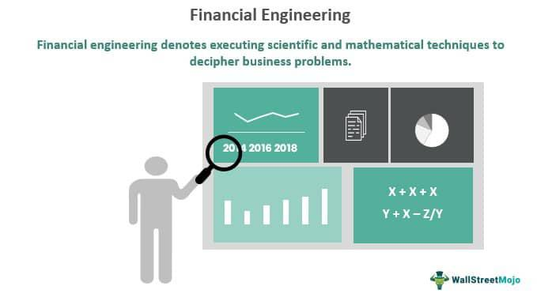

## Table of Contents

## What is financial engineering?

Financial engineering is a field where people use math and computer skills to create new financial products and solve money problems. It's like building new tools or fixing old ones, but instead of working with machines, you work with money and investments. People in financial engineering might design new types of loans, create ways to manage risk, or develop systems to trade stocks more efficiently.

This field is important because it helps banks, companies, and investors handle money in smarter ways. For example, financial engineers might create a new type of bond that helps a company raise money more easily, or they might develop a computer program that helps predict stock prices. By using their skills, financial engineers can make the financial world work better for everyone involved.

## How does financial engineering differ from traditional finance?

Financial engineering and traditional finance are related but different. Traditional finance focuses on understanding how money works, like saving, investing, and managing budgets. It's about learning the basic rules of money, like how interest rates work or how to pick good investments. Traditional finance is what you learn in basic money classes or what you might do when managing your own money.

Financial engineering, on the other hand, is more about creating new ways to use money. It's like inventing new tools or fixing old ones, but for finance. Financial engineers use math and computers to design new financial products, like special types of loans or ways to manage risk. They might create a new way for a company to raise money or develop a program to predict stock prices. So while traditional finance is about understanding money, financial engineering is about innovating with it.

## What are the main tools and techniques used in financial engineering?

In financial engineering, people use a lot of math and computer skills to create new financial products. One main tool they use is called quantitative analysis. This is just a fancy way of saying they use numbers and math to make decisions about money. They might use something called the Black-Scholes model to figure out the price of options, which are contracts that give you the right to buy or sell something at a certain price. Another important tool is computer programming. Financial engineers write code to make models and simulations, which help them see how different financial products might work in the real world.

Another big part of financial engineering is risk management. This means figuring out how to protect money from bad things happening, like a stock market crash. Financial engineers use techniques like hedging, where they balance their investments to reduce risk. They might also use something called Monte Carlo simulations, which are like playing out different money scenarios on a computer to see what could happen. These tools help them make safer and smarter decisions about money.

Lastly, financial engineers often use data analysis to understand markets and make better predictions. They look at big sets of numbers, called data, to find patterns and trends. This can help them see where the market might be going or how people are likely to act with their money. By using these tools and techniques, financial engineers can create new ways to invest, manage risk, and make money work better for everyone.

## Can you explain the role of mathematical models in financial engineering?

Mathematical models are super important in financial engineering. They help financial engineers figure out how money works and make smart choices. For example, a model might help them decide how much to charge for a new type of loan or how risky an investment is. These models use math to turn complicated money problems into something easier to understand. They can predict what might happen in the future, like how a stock price might change, by looking at numbers and patterns from the past.

One famous model is the Black-Scholes model, which helps figure out the price of options. Options are like bets on whether a stock price will go up or down. The Black-Scholes model uses math to guess the right price for these bets. Another tool is Monte Carlo simulations, which are like playing out different money scenarios on a computer. This helps financial engineers see all the possible ways things could go and plan for them. By using these models, financial engineers can create new financial products and manage risk better, making the whole money world work smoother and safer.

## What are some common applications of financial engineering in the industry?

Financial engineering helps companies and banks create new ways to handle money. One common use is in designing new financial products. For example, financial engineers might create a new type of bond that helps a company raise money more easily. They use math and computer models to figure out the best way to set up these products so they are both useful and safe for investors. Another use is in managing risk. Financial engineers use techniques like hedging to protect investments from big losses. They might use computer simulations to see how different scenarios could affect their investments and then adjust their plans to make them safer.

Another big application is in trading and investment strategies. Financial engineers develop algorithms that help trade stocks more efficiently. These algorithms can analyze lots of data quickly to find the best times to buy or sell stocks. This helps investors make more money and manage their portfolios better. Financial engineers also work on pricing models, like the Black-Scholes model, to figure out fair prices for options and other financial instruments. By using these tools, they can make the financial markets work better and help people make smarter choices with their money.

## How is financial engineering used in risk management?

Financial engineering helps a lot with managing risk. It's like making a safety net for money. Financial engineers use math and computers to figure out how risky an investment might be. They might use a technique called hedging, which is like balancing your bets to reduce the chance of losing money. For example, if you own a stock, you might buy an option that goes up in value if the stock goes down. This way, even if the stock loses money, the option can help cover the loss.

Another way financial engineers manage risk is by using simulations. They use computers to play out different money scenarios, called Monte Carlo simulations. These simulations help them see all the possible ways things could go wrong and plan for them. By looking at these different outcomes, financial engineers can make better decisions about how to protect money. This makes investments safer and helps companies and investors feel more secure about their money choices.

## What is the impact of financial engineering on financial markets?

Financial engineering has a big impact on financial markets. It helps make the markets more efficient and easier to use. Financial engineers create new financial products, like special types of loans or ways to invest money. These new products give people more choices and can help them make money in different ways. For example, a new type of bond might help a company raise money more easily, or a new trading algorithm might help investors buy and sell stocks faster and smarter.

Another way financial engineering affects the markets is by managing risk. Financial engineers use math and computers to figure out how to protect money from big losses. They might use techniques like hedging, which balances investments to reduce risk. They also use simulations to see how different money scenarios might play out. By managing risk better, financial engineers help make the markets safer and more stable. This can give people more confidence to invest and trade, which can make the whole financial system work better.

## How does financial engineering contribute to product development in finance?

Financial engineering helps create new financial products by using math and computers. It's like inventing new tools for money. Financial engineers design things like special loans, new types of bonds, and ways to invest money. They use models to figure out the best way to set up these products so they are useful and safe for people to use. For example, they might create a new type of bond that helps a company raise money more easily. This makes it easier for companies to get the money they need and gives investors more choices.

Another way financial engineering helps with product development is by making sure these new products work well in the market. Financial engineers use simulations to test how their new products might do in different situations. They look at data to understand how people might use the products and how they can be improved. This helps make sure the new financial products are not only innovative but also practical and safe. By doing this, financial engineers help make the financial world more efficient and give people better ways to handle their money.

## What are the ethical considerations in financial engineering practices?

Financial engineering can do a lot of good, but it also brings up some important ethical questions. One big issue is fairness. When financial engineers create new products, they need to make sure these products are fair for everyone. Sometimes, new financial tools can be complicated, and only people with a lot of money or knowledge might be able to use them. This can make the financial world less fair and leave some people behind. Financial engineers need to think about how their work affects different groups of people and try to make products that help everyone, not just a few.

Another ethical concern is about risk and transparency. Financial engineers often use complex math and computer models to manage risk, but these models aren't always perfect. If they make a mistake, it can lead to big problems, like a financial crisis. It's important for financial engineers to be honest about the risks and not hide them from people who might use their products. They should also make sure their models are as accurate as possible and keep improving them. By being open and honest, financial engineers can help build trust and make the financial world safer for everyone.

## How can financial engineering be used to optimize investment portfolios?

Financial engineering can help make investment portfolios better by using math and computers to figure out the best way to invest money. Financial engineers use models like the Modern Portfolio Theory to balance risk and reward. This means they can pick a mix of investments that gives you the best chance to make money while keeping the risk low. They might also use computer programs to look at lots of data and find patterns that help them decide which stocks or bonds to buy or sell. This can make your portfolio more efficient and help you reach your money goals faster.

Another way financial engineering helps is by using techniques like hedging to protect your investments from big losses. For example, if you own a stock, a financial engineer might suggest buying an option that goes up in value if the stock goes down. This way, even if the stock loses money, the option can help cover the loss. Financial engineers also use simulations to see how different money scenarios might play out. By looking at these different outcomes, they can make better decisions about how to adjust your portfolio to make it safer and more likely to grow over time.

## What advanced techniques in financial engineering are used for pricing complex financial instruments?

Financial engineers use advanced techniques to figure out the price of complex financial instruments, like options or derivatives. One popular method is the Black-Scholes model, which helps calculate the price of options by using math to predict how the price might change over time. This model looks at things like the current price of the stock, how much the stock price moves around, and how long until the option expires. Another technique is called the binomial model, which breaks down the time until an option expires into smaller steps and calculates the price at each step. This helps financial engineers see how different scenarios could affect the price of the option.

Another advanced technique is Monte Carlo simulation, which is like playing out different money scenarios on a computer. Financial engineers use this to see how a complex financial instrument might behave under different conditions. They run thousands of simulations to get a good idea of the possible outcomes and use this information to set a fair price. These techniques help make sure that the prices of complex financial instruments are as accurate as possible, which is important for both buyers and sellers in the market.

## What future trends and innovations are expected in the field of financial engineering?

In the future, financial engineering is expected to become even more important as technology keeps getting better. One big trend is the use of artificial intelligence (AI) and machine learning. These technologies can help financial engineers analyze huge amounts of data quickly and find patterns that humans might miss. This can lead to new ways to predict stock prices or manage risk. For example, AI could help create smarter trading algorithms that make better decisions about when to buy or sell stocks. Another trend is the growth of blockchain and cryptocurrencies. Financial engineers might use these technologies to create new types of financial products, like digital bonds or smart contracts, that work more efficiently and securely.

Another future trend is the increasing focus on sustainability and ethical investing. Financial engineers are starting to design products that help investors put their money into companies that are good for the environment or society. This could include new types of green bonds or funds that focus on social impact. As more people care about where their money goes, financial engineers will need to come up with innovative ways to meet these demands. Overall, the future of financial engineering looks exciting, with new technologies and a growing focus on doing good with money.

## What is Risk Management in Finance?

Risk management in finance is a critical process that encompasses identifying, analyzing, and mitigating risks associated with financial investments. This discipline is integral to safeguarding assets and ensuring the stability and growth of investment portfolios. The primary strategies employed in risk management include diversification, hedging, and the use of risk assessment models.

Diversification is the process of reducing risk by allocating investments across various financial instruments, industries, and geographic regions. The rationale is that a diverse portfolio decreases the impact of negative performance in a single asset or sector. Mathematically, the benefits of diversification can be illustrated using the portfolio variance formula: 

$$
\sigma_p^2 = \sum_{i=1}^{N}w_i^2\sigma_i^2 + \sum_{i=1}^{N}\sum_{j\neq i}^{N}w_iw_j\sigma_i\sigma_j\rho_{ij}
$$

where $\sigma_p^2$ is the portfolio variance, $w_i$ and $w_j$ are the weights of assets in the portfolio, $\sigma_i$ and $\sigma_j$ are the standard deviations of assets, and $\rho_{ij}$ is the correlation coefficient between the assets.

Hedging is another key strategy used to protect investments from adverse price movements. This involves taking offsetting positions in related securities to mitigate potential losses. Common hedging instruments include options, futures, and swaps. For instance, an investor might use put options to hedge against a decline in the value of a stock portfolio.

Risk assessment models, such as Value at Risk (VaR) and Conditional Value at Risk (CVaR), are tools used to quantify potential losses in an investment over a specific period. These models help managers in anticipating and preparing for extreme market events. The VaR model estimates the maximum loss at a given confidence level, while CVaR provides the expected loss beyond the VaR threshold.

Technological advancements play a significant role in enhancing risk management practices. Predictive analytics and [artificial intelligence](/wiki/ai-artificial-intelligence) (AI) have revolutionized the ability to evaluate risks by providing more accurate forecasts and insights. Machine learning algorithms can analyze vast amounts of data to identify patterns and predict market trends, enabling proactive risk mitigation.

For example, the following Python code demonstrates a basic outline for employing a [machine learning](/wiki/machine-learning) model to predict stock price movements:

```python
from sklearn.ensemble import RandomForestClassifier
import pandas as pd

# Load historical stock data
data = pd.read_csv('stock_data.csv')

# Feature engineering: create features based on the historical data
data['PriceChange'] = data['Close'].diff()
data['SMA'] = data['Close'].rolling(window=10).mean()
data.dropna(inplace=True)

# Define features and target
X = data[['PriceChange', 'SMA']]
y = (data['PriceChange'] > 0).astype(int)  # Target: 1 if price increased, 0 if decreased

# Split data into training and test sets
from sklearn.model_selection import train_test_split
X_train, X_test, y_train, y_test = train_test_split(X, y, test_size=0.2, random_state=42)

# Train a random forest model
model = RandomForestClassifier(n_estimators=100, random_state=42)
model.fit(X_train, y_train)

# Predict and evaluate the model
predictions = model.predict(X_test)
```

This code is a simple framework illustrating how predictive models can be leveraged for risk management by forecasting potential changes in stock prices, thus enabling timely decisions. 

In conclusion, effective risk management combines traditional strategies with cutting-edge technology to protect assets from market [volatility](/wiki/volatility-trading-strategies) and unforeseen events. As technology continues to evolve, it will play an increasingly important role in refining these strategies, offering financial managers more robust and dynamic tools to manage risk and safeguard investments.

## What is the Role of Financial Engineering?

Financial engineering employs advanced mathematical techniques to address complex financial problems and optimize investment strategies. By harnessing mathematical tools, such as stochastic calculus, linear algebra, and [statistics](/wiki/bayesian-statistics), financial engineers develop innovative financial products and strategies that enhance market efficiency and foster innovation. This sophisticated approach aids in the creation and refinement of derivatives, structured products, and custom investment solutions tailored to specific investor needs.

Derivatives, for example, are financial instruments whose value is derived from underlying assets such as stocks, bonds, or commodities. These instruments enable investors to hedge against risks or speculate on market movements. Options, futures, and swaps are common types of derivatives that have been developed through financial engineering. The Black-Scholes model, a fundamental formula in financial engineering, is used to price European options and is given by:

$$
C(S, t) = N(d_1)S - N(d_2)Ke^{-r(T-t)}
$$

where:
- $C(S, t)$ is the call option price,
- $S$ is the current stock price,
- $K$ is the strike price of the option,
- $T$ is the time to expiration,
- $r$ is the risk-free interest rate,
- $N(d)$ is the cumulative distribution function of the standard normal distribution,
- $d_1 = \frac{\ln(\frac{S}{K}) + (r + \frac{\sigma^2}{2})(T-t)}{\sigma\sqrt{T-t}}$,
- $d_2 = d_1 - \sigma\sqrt{T-t}$,
- $\sigma$ is the volatility of the stock's returns.

Structured products are another result of financial engineering. These are pre-packaged investments that typically include derivatives and are tailored to meet specific market views or risk appetites. They offer a broad range of payoffs and can be customized based on the investor’s expectations and risk tolerance, enabling investors to achieve precise investment goals.

Moreover, financial engineers develop custom investment solutions using quantitative techniques to meet client-specific objectives. These solutions often involve modeling complex market behaviors and constructing portfolios that balance risk and return efficiently.

Financial engineering greatly influences modern financial markets by enabling more sophisticated risk management practices. Techniques like value-at-risk (VaR) and stress testing, derived from financial engineering, allow firms to better understand and mitigate potential losses. As a result, financial institutions can more effectively manage their risk exposure and optimize their capital allocation.

The integration of financial engineering into modern finance facilitates continuous innovation and reinforces the stability of financial ecosystems. By providing the tools and frameworks for developing new financial products and services, financial engineering continuously adapts to changing market conditions and investor needs. Its profound impact on financial markets and portfolios underscores its essential role in navigating the complexities of global finance.

## References & Further Reading

[1]: Bergstra, J., Bardenet, R., Bengio, Y., & Kégl, B. (2011). ["Algorithms for Hyper-Parameter Optimization."](https://papers.nips.cc/paper/4443-algorithms-for-hyper-parameter-optimization) Advances in Neural Information Processing Systems 24.

[2]: ["Advances in Financial Machine Learning"](https://www.amazon.com/Advances-Financial-Machine-Learning-Marcos/dp/1119482089) by Marcos Lopez de Prado

[3]: ["Evidence-Based Technical Analysis: Applying the Scientific Method and Statistical Inference to Trading Signals"](https://www.amazon.com/Evidence-Based-Technical-Analysis-Scientific-Statistical/dp/0470008741) by David Aronson

[4]: ["Machine Learning for Algorithmic Trading"](https://github.com/stefan-jansen/machine-learning-for-trading) by Stefan Jansen

[5]: ["Quantitative Trading: How to Build Your Own Algorithmic Trading Business"](https://www.amazon.com/Quantitative-Trading-Build-Algorithmic-Business/dp/1119800064) by Ernest P. Chan