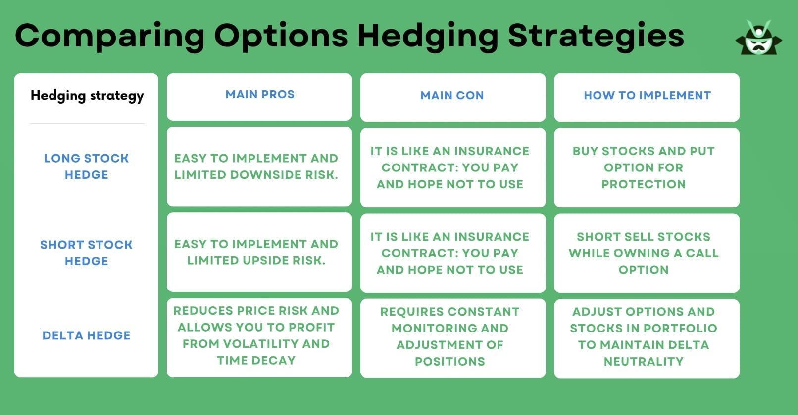

## Table of Contents

## What is financial exposure?

Financial exposure refers to the risk that a person or a business faces due to their financial activities. It can happen when someone invests money, takes a loan, or does business with others. If things don't go as planned, like if an investment loses value or a customer doesn't pay back a loan, the person or business could lose money. This risk is called financial exposure because it shows how much they could be affected financially.

Managing financial exposure is important for keeping a business or personal finances stable. People and businesses can reduce their exposure by spreading out their investments, having insurance, or setting limits on how much they are willing to risk. By understanding and managing their financial exposure, they can make better decisions and protect themselves from big losses.

## Why is understanding financial exposure important for businesses and individuals?

Understanding financial exposure is important for businesses and individuals because it helps them know how much risk they are taking with their money. When you know your financial exposure, you can see which parts of your money activities might cause problems if things go wrong. For example, if a business has a lot of money tied up in one project, that's a big exposure. If that project fails, the business could lose a lot of money. By understanding this, the business can make better choices about where to put their money.

For individuals, knowing their financial exposure helps them manage their personal money better. If someone has a lot of debt, like credit card debt or loans, they are exposed to the risk of not being able to pay it back. Understanding this can help them decide to pay off debt faster or avoid taking on more debt. It also helps them plan for unexpected events, like losing a job, by saving money or getting insurance. In short, understanding financial exposure helps both businesses and individuals make smarter money decisions and avoid big losses.

## What are the different types of financial exposure?

There are different types of financial exposure that businesses and people can face. One type is credit exposure, which happens when someone lends money to someone else. If the person borrowing the money can't pay it back, the lender loses money. Another type is market exposure, which happens when someone invests in things like stocks or real estate. If the value of those investments goes down, the investor loses money. There's also operational exposure, which comes from the day-to-day running of a business. If something goes wrong, like a machine breaking down, the business might lose money.

Another type of financial exposure is currency exposure, which happens when a business deals with money from different countries. If the value of one currency changes compared to another, the business could lose or gain money. Then there's interest rate exposure, which affects people and businesses with loans or savings. If interest rates go up, it might cost more to borrow money, but people with savings might earn more. Lastly, there's liquidity exposure, which is the risk of not being able to turn assets into cash quickly enough to pay bills or other needs. Understanding these types of exposure helps people and businesses make better financial decisions.

## How does currency exchange rate fluctuation create financial exposure?

Currency exchange rate fluctuation creates financial exposure when a business or person deals with money from different countries. If a business sells things to other countries, it gets paid in foreign money. If the value of that foreign money goes down compared to their own country's money, the business will get less money when they change it back. This means they might lose money even if they sold their products at a good price. The same thing can happen if a business has to buy things from other countries. If the value of their own money goes down, it will cost them more to buy those things.

For people, currency exchange rate fluctuation can also be a problem. Imagine someone who gets paid in one country but lives in another. If the value of the money they earn goes down compared to the money they need to spend, they will have less money to live on. Or, if someone saves money in a foreign bank account, changes in the exchange rate can make their savings worth more or less when they want to use it. So, both businesses and people need to think about how changes in currency values can affect their money and plan for these changes to avoid big losses.

## What role does interest rate risk play in financial exposure?

Interest rate risk is a type of financial exposure that happens when the interest rates change. For people and businesses with loans, if interest rates go up, it will cost more money to borrow. This can be a problem because it means they have to pay more each month. For example, if someone has a loan with a variable interest rate, their payments can go up if the interest rate goes up. This can make it harder to pay off the loan and can cause financial stress.

On the other hand, interest rate risk can also affect people and businesses with savings. If interest rates go up, the money they earn from their savings can increase. This is good because it means they can earn more without doing anything extra. But if interest rates go down, the money they earn from savings will be less. So, understanding interest rate risk helps people and businesses plan better for how much they might have to pay or how much they might earn from their money.

## Can you explain how commodity price changes affect financial exposure?

Commodity price changes can create financial exposure for businesses and people who rely on commodities. Commodities are things like oil, gold, or wheat that are traded in large amounts. If a business uses a lot of a commodity to make their products, like a bakery using wheat to make bread, they are exposed to the risk of the price of that commodity going up. If the price of wheat goes up, the bakery will have to pay more to make their bread, which can hurt their profits. The same thing can happen to people who invest in commodities. If they buy gold hoping to sell it later for a profit, and the price of gold goes down instead, they lose money.

To manage this kind of financial exposure, businesses and people can use different strategies. One way is to use futures contracts, which let them agree on a price for a commodity in the future. This can help protect them if the price goes up. Another way is to diversify, which means not relying on just one commodity. By using different commodities or finding other ways to make money, they can reduce the risk of losing a lot if the price of one commodity changes a lot. Understanding how commodity prices can affect their money helps businesses and people make better plans and avoid big losses.

## What are common mechanisms that lead to financial exposure?

Financial exposure can happen in many ways. One common way is through borrowing money. When someone takes a loan, they are exposed to the risk of not being able to pay it back. If they lose their job or if interest rates go up, it can become harder to make the payments. Businesses can also face exposure when they borrow money to grow or invest in new projects. If the project doesn't do well, they might not be able to pay back the loan, which can lead to big losses.

Another way financial exposure happens is through investing. When people or businesses put their money into things like stocks, real estate, or commodities, they are exposed to the risk of losing money if the value of those investments goes down. For example, if a company's stock price drops a lot, an investor could lose a lot of money. Also, businesses that need certain materials to make their products can be exposed if the prices of those materials change a lot. If the price of oil goes up, a company that uses a lot of oil might have to pay more, which can hurt their profits.

Lastly, financial exposure can come from daily business operations. If a business relies on a certain supplier and that supplier has problems, the business might not be able to make their products. Or, if a business has a lot of customers who don't pay on time, they might not have enough money to keep going. People can also face exposure from their daily money choices, like using a lot of credit cards or not saving enough for emergencies. Understanding these common mechanisms can help people and businesses plan better and reduce their financial risks.

## What are the basic strategies for managing financial exposure?

Managing financial exposure is important for keeping your money safe. One basic strategy is diversification. This means spreading your money across different investments or business activities instead of putting it all in one place. For example, if you invest in different types of stocks, real estate, and savings accounts, you won't lose everything if one of them does badly. Another way to manage exposure is by using insurance. Insurance can protect you from big losses if something unexpected happens, like getting sick or your business getting damaged.

Another strategy is to set limits on how much risk you are willing to take. This can mean not borrowing too much money or not investing more than you can afford to lose. It's also helpful to keep an eye on things that can affect your money, like interest rates or commodity prices. By staying informed, you can make better choices about when to borrow, invest, or save. Using these strategies can help you feel more secure and avoid big financial problems.

## How can derivatives be used to hedge against financial exposure?

Derivatives are special kinds of financial tools that can help people and businesses protect themselves from financial exposure. One common way to use derivatives is through something called a futures contract. A futures contract lets you agree on a price today for something you will buy or sell in the future. For example, if you run a bakery and you're worried about the price of wheat going up, you can use a futures contract to lock in a price for wheat now. This way, even if the price of wheat goes up later, you won't have to pay more than what you agreed on. This helps you avoid losing money if the price changes a lot.

Another way to use derivatives is with options. An option gives you the right, but not the obligation, to buy or sell something at a certain price in the future. For instance, if you own a company and you're worried about the price of oil going down, you can buy an option that lets you sell oil at a set price. If the price of oil does drop, you can use the option to sell at the higher price you locked in, which helps you avoid losing money. By using derivatives like futures and options, people and businesses can manage their financial exposure and feel more secure about their money.

## What advanced hedging strategies can be employed to mitigate financial exposure?

Advanced hedging strategies can be used to manage financial exposure in more complex ways. One strategy is using a combination of different derivatives, like futures, options, and swaps, to create a more complete hedge. For example, a company might use futures to lock in a price for a commodity they need, and at the same time, buy options to protect against big price swings. This way, they can be safe from both small and big changes in the price. Another strategy is called delta hedging, where you keep adjusting your investments to balance out the risks. If the price of something you own goes up or down, you change your investments to make sure you're still protected.

Another advanced strategy is using currency swaps to manage currency exposure. If a company does business in different countries, they can use a currency swap to agree to exchange money at a set rate in the future. This helps them avoid losing money if the value of one currency changes a lot compared to another. Also, some businesses use something called a collar strategy, which involves buying and selling options at the same time to set a range for how much a price can change. This way, they know the worst and best that can happen, which helps them plan better and feel more secure about their money.

## How do multinational companies manage their financial exposure across different countries?

Multinational companies, which do business in many countries, have to deal with financial exposure in different ways. One big problem they face is currency exposure. This happens when the value of money from one country changes compared to another. To manage this, these companies often use something called currency hedging. They might use futures contracts or options to lock in exchange rates for the future. This way, if the value of one currency goes down, they won't lose as much money. They also might use currency swaps, where they agree to exchange money at a set rate later on. This helps them plan better and avoid big losses from currency changes.

Another way multinational companies manage financial exposure is by diversifying their business. Instead of putting all their money and effort into one country, they spread it out across different places. This means if something bad happens in one country, like a big change in commodity prices or interest rates, it won't hurt their whole business. They also use insurance to protect against unexpected problems, like natural disasters or political changes. By using these strategies, multinational companies can feel more secure and manage their money better across different countries.

## What are the latest trends and tools in financial exposure management for expert practitioners?

Expert practitioners in financial exposure management are now using advanced technology and data analytics to better understand and manage risks. One big trend is the use of artificial intelligence (AI) and machine learning. These tools can look at a lot of data quickly and find patterns that humans might miss. For example, AI can predict how commodity prices or currency values might change in the future. This helps companies make better decisions about when to buy or sell things. Another tool that's becoming popular is called risk management software. This software can keep track of all the different risks a company faces and suggest ways to manage them. It can also run simulations to see how different choices might affect the company's money.

Another trend is the use of blockchain technology for more secure and clear financial transactions. Blockchain can help companies keep better records of their deals and make sure everyone follows the rules. This can reduce the risk of fraud and mistakes, which can lead to financial exposure. Also, more companies are using something called enterprise risk management (ERM) systems. These systems look at all the risks a company faces, not just financial ones, and help plan how to deal with them. By using these new tools and trends, expert practitioners can manage financial exposure better and keep their companies safe.

## What is the Role of Hedging in Risk Management?

Hedging is a fundamental financial strategy that involves taking an additional position to offset potential losses in an existing investment. This approach is akin to taking out insurance to protect against unforeseen adverse events. By utilizing hedging, market participants aim to limit their exposure to risk, particularly risks associated with unpredictable price movements in the financial markets.

Common instruments employed in hedging include options, futures, and swaps. Each of these instruments offers distinct advantages and is suitable for specific hedging situations:

1. **Options**: Options provide the right, but not the obligation, to buy or sell an asset at a predetermined price before a specified expiration date. Call options are typically used to hedge against potential price increases, while put options offer protection against price declines.
$$
   \text{Option Price} = f\left(S, K, T, r, \sigma\right)

$$

   Where $S$ is the current price of the asset, $K$ is the strike price, $T$ is the time to expiration, $r$ is the risk-free [interest rate](/wiki/interest-rate-trading-strategies), and $\sigma$ is the [volatility](/wiki/volatility-trading-strategies) of the asset.

2. **Futures**: Futures contracts obligate the transaction of an asset at a predetermined date and price. They are commonly used for hedging because they can effectively lock in prices. For instance, a company expecting to receive payment in foreign currency might use currency futures to hedge against exchange rate fluctuations.

   ```python
   # Example of calculating the future value of an asset
   def future_value(present_value, interest_rate, time):
       return present_value * ((1 + interest_rate) ** time)
   ```

3. **Swaps**: Swaps are contracts through which two parties exchange financial instruments, often used to manage interest rate and currency exchange risks. A common type of swap is the interest rate swap, where fixed interest payments are exchanged for floating rate payments.

The primary objective of hedging is risk mitigation, not profit generation. While hedging strategies can lead to gains under certain conditions, their main purpose is to provide a financial safety net. Effective hedging can reduce the potential for significant financial loss, thereby contributing to financial stability. For investors and companies, a well-constructed hedging strategy can serve as a buffer against volatile market conditions, safeguarding their financial health and helping preserve capital.

The prudent use of hedging is vital for those exposed to various market risks. By balancing potential losses with protective measures, hedging supports the architecture of comprehensive risk management practices, ensuring organizations and individual investors can withstand adverse financial scenarios.

 to Algorithmic Trading

Algorithmic trading is a technology-driven approach that employs computer programs to automate and execute trading processes. These automated systems are guided by predetermined criteria, such as timing, price, and [volume](/wiki/volume-trading-strategy), which enable them to execute trades at speeds and frequencies that are beyond the capabilities of human traders. By utilizing complex algorithms, these systems make trading decisions based on real-time market data, eliminating the delays inherent in manual trading.

Predetermined criteria form the backbone of [algorithmic trading](/wiki/algorithmic-trading) strategies. For instance, a simple algorithm might be programmed to buy a stock once its price drops below a certain threshold and sell when it exceeds a specified high. Such mathematical models ensure that trading decisions adhere strictly to established rules, thereby removing the emotional biases that often accompany human decision-making in financial markets.

The adoption of algorithmic trading has surged due to several significant advantages. Firstly, it reduces transaction costs by optimizing entry and [exit](/wiki/exit-strategy) points in the market. Automation eliminates the cost associated with manual interventions, allowing operations to be streamlined. Secondly, the methodical nature of algorithmic trading aids in minimizing the impact of psychological biases, such as fear and greed, on trading outcomes. As algorithms operate under predefined instructions, they maintain steadfastness in volatile market conditions where emotions might lead to irrational decisions.

Moreover, algorithmic trading is pivotal in implementing automated risk management strategies. It enables the continuous monitoring and adjustment of positions in response to changing market dynamics. For example, if a specific stock price begins to move in an unfavorable direction, an algorithm can automatically initiate a hedging position to protect against potential losses. This capability ensures that risk management processes are executed accurately and consistently, without the need for constant human oversight.

The role of algorithmic trading in financial markets continues to expand as computational capabilities advance. Its efficiency in executing large volumes of trades quickly and at minimal cost underpins its growing popularity among institutional investors. Consequently, algorithmic trading has become an integral component in the landscape of modern finance, influencing not only the speed and efficiency of transactions but also the way financial risks are managed.

## References & Further Reading

[1]: Bergstra, J., Bardenet, R., Bengio, Y., & Kégl, B. (2011). ["Algorithms for Hyper-Parameter Optimization."](https://papers.nips.cc/paper/4443-algorithms-for-hyper-parameter-optimization) Advances in Neural Information Processing Systems 24.

[2]: ["Advances in Financial Machine Learning"](https://www.amazon.com/Advances-Financial-Machine-Learning-Marcos/dp/1119482089) by Marcos Lopez de Prado

[3]: ["Evidence-Based Technical Analysis: Applying the Scientific Method and Statistical Inference to Trading Signals"](https://books.google.com/books/about/Evidence_Based_Technical_Analysis.html?id=MeoJAQAAMAAJ) by David Aronson

[4]: ["Machine Learning for Algorithmic Trading"](https://github.com/stefan-jansen/machine-learning-for-trading) by Stefan Jansen

[5]: ["Quantitative Trading: How to Build Your Own Algorithmic Trading Business"](https://www.amazon.com/Quantitative-Trading-Build-Algorithmic-Business/dp/1119800064) by Ernest P. Chan