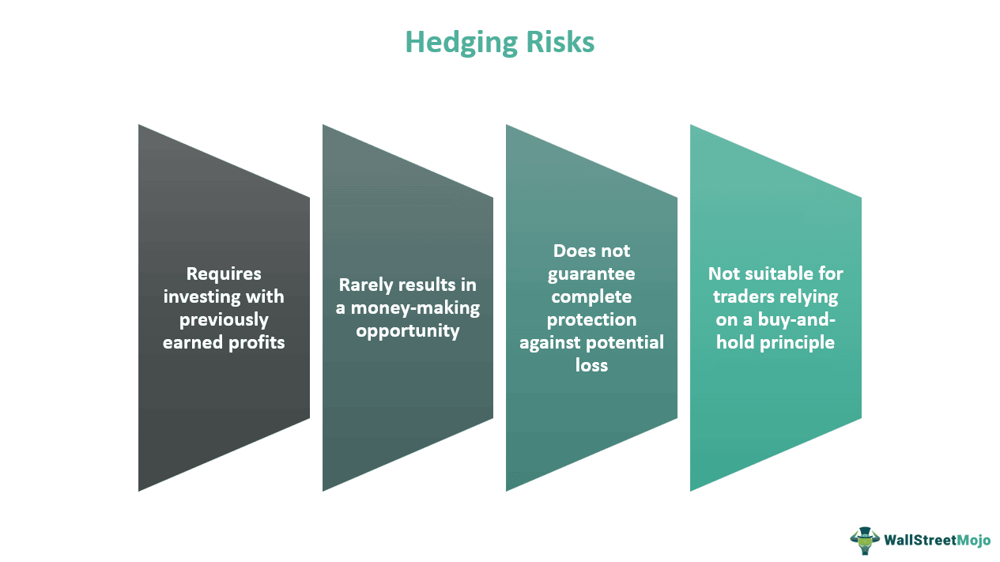

In the dynamic world of finance, managing exposure and mitigating risks are paramount for sustained success. As financial markets become increasingly complex and volatile, hedging financial exposure has emerged as a cornerstone of risk management strategies. Through hedging, investors and companies seek to protect themselves from adverse price movements and market fluctuations that could lead to significant financial loss. The fundamental goal of hedging is to limit these potential losses rather than to generate profit.

With advancements in technology, particularly in the field of algorithmic trading, the management of financial risk has been revolutionized. Algorithmic trading utilizes sophisticated computer programs to execute trades with speed and precision unattainable by human traders. By adhering to pre-set criteria such as timing, price, and volume, these algorithms can perform trades that minimize transaction costs and eliminate emotional biases that might affect human decision-making. As a result, algorithmic trading plays a crucial role in automated risk management strategies, enhancing the ability to implement effective hedging techniques swiftly and accurately.



This article explores the intersection of hedging, financial risk management, and algorithmic trading, providing insights into how these elements work together to protect investments. Understanding the intricate relationships between these concepts is essential for investors and traders who wish to make informed decisions in a rapidly changing financial landscape. Whether you are a seasoned trader or new to the financial markets, grasping the nuances of these strategies will empower you to better safeguard your assets against uncertainties inherent in global financial systems.

## Table of Contents

## Understanding Financial Exposure and Risk Management

Financial exposure is a critical concept in finance that pertains to the potential loss a company or individual may encounter due to changes in market conditions. This exposure arises when investments, assets, or financial statements are subject to fluctuations in prices, interest rates, currency exchange rates, or other economic variables. Understanding this exposure is fundamental for effective financial planning and risk management, as it directly impacts the financial health and stability of an entity.

Risk management serves as a vital mechanism for identifying, assessing, and prioritizing these risks. It involves structured processes and coordinated efforts aimed at minimizing or controlling the adverse effects of these risks. A sound risk management framework enables organizations and individuals to anticipate potential threats, thereby enhancing their ability to make informed and strategic decisions.

Key to any risk management strategy is the implementation of techniques designed to mitigate potential losses. Diversification, a commonly employed method, involves spreading investments across different asset classes or geographic regions to reduce exposure to any single source of risk. This approach aims to balance the risk-return ratio by ensuring that poor performance in one area is offset by gains in another.

Another essential tool in risk management is the use of financial derivatives, such as options, futures, and swaps. These instruments allow for the hedging of financial positions, effectively providing insurance against unfavorable market movements. For example, a company anticipating fluctuations in foreign currency exchange rates might enter into a currency swap agreement to lock in a specific rate, thereby protecting itself from potential losses due to currency depreciation.

In summary, understanding financial exposure and implementing effective risk management strategies are imperative for safeguarding assets and ensuring long-term financial stability. By utilizing diversification and financial derivatives, individuals and organizations can mitigate risks and navigate the complexities of modern financial markets more effectively.

## The Role of Hedging in Risk Management

Hedging is a fundamental financial strategy that involves taking an additional position to offset potential losses in an existing investment. This approach is akin to taking out insurance to protect against unforeseen adverse events. By utilizing hedging, market participants aim to limit their exposure to risk, particularly risks associated with unpredictable price movements in the financial markets.

Common instruments employed in hedging include options, futures, and swaps. Each of these instruments offers distinct advantages and is suitable for specific hedging situations:

1. **Options**: Options provide the right, but not the obligation, to buy or sell an asset at a predetermined price before a specified expiration date. Call options are typically used to hedge against potential price increases, while put options offer protection against price declines.
$$
   \text{Option Price} = f\left(S, K, T, r, \sigma\right)

$$

   Where $S$ is the current price of the asset, $K$ is the strike price, $T$ is the time to expiration, $r$ is the risk-free [interest rate](/wiki/interest-rate-trading-strategies), and $\sigma$ is the [volatility](/wiki/volatility-trading-strategies) of the asset.

2. **Futures**: Futures contracts obligate the transaction of an asset at a predetermined date and price. They are commonly used for hedging because they can effectively lock in prices. For instance, a company expecting to receive payment in foreign currency might use currency futures to hedge against exchange rate fluctuations.

   ```python
   # Example of calculating the future value of an asset
   def future_value(present_value, interest_rate, time):
       return present_value * ((1 + interest_rate) ** time)
   ```

3. **Swaps**: Swaps are contracts through which two parties exchange financial instruments, often used to manage interest rate and currency exchange risks. A common type of swap is the interest rate swap, where fixed interest payments are exchanged for floating rate payments.

The primary objective of hedging is risk mitigation, not profit generation. While hedging strategies can lead to gains under certain conditions, their main purpose is to provide a financial safety net. Effective hedging can reduce the potential for significant financial loss, thereby contributing to financial stability. For investors and companies, a well-constructed hedging strategy can serve as a buffer against volatile market conditions, safeguarding their financial health and helping preserve capital.

The prudent use of hedging is vital for those exposed to various market risks. By balancing potential losses with protective measures, hedging supports the architecture of comprehensive risk management practices, ensuring organizations and individual investors can withstand adverse financial scenarios.

 to Algorithmic Trading

Algorithmic trading is a technology-driven approach that employs computer programs to automate and execute trading processes. These automated systems are guided by predetermined criteria, such as timing, price, and [volume](/wiki/volume-trading-strategy), which enable them to execute trades at speeds and frequencies that are beyond the capabilities of human traders. By utilizing complex algorithms, these systems make trading decisions based on real-time market data, eliminating the delays inherent in manual trading.

Predetermined criteria form the backbone of [algorithmic trading](/wiki/algorithmic-trading) strategies. For instance, a simple algorithm might be programmed to buy a stock once its price drops below a certain threshold and sell when it exceeds a specified high. Such mathematical models ensure that trading decisions adhere strictly to established rules, thereby removing the emotional biases that often accompany human decision-making in financial markets.

The adoption of algorithmic trading has surged due to several significant advantages. Firstly, it reduces transaction costs by optimizing entry and [exit](/wiki/exit-strategy) points in the market. Automation eliminates the cost associated with manual interventions, allowing operations to be streamlined. Secondly, the methodical nature of algorithmic trading aids in minimizing the impact of psychological biases, such as fear and greed, on trading outcomes. As algorithms operate under predefined instructions, they maintain steadfastness in volatile market conditions where emotions might lead to irrational decisions.

Moreover, algorithmic trading is pivotal in implementing automated risk management strategies. It enables the continuous monitoring and adjustment of positions in response to changing market dynamics. For example, if a specific stock price begins to move in an unfavorable direction, an algorithm can automatically initiate a hedging position to protect against potential losses. This capability ensures that risk management processes are executed accurately and consistently, without the need for constant human oversight.

The role of algorithmic trading in financial markets continues to expand as computational capabilities advance. Its efficiency in executing large volumes of trades quickly and at minimal cost underpins its growing popularity among institutional investors. Consequently, algorithmic trading has become an integral component in the landscape of modern finance, influencing not only the speed and efficiency of transactions but also the way financial risks are managed.

## Algorithmic Trading in Hedging and Risk Management

Algorithmic trading has transformed risk management in financial markets by automating the execution of hedging strategies, thus enhancing the speed and efficiency of these operations. The core advantage of these systems is their ability to swiftly adapt to market changes, reducing the time lag between identifying a hedging opportunity and executing the necessary trades. This rapid response is crucial in volatile markets where prices can change dramatically in a matter of seconds.

At the heart of algorithmic trading systems is their capability to process and analyze vast datasets in real-time. Advanced algorithms can sift through extensive market data to recognize patterns and trends, identifying potential hedging opportunities that may not be immediately apparent through manual analysis. This ability to process information at such high speeds allows for a more proactive approach to risk management, enabling traders to anticipate potential market shifts rather than simply react to them.

By automating hedging strategies, algorithmic trading ensures consistent application of risk management rules, minimizing the potential for human error or emotion-driven decisions that can lead to suboptimal results. The system can execute orders based on pre-defined parameters, such as price limits or timing constraints, thereby maintaining the integrity of the hedging strategy even amidst stressful market conditions.

Consider a Python script for a basic algorithmic hedging strategy, where an algorithm monitors asset prices and executes trades to hedge a particular financial exposure when a price threshold is breached:

```python
import yfinance as yf

# Define the asset to be monitored
asset = 'AAPL'
hedge_threshold = 150.0

def check_and_hedge():
    # Fetch the current price
    data = yf.Ticker(asset).history(period='1d')
    current_price = data['Close'].iloc[-1]

    # Check if the current price meets the hedging criteria
    if current_price > hedge_threshold:
        execute_trade()

def execute_trade():
    # Placeholder for trade execution logic
    print(f"Hedging trade executed for {asset} at price above {hedge_threshold}")

check_and_hedge()
```

This script uses the `yfinance` library to access real-time data, monitoring Apple's stock price. If the price exceeds a predefined threshold, it triggers a placeholder function representing the execution of a hedging trade. This basic structure demonstrates how automation can be leveraged to manage risks systematically.

However, algorithmic trading is not without its challenges: systems must be carefully designed to avoid malfunctions that can have significant financial repercussions. Furthermore, during periods of extreme market volatility, algorithms must be equipped to handle unexpected scenarios gracefully. Despite these challenges, as technology advances, the integration of sophisticated data analysis techniques continues to enhance the effectiveness of algorithmic trading in hedging, making it a vital tool in modern risk management.

## Benefits and Challenges of Using Algorithms for Risk Management

The use of algorithms in risk management offers significant benefits, primarily in terms of processing vast amounts of data with remarkable speed and precision. Algorithms are adept at analyzing complex datasets to identify trends and patterns that may not be immediately apparent to human traders. This capability allows for more informed decision-making and can greatly enhance the efficiency of financial operations. Moreover, by automating trading processes, algorithms minimize the risk of human errors and the influence of emotional biases, leading to more consistent trading outcomes.

However, the reliance on algorithms is not without its challenges. One of the primary requirements is a robust data infrastructure capable of supporting the high-speed data processing that these systems demand. Inadequacy in this infrastructure could lead to significant operational inefficiencies and various risks. Additionally, there's an inherent risk of algorithmic malfunctions, which can result in unintended and sometimes severe market impacts. These malfunctions could be due to coding errors, unexpected market conditions, or misinterpretations of data inputs.

Furthermore, market volatility poses another layer of complexity within algorithmic systems. During periods of intense market fluctuations, algorithms might behave unpredictably, leading to trading decisions that could adversely affect financial stability. For example, an algorithm designed to execute trades based on specific market indicators might continue to operate under volatile conditions, potentially exacerbating market downturns.

To mitigate these challenges, continuous monitoring and refining of algorithmic systems is essential. Machine learning models are being increasingly integrated into these systems to enable dynamic adjustment to changing market conditions. By incorporating adaptive learning capabilities, algorithms can improve their resilience against unexpected market scenarios, ultimately enhancing the reliability and effectiveness of automated risk management strategies. However, this also necessitates a commitment to maintaining up-to-date technology and issues pertaining to data security, privacy, and algorithmic accountability.

## Future Trends in Hedging and Algorithmic Risk Management

The integration of [artificial intelligence](/wiki/ai-artificial-intelligence) (AI) and [machine learning](/wiki/machine-learning) (ML) is significantly advancing the capabilities of algorithmic trading, fundamentally transforming hedging and risk management approaches. These technologies enable algorithms to process and analyze vast amounts of data, facilitating more informed and precise decision-making. AI and ML enhance the ability to identify patterns and correlations within financial markets that may not be immediately apparent through traditional analysis. Consequently, algorithms can autonomously learn from historical and real-time data to refine trading strategies continuously, leading to more effective hedging practices.

Responsive algorithms, capable of adapting to unforeseen market events, are becoming a focal point in the development of next-generation risk management systems. These adaptive algorithms can adjust their parameters in real-time, reacting to sudden shifts in market dynamics. Such capabilities allow for a more agile response to volatility, reducing potential adverse impacts on investment portfolios. For instance, [reinforcement learning](/wiki/reinforcement-learning), a subset of machine learning, is increasingly utilized to develop algorithms that optimize trading strategies based on continuously updated market feedback.

In addition to adaptability, another anticipated trend is the increased sophistication in predictive analytics. Advanced models leveraging [deep learning](/wiki/deep-learning) techniques can forecast market trends with higher accuracy, allowing traders and risk managers to preemptively position themselves against potential risks. As an example, recurrent neural networks (RNNs) and [long short](/wiki/equity-long-short)-term memory (LSTM) networks are being employed to predict time-series data due to their ability to retain memory of previous inputs, thereby improving prediction quality.

As technology continues to advance, the landscape of risk management and hedging is expected to evolve further. The ongoing integration of blockchain technology and decentralized finance (DeFi) into risk management systems offers new opportunities for transparency and security. Additionally, the proliferation of cloud computing and edge computing provides the necessary infrastructure to handle increased computational demands of advanced algorithms.

Overall, the progress in AI and ML holds the potential to not only enhance efficiency and accuracy in risk management but also to open up novel strategies for hedging financial exposure. Investors and companies who remain abreast of these developments will be better equipped to navigate future market uncertainties.

## Conclusion

Hedging financial exposure through algorithmic trading offers a robust approach to effectively manage financial risk by utilizing advanced technologies and sophisticated strategies. This approach serves not merely as a tool for profit maximization but as a critical mechanism for reducing vulnerability to market fluctuations. By utilizing algorithms, investors can execute complex hedging strategies with remarkable speed and precision, minimizing human error and emotional decision-making often associated with trading.

The advantages of automated, efficient risk management strategies are indeed significant, allowing for rapid adaptation to changing market dynamics. These systems enable continuous monitoring of markets and automatic adjustment of hedging positions, ensuring that financial exposures are kept within acceptable limits. The ability to process and analyze large datasets quickly allows for timely decisions that traditional methods may not achieve.

Despite these advantages, challenges remain, including the need for robust infrastructure to support data processing and the potential for algorithmic malfunctions. It is essential for stakeholders to remain informed about the latest advancements in algorithmic trading and risk management technologies. Keeping abreast of new developments ensures that investors and companies can adapt their strategies to leverage these tools more effectively.

Understanding these concepts and integrating them into a comprehensive risk management framework allows investors and companies to strengthen their defenses against market uncertainties. This proactive approach reduces the likelihood of significant financial loss and contributes to more stable investment outcomes over time. By strategically employing hedging through algorithmic trading, stakeholders are better equipped to navigate the complexities of modern financial markets.

## References & Further Reading

[1]: Bergstra, J., Bardenet, R., Bengio, Y., & Kégl, B. (2011). ["Algorithms for Hyper-Parameter Optimization."](https://papers.nips.cc/paper/4443-algorithms-for-hyper-parameter-optimization) Advances in Neural Information Processing Systems 24.

[2]: ["Advances in Financial Machine Learning"](https://www.amazon.com/Advances-Financial-Machine-Learning-Marcos/dp/1119482089) by Marcos Lopez de Prado

[3]: ["Evidence-Based Technical Analysis: Applying the Scientific Method and Statistical Inference to Trading Signals"](https://books.google.com/books/about/Evidence_Based_Technical_Analysis.html?id=MeoJAQAAMAAJ) by David Aronson

[4]: ["Machine Learning for Algorithmic Trading"](https://github.com/stefan-jansen/machine-learning-for-trading) by Stefan Jansen

[5]: ["Quantitative Trading: How to Build Your Own Algorithmic Trading Business"](https://www.amazon.com/Quantitative-Trading-Build-Algorithmic-Business/dp/1119800064) by Ernest P. Chan