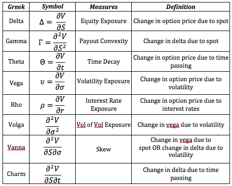

## Table of Contents

## What are Financial Greeks?

Financial Greeks are a set of measures used in finance to understand how sensitive an option's price is to various factors. They are called "Greeks" because they are usually represented by Greek letters. The most common Greeks are Delta, Gamma, Theta, Vega, and Rho. Each Greek measures a different aspect of an option's price movement, helping investors and traders make better decisions about buying and selling options.

Delta, for example, tells you how much an option's price will change for every one-point move in the underlying asset's price. If a stock option has a Delta of 0.5, the option's price will go up by $0.50 if the stock price goes up by $1.00. Gamma measures the rate of change of Delta, showing how Delta itself changes as the underlying asset's price moves. Theta measures the impact of time on an option's price, showing how much value an option loses as it gets closer to its expiration date. Vega measures the sensitivity of an option's price to changes in the volatility of the underlying asset, while Rho measures the sensitivity to changes in interest rates.

Understanding the Greeks can help traders manage risk and plan their strategies more effectively. By knowing how different factors affect an option's price, traders can make more informed decisions about when to buy or sell options, and how to hedge their positions to minimize potential losses. While the Greeks can be complex, they are essential tools for anyone involved in options trading.

## How many Financial Greeks are there and what are their names?

There are five main Financial Greeks that traders use to understand options. Their names are Delta, Gamma, Theta, Vega, and Rho. Each one tells you something different about how an option's price might change.

Delta shows how much the option's price will move if the price of the underlying asset changes by one point. Gamma tells you how Delta itself changes as the asset's price moves. Theta measures how much the option loses value as time passes. Vega shows how the option's price is affected by changes in the volatility of the underlying asset. Rho measures the impact of interest rate changes on the option's price. These Greeks help traders make better decisions about buying and selling options.

## What is Delta and how does it affect an option's price?

Delta is a measure that tells you how much an option's price will change if the price of the underlying asset moves by one point. For example, if an option has a Delta of 0.5, it means that for every dollar the stock price goes up, the option's price will go up by 50 cents. Delta is important because it helps traders understand how sensitive an option is to changes in the stock price.

Delta can be positive or negative, depending on whether you're dealing with a call option or a put option. A call option, which gives you the right to buy the stock, usually has a positive Delta. This means the option's price goes up when the stock price goes up. On the other hand, a put option, which gives you the right to sell the stock, usually has a negative Delta. This means the option's price goes down when the stock price goes up. Understanding Delta helps traders predict how their options will behave as the stock price changes.

## What is Gamma and why is it important for option traders?

Gamma is a measure that tells you how fast the Delta of an option changes when the price of the stock moves. Think of Delta as the speed of the option's price change, and Gamma as the acceleration. If an option has a high Gamma, its Delta can change a lot even with small moves in the stock price. This means the option's price can become more sensitive to the stock's price changes quickly.

Gamma is important for option traders because it helps them understand how their options will react to big or small moves in the stock price. If you're trading options with a high Gamma, you need to be ready for quick changes in the option's price. This can be good if you're trying to make money from fast price movements, but it can also be risky because the option's value can change a lot in a short time. Knowing the Gamma helps traders manage their risk and make better decisions about when to buy or sell options.

## What is Theta and how does it relate to time decay?

Theta is a measure that tells you how much an option's price goes down as time passes. It shows the daily rate of loss in the option's value, which is called time decay. If an option has a Theta of -0.10, it means the option loses 10 cents in value every day, as long as nothing else changes.

Time decay is important because all options have an expiration date. As that date gets closer, the option becomes less valuable because there's less time left for the stock price to move in a way that could make the option profitable. Theta helps traders understand how time affects their options, so they can make better decisions about when to buy or sell them.

## What is Vega and how does it measure an option's sensitivity to volatility?

Vega is a measure that tells you how much an option's price changes when the expected volatility of the stock changes. Volatility is how much the stock price is expected to move up or down. If an option has a Vega of 0.10, it means the option's price will go up by 10 cents if the expected volatility goes up by 1%.

Vega is important because it helps traders understand how changes in the market's expectations about a stock's future movements can affect their options. If a trader thinks the stock will become more volatile, they might look for options with a high Vega because those options could become more valuable. On the other hand, if they expect the stock to become less volatile, they might avoid high Vega options because those options could lose value.

## What is Rho and how does it impact options in relation to interest rates?

Rho is a measure that tells you how much an option's price changes when interest rates change. If an option has a Rho of 0.05, it means the option's price will go up by 5 cents if interest rates go up by 1%. Rho is usually not as important as the other Greeks like Delta or Theta, but it can still matter, especially for long-term options.

Interest rates affect options because they change the cost of holding the option. When interest rates go up, the cost of holding an option goes up too, which can make call options more valuable and put options less valuable. On the other hand, when interest rates go down, the cost of holding an option goes down, which can make call options less valuable and put options more valuable. Understanding Rho helps traders see how changes in interest rates might affect their options, even if it's a smaller effect compared to other factors.

## How can Financial Greeks be used to manage risk in a trading portfolio?

Financial Greeks can help traders manage risk by showing how different factors affect the price of options in their portfolio. By understanding Delta, traders can see how their options will react to changes in the stock price. If a trader wants to reduce the risk of big price swings, they can look at the Delta of their options and adjust their positions to make the portfolio less sensitive to stock price movements. Gamma helps traders know how quickly Delta can change, which is important for managing risk when the stock price moves a lot. By keeping an eye on Gamma, traders can be ready for quick changes in their options' sensitivity and adjust their strategies accordingly.

Theta is another important Greek for risk management because it shows how much value options lose over time. Traders can use Theta to plan when to buy or sell options, especially as the expiration date gets closer. If a trader wants to avoid losing too much value due to time decay, they might choose options with a lower Theta or adjust their positions to reduce the impact of time passing. Vega helps traders understand how changes in the stock's expected volatility can affect their options. By knowing Vega, traders can manage risk related to volatility by choosing options that fit their expectations about future market movements. Finally, Rho, though less impactful, can help traders see how changes in interest rates might affect their long-term options, allowing them to make small adjustments to minimize risk from rate changes.

## What are some common strategies that utilize Financial Greeks?

One common strategy that uses Financial Greeks is Delta hedging. In Delta hedging, traders try to reduce the risk of their options by balancing the Delta of their portfolio. If a trader has options with a high positive Delta, they might buy or sell the stock to make the overall Delta closer to zero. This way, if the stock price moves a lot, the changes in the option's price and the stock's price will balance each other out, reducing the risk. Delta hedging helps traders manage their risk by making their portfolio less sensitive to big moves in the stock price.

Another strategy is the Gamma scalping, which focuses on the Gamma Greek. Traders use Gamma scalping to take advantage of quick changes in the stock price. They buy options with a high Gamma and then adjust their positions as the stock price moves. When the stock price goes up or down, the Delta of the options changes quickly because of the high Gamma. Traders can make small profits by buying or selling the stock to keep their Delta balanced. This strategy works well in markets where the stock price is moving a lot, but it needs a lot of attention and quick action.

A third strategy involves using Theta to manage time decay. Traders might use a strategy called a calendar spread, where they buy and sell options with different expiration dates. They might buy a long-term option with a high Theta and sell a short-term option with an even higher Theta. As time passes, the short-term option loses value faster than the long-term option, which can make money for the trader. This strategy works well when the stock price stays stable, and it helps traders take advantage of time decay to make a profit.

## How do Financial Greeks interact with each other, and what is the Greeks' 'hedging' concept?

Financial Greeks interact with each other in ways that can affect an option's price. Delta and Gamma work together closely. Delta tells you how much an option's price will change if the stock price moves by one point, and Gamma tells you how fast Delta changes. When the stock price moves, Gamma shows how quickly the option becomes more or less sensitive to those moves. Theta, which measures time decay, also interacts with Delta and Gamma. As time passes, Theta makes the option lose value, which can change how Delta and Gamma affect the option's price. Vega, which measures sensitivity to volatility, can also change Delta, Gamma, and Theta. If the market expects the stock to move more, Vega can make the option more valuable, which can change how the other Greeks work. Rho, which measures sensitivity to interest rates, usually has a smaller effect but can still change the option's price along with the other Greeks.

Hedging with Greeks is about using these measures to reduce risk in a trading portfolio. Traders use Delta hedging to balance the sensitivity of their options to the stock price. They might buy or sell the stock to make their overall Delta closer to zero, so big moves in the stock price don't affect their portfolio as much. Gamma hedging is about managing how quickly Delta changes. Traders might adjust their positions often to take advantage of quick stock price movements. Theta hedging involves managing time decay. Traders might use strategies like calendar spreads to profit from the difference in how fast different options lose value over time. Vega hedging helps traders manage the risk from changes in expected volatility. By understanding how these Greeks interact, traders can make better decisions to protect their investments and possibly make more money.

## How can advanced traders use second-order Greeks like Charm, Vanna, and Vomma for more precise risk management?

Advanced traders use second-order Greeks like Charm, Vanna, and Vomma to get a deeper understanding of how their options will change. Charm, also known as Delta decay, tells traders how Delta changes over time, not just with stock price movements. This helps traders see how their options' sensitivity to the stock price will change as the expiration date gets closer. Vanna shows how Delta changes when volatility changes. If a trader thinks the stock's volatility will go up or down, Vanna helps them understand how that will affect their options' sensitivity to the stock price. Vomma measures how Vega changes with volatility, which can be important if a trader expects big changes in how much the stock price might move.

Using these second-order Greeks, traders can manage risk more precisely. For example, if a trader knows the Charm of their options, they can adjust their positions to reduce the impact of time on their Delta. This can help them keep their portfolio balanced even as the expiration date approaches. Vanna can help traders see how their options will react if the market's expectations about volatility change, allowing them to make better decisions about when to buy or sell options. And with Vomma, traders can understand how changes in volatility will affect the Vega of their options, helping them manage the risk from big swings in the market's expected movements. By using these second-order Greeks, advanced traders can fine-tune their strategies to protect their investments and possibly make more money.

## What are the limitations and criticisms of using Financial Greeks in options pricing models?

Using Financial Greeks in options pricing models has some limitations. One big problem is that Greeks are based on assumptions that might not always be true in real life. For example, the Black-Scholes model, which is often used to calculate Greeks, assumes that stock prices move in a normal way and that the market is always open. But in the real world, stock prices can jump suddenly, and markets can close or be affected by big events. This means the Greeks might not always predict how options will behave as well as we hope. Another issue is that Greeks are just estimates. They give us an idea of how an option's price might change, but they can't tell us exactly what will happen. This can make it hard for traders to make perfect decisions.

There are also criticisms about how Greeks are used. Some people think that traders might rely too much on Greeks and forget about other important factors, like the overall market mood or big news events. Greeks are good at showing how small changes might affect an option's price, but they don't tell us everything. For example, if a company suddenly announces bad news, the stock price could drop a lot, and the Greeks might not have predicted that. Also, Greeks can be hard to understand and use correctly, especially for new traders. If someone doesn't fully understand how to use them, they might make mistakes and lose money. So, while Greeks are helpful, traders need to use them carefully and not depend on them too much.

## How did the Greeks manage risk in derivatives?

Financial derivatives are complex instruments, and their risk management requires precise metrics known as "Greeks." These measures are essential in quantifying and mitigating various risk dimensions inherent in derivatives trading.

Delta (Δ) measures the sensitivity of a derivative's price to changes in the price of the underlying asset. It represents the expected change in the derivative's value for a one-unit change in the asset's price. Mathematically, Delta is expressed as:

$$
\Delta = \frac{\partial V}{\partial S}
$$

where $V$ is the derivative's value and $S$ is the underlying asset's price. Delta is crucial for hedging purposes, where a trader maintains a "delta-neutral" position to protect against price movements of the underlying asset.

Theta (Θ) quantifies the sensitivity of the derivative's price to the passage of time, often called time decay. It indicates how much the price of an option is expected to decrease as the expiry approaches, assuming all other factors remain constant. Theta is vital for options traders, especially in volatile markets.

Gamma (Γ) measures the rate of change of Delta itself, providing insight into the curvature of the option's price relative to the underlying asset's price. It is mathematically represented as:

$$
\Gamma = \frac{\partial^2 V}{\partial S^2}
$$

Gamma is critical for understanding how Delta will change with the underlying asset price, enabling traders to assess their exposure to large price swings.

Vega (𝜈) reflects the sensitivity of the derivative's price to changes in the [volatility](/wiki/volatility-trading-strategies) of the underlying asset. Vega helps traders understand how options prices can be affected by shifts in market volatility, an essential [factor](/wiki/factor-investing) during turbulent market conditions.

Rho (ρ) measures the sensitivity of the derivative's price to changes in interest rates. While often overlooked, Rho becomes significant in environments with fluctuating interest rates, aiding in the assessment of [interest rate](/wiki/interest-rate-trading-strategies) risk exposure.

Diving deeper into risk management, the minor Greeks play a substantial role in complex portfolio strategies. These include Charm, Vanna, and Vomma, among others. For instance, Vanna measures the change in Delta with respect to changes in implied volatility, while Vomma gauges the change in Vega with respect to volatility shifts. These minor Greeks allow traders to dissect the nuanced interactions between various risks, tailoring their portfolios to adjust for non-linear responses to market conditions.

Incorporating these Greeks into risk management frameworks enables derivatives traders to anticipate potential losses and make informed decisions, paving the way for sophisticated risk-reduction techniques and optimized trading strategies. As quantitative finance advances, understanding and application of both major and minor Greeks are becoming more pivotal in the pursuit of effective risk management.

## References & Further Reading

[1]: Wilmott, P., Howison, S., & Dewynne, J. (1995). ["The Mathematics of Financial Derivatives: A Student Introduction"](https://www.cambridge.org/core/books/mathematics-of-financial-derivatives/7121345D07C5BCE4FBEC91A8A7E6F267). Cambridge University Press.

[2]: Hull, J. C. (2018). ["Options, Futures, and Other Derivatives"](https://www.semanticscholar.org/paper/Options%2C-Futures%2C-and-Other-Derivatives-Hull/89bdee500c8623864fc9eb7a471546aa713acc44). Pearson Education.

[3]: Black, F., & Scholes, M. (1973). ["The Pricing of Options and Corporate Liabilities."](https://www.cs.princeton.edu/courses/archive/fall09/cos323/papers/black_scholes73.pdf) Journal of Political Economy, 81(3), 637-654.

[4]: Gatheral, J. (2006). ["The Volatility Surface: A Practitioner's Guide."](https://onlinelibrary.wiley.com/doi/book/10.1002/9781119202073) Wiley Finance.

[5]: Chan, E. (2009). ["Quantitative Trading: How to Build Your Own Algorithmic Trading Business"](https://github.com/ftvision/quant_trading_echan_book). Wiley Trading.

[6]: Jansen, S. (2020). ["Machine Learning for Algorithmic Trading: Predictive models to extract signals from market and alternative data for systematic trading strategies with Python, 2nd Edition."](https://www.amazon.com/Machine-Learning-Algorithmic-Trading-alternative/dp/1839217715) Packt Publishing.

[7]: Lopez de Prado, M. (2018). ["Advances in Financial Machine Learning"](https://www.amazon.com/Advances-Financial-Machine-Learning-Marcos/dp/1119482089). Wiley.

[8]: Natenberg, S. (1994). ["Option Volatility and Pricing: Advanced Trading Strategies and Techniques."](https://www.amazon.com/Option-Volatility-Pricing-Strategies-Techniques/dp/0071818774) McGraw-Hill Education.