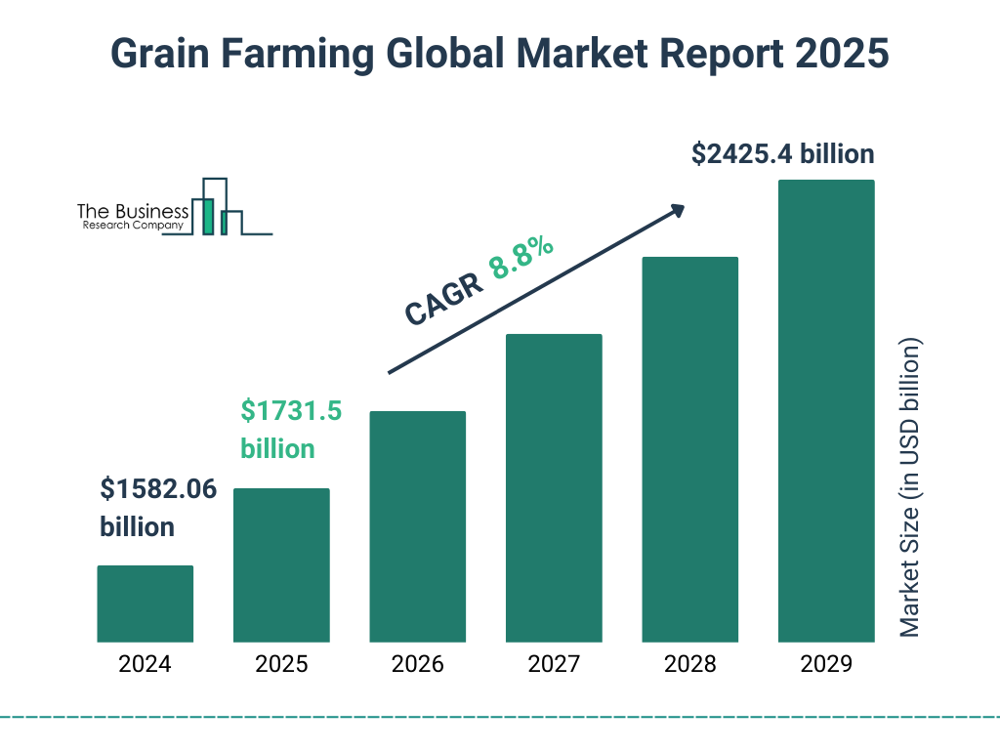

Grain markets, investment finance, and algorithmic trading intersect to create a dynamic landscape filled with both opportunities and challenges. Global food prices are shaped by an array of factors, leading investors to increasingly view grain futures as viable investment options. These futures provide a mechanism to speculate on price movements and hedge against future price volatility in critical commodities such as wheat, corn, and soybeans. The inherent volatility and potential for profit in these markets attract a wide range of participants from traditional agricultural producers to speculative financial investors.

Algorithmic trading, with its ability to rapidly process information and execute trades with precision, has transformed investment approaches within the commodities sector. This method employs programmed trading strategies to assess large datasets and make informed decisions based on pre-set criteria. By minimizing human error and reacting swiftly to market changes, algorithmic trading enhances the efficiency of participating in volatile markets like those of grain.



As investors engage with grain futures, they encounter an environment where technology and traditional trading practices converge. The implications of this intersection are profound: while algorithmic trading introduces unprecedented precision and control, it simultaneously demands a higher level of technical understanding and infrastructure. This article aims to examine how grain market investments are evolving with the advent of automated trading systems and consider the broader impacts on the commodities market landscape.

## Table of Contents

## Understanding Grain Markets

Grain markets are integral components of the global commodities market, focusing on essential agricultural products such as wheat, corn, and soybeans. These markets function by trading contracts that stipulate the purchase or sale of a specific amount of grain at a predetermined price and date. This system of futures contracts is pivotal for both producers and consumers as it provides a mechanism to hedge against price fluctuations and facilitates strategic planning.

The dynamics of grain markets are substantially influenced by a combination of climatic conditions, global demand, and geopolitical factors. Climatic conditions, including rainfall patterns, temperature variations, and extreme weather events, have direct impacts on crop yields. For instance, droughts in major grain-producing regions can lead to significant supply shortages, driving up prices. Conversely, favorable weather can lead to bumper crops and potential price declines. 

Global demand for grains is another critical factor. The growing world population and increasing demand for grains in emerging economies, particularly for livestock feed and biofuels, exert upward pressure on grain prices. Additionally, the shift towards sustainable energy has augmented the demand for biofuel crops like corn, further influencing market dynamics.

Geopolitical factors also play a crucial role. Policies regarding tariffs, trade agreements, and subsidies can alter competitive advantages and market accessibility, affecting both [liquidity](/wiki/liquidity-risk-premium) and price stability. Political instability in grain-exporting regions can disrupt supply chains, leading to market [volatility](/wiki/volatility-trading-strategies).

While investments in grain futures present opportunities for profitability, they come with inherent risks. Price volatility, driven by unpredictable elements such as weather and political decisions, means that investors can experience significant gains or losses. Risk management strategies, such as diversifying investments and employing hedging techniques, are essential for mitigating potential adverse outcomes.

Overall, understanding the interplay of these factors is essential for participants in grain markets to navigate the complexities of this sector effectively.

## The Role of Futures in Grain Trading

Futures contracts in grain trading serve as a critical tool for managing price volatility. By allowing investors to lock in prices for grains like wheat, corn, and soybeans, these contracts provide a hedge against unpredictable price swings. For instance, a farmer can sell a futures contract to fix the price of their harvest in advance, protecting against potential declines in market prices. Conversely, a grain processor might purchase a futures contract to secure a steady supply at a known cost, safeguarding against price spikes.

These contracts are inherently standardized, stipulating specific quantities and quality of the commodity to be delivered, and are traded on organized exchanges such as the Chicago Board of Trade (CBOT) or the Intercontinental Exchange (ICE). This standardization ensures liquidity, enabling market participants to efficiently enter and [exit](/wiki/exit-strategy) positions.

While futures offer essential risk management tools for hedgers, who aim to stabilize their financial planning, they also draw speculators. Speculators engage in futures trading to profit from anticipated price movements, leveraging the contract's volatility for potential high returns. For example, if a speculator anticipates a rise in corn prices due to adverse weather conditions, they might purchase a futures contract with the expectation of selling it at a higher price for a profit.

Despite their advantages, futures contracts come with inherent risks. Both hedgers and speculators face the possibility of margin calls if market movements are unfavorable, requiring additional funds to maintain their positions. As such, while futures provide a mechanism for risk mitigation and potential profit, they necessitate a deep understanding of market trends and solid financial strategies.

## Investment Finance in Commodities

Finance professionals often turn to commodities trading as a means to diversify their investment portfolios and take advantage of fluctuations in commodity prices. Commodities, including grains such as wheat, corn, and soybeans, are tangible goods that can be bought and sold in futures contracts on organized exchanges. This asset class is particularly attractive to investors seeking to mitigate risk, hedge against inflation, and explore opportunities distinct from traditional equity or bond markets.

**Understanding Market Trends**

A key component of successful investment in commodities involves grasping market trends. This requires a comprehensive analysis of factors such as supply and demand dynamics, weather patterns affecting crop yields, geopolitical influences, and economic indicators. Traders utilize a combination of [fundamental analysis](/wiki/fundamental-analysis)—examining crop reports, inventory data, and consumption rates—and technical analysis, which involves statistical tools and chart patterns to predict future price movements.

**Leveraging Strategies**

To enhance returns in commodities trading, investors employ a range of leveraging strategies. Leverage allows traders to control a larger position than would be possible by using only their invested capital, magnifying both potential gains and losses. One common strategy is utilizing margin trading, where investors borrow funds to increase exposure. However, this approach requires careful management of risks associated with price volatility.

**Risk Mitigation**

Managing risk is paramount in commodities trading. Price volatility, influenced by external conditions such as natural disasters, trade policies, and technological advancements, presents both opportunities and challenges. Risk mitigation strategies include:

- **Diversification**: By spreading investments across different commodities, traders reduce exposure to adverse price movements in any single market.
- **Hedging**: Traders often utilize future contracts to lock in prices, protecting against unfavorable price shifts. For example, a wheat producer might enter a futures contract to sell a specific amount of wheat at a predetermined price, safeguarding profitability regardless of market fluctuations.
- **Stop-Loss Orders**: These are set to automatically sell a commodity when it reaches a certain price, minimizing potential losses in declining markets.

**Conclusion**

Effective management in commodities trading demands an in-depth understanding of market trends, astute leveraging of financial resources, and strategic risk mitigation. These elements collectively allow finance professionals to navigate the complexities and capitalize on the inherent opportunities within commodity markets.

## Algorithmic Trading in Grain Markets

Algorithmic trading has fundamentally transformed the landscape of grain market investments, employing sophisticated algorithms to automate and optimize trading decisions. These algorithms are designed to interpret large volumes of data, identify patterns, and execute trades with minimal human intervention. The primary advantage of [algorithmic trading](/wiki/algorithmic-trading) is its ability to enhance trading efficiency. By automating processes, it reduces the potential for human error and allows for the rapid execution of trades, which is crucial in the volatile grain markets where price movements can be sudden and significant.

Traders and financial institutions leverage algorithmic trading to implement high-frequency trading ([HFT](/wiki/high-frequency-trading-strategies)) strategies. These strategies involve executing a large number of orders at extremely high speeds, often in fractions of a second, to capitalize on small price discrepancies. The algorithms used in HFT are typically based on a set of predetermined rules that assess market conditions and make split-second trading decisions. This capability is particularly beneficial in grain markets, where liquidity and market depth can vary significantly across different contracts and trading periods.

Python, a versatile programming language, is frequently used to develop these trading algorithms due to its strong data processing capabilities and the availability of powerful libraries. For example, libraries like pandas and numpy facilitate efficient data manipulation, while tools such as scikit-learn enable sophisticated [machine learning](/wiki/machine-learning) applications that can be applied to algorithmic trading strategies.

Here is a simple Python example of an algorithm that could be used to make trading decisions based on moving averages—a common technique in algorithmic trading:

```python
import pandas as pd

# Assume df is a DataFrame with historical grain price data
def simple_moving_average_strategy(df, short_window=40, long_window=100):
    df['Short_MA'] = df['Close'].rolling(window=short_window, min_periods=1).mean()
    df['Long_MA'] = df['Close'].rolling(window=long_window, min_periods=1).mean()

    # Generate signals
    df['Signal'] = 0  # no position
    df['Signal'][short_window:] = np.where(df['Short_MA'][short_window:] 
                                            > df['Long_MA'][short_window:], 1.0, 0.0)

    # Generate trading orders
    df['Position'] = df['Signal'].diff()

    return df

# Implement this strategy on your market data
market_data = pd.DataFrame({
    'Close': [/* fill in grain price data */]
})

trading_signals = simple_moving_average_strategy(market_data)
```

The script calculates short-term and long-term moving averages of grain prices and generates buy or sell signals based on the crossover points. Such strategies, when refined and executed at high frequencies, can be highly profitable by capturing minute price movements that are typically invisible to human traders.

Despite its advantages, algorithmic trading in grain markets is not without challenges. Algorithms must be continuously refined to adapt to changing market conditions, and maintaining accurate data feeds is essential for reliable execution. Successful implementation requires a deep technical understanding, robust infrastructure, and comprehensive risk management practices to mitigate potential downsides.

## Advantages and Challenges of Algo Trading

Algorithmic trading has transformed grain markets by enabling traders to process vast amounts of data and execute trades with precision and speed. The primary advantage of algorithmic trading is its capacity to handle large datasets, which is crucial for identifying patterns and trends that human analysis might overlook. Algorithms can assess real-time market data, historical [statistics](/wiki/bayesian-statistics), and other relevant factors, allowing for informed decision-making that optimizes trading outcomes.

The ability to execute trades at optimal times is another significant advantage. Algorithms use predefined criteria to make trading decisions instantaneously, reducing the latency associated with manual trading. This speed is beneficial in the highly volatile grain markets, where prices can fluctuate rapidly based on various factors like weather conditions, geopolitical events, and market speculation. By minimizing the time between decision-making and trade execution, algorithms can help traders secure the best possible prices.

Consistency is a further benefit of automated trading systems. Unlike humans, algorithms perform trading tasks systematically without the influence of emotions, ensuring that trading strategies are executed consistently. This consistency aids in maintaining a disciplined approach to trading, reducing the risk of impulsive decisions that could lead to significant losses.

However, algorithmic trading comes with several challenges. One central issue is refining algorithms for market adaptability. Markets are inherently dynamic, and algorithms must be regularly updated and tested to ensure they remain effective in adjusting to new market conditions. Failure to do so can lead to outdated strategies that no longer capture the complexities of the current trading environment.

Another challenge is maintaining data accuracy. Algorithms rely heavily on data inputs, and inaccuracies can lead to poor trading decisions. Therefore, it is critical to have robust systems for data management, including data validation and error correction mechanisms, to ensure the reliability of the information used for trading.

Moreover, implementing algorithmic trading requires a significant technical understanding and infrastructure. Developing and maintaining efficient algorithms demands expertise in programming and quantitative analysis, often necessitating a team of skilled professionals. Additionally, the infrastructure supporting algorithmic trading, including powerful computing systems and high-speed internet connections, must be sophisticated enough to handle the demands of high-frequency trading environments.

Overall, while algorithmic trading provides numerous advantages to investors in grain markets, these benefits are contingent upon overcoming the technical complexities and data challenges associated with its implementation.

## Conclusion

Grain market investments present significant opportunities for achieving substantial returns due to the dynamic nature of demand, climatic effects, and geopolitical influences. However, these opportunities are accompanied by complexities that necessitate careful strategic planning. Investors must navigate a landscape where price fluctuations can be frequent and substantial, understanding both the macroeconomic factors at play and the finer details of commodity pricing.

Algorithmic trading is instrumental in transforming how investors engage with grain markets. By employing sophisticated algorithms, traders can achieve enhanced precision in timing and execution, essential in markets characterized by volatility. These systems offer a significant edge by enabling rapid processing of market data and execution of trades, minimizing human error and allowing for high-frequency trading strategies that capitalize on minute price changes.

The success of investments in grain markets requires not only a robust understanding of the intricacies of these markets but also the effective implementation of algorithmic trading systems. These systems provide the mechanisms for achieving precision, control, and speed, which are pivotal in managing risks and maximizing profitability. As technology advances, the capacity for algorithms to process vast datasets and adapt to changing market conditions will continue to grow, offering investors more sophisticated tools for navigating the complexities of grain market investments.

To be successful, investors must integrate deep market knowledge with cutting-edge algorithmic trading tools, aligning technological capabilities with market strategies to optimize outcomes in this competitive arena.

## References & Further Reading

[1]: Bergstra, J., Bardenet, R., Bengio, Y., & Kégl, B. (2011). ["Algorithms for Hyper-Parameter Optimization."](https://papers.nips.cc/paper/4443-algorithms-for-hyper-parameter-optimization) Advances in Neural Information Processing Systems 24.

[2]: Lopez de Prado, M. (2018). ["Advances in Financial Machine Learning."](https://www.amazon.com/Advances-Financial-Machine-Learning-Marcos/dp/1119482089) Wiley.

[3]: Aronson, D. (2006). ["Evidence-Based Technical Analysis: Applying the Scientific Method and Statistical Inference to Trading Signals."](https://www.wiley.com/en-us/Evidence+Based+Technical+Analysis%3A+Applying+the+Scientific+Method+and+Statistical+Inference+to+Trading+Signals-p-9780470008744) Wiley.

[4]: Jansen, S. (2020). ["Machine Learning for Algorithmic Trading: Predictive models to extract signals from market and alternative data for systematic trading strategies."](https://www.amazon.com/Machine-Learning-Algorithmic-Trading-alternative/dp/1839217715) Packt Publishing.

[5]: Chan, E. P. (2008). ["Quantitative Trading: How to Build Your Own Algorithmic Trading Business."](https://github.com/ftvision/quant_trading_echan_book) Wiley.