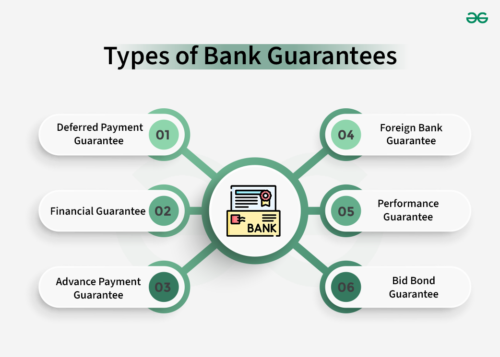

## Table of Contents

## What is a financial guarantee?

A financial guarantee is a promise made by one party to cover the financial obligations of another party if they fail to meet their commitments. This is often used in business and finance to reduce the risk for lenders or investors. For example, if a company borrows money from a bank, a financial guarantee might be provided by a third party, like an insurance company, to assure the bank that the loan will be repaid even if the borrowing company cannot pay it back.

Financial guarantees can take many forms, such as a letter of credit, a surety bond, or an insurance policy. They are important because they help build trust between parties in financial transactions. By having a guarantee, the lender feels more secure about lending money, and the borrower might get better loan terms or interest rates. This can make it easier for businesses to get the funding they need to grow and operate.

## What are the basic forms of financial guarantees?

Financial guarantees come in different forms, but some of the most common ones are letters of credit, surety bonds, and insurance policies. A letter of credit is a promise from a bank that it will pay a certain amount of money to a seller if the buyer cannot pay. This is often used in international trade to make sure that sellers get paid even if the buyer's payment fails. A surety bond is a promise by a third party, called a surety, to pay a certain amount if the person who gets the bond does not meet their obligations. This is often used in construction projects or when someone needs to guarantee that they will follow the law.

An insurance policy can also act as a financial guarantee. In this case, an insurance company promises to cover losses if something goes wrong. For example, if a company takes out a loan and buys insurance to cover the loan, the insurance company will pay the lender if the company cannot repay the loan. Each of these forms of financial guarantees helps to reduce risk for the person or company that is owed money. By having a guarantee, they feel more secure about lending money or doing business with someone.

## How does a financial guarantee work?

A financial guarantee is like a promise that helps make people feel safe when they lend money or do business. Imagine you want to borrow money from a bank. The bank might be worried that you won't be able to pay it back. But if someone else, like an insurance company, promises to pay the bank if you can't, the bank feels better about lending you the money. This promise is called a financial guarantee. It can be in the form of a letter of credit, a surety bond, or an insurance policy.

When a financial guarantee is in place, it means that if you can't pay back the money you borrowed, the person or company that made the guarantee will step in and pay instead. This makes it easier for you to get the loan because the bank knows it will get its money back one way or another. Financial guarantees are important because they help build trust between people and businesses. They make it possible for more deals to happen by reducing the risk for everyone involved.

## What are the common types of financial guarantees?

Financial guarantees come in different forms, but the most common ones are letters of credit, surety bonds, and insurance policies. A letter of credit is a promise from a bank to pay a seller if the buyer can't pay. This is often used when people buy things from other countries to make sure the seller gets their money. A surety bond is a promise by a third party, called a surety, to pay if the person who gets the bond doesn't do what they promised. This is often used in construction or when someone needs to show they will follow the law.

An insurance policy can also act as a financial guarantee. This means an insurance company promises to cover losses if something goes wrong. For example, if a company takes out a loan and buys insurance to cover it, the insurance company will pay the lender if the company can't repay the loan. These types of guarantees help make people feel safer about lending money or doing business because they know there's a backup plan if things don't go as planned.

## Can you provide an example of a financial guarantee in a business context?

Imagine a small business owner named Sarah who wants to expand her bakery. She needs to borrow $50,000 from a bank to buy new equipment. The bank is worried that Sarah might not be able to pay back the loan, so they ask for a financial guarantee. Sarah's friend, who owns a successful restaurant, agrees to act as a guarantor. He signs a surety bond, promising the bank that if Sarah can't pay back the loan, he will pay it instead. This makes the bank feel more secure, and they agree to lend Sarah the money she needs.

Thanks to the financial guarantee, Sarah can now buy the new equipment and grow her bakery. The guarantee helped build trust between Sarah and the bank. Without it, the bank might have said no to the loan, and Sarah's business might not have been able to expand. This example shows how financial guarantees can help businesses get the money they need to grow, by making lenders feel safer about lending money.

## What are the key differences between a financial guarantee and an insurance policy?

A financial guarantee and an insurance policy both help reduce risk, but they work in different ways. A financial guarantee is like a promise from one party to cover the financial obligations of another party if they can't pay. For example, if a company borrows money and can't pay it back, a financial guarantee might come from a third party, like a bank or another company, to make sure the lender gets their money. This is often used in business deals to build trust between the parties involved.

On the other hand, an insurance policy is a contract between a person or business and an insurance company. The insurance company agrees to pay for certain losses, damages, or risks in exchange for a premium. For example, if a business takes out a loan and buys insurance to cover it, the insurance company will pay the lender if the business can't repay the loan. The key difference is that while a financial guarantee is usually about making sure money is paid back, an insurance policy can cover a wider range of risks and losses, and it involves regular payments (premiums) to keep the coverage active.

## Who are the typical parties involved in a financial guarantee?

In a financial guarantee, there are usually three main parties involved: the borrower, the lender, and the guarantor. The borrower is the person or business that needs money and wants to take out a loan. The lender is the bank or financial institution that gives the money to the borrower. The guarantor is the third party, like an insurance company or another business, that promises to pay the lender if the borrower can't pay back the loan.

The guarantor's role is important because it helps the lender feel safer about giving out the loan. By having a financial guarantee, the lender knows that they will get their money back even if the borrower can't pay. This makes it easier for the borrower to get the loan they need. The guarantee builds trust between all the parties involved and can help businesses grow by making it possible for them to borrow money more easily.

## What are the legal requirements for issuing a financial guarantee?

When someone wants to issue a financial guarantee, there are some legal rules they need to follow. First, the guarantee must be in writing and signed by the guarantor. This makes sure everyone knows who is promising to pay if the borrower can't. The document should clearly state the amount of money involved and the conditions under which the guarantor will have to pay. It's also important that the guarantor understands what they are agreeing to and that they have the money or resources to back up their promise.

Different countries might have different laws about financial guarantees, so it's a good idea to check with a lawyer to make sure everything is done right. For example, some places might need the guarantee to be notarized, which means a special person has to watch the signing and confirm that it's real. Also, the guarantee needs to follow any rules set by the bank or financial institution that is lending the money. By following these legal requirements, the guarantee can be a strong promise that helps everyone feel safer about the loan.

## How do financial guarantees impact credit ratings?

Financial guarantees can affect credit ratings in a big way. When a person or a business gets a financial guarantee, it can help them get a loan more easily. This is because the lender feels safer knowing that someone else will pay if the borrower can't. If the borrower pays back the loan on time, their credit rating can go up because they showed they can handle their money well. But if the borrower can't pay and the guarantor has to step in, the borrower's credit rating might go down. This shows that they had trouble paying their bills.

The guarantor's credit rating can also be affected by a financial guarantee. If the guarantor has to pay because the borrower can't, it might hurt their credit rating too. This is because it shows that the guarantor had to use their money to cover someone else's debt. But if the borrower pays back the loan without any problems, the guarantor's credit rating usually stays the same. It's important for both the borrower and the guarantor to understand how a financial guarantee can affect their credit ratings before they agree to it.

## What are the risks associated with providing a financial guarantee?

Providing a financial guarantee can be risky. If the person or business you are guaranteeing can't pay back their loan, you will have to pay instead. This means you could lose a lot of money. It can also hurt your credit rating if you have to step in and pay. If you can't pay the loan either, your own finances could be in trouble. It's important to think carefully about whether you can really afford to take on this risk before you agree to be a guarantor.

Another risk is that it might be hard to get out of a financial guarantee once you've agreed to it. If the borrower keeps having money problems, you might be stuck paying for them for a long time. This can be stressful and can affect your own plans for your money. Before you agree to provide a financial guarantee, make sure you understand all the terms and know exactly what you might have to pay if things go wrong. It's a big responsibility, so take it seriously.

## How can a company mitigate the risks of a financial guarantee?

A company can lower the risks of a financial guarantee by carefully checking the financial health of the person or business they are guaranteeing. They should look at the borrower's credit history, income, and ability to pay back the loan. If the borrower seems reliable, the risk is lower. The company can also ask for some form of security, like property or other assets, that they can take if the borrower can't pay. This way, they have something to fall back on if things go wrong.

Another way to reduce risk is to set clear terms in the guarantee agreement. The company should make sure the agreement says exactly when they have to pay and how much. They can also limit how long the guarantee lasts, so they don't have to keep paying forever. It's a good idea to talk to a lawyer to make sure the agreement is fair and protects the company as much as possible. By being careful and setting clear rules, a company can make a financial guarantee safer for themselves.

## What advanced strategies can be used to structure a financial guarantee for optimal benefit?

One advanced strategy for structuring a financial guarantee is to use a partial guarantee instead of a full one. This means the guarantor only agrees to cover a part of the loan, not all of it. This can lower the risk for the guarantor because they won't have to pay back the whole loan if the borrower can't. It can also make the lender more willing to work with the borrower because they still have some risk, but it's less than if there was no guarantee at all. By using a partial guarantee, both the guarantor and the lender can feel safer about the deal.

Another strategy is to use a conditional guarantee. This means the guarantor only has to pay if certain things happen, like if the borrower misses a certain number of payments. This can help the guarantor because they don't have to pay right away if the borrower has a small problem. It gives the borrower time to fix things before the guarantor has to step in. By setting clear conditions, the guarantor can make sure they only have to pay when it's really needed. This can make the guarantee more fair for everyone involved.

## References & Further Reading

[1]: Kessler, B. (2019). ["Understanding the Role of Financial Guarantees in Algorithmic Trading."](https://onlinelibrary.wiley.com/doi/10.1002/jsc.2403) Investopedia.

[2]: Marcos, J. (2018). ["Risk Management in Algorithmic Trading: A Comprehensive Review."](https://www.researchgate.net/publication/378287610_Machine_learning_in_financial_markets_A_critical_review_of_algorithmic_trading_and_risk_management) Journal of Financial Markets.

[3]: Lopez de Prado, M. (2018). ["Advances in Financial Machine Learning."](https://www.amazon.com/Advances-Financial-Machine-Learning-Marcos/dp/1119482089) Wiley.

[4]: Aronson, D. (2007). ["Evidence-Based Technical Analysis: Applying the Scientific Method and Statistical Inference to Trading Signals."](https://www.amazon.com/Evidence-Based-Technical-Analysis-Scientific-Statistical/dp/0470008741) Wiley.

[5]: Chan, E. P. (2009). ["Quantitative Trading: How to Build Your Own Algorithmic Trading Business."](https://github.com/ftvision/quant_trading_echan_book) Wiley.