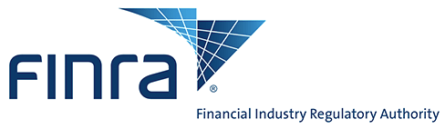

## Table of Contents

## What is the Financial Industry Regulatory Authority (FINRA)?

The Financial Industry Regulatory Authority, or FINRA, is a non-governmental organization that helps keep the U.S. financial markets safe and fair. It does this by making rules for people and companies that sell stocks, bonds, and other investments. FINRA also checks to make sure these rules are followed. If someone breaks the rules, FINRA can take action against them.

FINRA is important because it helps protect investors. It does this by making sure that brokers and dealers are honest and fair. FINRA also gives investors tools and information to help them make good choices about their money. This way, people can feel more confident when they invest in the stock market.

## What are the main functions of FINRA?

FINRA's main job is to make and enforce rules for the people and companies that sell investments like stocks and bonds. This helps keep the financial markets safe and fair. FINRA checks that everyone follows these rules. If someone doesn't follow the rules, FINRA can punish them. This makes sure that brokers and dealers act honestly and fairly.

Another important thing FINRA does is help protect investors. It gives people tools and information so they can make smart choices about their money. FINRA also helps people understand how to invest safely. By doing this, FINRA makes sure that investors feel confident when they put their money into the stock market.

## How does FINRA protect investors?

FINRA protects investors by making sure that brokers and dealers follow the rules. They check that these people are honest and fair when they sell investments like stocks and bonds. If someone breaks the rules, FINRA can take action against them. This helps keep the financial markets safe and makes sure that investors are treated fairly.

FINRA also helps investors by giving them tools and information. They provide resources that help people understand how to invest safely and make smart choices with their money. By doing this, FINRA helps investors feel more confident when they put their money into the stock market. This way, people can invest without worrying as much about being cheated or making bad choices.

## What is the history and background of FINRA?

FINRA was created in 2007 when two older organizations, the National Association of Securities Dealers (NASD) and the regulation part of the New York Stock Exchange (NYSE), came together. Before FINRA, the NASD was formed in 1939 to keep the stock market honest after a big crash in 1929. The NYSE had its own rules too, but in 2007, they decided to join forces to make one big group that could do an even better job.

Today, FINRA is a big part of keeping the U.S. financial markets safe and fair. It makes rules for people and companies that sell investments like stocks and bonds. FINRA also checks to make sure everyone follows these rules. If someone breaks them, FINRA can take action. This helps protect investors by making sure they are treated fairly and have the information they need to make smart choices with their money.

## How is FINRA structured and governed?

FINRA is run by a board of governors that makes the big decisions. The board has people from different parts of the financial world, like big companies, smaller firms, and even some people who don't work in finance at all. This mix helps make sure that FINRA's rules are fair and good for everyone. The board is led by a chairperson who helps guide the group and make sure everyone works together well.

FINRA also has different groups inside it that focus on specific things, like making rules, checking if people follow those rules, and helping investors. These groups work together to keep the financial markets safe and fair. FINRA is not part of the government, but it works with the government to make sure the rules are strong and protect investors. This way, FINRA can do its job well and help people feel confident when they invest their money.

## What are the key regulations enforced by FINRA?

FINRA makes rules that people and companies selling investments like stocks and bonds have to follow. One big rule is that brokers and dealers must be honest and fair with their clients. They can't lie or hide important information about investments. Another rule is that they have to keep their clients' money and investments safe. They can't use this money for other things without permission. FINRA also says that brokers and dealers need to know a lot about the investments they sell, so they can give good advice to their clients.

FINRA also has rules about how brokers and dealers talk to their clients. They must clearly explain the risks and costs of investments. They can't trick people or pressure them into buying something they don't want. FINRA checks to make sure everyone follows these rules. If someone breaks them, FINRA can punish them. This could mean fines, stopping them from working in the industry, or making them give money back to their clients. By enforcing these rules, FINRA helps keep the financial markets safe and fair for everyone.

## How does FINRA oversee and regulate brokerage firms and their employees?

FINRA keeps an eye on brokerage firms and their employees to make sure they follow the rules. They do this by checking the firms regularly. These checks help FINRA see if the firms are doing things the right way. If they find problems, they can tell the firms to fix them. FINRA also looks at the backgrounds of people who want to work at these firms. They make sure these people are honest and have the right skills. This helps keep bad people out of the industry.

If someone at a brokerage firm breaks the rules, FINRA can take action against them. They might fine them, stop them from working in the industry, or make them give money back to their clients. This makes sure that everyone plays by the same rules. By doing all of this, FINRA helps keep the financial markets safe and fair. They protect investors by making sure the people selling investments are honest and good at their jobs.

## What role does FINRA play in the arbitration and mediation of disputes?

FINRA helps people solve disagreements through arbitration and mediation. Arbitration is when a neutral person listens to both sides and makes a decision. Mediation is when a neutral person helps both sides talk and try to agree on a solution themselves. FINRA runs these processes to help investors and brokers solve their problems without going to court. This can be faster and less expensive than a court case.

FINRA's arbitration and mediation services are important because they give investors a way to fix issues with their brokers. If an investor thinks a broker did something wrong, they can ask FINRA to help. FINRA makes sure the process is fair and that both sides get a chance to explain their side of the story. By doing this, FINRA helps keep the financial markets honest and protects investors.

## How does FINRA contribute to market transparency and integrity?

FINRA helps make the financial markets more open and honest by setting rules that brokers and dealers must follow. They make sure that everyone shares important information about investments clearly and honestly. This means that investors can see the real value and risks of what they are buying. FINRA also checks that brokers and dealers don't hide things or lie to their clients. By doing this, FINRA helps investors trust the market more because they know they are getting the truth.

Another way FINRA helps with market transparency and integrity is by keeping a close watch on the market. They use technology and regular checks to spot any bad behavior quickly. If they find someone breaking the rules, FINRA can take action to stop it. This could mean fines, stopping someone from working in the industry, or making them give money back to their clients. By keeping a strong watch, FINRA makes sure that the market stays fair and that investors can feel safe when they put their money into it.

## What are the reporting requirements for firms under FINRA rules?

FINRA makes rules that say what information firms need to tell them. Firms have to report things like how much money they are making, what investments they are selling, and any problems they run into. They also need to tell FINRA about any big changes in their business, like if they start selling new types of investments or if someone important leaves the company. This helps FINRA keep an eye on the firms and make sure they are following the rules.

Firms also need to tell FINRA if they get complaints from their clients. If someone says a broker did something wrong, the firm has to report it. This includes things like if a client loses money because of bad advice or if a broker doesn't follow the rules. By making firms report these things, FINRA can check if the firms are treating their clients fairly and fix any problems quickly. This helps keep the financial markets honest and safe for everyone.

## How does FINRA collaborate with other regulatory bodies?

FINRA works with other groups that make rules to help keep the financial markets safe and fair. One big group they work with is the Securities and Exchange Commission (SEC). The SEC is a part of the government that makes sure companies follow the rules when they sell stocks and bonds. FINRA and the SEC share information and help each other check that brokers and dealers are doing things the right way. This teamwork helps them catch any problems quickly and keep investors safe.

FINRA also works with other groups around the world. Since many people buy and sell investments in different countries, it's important for FINRA to talk with other rule-makers in places like Europe and Asia. By sharing information and working together, they can make sure that the rules are strong everywhere. This helps keep the whole global financial market honest and fair for everyone who invests their money.

## What are some recent initiatives or changes implemented by FINRA?

FINRA has been working on some new things to make the financial markets safer and easier to understand. One big change they made is about how brokers and dealers report their activities. They now have to give more details about what they are doing, so FINRA can keep a closer watch on the market. This helps them catch any problems faster and makes sure that everyone is playing by the rules.

Another thing FINRA has done is to focus more on helping investors. They started a program called "BrokerCheck," which lets people look up information about brokers and firms before they decide to work with them. This way, investors can see if a broker has had any problems in the past and make better choices about who to trust with their money. By doing this, FINRA is trying to make sure that investors have all the tools they need to stay safe and informed.

## References & Further Reading

[1]: Financial Industry Regulatory Authority (FINRA). ["FINRA Rules."](https://www.finra.org/rules-guidance) 

[2]: Aldridge, I. (2013). ["High-Frequency Trading: A Practical Guide to Algorithmic Strategies and Trading Systems."](https://books.google.com/books/about/High_Frequency_Trading.html?id=6l0DDQAAQBAJ) Wiley.

[3]: Hendershott, T., & Riordan, R. (2013). ["Algorithmic Trading and the Market for Liquidity."](https://www.jstor.org/stable/43303831) Journal of Financial and Quantitative Analysis, 45(1), 1-21.

[4]: Kirilenko, A. A., Kyle, A. S., Samadi, M., & Tuzun, T. (2017). ["The Flash Crash: The Impact of High-Frequency Trading on an Electronic Market."](https://onlinelibrary.wiley.com/doi/abs/10.1111/jofi.12498) The Journal of Law, Economics, and Organization, 33(3), 547-580.

[5]: Securities and Exchange Commission (SEC). ["Algorithmic Trading: Examination FAQ."](https://www.sec.gov/about/reports-publications/algo_trading_report_2020) 

[6]: Lopez de Prado, M. (2018). ["Advances in Financial Machine Learning."](https://www.amazon.com/Advances-Financial-Machine-Learning-Marcos/dp/1119482089) Wiley.

[7]: Securities and Exchange Commission (SEC). ["FINRA Market Surveillance."](https://www.finra.org/media-center/speeches-testimony/equity-market-surveillance-today-and-path-ahead)

[8]: Staats, J. L., & Gilson, A. (2011). ["The Financial Crisis Inquiry Report."](https://www.congress.gov/112/chrg/CHRG-112hhrg64556/CHRG-112hhrg64556.pdf) National Commission on the Causes of the Financial and Economic Crisis in the United States.