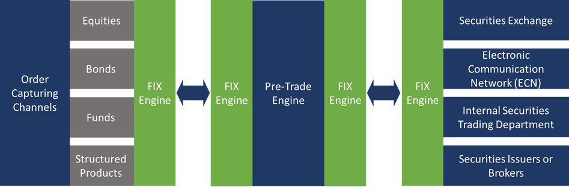

## Table of Contents

## What is the Financial Information Exchange (FIX) Protocol?

The Financial Information Exchange (FIX) Protocol is a way for different computers in the financial world to talk to each other. It helps banks, stock exchanges, and other financial companies share information about buying and selling stocks, bonds, and other financial products. It's like a common language that makes it easier for everyone to understand each other, no matter what kind of computer system they are using.

The FIX Protocol was first created in the early 1990s because people in the financial industry needed a better way to communicate. Before FIX, different companies had their own ways of sending messages, which made things confusing and slow. By using FIX, they can send information quickly and accurately, which helps them make better decisions and do their jobs more efficiently. Today, FIX is used all over the world and is constantly being updated to meet the needs of the ever-changing financial markets.

## Who developed the FIX Protocol and when was it first introduced?

The FIX Protocol was developed by a group of people from different financial companies. They worked together to create a common way to share information about buying and selling financial products. The group was led by Bob Trojan, who was working at Fidelity Investments at the time. They started working on FIX in the late 1980s because they saw a need for a better way to communicate in the financial industry.

The FIX Protocol was first introduced in 1992. It was a big step forward because it helped different companies talk to each other more easily. Before FIX, each company had its own way of sending messages, which made things confusing. With FIX, they could all use the same language, which made everything faster and more accurate. Since then, FIX has been updated many times to keep up with changes in the financial world.

## What are the primary uses of the FIX Protocol in the financial industry?

The FIX Protocol is mainly used in the financial industry to help different companies share information about buying and selling stocks, bonds, and other financial products. When someone wants to buy or sell something, they can use FIX to send a message to another company, like a stock exchange or a broker. This message tells the other company what they want to do, how much they want to buy or sell, and at what price. This helps make sure everyone understands each other and can do their jobs quickly and correctly.

Another important use of the FIX Protocol is for sharing real-time market data. Companies can use FIX to send information about what's happening in the markets right now, like current prices and how many people are buying or selling. This helps traders and investors make better decisions because they can see what's going on and react quickly. By using FIX, everyone in the financial industry can work together more smoothly and efficiently.

## How does the FIX Protocol facilitate communication between financial institutions?

The FIX Protocol helps financial institutions talk to each other by giving them a common language to use. When banks, stock exchanges, and other companies want to buy or sell stocks, bonds, or other financial products, they can send messages using FIX. These messages tell the other company exactly what they want to do, like how much they want to buy or sell and at what price. This makes it easier for everyone to understand each other, no matter what kind of computer system they are using. It's like everyone speaking the same language, which makes things faster and less confusing.

Another way the FIX Protocol helps is by sharing real-time market information. Companies can use FIX to send updates about what's happening in the markets right now, like current prices and how many people are buying or selling. This helps traders and investors make better decisions because they can see what's going on and react quickly. By using FIX, financial institutions can work together more smoothly and efficiently, which is important in the fast-paced world of finance.

## What are the key components of a FIX message?

A FIX message is made up of several important parts that help financial companies talk to each other. The first part is the header, which is like the envelope of a letter. It tells the receiver who sent the message, what type of message it is, and other important details like the time it was sent. The header helps the receiver know what to do with the message as soon as they get it.

The next part is the body of the message, which is where all the important information about the trade or the market data is written. This can include things like the type of financial product being traded, the price, how many are being bought or sold, and any special instructions. The body makes sure that everyone understands exactly what the message is about and what they need to do.

The last part is the trailer, which is like the end of the letter. It includes a checksum, which is a special number that helps make sure the message wasn't changed or damaged while it was being sent. The trailer helps keep the message safe and accurate, so the receiver can trust the information they get.

## What are the different versions of the FIX Protocol and their main differences?

The FIX Protocol has been updated many times since it was first introduced in 1992. Each new version adds new features and improves how it works. The first version was FIX 2.7, which was simple and helped companies start using the protocol. Then came FIX 3.0, which added more ways to send messages and made it easier to use. FIX 4.0 and FIX 4.1 brought even more improvements, like better ways to handle different types of trades and more detailed market data. FIX 4.2 was a big step forward because it added support for more complex financial products and made the protocol more flexible.

Later versions like FIX 4.3 and FIX 4.4 continued to make the protocol better. FIX 4.3 added more ways to handle different kinds of trades and made it easier to use with other systems. FIX 4.4 focused on making the protocol more reliable and easier to use. The most recent major version is FIX 5.0, which was released in 2007. FIX 5.0 made big changes to how messages are structured and added support for even more types of financial products. Each version builds on the last one, making the FIX Protocol more useful and easier to use for everyone in the financial industry.

## How can a company implement the FIX Protocol in their trading systems?

To implement the FIX Protocol in their trading systems, a company first needs to understand what FIX is and how it works. They can start by learning about the different versions of FIX and choosing the one that best fits their needs. Then, they need to find or develop software that supports FIX. This software will help them send and receive FIX messages. The company might need to work with a software developer or buy a ready-made FIX engine from a company that specializes in financial technology. They will also need to set up their systems to handle the messages correctly, making sure they can understand and respond to the information they receive.

Once the software is in place, the company needs to connect to other financial institutions that also use FIX. This usually involves setting up a connection through a network that can handle FIX messages securely and quickly. The company will need to test their system to make sure it works well with other systems. They might do this by sending test messages back and forth to see if everything is working as expected. After testing, they can start using FIX for real trading, making sure to keep their systems updated and secure. By following these steps, a company can use the FIX Protocol to communicate more effectively with other financial institutions and improve their trading operations.

## What are the security features of the FIX Protocol to ensure data integrity and confidentiality?

The FIX Protocol includes several security features to make sure that the data being sent between financial companies is safe and accurate. One important feature is the use of encryption, which helps keep the information private. When a FIX message is sent, it can be encrypted so that only the person it's meant for can read it. This is like sending a secret message that only the right person can open. Another security feature is the use of digital signatures, which help make sure that the message hasn't been changed by someone else along the way. A digital signature is like a special stamp that shows the message is from the right person and hasn't been tampered with.

In addition to encryption and digital signatures, the FIX Protocol uses a checksum in the trailer of each message. The checksum is a special number that helps check if the message was sent correctly and hasn't been damaged or changed during transmission. This helps make sure that the data is accurate and reliable. By using these security features, the FIX Protocol helps financial companies trust that the information they are sending and receiving is safe and correct, which is very important in the fast-paced world of finance.

## What are some common challenges faced when integrating the FIX Protocol into existing systems?

When a company tries to add the FIX Protocol to their existing trading systems, they often run into some challenges. One big problem is making sure the new FIX system works well with the old systems. This can be hard because the old systems might use different ways to send and receive information. The company needs to find a way to make everything work together smoothly, which can take a lot of time and effort. They might need to change their old systems or find special software that can help connect the two.

Another challenge is keeping everything secure and working correctly. When you start using FIX, you need to make sure that the messages are safe and that they are sent and received without any mistakes. This means setting up strong security measures like encryption and digital signatures, and also testing the system a lot to make sure it works right. If something goes wrong, it could cause big problems in trading, so it's important to be very careful and thorough when setting up the FIX Protocol.

## How does the FIX Protocol support real-time data exchange and what are its performance capabilities?

The FIX Protocol helps companies share information about buying and selling stocks and other financial products in real time. When someone wants to buy or sell something, they can send a FIX message to another company, like a stock exchange or a broker. This message tells the other company what they want to do, how much they want to buy or sell, and at what price. Because FIX messages can be sent and received quickly, everyone can see what's happening in the markets right now. This helps traders and investors make better decisions because they can react to changes in the market as soon as they happen.

The performance of the FIX Protocol is very good because it's designed to handle a lot of messages quickly and accurately. It can send thousands of messages every second, which is important in the fast-paced world of finance where things can change in the blink of an eye. The protocol also has features like checksums to make sure the messages are not damaged or changed during transmission. This helps keep the information reliable, so companies can trust the data they are using to make their trading decisions.

## What are some advanced features of the FIX Protocol that benefit expert users?

The FIX Protocol has some advanced features that can really help expert users. One of these features is the ability to customize messages. Expert users can add special tags to FIX messages to include more detailed information about trades or market data. This means they can tailor the messages to fit their specific needs, making their trading operations more efficient and precise. Another advanced feature is the support for complex financial products. The FIX Protocol can handle trades for things like options, futures, and other derivatives, which can be very important for expert traders who deal with these kinds of products.

Another useful feature for expert users is the ability to use FIX for [algorithmic trading](/wiki/algorithmic-trading). This means they can set up computer programs to automatically buy and sell based on certain rules or market conditions. The FIX Protocol can handle the high speed and [volume](/wiki/volume-trading-strategy) of messages needed for this kind of trading, which helps experts take advantage of market opportunities quickly. Additionally, the FIX Protocol supports session management, which helps manage the connection between different systems. This ensures that messages are sent and received reliably, even during busy trading times, which is crucial for expert users who need to trust their systems to work well under pressure.

## How is the FIX Protocol evolving to meet the needs of modern financial markets?

The FIX Protocol keeps changing to meet the needs of today's financial markets. As markets get more complex, the FIX Protocol adds new features to handle different kinds of trades and financial products. For example, it now supports trading in cryptocurrencies and other new types of assets. The protocol also works better with other systems, making it easier for companies to use it with their existing technology. This helps everyone in the financial world talk to each other more easily and efficiently.

Another way the FIX Protocol is evolving is by focusing on speed and security. With more trading happening automatically, the protocol needs to handle a lot of messages very quickly. It's getting better at sending thousands of messages every second, which is important for traders who need to react to market changes right away. At the same time, the FIX Protocol is adding stronger security features to keep data safe. This includes better encryption and more ways to check that messages haven't been changed or damaged during transmission. By keeping up with these changes, the FIX Protocol helps financial companies stay ahead in the fast-paced world of trading.

## References & Further Reading

[1]: Harris, L. (2003). ["Trading and Exchanges: Market Microstructure for Practitioners."](https://www.amazon.com/Trading-Exchanges-Market-Microstructure-Practitioners/dp/0195144708) Oxford University Press.

[2]: FIX Trading Community. (n.d.). ["FIX Protocol."](https://www.fixtrading.org/) Retrieved from FIX Trading Community website.

[3]: Domowitz, I., & Stoll, H. R. (2002). ["Order Execution Performance and Costs for Institutional Investors."](https://www.sciencedirect.com/science/article/pii/S0927539822001037) Journal of Finance, 57(6), 2247-2759.

[4]: Biais, B., Glosten, L., & Spatt, C. (2005). ["Market Microstructure: A Survey of Microfoundations, Empirical Results, and Policy Implications."](https://www.cis.upenn.edu/~mkearns/finread/bias-spatt-survey.pdf) The Review of Financial Studies, 18(2), 507–541.

[5]: Popper, N. (2016). ["Digital Gold: Bitcoin and the Inside Story of the Misfits and Millionaires Trying to Reinvent Money."](https://www.amazon.com/Digital-Gold-Bitcoin-Millionaires-Reinvent/dp/006236250X) HarperCollins.