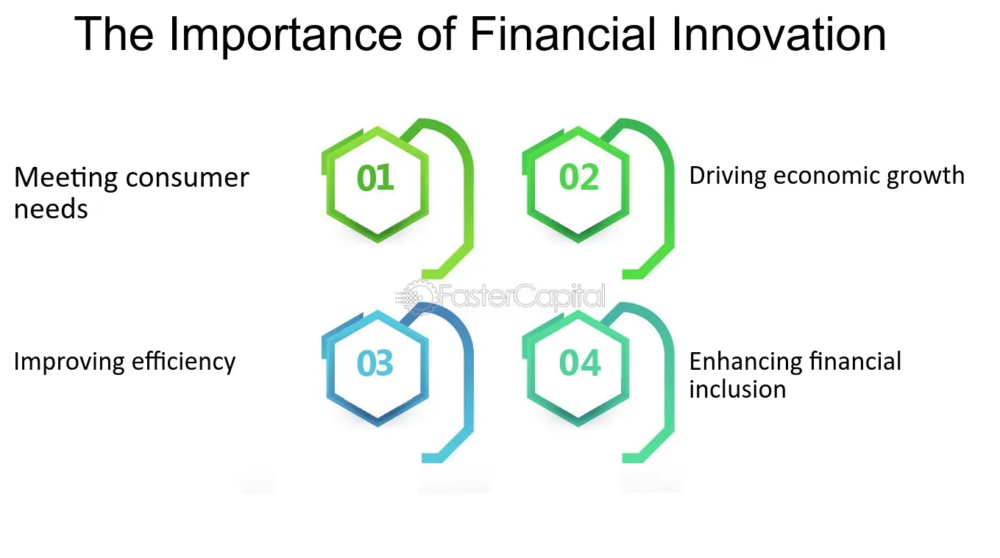

## Table of Contents

## What is financial innovation?

Financial innovation refers to the creation and implementation of new financial products, services, or processes that aim to improve efficiency, meet new needs, or solve existing problems in the financial system. It can involve anything from new types of loans and investment vehicles to advanced technologies like blockchain and artificial intelligence. These innovations often arise in response to changes in the economic environment, regulatory landscape, or technological advancements.

One example of financial innovation is the development of peer-to-peer lending platforms, which allow individuals to lend and borrow money directly from each other without the need for traditional banks. This innovation has made borrowing more accessible and often cheaper for many people. Another example is the use of mobile banking apps, which have revolutionized how people manage their finances by providing easy, instant access to banking services from anywhere. These innovations show how financial creativity can lead to more inclusive and efficient financial systems.

## What are some examples of financial innovations?

One example of financial innovation is the creation of credit cards. Before credit cards, people had to carry cash or write checks to make purchases. Credit cards made it easier for people to buy things without needing to have money right away. They could pay later, which helped businesses sell more and helped people manage their money better.

Another example is the rise of online banking. In the past, people had to go to a bank branch to do their banking. With online banking, people can check their account balances, pay bills, and transfer money from their computers or phones. This makes banking much more convenient and saves time.

A third example is the development of cryptocurrencies like Bitcoin. Cryptocurrencies are digital money that uses technology to keep transactions secure and private. They don't need banks to work, which is a big change from traditional money. This innovation has opened up new ways for people to invest and pay for things online.

## How does financial innovation affect the economy?

Financial innovation can help the economy grow by making it easier for people to borrow money and invest. When new financial products like credit cards or peer-to-peer lending come out, more people can get loans to start businesses or buy homes. This means more money is moving around in the economy, which can create jobs and boost spending. Also, new ways of investing, like cryptocurrencies or stock trading apps, can attract more people to put their money into the market, which can help companies grow and create more wealth.

But financial innovation can also bring risks. Sometimes, new financial products can be hard to understand and might lead people to take on too much debt. If a lot of people can't pay back their loans, it can cause problems for banks and even lead to a financial crisis, like what happened in 2008 with risky mortgage loans. Also, if financial innovations make the market more complicated, it can be harder for regulators to keep things safe and fair. So while financial innovation can help the economy, it's important to be careful and make sure it's used in a way that doesn't cause more harm than good.

## What are the benefits of financial innovation for consumers?

Financial innovation can make life easier for consumers in many ways. For example, new inventions like credit cards let people buy things without needing cash right away. This means they can spread out their payments over time, which can help them manage their money better. Also, things like online banking and mobile apps let people do their banking from home or on their phones. This saves time and makes it easier to keep track of money without having to go to a bank.

Another big benefit is that financial innovations can give consumers more choices. For example, peer-to-peer lending platforms let people borrow money directly from other people, which can sometimes be cheaper and easier than going to a bank. And with things like cryptocurrencies, people can invest in new ways and maybe even make more money. These new options can help people find the best deals and services that fit their needs better.

But it's not all good. Sometimes, new financial products can be hard to understand and might lead people to take on too much debt. If people can't pay back their loans, it can cause big problems. So while financial innovation can offer many benefits, it's important for consumers to be careful and understand what they're getting into.

## What risks are associated with financial innovation?

Financial innovation can bring risks because new financial products can be hard to understand. Sometimes, people might take on too much debt because they don't fully understand the new products. If many people can't pay back their loans, it can cause big problems for banks and even lead to a financial crisis, like what happened in 2008 with risky mortgage loans. This shows how new financial tools can sometimes make things worse if they're not used carefully.

Another risk is that financial innovations can make the market more complicated. When things get too complex, it can be hard for regulators to keep everything safe and fair. This can lead to fraud or other bad practices that hurt consumers and the economy. So while financial innovation can help people in many ways, it's important to have good rules in place to manage the risks and protect everyone involved.

## How has financial innovation evolved over the past decade?

Over the past decade, financial innovation has grown a lot, especially with new technology. One big change is the rise of mobile banking apps. Now, people can do all their banking on their phones, like checking their balance, paying bills, and sending money to friends. This has made banking much easier and faster. Another big change is the growth of cryptocurrencies like Bitcoin. These are digital currencies that don't need banks to work. They've opened up new ways for people to invest and pay for things online, which has changed how we think about money.

Another important development is the rise of peer-to-peer lending platforms. These let people borrow and lend money directly to each other without going through a bank. This has made borrowing easier and often cheaper for many people. Also, new tools like robo-advisors have come out. These use computers to help people invest their money without needing a human advisor. All these changes show how financial innovation keeps finding new ways to help people manage their money better, but it's also important to be careful because new things can sometimes bring new risks.

## What role does technology play in financial innovation?

Technology plays a big role in financial innovation. It has made it easier for people to do their banking and manage their money. For example, with mobile banking apps, people can check their account balance, pay bills, and send money to friends right from their phones. This is much easier than having to go to a bank in person. Also, technology has led to new things like cryptocurrencies, which are digital money that don't need banks. People can use them to buy things online or invest in new ways.

Another way technology helps is by making financial services more accessible. Peer-to-peer lending platforms let people borrow and lend money directly to each other without going through a bank. This can make borrowing cheaper and easier for many people. Also, robo-advisors use computers to help people invest their money without needing a human advisor. These new tools show how technology is changing the way we handle our finances, making things more convenient and opening up new opportunities. But it's important to be careful because new technology can also bring new risks.

## How do regulatory frameworks adapt to financial innovations?

Regulatory frameworks have to change as financial innovations come out. When new financial products or services appear, like cryptocurrencies or peer-to-peer lending, regulators need to make new rules to keep things safe and fair. They have to figure out how to protect consumers from risks that come with these new things. This can be hard because financial innovations can be complicated and change quickly. Regulators have to keep up with these changes to make sure the rules work well and don't stop new ideas from growing.

Sometimes, regulators work with the people who make the new financial products to understand them better. They might set up special groups or sandboxes where new ideas can be tested safely. This helps them learn about the new products and figure out the best way to regulate them. It's a balance between letting innovation happen and making sure it doesn't cause problems for consumers or the economy. As financial innovations keep coming, regulators will need to keep adapting to make sure everyone stays safe and the financial system works well.

## What is the impact of financial innovation on financial inclusion?

Financial innovation has helped more people get access to financial services, which is called financial inclusion. For example, mobile banking apps and online banking let people do their banking from anywhere, even if they don't live near a bank. This is really helpful for people in rural areas or those who can't easily get to a bank branch. Also, peer-to-peer lending platforms let people borrow money directly from others, which can be easier and cheaper than going to a bank. These innovations have made it possible for more people to save, borrow, and invest money, helping them improve their lives.

But financial innovation can also make things harder for some people. New financial products can be complicated and hard to understand. If people don't fully understand these products, they might make bad decisions and end up with too much debt. This can hurt them instead of helping them. So while financial innovation can make financial services more available, it's important to have good rules in place to protect people and make sure the new products are safe and fair for everyone.

## How can financial innovation contribute to sustainable development?

Financial innovation can help with sustainable development by making it easier for people and businesses to invest in green projects. For example, new financial products like green bonds let people invest in things like renewable energy or clean water projects. This helps the environment and can create jobs in these new industries. Also, technology like mobile banking apps can help people in poor areas save money and get loans more easily. This can help them start businesses or improve their lives, which is part of sustainable development.

But financial innovation can also bring risks. Sometimes, new financial products can be hard to understand and might lead people to take on too much debt. If many people can't pay back their loans, it can cause big problems for banks and the economy. So while financial innovation can help with sustainable development, it's important to have good rules in place to manage the risks and protect everyone involved.

## What are the challenges faced by financial institutions in adopting new financial innovations?

Financial institutions face many challenges when they try to adopt new financial innovations. One big challenge is the cost. Creating new products or using new technology can be expensive. Banks need to spend a lot of money on things like research, development, and training their staff to use the new tools. This can be hard, especially for smaller banks that might not have as much money to spend.

Another challenge is dealing with regulations. When banks introduce new financial products, they have to follow a lot of rules to make sure they are safe and fair for everyone. These rules can change a lot, and it can be hard for banks to keep up. They might need to spend a lot of time and money to make sure they are following all the new rules. This can slow down the process of bringing new innovations to their customers.

Also, there is the challenge of customer trust. People might be scared to try new financial products because they don't fully understand them. If banks don't explain the new products well, people might not want to use them. This can make it hard for banks to get people to try the new innovations. So, banks need to work hard to build trust and make sure their customers understand and feel good about using the new financial tools.

## What future trends are expected in the field of financial innovation?

In the future, financial innovation is expected to keep growing with new technology. One big trend will be the use of [artificial intelligence](/wiki/ai-artificial-intelligence) (AI) and [machine learning](/wiki/machine-learning). These technologies can help banks understand their customers better and offer them personalized services. For example, AI could help people manage their money by giving them advice on how to save or invest. Another trend will be the use of blockchain technology, which is already used for cryptocurrencies like Bitcoin. Blockchain can make transactions safer and faster, and it could be used for things like keeping track of property ownership or voting in elections.

Another important trend will be the growth of digital currencies and payment systems. More and more people will use digital money to buy things online or even in stores. This could make it easier for people in different countries to send money to each other without needing banks. Also, financial services will become more connected with other parts of our lives, like shopping or healthcare. For example, you might be able to pay for your doctor's visit using a mobile app that also helps you manage your health. These trends show how financial innovation will keep changing to make things easier and more convenient for everyone.

## References & Further Reading

[1]: Bergstra, J., Bardenet, R., Bengio, Y., & Kégl, B. (2011). ["Algorithms for Hyper-Parameter Optimization."](https://dl.acm.org/doi/10.5555/2986459.2986743) Advances in Neural Information Processing Systems 24.

[2]: ["Advances in Financial Machine Learning"](https://www.amazon.com/Advances-Financial-Machine-Learning-Marcos/dp/1119482089) by Marcos Lopez de Prado

[3]: ["Evidence-Based Technical Analysis: Applying the Scientific Method and Statistical Inference to Trading Signals"](https://www.amazon.com/Evidence-Based-Technical-Analysis-Scientific-Statistical/dp/0470008741) by David Aronson

[4]: ["Machine Learning for Algorithmic Trading"](https://github.com/stefan-jansen/machine-learning-for-trading) by Stefan Jansen

[5]: ["Quantitative Trading: How to Build Your Own Algorithmic Trading Business"](https://www.amazon.com/Quantitative-Trading-Build-Algorithmic-Business/dp/1119800064) by Ernest P. Chan