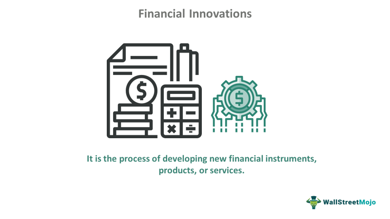

Economic development finance is a critical driver in shaping modern economies, focusing on the mobilization of financial resources to support economic growth, infrastructure enhancements, and job creation. This domain not only nurtures a nation's economic health but also aims to reduce socio-economic disparities by promoting equitable opportunities. Economic development finance encompasses various mechanisms, including government grants, private investments, and public-private partnerships, all geared towards sustainable development.

Financial innovation has further revolutionized the economic landscape by introducing new products, processes, and business models that enhance accessibility, efficiency, and financial inclusion. Recent advancements such as mobile banking, crowdfunding, and blockchain technology have democratized access to financial services, allowing underserved populations to participate in and benefit from economic activities. These innovations are characterized by their ability to lower transaction costs, improve transparency, and facilitate seamless cross-border financial activities.

Algorithmic trading, often referred to as algo trading, is one of the salient examples of technological advancements in the financial sector. Enabled by the progress in artificial intelligence (AI) and machine learning (ML), algo trading utilizes complex algorithms to make trading decisions at speeds and frequencies beyond human capabilities. This form of trading enhances market efficiency and liquidity by enabling rapid execution of transactions. Additionally, algo trading provides precision and data-driven decision-making, which can adapt to changing market conditions, thus reducing human bias and error in trading activities.

Collectively, economic development finance, financial innovation, and algorithmic trading are pivotal in driving transformative changes within the financial landscape. By fostering an environment where financial resources are optimally utilized, these concepts contribute to the creation of robust, resilient, and inclusive economies. As stakeholders continue to embrace these innovations, the potential for significant economic growth and development is immense, reinforcing their importance in the progressive evolution of modern finance.

## Table of Contents

## Understanding Economic Development Finance

Economic development finance refers to the strategic use of financial tools and resources to foster economic growth and improve living standards within a community or region. This form of finance is central to establishing sustainable economic systems by allocating funds towards projects that have long-term benefits, including infrastructure development, investment in human capital, and job creation. 

Key Components:

1. **Investment**: Investment is a cornerstone of economic development finance, aimed at injecting capital into communities to spur growth and innovation. This can include funding for businesses, technology start-ups, or renewable energy projects. These investments are often facilitated through loans, grants, or public-private partnerships.

2. **Infrastructure Development**: Infrastructure projects are critical as they lay the foundation for economic activity. This includes the development of transportation networks, utilities such as water and energy systems, and digital infrastructure like broadband Internet. Infrastructure development not only improves efficiency and productivity but also attracts additional investment by providing essential services and facilities.

3. **Job Creation**: The ultimate goal of economic development finance is to create jobs and reduce unemployment. By doing so, it helps in alleviating poverty and income inequality. This can be achieved through direct funding of projects that require human labor or indirectly through supporting sectors like education and training, which equip individuals with the skills needed in the economy.

Role in Sustainable Economic Growth:

Economic development finance plays a pivotal role in promoting sustainable economic growth by addressing both the supply and demand sides of the economy. By funding infrastructure development, it ensures that supply can meet the increasing demands of a growing population. Moreover, through targeted investments, resources are allocated efficiently to areas that promise the highest returns, thereby optimizing economic outcomes. Additionally, these financial mechanisms work towards reducing inequalities by focusing on underdeveloped or marginalized regions, ensuring that economic benefits are broadly shared.

Examples of Successful Initiatives Globally:

1. **The European Union Cohesion Policy**: This initiative aims to reduce disparities between various regions within the EU by investing in infrastructure, SMEs, and technology development. It has successfully modernized transport and energy networks across Europe, significantly contributing to regional development.

2. **The World Bank's Development Projects**: The World Bank finances numerous projects globally that focus on infrastructure, education, and health, fundamentally transforming communities in developing countries.

3. **China's Belt and Road Initiative (BRI)**: This is one of the largest infrastructure and investment projects in history, covering over 70 countries. It aims to enhance regional connectivity and embrace a brighter economic future through building roads, railways, ports, and other critical infrastructure.

Through these initiatives and strategic use of financial tools, economic development finance continues to be a transformative force in achieving sustainable economic growth and reducing inequalities globally.

## Exploring Financial Innovation

Financial innovation refers to the creation and popularization of new financial instruments, technologies, institutions, markets, and business models that develop, join or divide the participants in financial markets. This encompasses a wide range of advancements, each having unique implications for the financial sector. The definition encapsulates the development of new products, such as derivatives and securities, processes including [algorithmic trading](/wiki/algorithmic-trading) and high-frequency trading, and business models like peer-to-peer lending platforms and digital-only banks. 

Recent innovations have dramatically reshaped both localized and global financial landscapes. Mobile banking is an exemplary innovation that enables users to conduct financial transactions remotely using mobile devices, thus enhancing accessibility to banking services across diverse demographics. Crowdfunding platforms represent another significant innovation, allowing startups and small businesses to raise funds by reaching potential investors directly online, thereby broadening their access to capital. Blockchain technology, underpinning cryptocurrencies like Bitcoin, offers a decentralized ledger system that increases transparency and security in financial transactions by enabling peer-to-peer transfers without intermediaries.

These innovations play a critical role in improving both accessibility and efficiency within the financial system. Mobile banking, for instance, reduces costs and barriers to bank account access for populations in remote or underserved areas, simultaneously increasing financial inclusion and operational efficiency. Crowdfunding democratizes capital formation by directly connecting entrepreneurs with potential investors, proving to be more inclusive and efficient than traditional funding avenues. Similarly, blockchain technology streamlines operations by reducing transaction times and costs while enhancing the security of financial data.

However, financial innovation is not without challenges. Regulatory hurdles constitute a significant barrier, as innovations often outpace existing legal frameworks. For instance, the rapid rise of initial coin offerings (ICOs) and other blockchain-based financings have presented new regulatory challenges related to investor protection and market stability. Cybersecurity concerns also present substantial risks, notably with mobile banking and blockchain technologies, as they handle sensitive financial data and transactions. Ensuring robust security mechanisms is essential to mitigate these risks and maintain consumer trust.

Additionally, striking a balance between innovation and regulation is crucial. Over-regulation can stifle innovation, whereas under-regulation can lead to market instability and consumer harm. Ensuring a robust yet flexible regulatory framework is essential for the healthy development of financial innovation, allowing for the protection of all stakeholders without hindering progress. As financial systems continue to evolve, addressing these challenges will be pivotal in leveraging financial innovation's full potential to foster inclusive and sustainable economic growth.

## Algorithmic Trading: The Use of AI and ML

Algorithmic trading, often referred to as algo trading, leverages cutting-edge technologies such as [artificial intelligence](/wiki/ai-artificial-intelligence) (AI) and [machine learning](/wiki/machine-learning) (ML) to streamline and enhance financial trading processes. This form of trading involves utilising computer algorithms to execute a large number of trades within milliseconds. The integration of AI and ML in algorithmic trading allows for the processing and analysis of vast datasets, facilitating more informed and effective trading decisions.

The benefits of algorithmic trading are numerous, with speed, precision, and data-driven decision-making standing out as key advantages. Speed is crucial in financial markets where milliseconds can determine the difference between profit and loss. Algorithms can execute trades far faster than human traders, scanning multiple markets and securities simultaneously to identify optimal trading opportunities. This rapid execution is not only advantageous for capturing fleeting market opportunities but also for reducing trading costs and slippage.

Precision is another significant advantage of algorithmic trading. By removing human emotions and biases from the trading process, algorithms ensure a high level of consistency and accuracy in trade execution. This precision is particularly vital in high-frequency trading ([HFT](/wiki/high-frequency-trading-strategies)), where minor pricing differentials are exploited over a short duration for profit.

Data-driven decision-making is perhaps the most transformative aspect of algorithmic trading. AI and ML enable the analysis of complex datasets that include historical pricing data, real-time market information, and even [alternative data](/wiki/best-alternative-data) sources such as news feeds and social media sentiment. Machine learning models, in particular, excel in identifying patterns and trends within these datasets, allowing algorithms to adapt and refine their trading strategies based on evolving market conditions.

Incorporating machine learning into trading strategies involves using techniques such as supervised learning, unsupervised learning, and [reinforcement learning](/wiki/reinforcement-learning). Supervised learning models can predict asset prices by training on historical data, while unsupervised learning algorithms uncover hidden patterns and relationships in market data. Reinforcement learning, on the other hand, allows algorithms to learn through trial and error, effectively improving their performance over time by interacting with the market environment.

When comparing traditional trading methods with AI-driven approaches, the differences are stark. Traditional trading relies heavily on human intuition and experience, which can be limited by cognitive biases and emotional influences. Human traders may also struggle to process the sheer [volume](/wiki/volume-trading-strategy) of data available in today's digital markets. In contrast, AI-driven trading systems can manage and interpret vast amounts of information quickly and objectively, leading to more strategic and timely trading decisions.

In sum, algorithmic trading represents a significant advancement in financial markets, driven by the integration of AI and machine learning technologies. The use of these technologies not only enhances the speed and precision of trading but also empowers traders with data-driven insights and adaptive strategies that traditional methods cannot match. As technology continues to evolve, the potential for AI and ML to reshape trading strategies and outcomes will likely expand, offering new opportunities for innovation in the financial sector.

## Real-World Applications and Implications

Algorithmic trading, often classified into high-frequency trading (HFT) and [quantitative trading](/wiki/quantitative-trading), plays a critical role in modern financial markets. These strategies leverage advanced algorithms, primarily driven by artificial intelligence (AI) and machine learning (ML), to execute orders with precision and speed, thereby influencing market dynamics and retail trading.

### High-Frequency Trading (HFT) and Quantitative Trading

High-frequency trading (HFT) represents a subset of algorithmic trading where traders execute large numbers of orders at extremely high speeds. HFT firms utilize complex algorithms that scan multiple markets and execute orders based on predefined criteria. This method aims to exploit minute price discrepancies that exist only for a few milliseconds. Quantitative trading, while encompassing HFT, typically uses mathematical models to identify trading opportunities by analyzing patterns and trends over a more extended period.

#### Impact on Market Dynamics

- **Liquidity**: Algorithmic trading, particularly HFT, contributes significantly to market liquidity. By facilitating rapid transactions, these algorithms ensure that buy and sell orders are matched more efficiently, reducing the bid-ask spread. This increased liquidity allows for more accessible capital flow and potentially less volatile markets. However, there are arguments that HFT may create a liquidity mirage—where liquidity is available in good market conditions but disappears during times of stress.

- **Volatility**: The presence of algorithmic trading can both dampen and amplify market volatility. While the enhanced liquidity can stabilize prices, sudden shifts in algorithms based on similar signals can lead to abrupt price movements. During events like the Flash Crash of 2010, algorithmic trading exacerbated volatility when automated systems reacted to a rapidly declining market.

### Role in Retail Trading

Algorithmic trading has increasingly penetrated the retail sector through AI-powered Expert Advisors (EAs) on trading platforms. These EAs are pre-programmed tools that help retail traders in decision-making by analyzing market data and executing trades automatically. They lower the entry barrier for individual traders by providing access to complex strategies usually reserved for institutional traders.

- **Accessibility**: These tools provide retail investors with the capacity to engage in sophisticated trading strategies without the need for a deep understanding of the underlying algorithms. 

- **Customization**: AI-powered advisors can be customized to suit individual risk preferences and investment goals, making personalized trading more feasible.

### Case Studies

Several successful implementations of algorithmic trading highlight its potential benefits and outcomes:

1. **Renaissance Technologies**: This firm employs quantitative trading strategies and has achieved average annual returns of over 66% since its inception, highlighting the efficacy of algorithm-driven investment.

2. **Two Sigma Investments**: Known for its focus on data science and technology, Two Sigma uses machine learning to uncover patterns in vast datasets, enabling it to outpace the market regularly.

3. **Retail Algorithmic Trading Platforms**: Platforms like MetaTrader provide tools like Expert Advisors, enabling retail investors to execute algorithm-driven trades, emulating strategies that were once exclusive to professional hedge funds. Users have reported increased engagement and profitability from these platforms, as they democratize access to complex trading mechanisms.

In summary, algorithmic trading, through HFT and quantitative approaches, significantly affects [liquidity](/wiki/liquidity-risk-premium), potentially amplifies [volatility](/wiki/volatility-trading-strategies), and empowers retail traders with AI-enabled tools. While offering many advantages, these methods also necessitate robust regulatory oversight to mitigate associated risks.

## Challenges and Ethical Considerations

The integration of advanced technologies in finance brings forward several challenges and ethical considerations that need to be addressed for responsible adoption. A significant barrier is data security and trust issues. With the increasing sophistication of cyber threats, financial institutions face heightened risks in safeguarding sensitive data. The reliance on algorithms necessitates stringent data protection measures to prevent breaches that could undermine trust in these technologies. According to a 2023 report by McKinsey & Company, the financial sector experiences a higher cyberattack cost compared to other industries, emphasizing the need for robust cybersecurity strategies.

Ethical considerations in algorithmic trading primarily involve concerns such as market manipulation and bias in AI algorithms. Algorithmic trading, particularly high-frequency trading, can potentially manipulate market prices by exploiting speed advantages over traditional methods. This raises questions about fairness and market integrity, as evidenced by incidents like the 2010 Flash Crash. Moreover, AI algorithms may inadvertently perpetuate or exacerbate biases, arising from skewed datasets or biased programming, leading to unequal treatment of market participants. Addressing these issues requires comprehensive bias detection and mitigation strategies.

The role of regulatory frameworks and compliance in mitigating these challenges is indispensable. Regulatory bodies worldwide, including the Securities and Exchange Commission (SEC) in the United States and the European Securities and Markets Authority (ESMA), are tasked with ensuring that algorithmic trading practices align with fair market conduct. These organizations focus on maintaining transparency, enhancing market stability, and protecting investors from the adverse impacts of algorithmic operations. Effective regulation must evolve alongside technological advancements to address emerging risks.

Looking ahead, the future of ethical algorithmic trading involves exploring new methodologies for enhancing algorithm transparency and accountability. Research into explainable AI (XAI) is crucial, as it provides insights into the decision-making processes of complex algorithms, fostering greater trust and understanding. Furthermore, collaborative initiatives between industry stakeholders and regulatory bodies can facilitate the development of global standards for ethical algorithm design and deployment.

In summary, challenges related to data security, trust, and ethical use of technology in finance require vigilant attention. Through robust regulatory measures and continuous innovation, the financial industry can foster an environment that balances technological advancement with ethical responsibility and market integrity.

## The Future of Finance: Integrating Innovations

The landscape of finance is poised for transformative growth as technologies like quantum computing and alternative data sources begin to play significant roles. Predicted advancements in economic development finance and financial innovation are expected to bring about increased efficiency, enhanced decision-making capabilities, and more personalized financial solutions.

Quantum computing, with its unparalleled processing power, promises to revolutionize complex financial computations, such as risk analysis and portfolio optimization. By processing vast datasets at speeds unattainable by classical computers, quantum computing can offer solutions to optimization problems common in finance, thus enhancing predictive modeling and risk management. Major firms are investing in research to harness quantum computing's capabilities for real-time pricing of complex financial instruments and efficient resource allocation.

Simultaneously, the integration of alternative data sources—ranging from social media sentiment to satellite imagery—offers unique insights that enhance traditional financial metrics. These data sources expand the scope of available information, allowing for the generation of more accurate market predictions and better-informed investment strategies. The challenge lies in effectively analyzing unstructured data, a task increasingly being addressed by machine learning algorithms.

As artificial intelligence (AI) and machine learning mature, they enable increasingly personalized finance solutions. These technologies process user data to tailor financial advice, investment strategies, and lending decisions to individual needs. Algorithms can analyze vast troves of data—transaction history, investment preferences, risk tolerance—to offer customized financial products and advice. This personalization enhances customer experiences and promotes financial inclusion by providing underserved populations with accessible financial services.

The vision for a sustainable and inclusive financial ecosystem is one where technology serves as a catalyst for equitable growth. Innovations must prioritize transparency, fairness, and accessibility. Initiatives such as decentralized finance (DeFi) platforms aim to democratize access to financial services, reducing dependency on traditional banking systems and lowering barriers to entry.

A future-focused financial ecosystem also addresses environmental sustainability by integrating [ESG](/wiki/esg-investing) (Environmental, Social, and Governance) considerations into investment decisions. Leveraging AI, firms can evaluate the ESG performance of investments by analyzing relevant data and ensuring alignment with sustainable development goals.

In summary, the future of finance is intricately tied to technological innovation. As quantum computing, AI, and alternative data sources reshape economic development finance, stakeholders must navigate ethical considerations and regulatory challenges to foster a financial landscape that is both advanced and inclusive.

## Conclusion

The transformative power of technology in economic development finance is undeniable. By leveraging technological innovations, economies worldwide can achieve unprecedented growth and efficiency. The integration of financial innovation, such as algorithmic trading, mobile banking, and blockchain, is reshaping the financial landscape, enhancing accessibility, and driving economic progress. These technologies facilitate more efficient capital allocation, foster transparency, and ultimately contribute to reducing economic inequalities.

Stakeholders, including governments, financial institutions, and businesses, must seize the opportunities presented by technological advancements and embrace innovation responsibly. This involves not only investing in new technologies but also ensuring a robust regulatory framework that addresses ethical concerns, such as algorithmic bias and market manipulation. By fostering an environment of trust and security, stakeholders can maximize the benefits of financial technology while mitigating potential risks.

Looking to the future, financial innovation and algorithmic trading hold immense potential to drive further economic growth. The utilization of advanced technologies, such as artificial intelligence and machine learning, enables more personalized and efficient financial solutions. As these tools continue to evolve, they will likely catalyze a shift towards a more sustainable and inclusive financial ecosystem. Embracing these changes thoughtfully and proactively will ensure that both the economy and society will thrive, paving the way for a brighter financial future.

## References & Further Reading

[1]: Bergstra, J., Bardenet, R., Bengio, Y., & Kégl, B. (2011). ["Algorithms for Hyper-Parameter Optimization."](https://dl.acm.org/doi/10.5555/2986459.2986743) Advances in Neural Information Processing Systems 24.

[2]: ["Advances in Financial Machine Learning"](https://www.amazon.com/Advances-Financial-Machine-Learning-Marcos/dp/1119482089) by Marcos Lopez de Prado

[3]: ["Evidence-Based Technical Analysis: Applying the Scientific Method and Statistical Inference to Trading Signals"](https://www.amazon.com/Evidence-Based-Technical-Analysis-Scientific-Statistical/dp/0470008741) by David Aronson

[4]: ["Machine Learning for Algorithmic Trading"](https://github.com/stefan-jansen/machine-learning-for-trading) by Stefan Jansen

[5]: ["Quantitative Trading: How to Build Your Own Algorithmic Trading Business"](https://www.amazon.com/Quantitative-Trading-Build-Algorithmic-Business/dp/1119800064) by Ernest P. Chan