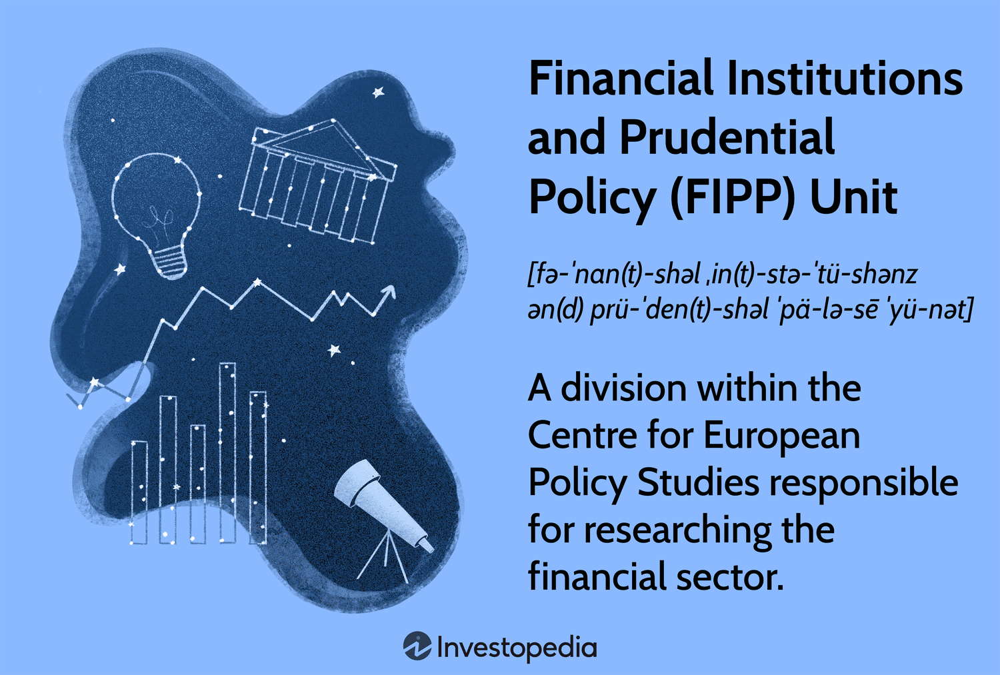

## Table of Contents

## What is a financial institution?

A financial institution is a company that deals with money. They help people and businesses with things like saving money, borrowing money, and moving money around. Some common types of financial institutions are banks, credit unions, and insurance companies.

Banks are a type of financial institution where people can keep their money safe. They can also borrow money from banks to buy things like houses or cars. Credit unions are similar to banks, but they are owned by the people who use them. Insurance companies are another type of financial institution. They help protect people from big costs if something bad happens, like a car accident or a house fire.

## What are the different types of financial institutions?

Financial institutions come in different forms, each with its own way of helping people and businesses with money. Banks are one type. They let people save their money in accounts, and they also lend money to people who need it. Banks can help you pay for big things like a house or a car by giving you a loan. Another type is credit unions. They work a lot like banks, but they are owned by their members, not by shareholders. This means that the people who use the credit union have a say in how it is run.

There are also insurance companies, which are financial institutions that help protect people from big costs if something bad happens. For example, if you have car insurance and you get into an accident, the insurance company helps pay for the damage. Investment firms are another type. They help people grow their money by investing it in things like stocks and bonds. Lastly, there are brokerage firms, which help people buy and sell stocks and other investments. Each of these institutions plays a different role in helping people manage their money.

## What is prudential policy?

Prudential policy is a set of rules and guidelines that financial institutions must follow to make sure they are safe and stable. These rules help prevent banks and other financial companies from taking too many risks that could lead to big problems, like a financial crisis. For example, prudential policies might require banks to keep a certain amount of money in reserve, so they can pay back people who want to take their money out.

These policies are important because they help protect people's money and keep the financial system strong. Governments and special agencies, like central banks, create and enforce these rules. They check on financial institutions regularly to make sure they are following the rules and not doing anything risky. By doing this, prudential policy helps keep the economy stable and makes sure that people can trust banks and other financial institutions with their money.

## Why is prudential policy important for financial institutions?

Prudential policy is important for financial institutions because it helps keep them safe and stable. These rules make sure that banks and other financial companies don't take too many risks that could cause big problems. For example, if a bank is not careful with the money it lends out, it might not have enough money to give back to people who want to take their savings out. Prudential policy helps prevent this by setting rules, like making sure banks keep some money in reserve.

These policies are also important because they help protect people's money and keep the whole financial system strong. When financial institutions follow prudential rules, people can trust that their money is safe. This trust is very important for the economy because it makes people more likely to save and invest their money. Governments and special agencies, like central banks, make these rules and check on financial institutions to make sure they are following them. This helps keep the economy stable and prevents financial crises.

## How does prudential policy help in maintaining financial stability?

Prudential policy helps maintain financial stability by setting rules that keep financial institutions safe and sound. These rules make sure that banks and other financial companies don't take too many risks. For example, they might have to keep a certain amount of money in reserve. This means they always have enough money to give back to people who want to take their savings out. By doing this, prudential policy prevents big problems like bank runs, where everyone wants their money back at the same time and the bank can't pay them.

These rules also help protect people's money and keep the whole financial system strong. When people know that banks and other financial institutions are following these rules, they feel more confident about keeping their money there. This trust is very important because it makes people more likely to save and invest their money, which helps the economy grow. Governments and special agencies, like central banks, make these rules and check on financial institutions to make sure they are following them. This helps keep the economy stable and prevents financial crises from happening.

## What are the key components of prudential regulation?

Prudential regulation includes several important parts that help keep financial institutions safe. One key part is capital requirements. This means banks have to keep a certain amount of money, called capital, to cover any losses they might have. This helps make sure they can still pay back people who want their money, even if some loans don't get paid back. Another part is [liquidity](/wiki/liquidity-risk-premium) requirements. This means banks need to have enough cash or easy-to-sell assets so they can give money back to people who want it right away. This stops banks from running out of money if lots of people want to take their savings out at the same time.

Another important part of prudential regulation is risk management. Banks have to have good ways to check and control the risks they take, like making sure they don't lend too much money to one person or company. They also need to have plans for what to do if something goes wrong. Supervision and enforcement are also key. This means that special agencies watch over banks to make sure they are following the rules. If a bank isn't following the rules, these agencies can make them fix it or even punish them. All these parts work together to keep banks safe and make sure people's money is protected.

## How do financial institutions comply with prudential standards?

Financial institutions follow prudential standards by making sure they have enough money saved up, called capital, to cover any losses. This means they can still pay back people who want their money, even if some loans don't get paid back. They also keep enough cash or easy-to-sell things, called liquidity, so they can give money back to people who want it right away. This stops banks from running out of money if lots of people want their savings at the same time. Banks also have to be careful about the risks they take. They need to check and control these risks, like not lending too much money to one person or company, and have plans for what to do if something goes wrong.

To make sure they are following the rules, financial institutions are watched by special agencies. These agencies check to see if banks are doing what they are supposed to do. If a bank isn't following the rules, the agencies can make them fix it or even punish them. By doing all these things, financial institutions make sure they are safe and that people's money is protected. This helps keep the whole financial system strong and stable.

## What are the consequences of non-compliance with prudential regulations?

If a financial institution does not follow prudential regulations, it can face serious problems. The special agencies that watch over banks might make the bank fix the problem right away. If the bank doesn't fix it, it could get fined, which means they have to pay money as a punishment. In very bad cases, the bank might even have to close down. This can make people lose trust in the bank and take their money out, which can lead to even bigger problems.

Not following these rules can also hurt the whole financial system. If one bank gets into trouble, it can make other banks and companies worried. This can cause a chain reaction where everyone starts to pull their money out of banks, which can lead to a financial crisis. That's why it's so important for financial institutions to follow prudential regulations. It helps keep everyone's money safe and the economy stable.

## How have prudential policies evolved in response to financial crises?

Prudential policies have changed a lot because of financial crises. After big problems like the 2008 financial crisis, people realized that the old rules weren't strong enough. So, governments and special agencies made the rules stricter. They started requiring banks to keep more money saved up, called capital, to be ready for big losses. They also made banks have more cash or easy-to-sell things, called liquidity, so they could give money back to people who wanted it quickly. These changes were meant to make banks safer and stop another big financial crisis from happening.

Another big change was in how banks manage risk. After the crises, banks had to be more careful about the risks they took. They had to have better plans for checking and controlling these risks, like making sure they didn't lend too much money to one person or company. Special agencies also started watching banks more closely to make sure they were following the new rules. All these changes helped make the financial system stronger and more stable, so people could feel safer about keeping their money in banks.

## What role do international standards play in shaping prudential policy?

International standards are very important for shaping prudential policy because they help make rules that are the same all around the world. Groups like the Basel Committee on Banking Supervision make these standards. They create rules that countries can use to make sure their banks are safe and stable. By following these international standards, countries can make sure their banks are not taking too many risks and that they have enough money saved up to cover any losses. This helps keep the whole world's financial system strong and stops problems in one country from causing trouble in others.

These international standards also help countries work together to keep their financial systems safe. When countries use the same rules, it's easier for them to check on each other's banks and make sure they are following the rules. This teamwork is important because money moves around the world a lot, and problems in one place can quickly spread to others. By using international standards, countries can make sure their banks are ready for any big problems and that people's money is safe no matter where they are.

## How do technological advancements impact prudential policy and financial institutions?

Technological advancements have changed how banks and other financial institutions work, which means prudential policies have to change too. Now, banks use computers and the internet to do things like checking accounts and moving money. This makes things faster and easier for people, but it also brings new risks. For example, hackers might try to steal money or information. So, prudential policies now include rules about keeping computer systems safe. Banks have to make sure their technology is strong and can protect people's money and information.

Because of technology, banks can also use new tools to check and control risks better. They can use special computer programs to look at lots of information quickly and see if there are any big problems coming. This helps them follow prudential policies better. But technology can also make things more complicated. Sometimes, it's hard for the people who watch over banks to understand all the new technology. So, they have to keep learning and updating the rules to make sure banks are still safe and following the rules, even as technology keeps changing.

## What are the future challenges and trends in prudential policy for financial institutions?

In the future, prudential policy will face new challenges because of technology and changes in the world. One big challenge is keeping up with new ways that people use money, like cryptocurrencies and online banking. These new ways can be risky, so prudential policies will need to include rules to make sure they are safe. Another challenge is dealing with problems that can happen all around the world at the same time, like a big economic crisis. Banks will need to be ready for these problems, so prudential policies will need to help them plan and stay strong.

There are also trends that will shape prudential policy. One trend is using more data and computer programs to check on banks. This can help find problems faster and make sure banks are following the rules. Another trend is working together more with other countries. Because money moves around the world so easily, countries will need to share information and work together to keep the whole financial system safe. These trends and challenges mean that prudential policy will keep changing to make sure banks stay safe and people's money is protected.

## References & Further Reading

[1]: Basle Committee on Banking Supervision. (2011). ["Basel III: A global regulatory framework for more resilient banks and banking systems."](https://www.bis.org/publ/bcbs189.htm) Bank for International Settlements.

[2]: MacKenzie, D. (2018). ["Material Signals: A Historical Sociology of High-Frequency Trading."](https://www.sps.ed.ac.uk/sites/default/files/assets/pdf/material-signals.pdf) American Journal of Sociology, 124(6), 1654-1690.

[3]: Cartea, Á., Jaimungal, S., & Penalva, J. (2015). ["Algorithmic and High-Frequency Trading."](https://assets.cambridge.org/97811070/91146/frontmatter/9781107091146_frontmatter.pdf) Cambridge University Press.

[4]: Financial Stability Board. (2015). ["Regulatory Framework for Haircuts on Non-Centrally Cleared Securities Financing Transactions."](https://www.fsb.org/uploads/r_141013a.pdf)

[5]: U.S. Securities and Exchange Commission. (2010). ["Concept Release on Equity Market Structure."](https://www.sec.gov/rules-regulations/2010/01/concept-release-equity-market-structure)