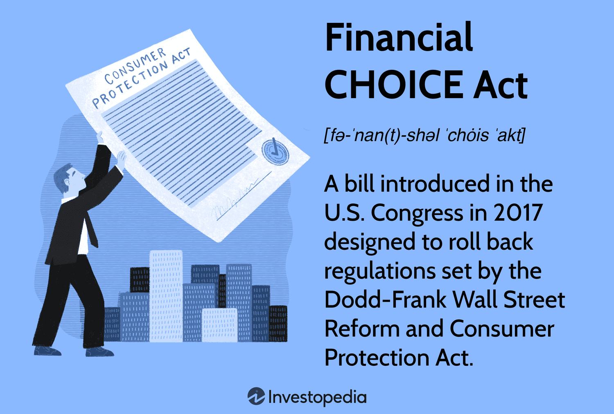

The world of finance has experienced a profound transformation with the integration of technology into its operations. A notable aspect of this transformation is algorithmic trading, a method that automates the trading process via sophisticated computer algorithms. Algorithmic trading is increasingly redefining how trades are executed by minimizing human intervention, enhancing speed, and increasing efficiency in financial markets.

This article investigates the intricacies of financial regulation, focusing particularly on the Financial Institutions Regulatory Act (FIRA), and its implications on both banking law and algorithmic trading. FIRA, as a significant legislative measure, was designed to oversee the functioning of financial institutions, ensuring their stability and protecting consumers. Its introduction brought notable regulatory standards, addressing various requirements for depository institutions and aiming to reinforce the integrity and effectiveness of financial activities.



A core objective of FIRA is to regulate financial institutions in such a way that maintains systemic integrity while facilitating innovation. Algorithmic trading, as a component of modern finance, plays a crucial role by allowing rapid data analysis and execution of trades. However, this intersection of technology and finance brings about new challenges, particularly in ensuring that these trading activities do not amplify risks such as market volatility and manipulation.

The article further addresses the crucial legal and regulatory frameworks that emerge due to algorithmic trading. As trading becomes more automated and complex, these frameworks are imperative to curb potential risks such as algorithm failures or market disruptions. Regulatory measures aim to manage these risks, balancing the need to foster technological innovation with the necessity to protect financial markets.

Lastly, we explore how FIRA, banking law, and algorithmic trading collectively contribute to shaping today's financial landscape. Understanding their interaction provides insights into how regulation can evolve in tandem with ongoing advancements in technology, thereby maintaining market stability and fostering responsible growth in the financial sector.

## Table of Contents

## Understanding the Financial Institutions Regulatory Act (FIRA)

The Financial Institutions Regulatory and Interest Rate Control Act (FIRA), enacted in 1978, is a significant U.S. federal law aimed at the regulation of depository financial institutions. This legislation brought forth substantial changes, marking a pivotal shift in the approach to financial regulation in the United States.

A core feature introduced by FIRA was the establishment of the Central Liquidity Facility, which was designed to enhance the [liquidity](/wiki/liquidity-risk-premium) positions of credit unions. The creation of the Federal Financial Institutions Examination Council (FFIEC) under FIRA was another fundamental change. The FFIEC standardized the examination processes of financial institutions across the federal regulatory agencies, thereby promoting consistency and fairness in regulatory oversight.

FIRA granted federal oversight over electronic funds transfers, which became increasingly vital with the digitalization of financial services. It also amended the lending terms for directors and officers of banks to prevent conflicts of interest and potential abuse of power. Furthermore, the act introduced cease and desist orders as a mechanism to address and rectify misconduct within financial institutions promptly.

The importance of FIRA lies in its role in constructing a foundation for modern financial regulations. These regulations foster institutional stability and enhance consumer protection by providing a robust legal framework that adapts to the dynamic financial environment. FIRA’s continuous evolution is a testament to the enduring necessity of evolving regulatory frameworks that can keep pace with ongoing financial innovations and challenges. This adaptability ensures that financial systems remain stable and secure in the face of emerging risks and technological advancements.

## The Rise of Algorithmic Trading

Algorithmic trading, commonly referred to as ALGO trading, automates trading strategies through sophisticated computer algorithms, significantly reducing the necessity for human intervention. This technology-driven approach to trading has seen monumental growth since the early 2000s, now constituting a substantial share of the overall trading [volume](/wiki/volume-trading-strategy) across global markets.

This exponential rise can be traced to several technological advancements and the integration of [artificial intelligence](/wiki/ai-artificial-intelligence) into trading systems. Enhanced computing power allows for rapid data analysis and decision-making capabilities, which are crucial for executing high-frequency trades. These trades often take advantage of minute price differentials in markets, known as [arbitrage](/wiki/arbitrage) opportunities, which require swift execution beyond the capacity of human traders.

Algorithmic trading systems are designed to process vast datasets at high speeds. Python, among other languages, is frequently used in developing these systems due to its robust libraries such as NumPy and pandas, which facilitate data manipulation and analysis. For instance, a simple algorithm to identify arbitrage opportunities might look like this:

```python
import numpy as np

# Hypothetical price data for a stock on two different exchanges
exchange_A_prices = np.array([100.5, 101.0, 100.8, 101.2])
exchange_B_prices = np.array([100.3, 100.9, 100.7, 101.1])

# Identifying arbitrage opportunities
arbitrage_opportunities = exchange_A_prices - exchange_B_prices
print("Arbitrage Opportunities:", arbitrage_opportunities)
```

While [algorithmic trading](/wiki/algorithmic-trading) offers increased efficiency and precision, it introduces potential risks such as algorithm failures and system errors. These issues can lead to unintended market impacts, including flash crashes, which can destabilize financial markets. Therefore, it is critical for traders and financial institutions to implement rigorous testing and validation procedures for their algorithms to minimize these risks. Additionally, effective risk management strategies and robust fail-safes are essential to mitigate potential disruptions caused by algorithmic malfunction.

Overall, the rise of algorithmic trading underscores a significant shift in financial market operations, combining traditional financial strategies with cutting-edge technology to optimize trading performance. However, the benefits must be carefully balanced with rigorous controls to ensure stability and integrity in financial markets.

## Regulatory Frameworks Governing Algorithmic Trading

Algorithmic trading is intricately governed by an array of regulations aimed at maintaining market integrity and safeguarding investor interests. Regulatory oversight is primarily provided by bodies such as the Securities and Exchange Commission (SEC) and the Financial Industry Regulatory Authority (FINRA), which ensure that algorithmic trading activities comply with existing financial laws and standards.

The SEC, for example, enforces rules under the Securities Exchange Act of 1934 that pertain to the transparency and fairness of securities markets in the United States. FINRA, on the other hand, focuses on the conduct of brokerage firms and their [agents](/wiki/agents), ensuring that their algorithmic trading practices do not jeopardize market stability or investor trust.

In targeting high-frequency trading, a subset of algorithmic trading characterized by extremely high turnover rates and short holding periods, specific regulations mandate rigorous compliance requirements. High-frequency traders are required to register with the relevant authorities, maintain comprehensive records of their trading activities, and publicly disclose information about their trading practices and any significant events that may impact markets.

Globally, the Markets in Financial Instruments Directive (MiFID) and its successor, MiFID II, have set a precedent for regulation in the European Union. These directives impose stringent obligations on firms engaged in algorithmic trading, including the necessity to implement robust governance frameworks and stringent algorithm testing protocols. The intention of these requirements is to mitigate the potential risks associated with algorithmic trading, such as liquidity issues or system failures, by ensuring that traders are equipped to maintain continuity in the face of unforeseen disruptions.

Additionally, regulatory frameworks often necessitate the development and perpetuation of business continuity plans, ensuring that firms can promptly address and recover from any disruptive incidents without adversely affecting market operations. Algorithmic trading firms are also urged to establish effective mechanisms to detect and neutralize any disruptive algorithmic behaviors, thereby preserving the orderly functioning of the financial markets.

These regulations are designed not only to minimize systemic risks but also to promote an environment where innovation in trading practices can proceed within a structured and secure framework. As algorithmic trading technologies evolve rapidly, regulatory bodies must continue to adjust and foresee new regulatory needs to adapt to the changing landscape of financial markets.

## Legal Implications of Algorithmic Trading

Algorithmic trading has become a significant component of modern financial markets. However, its growth has introduced legal challenges primarily associated with compliance with existing regulations and potential market manipulation. 

Algorithmic trading operates within a complex legal landscape designed to safeguard market integrity and protect investors. This trading method, while legal, must adhere strictly to regulations established by financial authorities such as the Securities and Exchange Commission (SEC) and the Financial Industry Regulatory Authority (FINRA) in the United States, as well as analogous bodies in other jurisdictions. These regulations are crucial in preventing fraudulent activities that could arise from the misuse of algorithms.

One of the primary legal concerns with algorithmic trading is the risk of unregulated algorithmic activities leading to severe market disruptions. Noteworthy incidents include cascading sell orders and flash crashes, which have the potential to destabilize financial markets. For instance, the Flash Crash of May 6, 2010, witnessed a sudden and deep plunge in the U.S. stock market, partly attributed to algorithmic trading strategies. Such events underscore the importance of stringent regulatory oversight to mitigate systemic risks.

An emerging approach to addressing legal liabilities in algorithmic trading is the exploration of algorithmic self-compliance models. These models advocate for the development of internal supervisory systems within trading firms that ensure algorithms operate within the legal boundaries autonomously. Implementing such systems could involve real-time monitoring mechanisms and automated compliance checks integrated directly into trading algorithms.

Balancing innovation with regulation is paramount. The rapid technological advancements facilitating algorithmic trading necessitate an adaptable regulatory framework that does not stifle innovation. Regulators need to anticipate potential risks and craft policies that allow for technological growth while ensuring market stability. This balance is crucial to harnessing the full benefits of algorithmic trading, such as increased market efficiency and liquidity, while minimizing associated risks.

The evolving landscape of financial markets demands an ongoing dialogue between regulators and market participants to collaboratively develop effective regulations. As algorithmic trading continues to advance, maintaining this balance will be essential for safeguarding market fairness and integrity.

## Conclusion

Financial regulation, particularly through legislative measures like the Financial Institutions Regulatory Act (FIRA), remains crucial for ensuring stability in the ever-evolving domain of banking and trading. FIRA establishes a structured framework that supports both consumer protection and institutional reliability, which is paramount as the financial environment becomes increasingly complex with technological advancements like algorithmic trading.

The relationship between FIRA, banking law, and algorithmic trading exemplifies the intricate balance between regulatory implementations and technological innovation. While FIRA provides a foundational legal framework, it must continuously adapt to address the sophisticated strategies introduced by algorithmic trading systems. These systems, which automate trading processes through complex algorithms, can introduce significant efficiencies but also present potential risks such as market [volatility](/wiki/volatility-trading-strategies) and systemic disruptions.

Financial institutions must actively engage with existing and emerging regulatory frameworks to harness the advantages of algorithmic trading effectively and responsibly. This involves thorough compliance measures, particularly in monitoring algorithmic activities to prevent any form of market manipulation or instability. The proactive alignment of trading practices with regulatory mandates ensures that institutions can innovate while maintaining trust and transparency within financial markets.

As financial markets continue to evolve under the influence of technological progression, regulatory bodies must maintain vigilance to ensure that legal frameworks adapt to the pace of these advancements. Regulatory adaptation involves not only revising traditional frameworks but also introducing new legal standards that anticipate the challenges and opportunities presented by algorithmic advancements. 

The future of finance promises a deeper integration of advanced algorithms across banking and trading operations. This trajectory demands a robust and adaptable regulatory structure capable of safeguarding market integrity without stifling innovation. Realizing this balance will be key to facilitating sustainable growth in the financial sector, ensuring that it remains both innovative and secure for all stakeholders involved.

## References & Further Reading

[1]: Cleary, D. & Purdy, R. (1979). ["A Summary of the Financial Institutions Regulatory and Interest Rate Control Act of 1978."](https://en.wikipedia.org/wiki/Financial_Institutions_Regulatory_and_Interest_Rate_Control_Act_of_1978) Akron Law Review, 12(3).

[2]: Gomber, P., Arndt, B., Lutat, M., & Uhle, T. (2011). ["High-Frequency Trading."](https://papers.ssrn.com/sol3/papers.cfm?abstract_id=1858626) Bank for International Settlements, Quarterly Review.

[3]: Aldridge, I. (2013). ["High-Frequency Trading: A Practical Guide to Algorithmic Strategies and Trading Systems."](https://onlinelibrary.wiley.com/doi/pdf/10.1002/9781119203803.fmatter) Wiley.

[4]: Securities and Exchange Commission. (2010). ["Concept Release on Equity Market Structure."](https://www.sec.gov/rules-regulations/2010/01/concept-release-equity-market-structure) U.S. Securities and Exchange Commission.

[5]: Siems, T. F. (2011). ["The TARP and its Impact on Bank Safety and Soundness."](https://www.academia.edu/19578310/The_impact_of_TARP_on_bank_efficiency) Economic Letter—Federal Reserve Bank of Dallas.