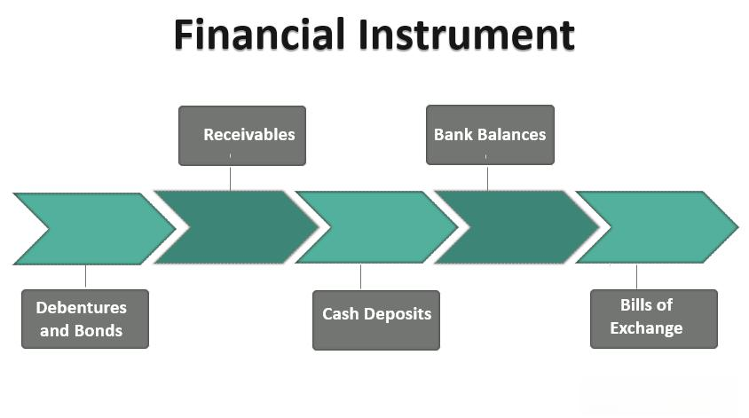

In finance, the mastery of various financial instruments, assets, and investment tools is essential for both novice and seasoned investors. These elements serve as the foundation of financial markets, influencing how trading is conducted and investments are made. This article focuses on algorithmic trading, a sophisticated strategy that operates at the intersection of these vital components of the financial sector.

Algorithmic trading, often referred to as algo trading, represents a significant evolution in the way trading is conducted. It utilizes computer programs and systems to execute trades based on pre-defined criteria, offering speed, precision, and an emotion-free trading experience. By automating the trading process, algo trading has begun to transform the investment landscape, providing opportunities for improved decision-making and enhanced trading strategies.



To fully understand the impact of algorithmic trading, it is important to examine the broader ecosystem of financial trading. This involves exploring the complex network of instruments, assets, and tools that traders use to maximize their returns and manage risks effectively. Each component plays a critical role, contributing to the dynamics of the financial market and shaping the strategies employed by traders and investors.

Our exploration of algorithmic trading will unravel the intricacies of this method and its implications for investors. By the end of this guide, you will have a comprehensive understanding of how various financial concepts are intertwined, enabling you to make informed investment decisions. Through understanding these elements, investors can better anticipate market movements, optimize their trading approaches, and potentially achieve superior financial outcomes.

## Table of Contents

## Understanding Financial Instruments and Assets

Financial instruments are foundational elements within the financial markets, representing contracts that hold monetary value. These instruments encompass a wide array of forms, including bonds, stocks, and derivatives. Each type of financial instrument serves distinct purposes and offers various levels of risk and return potential.

Bonds are fixed-income instruments representing a loan made by an investor to a borrower, usually corporate or governmental. They are considered less risky compared to stocks and offer relatively stable returns. For example, a government bond provides a fixed interest payment over a specific period, culminating in the repayment of the principal amount. The yield on a bond can be calculated using the formula:

$$

\text{Yield} = \frac{\text{Annual Coupon Payment}}{\text{Current Market Price}} 
$$

Stocks represent ownership in a company and provide shareholders with voting rights and potential dividends. Their value fluctuates based on the company's performance and broader market conditions. While capable of high returns, stocks also [carry](/wiki/carry-trading) substantial risk, largely influenced by market [volatility](/wiki/volatility-trading-strategies).

Derivatives are complex instruments derived from the value of underlying assets like stocks, bonds, commodities, or market indexes. Common derivatives include options and futures. These instruments allow investors to hedge against risks or speculate on future price movements. For example, an option grants the holder the right, but not the obligation, to buy or sell an asset at a predetermined price on or before a specific date.

Assets, on the other hand, are classified as either complex or non-complex, influencing their role in trading and investment strategies. Non-complex assets include cash and cash equivalents, which are highly liquid and carry minimal risk. These are suitable for short-term investments and for reducing the overall risk of a portfolio.

Complex assets often encompass mortgage-backed securities (MBS) and collateralized debt obligations (CDOs). These require more sophisticated analysis to assess their value and risk. Investors utilize complex assets to potentially achieve higher returns, albeit with increased risk exposure.

Understanding how these instruments are utilized in trading strategies is essential. Investors use these diverse instruments to construct portfolios that align with their risk tolerance and financial goals. For instance, a balanced investment strategy might combine bonds for stability and stocks for growth, employing derivatives for hedging purposes.

In summary, financial instruments and assets are vital components in structuring effective trading strategies. Recognizing their individual characteristics and roles helps investors navigate the complexities of the financial markets and optimize their investment decisions.

## Investment Tools and Their Impact on Trading

Investment tools play a crucial role in empowering investors to navigate the complexities of financial markets by providing valuable insights into market trends and potential opportunities. These tools encompass a range of functionalities that assist investors in making informed decisions, essentially serving as the backbone of modern trading strategies.

Trading platforms are one of the most fundamental investment tools. These platforms offer the infrastructure necessary for executing trades across various asset classes such as equities, [forex](/wiki/forex-system), and derivatives. Platforms like MetaTrader, eToro, and [Interactive Brokers](/wiki/interactive-brokers-api) provide users with real-time data, charting tools, and the capability to automate trades. The convenience and efficiency of these platforms enable investors to respond swiftly to market changes and optimize their investment decisions.

Analytical software is another crucial category of investment tools that aids in data interpretation and strategy development. Programs like Bloomberg Terminal and Reuters Eikon afford traders access to comprehensive data analytics, which helps in identifying patterns and predicting market movements. These tools often incorporate statistical techniques to analyze historical data and simulate future scenarios, assisting investors in assessing the risk and return profiles of their portfolios.

Educational resources play an integral role in equipping investors with the knowledge necessary to utilize other investment tools effectively. Platforms such as Investopedia and Coursera offer courses and articles that cover a broad spectrum of financial topics, from basic concepts to advanced trading strategies. Education empowers investors with the skills needed to understand market dynamics and leverage technology for better investment decisions.

The selection and utilization of the right combination of investment tools significantly enhance trading strategies and outcomes. For instance, employing a robust trading platform in conjunction with sophisticated analytical tools allows investors to not only execute trades with precision but also analyze market conditions with greater accuracy. This synergy leads to more strategic investment choices, potentially increasing returns and minimizing risks.

In conclusion, investment tools are indispensable in today's financial markets, enabling investors to achieve greater efficiency and profitability. By leveraging trading platforms, analytical software, and educational resources, investors can devise well-informed trading strategies, ensuring they remain competitive in the fast-paced world of finance.

## Algorithmic Trading: An Overview

Algorithmic trading, often referred to as algo-trading, utilizes computer algorithms to systematically execute trading instructions, encompassing timing, price, and quantity. This method leverages advanced mathematical models and data analysis to make trading decisions at speeds and frequencies that far surpass human capabilities. The principal advantage of [algorithmic trading](/wiki/algorithmic-trading) lies in its ability to mitigate the influence of human emotion, providing precision, consistency, and efficiency.

Algorithms in trading are constructed using pre-defined criteria. These rules could pertain to technical analysis, such as moving averages, or statistical methods involving regression analysis. A typical example of a simple algorithm could be a moving average crossover strategy, where an algorithm automatically buys a stock when the short-term moving average crosses above the long-term moving average, and sells when it crosses below.

```python
# Example of a simple moving average crossover strategy using Python

# Assume we have historical stock price data loaded in a Pandas DataFrame
import pandas as pd

# Calculate short-term and long-term moving averages
data['short_mavg'] = data['Close'].rolling(window=40, min_periods=1).mean()
data['long_mavg'] = data['Close'].rolling(window=100, min_periods=1).mean()

# Generate trading signals
data['signal'] = 0
data.loc[data['short_mavg'] > data['long_mavg'], 'signal'] = 1
data.loc[data['short_mavg'] < data['long_mavg'], 'signal'] = -1

# Simulate buy (1) and sell (-1) signals
data['positions'] = data['signal'].diff()
```

**Trend-following and Arbitrage Strategies**

Algorithmic trading can be implemented in various trading strategies. Trend-following strategies rely on the notion that prices are more likely to continue in the same direction as opposed to reversing. Algorithms in this context may follow moving averages, channel breakouts, or related technical indicators.

Arbitrage strategies, on the other hand, exploit the price differentials of the same asset across different markets or financial instruments. These strategies require significant computational power and speed to capture small and fleeting [arbitrage](/wiki/arbitrage) opportunities before they disappear.

**High-Frequency Trading**

High-frequency trading ([HFT](/wiki/high-frequency-trading-strategies)) is a specialized subset of algorithmic trading characterized by extremely high speed and turnover rates. HFT firms capitalize on small price discrepancies, executing orders in milliseconds or even microseconds, often using co-location services to minimize latency. While HFT has contributed to increased market [liquidity](/wiki/liquidity-risk-premium) and narrower spreads, it has also raised concerns due to its potential to cause systemic risk and market volatility.

The proliferation of algorithmic and high-frequency trading has substantially altered market dynamics. The automation and rapid execution associated with algo-trading have transformed the financial landscape, providing both opportunities and challenges for market participants. As technology continues to advance, the role of algorithmic trading is expected to grow, underscoring its significance in contemporary financial markets.

## Benefits and Risks of Algo Trading

Algorithmic trading, often lauded for its efficiency and precision, brings numerous benefits to modern trading practices. One of its primary advantages is the ability to execute trades at optimal prices, reducing slippage and transaction costs. This is primarily because algorithms can process vast amounts of data and place trades in a fraction of a second, which is beyond human capability. By automating trading strategies, the emotional biases typical of human decision-making are removed, potentially leading to more rational and consistent trading outcomes.

However, these benefits come with significant risks. The reliance on technology means that technical failures, such as software bugs or network disruptions, can have severe consequences. For instance, unexpected market behavior or coding errors could lead to unintended trading positions. Furthermore, algorithms can exacerbate market volatility, especially in unstable environments. This was starkly highlighted during the 2010 "Flash Crash," where automated trading systems magnified market moves, causing a brief but dramatic drop in the U.S. stock market.

Market volatility poses another challenge. Rapid price movements can trigger stop-loss mechanisms in algorithms, leading to a cascade of selling that amplifies market disturbances. Such volatility can also lead to 'black swan' events—rare and unpredictable occurrences with severe impacts on the markets. An example of a black swan event is the 2008 financial crisis, which was largely unforeseen yet resulted in substantial market upheaval.

To mitigate these risks, robust risk management techniques are essential. Implementing safeguards such as circuit breakers, which pause trading if an asset's price changes too rapidly, can help stabilize markets during turbulent times. Moreover, regular stress testing of algorithms under various market scenarios can identify potential weaknesses and allow for adjustments before actual deployment.

Continuous monitoring is also crucial. Algorithms should be supervised by experienced traders who can intervene if necessary. Parameters within trading algorithms may need to be adjusted in response to changing market conditions, ensuring that they operate as intended.

In conclusion, while algorithmic trading offers clear advantages in execution efficiency and cost reduction, it is not without its challenges. Understanding the inherent risks and implementing comprehensive risk management strategies is vital for traders looking to harness the potential of automated systems. As technology evolves, staying vigilant and adaptable will be crucial in navigating the complexities of algo trading.

## The Future of Investment Tools and Algo Trading

The financial markets are on the cusp of significant transformation due to technological advancements, particularly in algorithmic trading. One of the most promising trends is the integration of [artificial intelligence](/wiki/ai-artificial-intelligence) (AI) and [machine learning](/wiki/machine-learning) (ML) within trading algorithms. These technologies enable the development of smart algorithms that can analyze vast amounts of data, recognize patterns, and make autonomous trading decisions. AI and ML models can effectively process both structured data, like historical prices, and unstructured data, such as news articles or social media sentiment, to predict market movements more accurately.

Predictive analytics, a branch of ML, is becoming instrumental in enhancing the efficacy of trading strategies. By utilizing historical data and continuous learning models, predictive analytics can forecast asset price movements, providing a competitive edge to traders. The Monte Carlo simulation is a popular example where random sampling is used to understand the impact of risk and uncertainty in prediction and forecasting models.

Moreover, cloud computing is revolutionizing the accessibility and scalability of investment tools. With cloud-based platforms, retail investors now have access to computational power and sophisticated analytic tools that were once reserved for institutional players. This democratization of technology allows a wider audience to implement and benefit from algorithmic trading strategies.

Another exciting development is the fusion of AI technologies with blockchain to facilitate secure and transparent trading environments. Smart contracts on blockchain platforms can automatically execute trades when predetermined conditions are met, improving efficiency and reducing the potential for human error.

To prepare for these advancements, investors should focus on developing a strong understanding of AI and ML technologies and their applications in financial markets. Continuous education and keeping abreast of technological innovations are essential. Resources like open-access datasets and financial coding workshops can help traders get hands-on experience. Additionally, collaborating with fintech firms or subscribing to algorithmic trading platforms offering AI functionalities can provide valuable insights and tools for leveraging these advanced techniques.

Investors can enhance their readiness by exploring algorithmic trading strategies using Python, a widely used language due to its simplicity and extensive libraries for data analysis and machine learning. A basic Python algorithm to model a simple moving average crossover strategy looks like this:

```python
import numpy as np
import pandas as pd

# Load historical price data into a DataFrame
data = pd.read_csv('historical_prices.csv')

# Calculate short-term and long-term moving averages
data['short_mavg'] = data['Close'].rolling(window=40, min_periods=1).mean()
data['long_mavg'] = data['Close'].rolling(window=100, min_periods=1).mean()

# Generate trading signals
data['signal'] = np.where(data['short_mavg'] > data['long_mavg'], 1, 0)

# Shift signal by one to account for buy/sell on the following day
data['positions'] = data['signal'].shift()

# Output the resulting DataFrame with signals
print(data.tail())
```

As the financial markets increasingly embrace these innovative technologies, the future of investment tools and algorithmic trading promises greater efficiency, accuracy, and inclusivity. By staying informed and adaptable, investors can effectively position themselves to capitalize on these emerging opportunities.

## Conclusion

In conclusion, financial instruments, assets, investment tools, and algorithmic trading collectively form the backbone of the modern financial ecosystem. Understanding these elements and how they interrelate is crucial for developing successful investment strategies. Financial instruments and assets, such as stocks, bonds, and derivatives, provide the foundational structure for trading and investment activities, each offering unique risks and returns that must be assessed with precision.

Investment tools, including advanced trading platforms and analytical software, empower investors by delivering insights and facilitating efficient trade execution. When combined with robust data analytics, these tools enhance the decision-making process, allowing investors to respond swiftly to market changes.

Algorithmic trading, with its reliance on computer programs to execute trades based on predetermined criteria, exemplifies the transformative role of technology in financial markets. Its benefits—precision, speed, and emotion-free trading—are balanced by risks that require careful management strategies, particularly as market environments become increasingly volatile.

The relentless pace of technological innovation promises further evolution in the financial sector. Emerging technologies like artificial intelligence and machine learning are already beginning to redefine investment tools and strategies. Investors who remain informed and adaptable will be best positioned to harness these advancements, gaining a competitive edge in rapidly changing markets.

We hope this guide has provided a comprehensive overview of these critical components, equipping you with the insights needed to navigate the complex landscape of financial trading. As you contemplate integrating algorithmic trading into your investment portfolio, consider both the opportunities and challenges it presents. Stay educated and agile, and you can effectively manage risks while capitalizing on future opportunities in the ever-evolving financial ecosystem.

## References & Further Reading

[1]: Bergstra, J., Bardenet, R., Bengio, Y., & Kégl, B. (2011). ["Algorithms for Hyper-Parameter Optimization."](https://papers.nips.cc/paper/4443-algorithms-for-hyper-parameter-optimization) Advances in Neural Information Processing Systems 24.

[2]: ["Advances in Financial Machine Learning"](https://www.amazon.com/Advances-Financial-Machine-Learning-Marcos/dp/1119482089) by Marcos Lopez de Prado

[3]: ["Evidence-Based Technical Analysis: Applying the Scientific Method and Statistical Inference to Trading Signals"](https://www.amazon.com/Evidence-Based-Technical-Analysis-Scientific-Statistical/dp/0470008741) by David Aronson

[4]: ["Machine Learning for Algorithmic Trading"](https://github.com/PacktPublishing/Machine-Learning-for-Algorithmic-Trading-Second-Edition) by Stefan Jansen

[5]: ["Quantitative Trading: How to Build Your Own Algorithmic Trading Business"](https://books.google.com/books/about/Quantitative_Trading.html?id=j70yEAAAQBAJ) by Ernest P. Chan