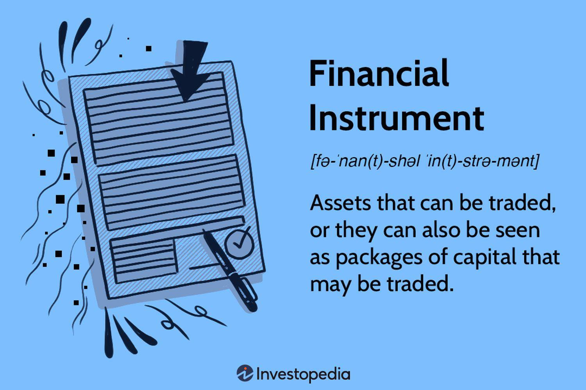

## Table of Contents

## What is a financial instrument?

A financial instrument is a tool that people and businesses use to manage money. It can be something you own, like a stock or a bond, or something you owe, like a loan or a mortgage. These instruments help people save, invest, or borrow money. They are important because they help the economy work smoothly by letting money move around.

There are many types of financial instruments. Stocks are pieces of a company that you can buy and sell. Bonds are like loans you give to a company or government, and they pay you back with interest. Other examples include mutual funds, which are collections of stocks and bonds, and derivatives, which are contracts based on the value of other assets. Each type of instrument has its own risks and benefits, so it's important to understand them before using them.

## What are the different types of financial instruments?

Financial instruments come in many forms, and they can be grouped into different categories. One big category is securities, which includes things like stocks and bonds. Stocks are pieces of a company that you can buy and sell. When you own a stock, you own a small part of that company. Bonds are like loans you give to a company or a government. They promise to pay you back with interest over time. Another category is derivatives, which are contracts based on the value of other assets, like commodities or currencies. These can be complex and risky, but they can also be used to manage risk.

There are also cash instruments, which include things like bank deposits and treasury bills. These are usually safer and more straightforward than securities or derivatives. Bank deposits are money you put in a bank, and treasury bills are short-term loans you give to the government. Another type of financial instrument is a loan, which can be a personal loan, a mortgage, or a business loan. Loans let you borrow money that you have to pay back with interest. Each type of financial instrument has its own purpose and level of risk, so it's important to understand them before you use them.

## How do financial instruments work?

Financial instruments are like tools that help people and businesses manage money. They can be things you own, like stocks and bonds, or things you owe, like loans and mortgages. When you buy a stock, you're buying a small piece of a company. If the company does well, the value of your stock might go up, and you could make money. Bonds work differently. When you buy a bond, you're lending money to a company or the government. They promise to pay you back with interest over time. This is a way to earn money without taking as much risk as with stocks.

There are also other types of financial instruments, like derivatives and cash instruments. Derivatives are contracts based on the value of other things, like commodities or currencies. They can be risky but are used to manage risk or speculate on future prices. Cash instruments, like bank deposits and treasury bills, are usually safer. When you put money in a bank, you're using a cash instrument. Treasury bills are short-term loans to the government. Loans are another kind of financial instrument. When you take out a loan, you're borrowing money that you have to pay back with interest. Each type of financial instrument works in its own way, but they all help move money around and keep the economy going.

## What are the benefits of using financial instruments?

Financial instruments help people and businesses manage their money better. They let you save, invest, or borrow money in different ways. For example, if you want to save for the future, you can put your money in a bank deposit or buy a bond. These options can give you some interest over time. If you want to grow your money faster, you might buy stocks. Stocks can go up and down a lot, but if you pick the right ones, you could make more money. Financial instruments also help businesses get the money they need to grow. A company can sell stocks to raise money from investors or borrow money through bonds or loans.

Another benefit of financial instruments is that they help spread out risk. Instead of putting all your money in one place, you can use different instruments to balance things out. For example, you might put some money in safe bank deposits, some in bonds, and some in stocks. This way, if one investment goes down, the others might still be okay. Financial instruments also make it easier to move money around in the economy. When people buy and sell stocks, bonds, and other instruments, it helps keep money flowing. This is important for keeping the economy healthy and growing.

## What are the risks associated with financial instruments?

Financial instruments can be risky. When you buy stocks, the value can go up and down a lot. If the company does badly, you could lose money. Bonds are usually safer, but if the company or government can't pay back the loan, you might lose your money too. Derivatives can be even riskier because they're based on the value of other things, like commodities or currencies. If those things change a lot, you could lose a lot of money quickly.

Another risk is that you might not understand how a financial instrument works. If you don't know what you're doing, you could make bad choices. Also, some financial instruments can be hard to sell quickly. If you need your money back fast, you might not be able to get it. Even safe instruments like bank deposits can have risks if the bank has problems. It's important to know these risks and think carefully before using any financial instrument.

## How are financial instruments regulated?

Financial instruments are regulated by different groups to make sure they are safe and fair. In the United States, the main group is the Securities and Exchange Commission (SEC). The SEC makes rules about how stocks, bonds, and other securities can be bought and sold. They also check that companies tell the truth about their financial health. Other countries have their own groups that do similar things. These groups help protect people who use financial instruments by making sure everyone follows the rules.

There are also rules about banks and other places that deal with money. In the U.S., the Federal Reserve and the Office of the Comptroller of the Currency (OCC) watch over banks. They make sure banks are safe and that they treat people fairly. Other countries have their own bank regulators. These rules help keep the financial system stable and make sure that people can trust the places where they save and invest their money.

## What is the difference between a financial instrument and a financial product?

A financial instrument is a tool that helps people and businesses manage money. It can be something you own, like a stock or a bond, or something you owe, like a loan. Financial instruments help move money around in the economy and let people save, invest, or borrow money. They come in many forms, like stocks, bonds, and derivatives, each with its own risks and benefits.

A financial product is a bit different. It's something that a bank or a financial company offers to help you with your money. Examples of financial products include bank accounts, insurance policies, and credit cards. While financial instruments are often part of financial products, the products are more about the services and features that come with them. For example, a bank account is a financial product that might include a savings instrument, but it also comes with other services like online banking and ATM access.

## How do financial instruments impact the economy?

Financial instruments help the economy grow by moving money around. When people buy and sell stocks, bonds, and other instruments, it helps businesses get the money they need to grow. For example, if a company sells stocks, it can use that money to build new factories or hire more workers. This creates jobs and helps the economy get bigger. Also, when people save money in bank deposits or buy bonds, it gives banks and governments money to lend or spend on projects that help the economy.

Financial instruments also help manage risk in the economy. By using different instruments, people and businesses can spread out their money and protect themselves from losing everything if one investment goes bad. For example, if you put some money in safe bank deposits, some in bonds, and some in stocks, you're less likely to lose everything if the stock market goes down. This makes people feel more confident about investing and spending money, which helps keep the economy stable and growing.

## What role do financial instruments play in investment strategies?

Financial instruments are key parts of investment strategies. They let people and businesses put their money into different things to grow it over time. For example, if you want to invest, you might buy stocks, which are pieces of a company. If the company does well, the value of your stocks might go up, and you could make money. Or you might buy bonds, which are like loans to a company or the government. Bonds usually give you interest over time, so they can be a safer way to grow your money.

Using different financial instruments helps spread out risk. Instead of putting all your money in one thing, you can use a mix of stocks, bonds, and other instruments. This way, if one investment goes down, the others might still be okay. This is called diversification, and it's a big part of a good investment strategy. Financial instruments also let you match your investments with your goals. If you want to save for the future and don't want to take too much risk, you might choose more bonds. If you're okay with taking more risk to grow your money faster, you might choose more stocks.

## How can one evaluate the performance of financial instruments?

Evaluating the performance of financial instruments involves looking at how well they are doing over time. For stocks, you might check how much the price has gone up or down. You can also look at the dividends, which are payments companies give to shareholders. For bonds, you look at the interest they pay and whether the bond's value has changed. If you have a mix of different instruments, like in a mutual fund, you might look at the overall return of the fund. It's also important to compare the performance to a benchmark, like a stock market index, to see if your investments are doing better or worse than the market.

Another way to evaluate financial instruments is by looking at risk. Some instruments, like stocks, can go up and down a lot, which means they are riskier. Others, like bonds, are usually safer but might not grow as fast. You can measure risk by looking at how much the value of an instrument changes over time, called volatility. You might also look at the Sharpe ratio, which compares the return of an investment to its risk. By understanding both the return and the risk, you can see if a financial instrument is a good fit for your investment goals.

## What advanced strategies involve the use of financial instruments?

Advanced strategies using financial instruments often involve using derivatives like options and futures. These are contracts that let you bet on the future price of things like stocks, commodities, or currencies. For example, you might buy an option that gives you the right to buy a stock at a certain price in the future. If the stock's price goes up, you can buy it at the lower price and make money. This is called a call option. Or you might buy a put option, which lets you sell a stock at a certain price if it goes down. These strategies can help you make money if you think prices will change a lot, but they can also be very risky.

Another advanced strategy is called hedging. This is when you use financial instruments to protect yourself from risk. For example, if you own a lot of stocks, you might buy put options to protect against a drop in the stock market. This way, if the market goes down, you can still make money from the options. Hedging can help you sleep better at night by reducing risk, but it can also be complicated and might cost you money if you don't need the protection. Both of these strategies need a good understanding of the market and how financial instruments work.

## How do global financial instruments affect international markets?

Global financial instruments like stocks, bonds, and currencies can have a big impact on international markets. When people and businesses in one country buy and sell these instruments, it can move money around the world. For example, if investors from the United States buy stocks in a company in Japan, it can help that company grow and create jobs in Japan. But if everyone starts selling those stocks at once, it could hurt the Japanese economy. So, these instruments help connect economies and can make them grow or shrink depending on what investors do.

These instruments also affect how much things cost in different countries. When people buy and sell currencies, it changes the exchange rates. If the value of the US dollar goes up compared to the Japanese yen, it can make things from Japan cheaper for Americans to buy. This can help trade between countries, but it can also cause problems if the exchange rates change too fast. Overall, global financial instruments are important for the world economy because they help move money and goods around, but they can also cause big changes that affect everyone.

## What is the understanding of financial instruments and assets?

Financial instruments are foundational elements within the financial markets, representing contracts that hold monetary value. These instruments encompass a wide array of forms, including bonds, stocks, and derivatives. Each type of financial instrument serves distinct purposes and offers various levels of risk and return potential.

Bonds are fixed-income instruments representing a loan made by an investor to a borrower, usually corporate or governmental. They are considered less risky compared to stocks and offer relatively stable returns. For example, a government bond provides a fixed interest payment over a specific period, culminating in the repayment of the principal amount. The yield on a bond can be calculated using the formula:

$$

\text{Yield} = \frac{\text{Annual Coupon Payment}}{\text{Current Market Price}} 
$$

Stocks represent ownership in a company and provide shareholders with voting rights and potential dividends. Their value fluctuates based on the company's performance and broader market conditions. While capable of high returns, stocks also [carry](/wiki/carry-trading) substantial risk, largely influenced by market [volatility](/wiki/volatility-trading-strategies).

Derivatives are complex instruments derived from the value of underlying assets like stocks, bonds, commodities, or market indexes. Common derivatives include options and futures. These instruments allow investors to hedge against risks or speculate on future price movements. For example, an option grants the holder the right, but not the obligation, to buy or sell an asset at a predetermined price on or before a specific date.

Assets, on the other hand, are classified as either complex or non-complex, influencing their role in trading and investment strategies. Non-complex assets include cash and cash equivalents, which are highly liquid and carry minimal risk. These are suitable for short-term investments and for reducing the overall risk of a portfolio.

Complex assets often encompass mortgage-backed securities (MBS) and collateralized debt obligations (CDOs). These require more sophisticated analysis to assess their value and risk. Investors utilize complex assets to potentially achieve higher returns, albeit with increased risk exposure.

Understanding how these instruments are utilized in trading strategies is essential. Investors use these diverse instruments to construct portfolios that align with their risk tolerance and financial goals. For instance, a balanced investment strategy might combine bonds for stability and stocks for growth, employing derivatives for hedging purposes.

In summary, financial instruments and assets are vital components in structuring effective trading strategies. Recognizing their individual characteristics and roles helps investors navigate the complexities of the financial markets and optimize their investment decisions.

## References & Further Reading

[1]: Bergstra, J., Bardenet, R., Bengio, Y., & Kégl, B. (2011). ["Algorithms for Hyper-Parameter Optimization."](https://papers.nips.cc/paper/4443-algorithms-for-hyper-parameter-optimization) Advances in Neural Information Processing Systems 24.

[2]: ["Advances in Financial Machine Learning"](https://www.amazon.com/Advances-Financial-Machine-Learning-Marcos/dp/1119482089) by Marcos Lopez de Prado

[3]: ["Evidence-Based Technical Analysis: Applying the Scientific Method and Statistical Inference to Trading Signals"](https://www.amazon.com/Evidence-Based-Technical-Analysis-Scientific-Statistical/dp/0470008741) by David Aronson

[4]: ["Machine Learning for Algorithmic Trading"](https://github.com/PacktPublishing/Machine-Learning-for-Algorithmic-Trading-Second-Edition) by Stefan Jansen

[5]: ["Quantitative Trading: How to Build Your Own Algorithmic Trading Business"](https://books.google.com/books/about/Quantitative_Trading.html?id=j70yEAAAQBAJ) by Ernest P. Chan