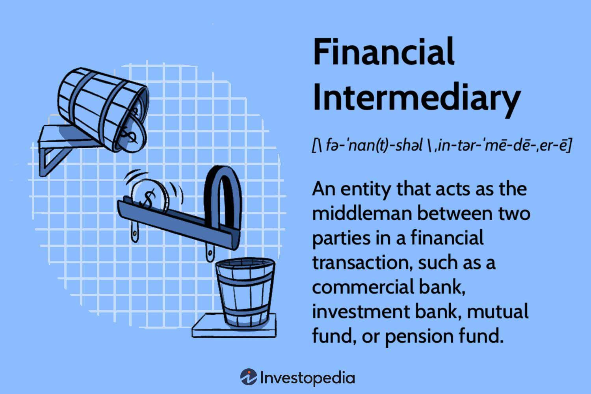

## Table of Contents

## What is a financial intermediary?

A financial intermediary is an organization that acts as a middleman between people who have money to save or invest and those who need money to borrow or spend. Think of them like a bridge that helps money move from one place to another. Common examples include banks, credit unions, and investment firms. These intermediaries take in money from savers and investors, then use that money to make loans or invest in other ways, helping the economy grow.

Financial intermediaries make things easier for everyone. For people saving money, they offer safe places to keep their money and often provide interest or other benefits. For those needing money, like businesses or home buyers, intermediaries provide loans or other financial products. This system helps money flow smoothly through the economy, making it easier for people to save, invest, and spend. By doing this, financial intermediaries play a key role in keeping the economy healthy and growing.

## What are the primary functions of financial intermediaries?

Financial intermediaries do a few main things to help the economy work well. One big job they have is to gather money from people who want to save or invest. This can be through bank accounts, where people put their money to keep it safe and maybe earn some interest, or through investment funds where people hope their money will grow over time. By collecting this money, financial intermediaries make it easier for people to save without having to find someone to lend to themselves.

Another important job is to lend this money to others who need it. This could be a family wanting to buy a house or a business needing money to grow. Financial intermediaries decide who gets the money and under what terms, like the [interest rate](/wiki/interest-rate-trading-strategies) and how long they have to pay it back. This helps money move around the economy, from those who have extra to those who can use it to do something useful. By doing these things, financial intermediaries keep money flowing and help the economy stay healthy.

## Can you provide examples of financial intermediaries?

Banks are a common type of financial intermediary. When people put their money into a bank account, the bank keeps it safe and might give them a little bit of interest. Then, the bank uses that money to give loans to other people or businesses. For example, if someone wants to buy a house, they can go to the bank for a mortgage. The bank uses the money from savers to help the person buy the house.

Another example is credit unions. They work a lot like banks but are owned by their members. People who save money in a credit union can also borrow from it. Credit unions often have lower fees and better interest rates because they are not trying to make a big profit like some banks. They focus more on helping their members.

Investment firms are also financial intermediaries. They collect money from investors and use it to buy stocks, bonds, or other investments. This helps people who want to grow their money over time but don't want to pick out investments themselves. The investment firm does the work and tries to make the money grow for everyone who invested.

## How do financial intermediaries facilitate the flow of funds?

Financial intermediaries help money move around the economy by taking in money from people who want to save or invest and then lending it to others who need it. For example, when someone puts money into a bank account, the bank keeps it safe and might give them a little interest. Then, the bank uses that money to give loans to people or businesses who need it. This way, the money doesn't just sit in one place; it gets used to help others do things like buy a house or start a business.

Another way financial intermediaries help is by making it easier for people to save and invest without having to find someone to lend to themselves. They do the work of finding good places to put the money, like giving loans or buying investments. This makes it simpler for people to grow their money over time. By doing this, financial intermediaries keep money flowing through the economy, helping it stay healthy and grow.

## What role do financial intermediaries play in the economy?

Financial intermediaries are super important for the economy because they help money move around. They take money from people who want to save or invest and give it to others who need it to buy things like houses or start businesses. This makes it easier for everyone because people don't have to find someone to lend their money to themselves. Instead, they can put their money in a bank or an investment fund, and the financial intermediary does the work of finding good places to put that money.

By doing this, financial intermediaries keep money flowing through the economy, which helps it grow and stay healthy. When money is moving around, businesses can grow, people can buy homes, and the economy can keep going strong. Without financial intermediaries, it would be much harder for money to get where it needs to go, and the economy might not work as well. So, they play a big role in making sure the economy keeps running smoothly.

## How do financial intermediaries manage risk?

Financial intermediaries manage risk by spreading it out. They do this by taking money from lots of different people and lending it to lots of different borrowers. If one borrower can't pay back their loan, it's not a big problem because the financial intermediary has money coming in from other places. This way, the risk is shared among many people, making it smaller for everyone.

They also use something called risk assessment to manage risk. Before giving out a loan, they look at how likely someone is to pay it back. They might check a person's credit history or see if a business is doing well. By only lending to people or businesses that seem safe, financial intermediaries can lower the chance that they'll lose money. This helps keep the money flowing smoothly and safely through the economy.

## What are the differences between banks and non-bank financial intermediaries?

Banks and non-bank financial intermediaries both help money move around the economy, but they do it in different ways. Banks are the most common type of financial intermediary. They take in money from people who want to save and then use that money to give loans to others who need it. Banks also offer services like checking accounts, savings accounts, and credit cards. They are regulated by the government to make sure they are safe and stable. This means they have to follow certain rules to protect people's money.

Non-bank financial intermediaries, on the other hand, include things like investment firms, insurance companies, and credit unions. These organizations also help move money around, but they don't offer the same services as banks. For example, investment firms take money from people and use it to buy stocks or bonds, aiming to grow the money over time. Insurance companies collect money from people in the form of premiums and then pay out money if something bad happens, like a car accident. Credit unions are similar to banks but are owned by their members and often have lower fees. Non-bank financial intermediaries are also regulated, but the rules can be different from those for banks.

Both types of financial intermediaries play important roles in the economy, but they do it in their own unique ways. Banks focus more on traditional banking services like savings and loans, while non-bank financial intermediaries might focus on investments, insurance, or member-owned services. Together, they help keep money flowing and the economy healthy.

## How do regulations affect financial intermediaries?

Regulations are like rules that governments set for financial intermediaries to follow. These rules are important because they help make sure that banks, investment firms, and other financial organizations work in a safe and fair way. For example, banks have to keep enough money on hand to give to people who want to take their money out. This rule helps stop banks from running out of money and causing problems. Regulations also make sure that financial intermediaries are honest and treat people fairly. They have to tell the truth about the risks and costs of their services, so people can make good choices with their money.

Regulations can also affect how financial intermediaries do business. Sometimes, the rules might limit what kinds of loans they can give out or how much they can charge in fees. This can make it harder for them to make money, but it also helps protect people from getting into too much debt or being charged too much. On the other hand, regulations can also help financial intermediaries by making people trust them more. When people know that a bank or an investment firm is following the rules, they feel safer putting their money there. So, while regulations can be a challenge, they are important for keeping the financial system strong and fair.

## What are the advantages of using financial intermediaries for individuals and businesses?

Financial intermediaries make things easier for individuals and businesses. For people, they provide a safe place to keep their money. When you put your money in a bank, it's protected and you might even earn some interest. This way, you don't have to worry about losing your savings. Plus, if you need to borrow money, like for a car or a house, financial intermediaries can help you get a loan. They do all the work of figuring out if you can pay it back and set up the terms, so you don't have to find someone to lend to you yourself.

For businesses, financial intermediaries are super helpful too. They can get loans to start up or grow their company. This means a business owner doesn't have to find investors on their own, which can be hard and time-consuming. Financial intermediaries also offer services like checking accounts and credit cards, which make it easier for businesses to manage their money. By using these services, businesses can focus on what they do best, instead of worrying about handling all their finances themselves.

## How do financial intermediaries contribute to financial stability?

Financial intermediaries help keep the economy stable by making sure money moves around smoothly. They take money from people who want to save and give it to others who need to borrow. This helps keep the economy going because businesses can get the money they need to grow, and people can buy things like houses. If financial intermediaries didn't do this, money might not flow as well, and the economy could have more ups and downs.

They also help by managing risk. Financial intermediaries spread out the risk by lending to lots of different people and businesses. If one loan doesn't get paid back, it's not a big problem because they have money coming in from other places. They also check how likely someone is to pay back a loan before giving it out. This careful checking helps make sure they don't lose too much money, which keeps the whole financial system safer and more stable.

## What are some modern challenges faced by financial intermediaries?

Financial intermediaries face a lot of challenges these days because of new technology and changing rules. One big challenge is keeping up with new tech like online banking and mobile apps. People want to do their banking on their phones or computers, so financial intermediaries need to make sure their services are easy to use and safe online. But this can be hard and expensive because they have to keep updating their systems to stay secure and meet what customers want.

Another challenge is dealing with new rules from the government. These rules are meant to protect people and make sure financial intermediaries are honest and safe. But sometimes, these rules can make it harder for financial intermediaries to do business. They have to spend a lot of time and money making sure they follow all the new rules, which can slow them down and make it harder to make money. So, they have to find a balance between following the rules and serving their customers well.

## How might technological advancements impact the future of financial intermediation?

Technological advancements are changing how financial intermediaries work. More and more people are using their phones or computers to do banking, which means financial intermediaries need to make their services easy to use online. They have to keep their websites and apps safe from hackers, which can be hard and costly. But if they do it right, they can reach more people and offer new services like instant payments or personalized financial advice. This can help them stay competitive and meet what customers want.

Another big change is the use of things like [artificial intelligence](/wiki/ai-artificial-intelligence) and blockchain. AI can help financial intermediaries make better decisions about who to lend money to and how to manage risk. It can look at a lot of data quickly and find patterns that humans might miss. Blockchain can make transactions faster and more secure, cutting out the need for some traditional financial intermediaries. While these technologies bring new opportunities, they also bring challenges. Financial intermediaries have to learn how to use them and keep up with the fast pace of change, or they might fall behind.

## References & Further Reading

[1]: Brogaard, J., Hendershott, T., & Riordan, R. (2014). ["High-Frequency Trading and Price Discovery."](https://academic.oup.com/rfs/article-abstract/27/8/2267/1582754) The Review of Financial Studies, 27(8), 2267-2306.

[2]: ["Algorithmic Trading and DMA: An Introduction to Direct Access Trading Strategies"](https://archive.org/details/algorithmictradi0000john) by Barry Johnson

[3]: Gomber, P., Arndt, B., Lutat, M., & Uhle, T. (2011). ["High-Frequency Trading."](https://papers.ssrn.com/sol3/papers.cfm?abstract_id=1858626) In: Business and Information Systems Engineering, 3, 32-37.

[4]: O'Hara, M. (2015). ["High Frequency Market Microstructure."](https://www.sciencedirect.com/science/article/pii/S0304405X15000045) Journal of Financial Economics, 116(2), 257-270.

[5]: Cartea, Á., Jaimungal, S., & Penalva, J. (2015). ["Algorithmic and High-Frequency Trading."](https://assets.cambridge.org/97811070/91146/frontmatter/9781107091146_frontmatter.pdf) Cambridge University Press.