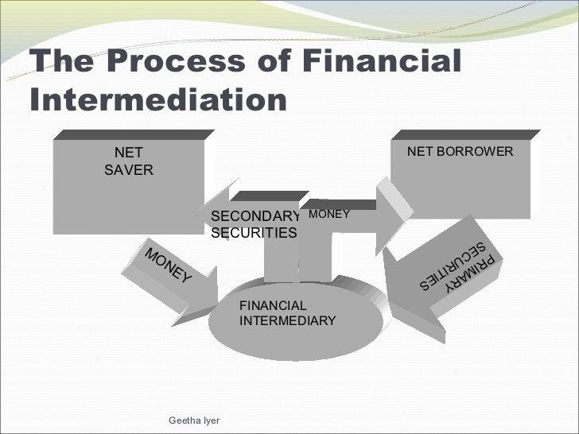

## Table of Contents

## What is financial intermediation?

Financial intermediation is the process where financial institutions, like banks or credit unions, act as middlemen between people who have money to save or invest and those who need to borrow money. These institutions take in money from savers in the form of deposits and then lend it out to borrowers, like individuals or businesses, who need funds for various purposes. This process helps money flow from those who have extra to those who need it, making the economy work more smoothly.

By doing this, financial intermediaries help to reduce the risks involved in lending and borrowing. For example, when you put your money in a bank, the bank pools it with money from other depositors and lends it out to many different borrowers. This spreading out of loans means that if one borrower can't pay back their loan, the bank is less likely to lose all the money. Also, financial intermediaries often have the expertise to assess the creditworthiness of borrowers, which helps to ensure that loans are given to those who are likely to pay them back.

## What are the main types of financial intermediaries?

Financial intermediaries come in different forms, but the main types are banks, credit unions, and insurance companies. Banks are probably the most well-known type. They take in money from people who want to save or invest and then lend it out to others who need to borrow. Credit unions work in a similar way, but they are owned by their members and often offer better rates because they are not-for-profit organizations. Insurance companies are a bit different. They collect premiums from people and businesses to cover potential losses, and they invest these funds to generate returns.

Another important type of financial intermediary is investment companies, like mutual funds and pension funds. These companies pool money from many investors and use it to buy a variety of assets, like stocks and bonds. This helps individual investors to diversify their investments without having to buy each asset themselves. Lastly, there are brokerage firms, which help people buy and sell securities like stocks and bonds. They act as a go-between for buyers and sellers in the financial markets, making it easier for people to invest their money.

## How do financial intermediaries facilitate economic growth?

Financial intermediaries help economic growth by making it easier for people and businesses to save and borrow money. When people save money in banks or credit unions, these institutions can lend it out to others who need it to start a business, buy a home, or go to school. This flow of money helps the economy grow because it lets more people and businesses do things that create jobs and make things that people want to buy.

Also, financial intermediaries help spread out the risk of lending and borrowing. By taking in money from lots of people and lending it out to many different borrowers, they make it less likely that one person's bad luck will hurt the whole economy. This makes people feel more confident about saving and borrowing, which means more money moves around and helps the economy grow even more.

## What role do banks play in financial intermediation?

Banks are important in financial intermediation because they help move money from people who want to save to people who need to borrow. When you put your money in a bank, it doesn't just sit there. The bank takes your money and lends it to someone else, like a person who wants to buy a house or a business that needs money to grow. This helps the economy because it lets people and businesses do more things that create jobs and make things people want to buy.

Banks also help by spreading out the risk. If you lend money to just one person and they can't pay it back, you lose all your money. But banks take money from lots of people and lend it to lots of different people. This way, if one person can't pay back their loan, the bank doesn't lose everything. This makes people feel safer about saving their money in banks, and it helps the economy grow because more money can move around.

## Can you explain the concept of maturity transformation in financial intermediation?

Maturity transformation is a key thing that banks do in financial intermediation. It's when banks take in money from people who want to save, usually for a short time, and then lend it out to others who need it for a longer time. For example, you might put your money in a bank account where you can take it out anytime, but the bank might lend that money to someone who needs it for 30 years to buy a house. This helps the economy because it lets people save money in a way that's easy for them, while also giving others the long-term loans they need.

This process is important because it helps match up the different needs of savers and borrowers. If everyone had to lend their money for the same amount of time they wanted to save it, it would be hard to find someone who wants to borrow for just a few months and someone else who wants to borrow for many years. By doing maturity transformation, banks make it easier for money to move around and help the economy grow. But it also means banks have to be careful, because if lots of people want their money back at the same time, the bank might not have enough to give back right away.

## What are the risks associated with financial intermediation?

Financial intermediation comes with some risks that can affect banks and the whole economy. One big risk is credit risk, which is when people who borrow money from banks can't pay it back. If lots of borrowers can't pay, the bank might lose a lot of money, and this can cause problems for everyone who has money in the bank. Another risk is [liquidity](/wiki/liquidity-risk-premium) risk. This happens when people want to take their money out of the bank, but the bank has lent it out for a long time and can't get it back quickly. If too many people want their money at the same time, the bank might not have enough to give back right away, which can lead to a bank run.

There's also [interest rate](/wiki/interest-rate-trading-strategies) risk, which is when the interest rates in the economy change and affect the bank's profits. If rates go up, the bank might have to pay more interest to people who save money with them, but they might not be able to charge more interest on the loans they've already given out. This can make it hard for the bank to make money. Lastly, there's operational risk, which is when something goes wrong inside the bank, like a computer system failing or someone making a mistake. These problems can cost the bank money and make it harder for them to do their job of moving money around to help the economy grow.

## How does financial intermediation impact monetary policy?

Financial intermediation affects monetary policy because it's how the central bank, like the Federal Reserve, tries to control the economy. When the central bank wants to make more money available in the economy, it can lower interest rates. This makes it cheaper for banks to borrow money from the central bank, so they can lend more money to people and businesses. More lending means more spending and investment, which can help the economy grow. On the other hand, if the central bank wants to slow down the economy, it can raise interest rates. This makes borrowing more expensive, so people and businesses might borrow and spend less.

The way banks work as financial intermediaries also matters for how well monetary policy works. If banks are healthy and confident, they are more likely to lend out the money they get from the central bank. But if banks are worried about risks, like people not paying back loans, they might not lend as much even if interest rates are low. This can make it harder for the central bank to get the economy moving. Also, if people start to worry about banks and take their money out, it can cause problems that the central bank has to deal with, which can affect how it sets interest rates and manages the economy.

## What is the difference between direct and indirect finance in the context of financial intermediation?

Direct finance happens when someone who has money to lend gives it straight to someone who wants to borrow, without any middleman like a bank. For example, if you lend money to your friend to start a business, that's direct finance. It's simpler and can be faster because you don't have to go through a bank or other financial institution. But it can also be riskier because if your friend can't pay you back, you might lose all your money.

Indirect finance is when a financial intermediary, like a bank, gets involved. You put your money in the bank, and the bank lends it to someone else who needs it. This way, you don't have to find someone to lend to yourself, and the bank handles all the details. It's usually safer because the bank spreads the risk by lending to lots of different people. But it can be slower and might involve fees or lower interest rates for you, the saver, because the bank needs to make money too.

## How have technological advancements affected financial intermediation?

Technological advancements have changed how financial intermediation works by making it easier and faster for people to save, borrow, and invest money. With the internet and smartphones, people can now do their banking online or through apps without going to a bank. This means they can check their accounts, pay bills, or apply for loans anytime and anywhere. Also, technology has made it possible for new kinds of financial intermediaries to appear, like online banks and peer-to-peer lending platforms. These new options give people more choices and can sometimes offer better rates or lower fees than traditional banks.

Another big change is that technology helps financial intermediaries use data and computers to make better decisions. Banks can now use algorithms and [artificial intelligence](/wiki/ai-artificial-intelligence) to quickly look at a lot of information about someone who wants to borrow money. This helps them decide if that person is likely to pay back the loan. Technology also makes it easier for banks to keep track of their money and manage risks. But there are also new risks with technology, like hackers trying to steal money or personal information. So, financial intermediaries have to be careful and use strong security to protect their customers.

## What regulatory frameworks govern financial intermediaries and why are they important?

Financial intermediaries like banks and insurance companies are watched over by rules and laws called regulatory frameworks. These rules come from government agencies like the Federal Reserve in the U.S. or the European Central Bank in Europe. The main goal of these rules is to make sure that financial intermediaries work in a safe and fair way. They have to follow rules about how much money they can lend, how much they need to keep in reserve, and how they should treat their customers. These rules help stop banks from taking too many risks that could hurt the economy, and they make sure that people's money is safe.

Regulatory frameworks are important because they help keep the financial system stable. If banks or other financial intermediaries start to fail, it can cause big problems for the whole economy. By having rules in place, regulators can step in early if they see a bank doing something risky. This helps prevent bank failures and keeps people's trust in the financial system. Also, these rules make sure that everyone is treated fairly. For example, they stop banks from charging too much or from hiding important information from their customers. This helps keep the financial system honest and working well for everyone.

## How do financial intermediaries manage liquidity and credit risks?

Financial intermediaries like banks manage liquidity risk by making sure they always have enough cash or easy-to-sell assets on hand. This way, if a lot of people want to take their money out at the same time, the bank can give it to them without problems. Banks also keep some money in reserve, as required by rules, and they can borrow from other banks or the central bank if they need to. By doing all these things, banks can handle times when people want their money back quickly and keep the trust of their customers.

To manage credit risk, banks look carefully at people who want to borrow money to see if they can pay it back. They check things like a person's job, how much money they make, and their credit history. Banks also spread out the risk by lending money to many different people and businesses. If one person can't pay back their loan, the bank won't lose all its money. Banks can also ask for things like houses or cars as security for loans, so if someone can't pay, the bank can sell these items to get some of its money back. By doing all these things, banks can lend money safely and help the economy grow.

## What are some advanced financial intermediation models used by investment banks?

Investment banks use advanced financial intermediation models to help companies and governments raise money. One common model is underwriting, where the investment bank buys securities like stocks or bonds from a company and then sells them to investors. This helps the company get the money it needs quickly, and the investment bank makes money by selling the securities at a higher price than it paid. Another model is securitization, where the bank takes a bunch of loans, like mortgages, and turns them into securities that can be sold to investors. This spreads out the risk and makes it easier for banks to lend more money.

Another advanced model is proprietary trading, where investment banks use their own money to buy and sell securities, trying to make a profit from the ups and downs in the market. This can be risky but can also make a lot of money for the bank. Investment banks also offer advisory services, helping companies with things like mergers and acquisitions. They help figure out the best way for two companies to come together or for one company to buy another, making sure everything goes smoothly and helping the companies grow. These advanced models help investment banks play a big role in the economy by moving money around and helping businesses and governments do big things.

## References & Further Reading

[1]: Allen, F., & Santomero, A. M. (1998). ["The Theory of Financial Intermediation."](https://www.sciencedirect.com/science/article/pii/S0378426697000320) Journal of Banking & Finance, 21(11-12), 1461-1485.

[2]: Biais, B., Foucault, T., & Moinas, S. (2015). ["Equilibrium High-Frequency Trading."](https://papers.ssrn.com/sol3/papers.cfm?abstract_id=2024360) The Review of Financial Studies, 28(3), 560–594.

[3]: Hendershott, T., Jones, C. M., & Menkveld, A. J. (2011). ["Does Algorithmic Trading Improve Liquidity?"](https://onlinelibrary.wiley.com/doi/full/10.1111/j.1540-6261.2010.01624.x) The Journal of Finance, 66(1), 1-33.

[4]: Väänänen, L. (2009). ["The Microstructure of the Stock Market in the Age of High-Frequency Trading."](https://www.sciencedirect.com/science/article/pii/S0304405X15000045) Applied Economics Letters, 16(13-15), 1419-1423.

[5]: O’Hara, M. (2015). ["High Frequency Market Microstructure."](https://www.sciencedirect.com/science/article/pii/S0304405X15000045) Annual Review of Financial Economics, 7, 133-144.

[6]: Lopez de Prado, M. (2018). ["Advances in Financial Machine Learning."](https://www.amazon.com/Advances-Financial-Machine-Learning-Marcos/dp/1119482089) Wiley.

[7]: Jarrow, R. A., & Larsson, M. (2012). ["The Economic Impact of Algorithmic Trading."](https://onlinelibrary.wiley.com/doi/abs/10.1111/j.1467-9965.2011.00497.x) The Review of Financial Studies, 25(8), 2148–2189.