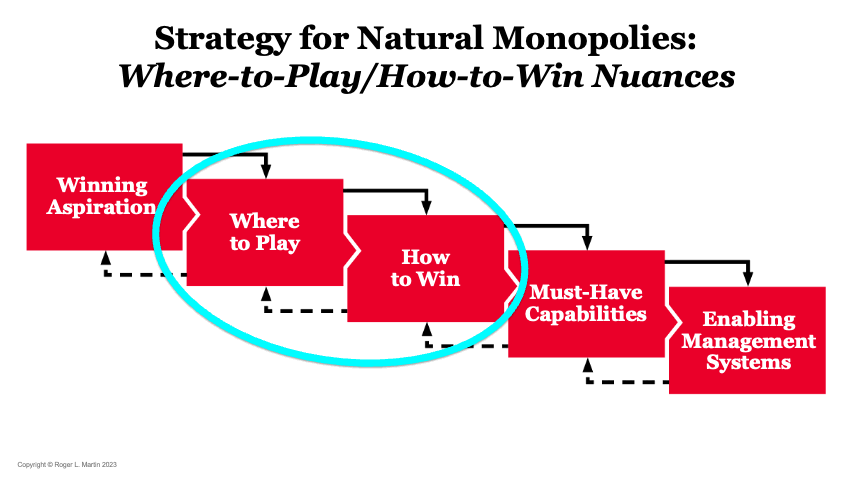

## Table of Contents

## What basic financial lessons can beginners learn from playing Monopoly?

Playing Monopoly can teach beginners some important financial lessons. One key lesson is the importance of saving and investing. In the game, players need to save their money to buy properties. These properties can then be developed with houses and hotels, which increases their value and the rent they can charge. This is similar to real life, where saving money and investing in assets like stocks or real estate can help grow wealth over time.

Another lesson from Monopoly is understanding the risks and rewards of borrowing money. In the game, players can take out loans by mortgaging their properties. This can help them buy more properties or get out of jail, but they have to pay interest on the loans. If they can't pay back the loans, they might lose their properties. This teaches players that borrowing money can help them grow their wealth, but it also comes with risks that need to be managed carefully.

Lastly, Monopoly shows the importance of strategy and planning. Players need to decide which properties to buy, when to trade with others, and how to manage their money. Making smart choices can lead to winning the game, while poor choices can lead to bankruptcy. This mirrors real life, where having a good financial plan and making wise decisions are crucial for financial success.

## How does the concept of property investment in Monopoly relate to real estate investing?

In Monopoly, players buy properties to earn rent from other players who land on them. This is similar to real estate investing where people buy houses or buildings to earn money from renting them out. In both cases, the goal is to make more money than what was spent on buying the property. In Monopoly, players can also build houses and hotels on their properties to increase the rent. This is like how real estate investors might improve their properties to charge higher rent or sell them for more money.

Another way Monopoly relates to real estate investing is through the idea of buying properties in sets. In the game, owning all the properties of the same color increases the rent significantly. This is similar to how real estate investors might try to buy multiple properties in the same area to control the market and increase their profits. Both in the game and in real life, having a strategy for which properties to buy and when to buy them can make a big difference in success.

## What does Monopoly teach about the importance of cash flow management?

Monopoly teaches that managing your cash flow is very important. In the game, you need to have enough money to buy properties, pay rent, and cover other costs like taxes and fines. If you run out of money, you might have to mortgage your properties or even go bankrupt. This shows that having a good cash flow helps you keep playing and winning the game.

Just like in Monopoly, in real life, managing your cash flow is key to staying financially stable. You need to make sure you have enough money coming in to cover your expenses and save for the future. If you don't manage your cash flow well, you might struggle to pay your bills or end up in debt. So, Monopoly teaches us to always keep an eye on our money and plan how we use it.

## How can the strategy of trading in Monopoly be applied to real-world investment negotiations?

In Monopoly, trading properties with other players is a smart move to get a complete set of properties, which helps you earn more rent. This is like real-world investment negotiations where people trade stocks, businesses, or real estate to make their investments stronger. For example, if you have a property that another player really wants, you can trade it for something you need. In real life, if you own a piece of land that a developer wants, you might trade it for a share in their project or another piece of property that could be more valuable to you.

The key to successful trading in Monopoly is knowing what you have and what the other player needs. You should always try to get the best deal possible. This is the same in real-world investments. You need to understand your own assets and what the other person values. By negotiating well, you can make trades that help both sides. This way, you can grow your investments and reach your financial goals faster.

## What lessons about risk and diversification can be drawn from Monopoly?

Monopoly teaches us about risk and how important it is to be careful. In the game, buying properties is a risk because you might not get your money back if other players don't land on them often. Also, if you spend all your money on one property, you might not have enough to buy others or pay rent. This shows that it's risky to put all your money into one thing. In real life, this is like investing all your money in one stock or one type of investment. If that investment fails, you could lose everything.

The game also shows us the value of diversification. In Monopoly, it's smart to buy different properties in different colors. This way, you have a better chance of getting rent from other players because they can land on any of your properties. It also helps you complete sets and increase your rent. In real life, diversification means spreading your money across different types of investments like stocks, bonds, and real estate. This can help reduce your risk because if one investment does badly, the others might do well and balance it out. So, Monopoly teaches us to spread our risks and not put all our eggs in one basket.

## How does Monopoly illustrate the impact of debt and leverage in financial strategies?

In Monopoly, players can use debt by mortgaging their properties to get more money. This is like taking a loan in real life. When you mortgage a property, you can use the money to buy more properties or pay rent. But, you have to pay interest on the mortgage. If you can't pay back the mortgage and the interest, you might lose your property. This shows that debt can help you grow your wealth by giving you more money to invest, but it also has risks. If you borrow too much and can't pay it back, you could end up losing everything.

Leverage in Monopoly is when you use the money from mortgaging to buy more properties. This can help you earn more rent and win the game. It's like using borrowed money to invest in real life. If you use leverage well, you can make a lot more money than what you borrowed. But, if the properties you buy don't make enough money, you might not be able to pay back the loans. This teaches us that using leverage can be a powerful way to grow your wealth, but it's important to use it carefully and understand the risks.

## In what ways does Monopoly demonstrate the concept of opportunity cost in financial decision-making?

In Monopoly, opportunity cost is shown when you have to choose between different things to do with your money. For example, if you buy a property, you might not have enough money left to buy another one that could be more valuable later. This means the opportunity cost of buying the first property is missing out on the chance to buy the second one. In the game, you always have to think about what you might lose by choosing one option over another.

This is a lot like real life. When you spend money on something, you can't use that same money for something else. For example, if you spend your money on a new phone, you might not be able to go on a trip you wanted. The opportunity cost of buying the phone is not being able to take the trip. Monopoly helps you see that every financial decision has a cost, and it's important to think about what you might be giving up before you make a choice.

## How can advanced players use Monopoly to understand the timing of investments?

In Monopoly, timing your investments can make a big difference. Advanced players know that buying properties early in the game can be good because there are more properties available and you can get them at a lower price. But, you also need to save some money for later because you might need it to pay rent or buy more properties when others become available. The key is to balance buying properties early with keeping enough money to take advantage of opportunities that come up later in the game.

As the game goes on, advanced players watch for the right time to trade properties or build houses and hotels. For example, if you see that other players are landing on a certain property a lot, it might be a good time to buy it or trade for it. Also, if you have a complete set of properties, waiting until you have enough money to build houses and hotels can help you earn a lot more rent. This shows that timing your investments, like knowing when to buy, trade, or build, can help you win the game.

## What insights can Monopoly provide about the psychological aspects of investing, such as greed and fear?

Monopoly can show us how greed can affect investing. In the game, players often want to buy every property they can, even if it means spending all their money. This is like being greedy in real life, where people might want to buy a lot of stocks or other investments without thinking about the risks. In Monopoly, being too greedy can make you run out of money and lose the game. In real life, being too greedy can lead to bad investment choices and big losses.

The game also teaches us about fear in investing. When players land on properties they don't own, they might feel scared about paying a lot of rent. This can make them not want to take risks, like buying new properties or trading with other players. In real life, fear can make people avoid investing or sell their investments too soon. Monopoly shows that being too scared can stop you from making good choices and growing your money.

## How does the game of Monopoly reflect the importance of long-term planning in financial and investment strategies?

Monopoly shows us that long-term planning is important in financial and investment strategies. In the game, you need to think about what will happen later, not just right now. For example, buying properties early can help you get more money in the long run, but you also need to save some money for later. If you plan well, you can buy properties at the right time and build houses and hotels when it will earn you the most rent. This teaches us that thinking about the future and making a plan can help you win the game.

In real life, long-term planning is just as important. If you want to save for a house or retirement, you need to make a plan and stick to it. Just like in Monopoly, you might need to save money now to invest later. Planning ahead helps you make smart choices about where to put your money and when to take risks. By thinking about the long term, you can build wealth and reach your financial goals, just like winning the game of Monopoly.

## What can expert investors learn from Monopoly about the impact of market monopolies and competition?

Expert investors can learn from Monopoly about how having a monopoly can give you a lot of power. In the game, if you own all the properties of one color, you can charge much higher rent. This is like having a monopoly in real life, where one company controls a whole market. When you have a monopoly, you can make more money because you don't have to compete with others. But, it can be hard to get a monopoly because other players might not want to trade with you or they might try to stop you from getting all the properties you need.

The game also shows how competition can affect your investments. In Monopoly, other players are your competition. They can buy properties you want, make trades that hurt you, or land on your properties and not pay rent because they have enough money. This teaches expert investors that they need to watch what their competition is doing and be ready to change their plans. In real life, competition can make it harder to make money, but it can also push you to be better and find new ways to grow your investments.

## How can the principles of game theory observed in Monopoly be applied to complex investment scenarios?

In Monopoly, game theory shows up when players make choices based on what they think others will do. For example, you might decide to buy a property because you think another player wants it too. This is like how investors in real life might buy a stock because they think others will want it later, making the price go up. In Monopoly, you also have to think about when to trade with other players. If you know they need a certain property to complete a set, you can ask for more in return. This is similar to real-life investing where understanding what other investors want can help you make better deals and get more value from your investments.

In complex investment scenarios, game theory helps investors predict how markets will move based on other people's actions. Just like in Monopoly, where players watch each other to decide when to buy or sell properties, investors need to watch market trends and other investors' moves. For example, if many investors are buying tech stocks, you might decide to buy them too, hoping the price will keep going up. But, you also need to think about what will happen if everyone starts selling those stocks. By understanding these dynamics, investors can make smarter choices and manage their risks better, just like a Monopoly player trying to win the game.

## References & Further Reading

[1]: ["The Psychology of Money: Timeless Lessons on Wealth, Greed, and Happiness"](https://www.amazon.com/Psychology-Money-Timeless-lessons-happiness/dp/0857197681) by Morgan Housel

[2]: ["A Random Walk Down Wall Street: The Time-Tested Strategy for Successful Investing"](https://www.amazon.com/Random-Walk-Down-Wall-Street/dp/0393358380) by Burton G. Malkiel

[3]: ["Rich Dad Poor Dad: What the Rich Teach Their Kids About Money That the Poor and Middle Class Do Not!"](https://www.amazon.com/Rich-Dad-Poor-Teach-Middle/dp/1612680194) by Robert T. Kiyosaki

[4]: ["Games, Strategies, and Managers"](https://www.amazon.com/Games-Strategies-Managers-Business-Decisions/dp/0195108035) by John McMillan

[5]: ["The Smartest Guys in the Room: The Amazing Rise and Scandalous Fall of Enron"](https://www.amazon.com/Smartest-Guys-Room-Amazing-Scandalous/dp/1591846609) by Bethany McLean and Peter Elkind