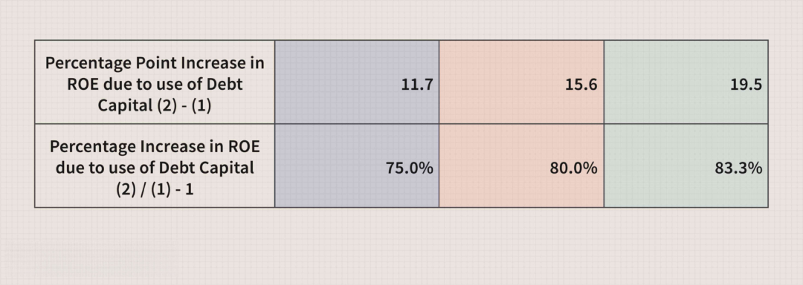

## Table of Contents

## What is financial leverage?

Financial leverage is when a company uses borrowed money to try to increase its profits. It's like using a lever to lift a heavy object; the borrowed money is the lever that helps the company lift its profits higher than it could with just its own money. Companies do this by taking loans or issuing bonds, and then they use that money to invest in things like new projects or buying other companies. The idea is that the return on these investments will be higher than the cost of the borrowed money.

But, using financial leverage can be risky. If the investments don't do well, the company still has to pay back the borrowed money plus interest. This can put a lot of pressure on the company's finances. If things go really bad, the company might not be able to pay its debts and could even go bankrupt. So, while financial leverage can help a company grow faster and make more money, it also increases the risk of big losses.

## How does financial leverage affect a company's capital structure?

Financial leverage changes a company's capital structure by increasing the amount of debt compared to equity. The capital structure is like a pie that shows how a company is financed, with slices representing debt and equity. When a company takes on more debt to use as financial leverage, the debt slice of the pie gets bigger and the equity slice gets smaller. This means the company relies more on borrowed money than on money from shareholders.

Using more debt in the capital structure can make the company's profits grow faster if the investments made with the borrowed money do well. But it also makes the company riskier because it has to pay back the debt no matter what happens with the investments. If the company can't pay back the debt, it might have to cut back on other spending or even go bankrupt. So, financial leverage can make the capital structure more profitable but also more fragile.

## What are the benefits of using financial leverage in a company?

Using financial leverage can help a company make more money. When a company borrows money and uses it to invest in new projects or buy other businesses, it can earn more than it would have if it only used its own money. If the investments do well, the company's profits can grow faster because it's using other people's money to make money. This can make the company's shareholders happy because their part of the company becomes more valuable.

But financial leverage also has risks. If the investments don't do well, the company still has to pay back the borrowed money plus interest. This can put a lot of pressure on the company's finances. If things go really bad, the company might not be able to pay its debts and could even go bankrupt. So, while financial leverage can help a company grow faster and make more money, it also increases the risk of big losses.

## What are the risks associated with high financial leverage?

High financial leverage means a company has a lot of debt compared to its own money. This can be risky because if the company can't pay back the debt, it might have to cut back on other spending or even go bankrupt. If the economy gets bad or the company's investments don't do well, it can be really hard to keep up with the debt payments. This can make the company's situation very unstable and stressful.

Also, when a company has a lot of debt, it might have to pay a lot of interest on that debt. This can eat into the company's profits and leave less money for other important things like growing the business or paying dividends to shareholders. If the company's profits aren't enough to cover the interest payments, it can quickly get into financial trouble. So, while high financial leverage can help a company grow faster, it also makes it more vulnerable to problems.

## How is the degree of financial leverage calculated?

The degree of financial leverage (DFL) is a way to measure how sensitive a company's earnings per share (EPS) are to changes in its operating income. It's calculated by dividing the percentage change in EPS by the percentage change in operating income. Another way to calculate it is by using the formula: DFL = EBIT / (EBIT - Interest Expense), where EBIT stands for Earnings Before Interest and Taxes. This tells us how much the use of debt is affecting the company's earnings.

A high DFL means that a small change in the company's operating income can lead to a big change in its EPS. This shows that the company is using a lot of debt, which can be risky but also potentially rewarding if things go well. A low DFL means the company isn't using much debt, so its EPS won't change much even if its operating income changes a lot. This makes the company's earnings more stable but might also mean it's not growing as fast as it could.

## Can you explain the difference between operating leverage and financial leverage?

Operating leverage and financial leverage are two ways a company can try to make more money, but they work in different ways. Operating leverage is about using fixed costs to make more profit from sales. Fixed costs are things like rent or salaries that don't change no matter how much the company sells. When a company has high operating leverage, a small increase in sales can lead to a big increase in profit because the fixed costs stay the same. But if sales go down, the company can lose a lot of money because those fixed costs still need to be paid.

Financial leverage is about using borrowed money to try to increase profits. When a company borrows money, it can use that money to invest in new projects or buy other businesses. If these investments do well, the company can make more money than it would have if it only used its own money. But financial leverage is risky because the company still has to pay back the borrowed money plus interest, no matter what happens with the investments. If the investments don't do well, the company might not be able to pay its debts and could even go bankrupt.

## What role does debt play in financial leverage?

Debt is like the engine that powers financial leverage. When a company borrows money, it's using debt to get more money to invest in new projects or buy other businesses. If these investments do well, the company can make more money than it would have if it only used its own money. The borrowed money helps the company grow faster and make more profit. This is why companies use debt as part of their financial leverage strategy.

But using debt also comes with risks. The company has to pay back the borrowed money plus interest, no matter what happens with the investments. If the investments don't do well, the company might struggle to pay back the debt. This can put a lot of pressure on the company's finances. If things get really bad, the company might not be able to pay its debts and could even go bankrupt. So, while debt can help a company make more money through financial leverage, it also makes the company's situation more risky.

## How does financial leverage impact a company's return on equity (ROE)?

Financial leverage can make a company's return on equity (ROE) go up. ROE is a way to measure how well a company is using the money its shareholders have given it. When a company borrows money and uses it to make more profit than the cost of the debt, it can increase its ROE. This is because the company is using other people's money to make more money for its shareholders. If the borrowed money is used well, the company's profits can grow faster, which makes the shareholders' part of the company more valuable.

But using financial leverage can also make things riskier. If the company can't pay back the debt or if the investments made with the borrowed money don't do well, the company's profits can go down. This can make the ROE go down too. If things get really bad, the company might not be able to pay its debts and could even go bankrupt. So, while financial leverage can help increase ROE when things go well, it also increases the chance of big losses if things go badly.

## What are some strategies for managing financial leverage effectively?

Managing financial leverage well means finding a good balance between using borrowed money to grow the company and keeping the risks low. A smart strategy is to only borrow money when the company has good investment opportunities that will likely make more money than the cost of the debt. It's also important to keep an eye on the economy and the company's own performance. If things start to look shaky, the company might want to slow down on borrowing more money until things get better.

Another key part of managing financial leverage is to always have a plan for paying back the debt. This means setting aside enough money from profits to cover the interest and principal payments on time. It's also a good idea to keep some extra cash on hand, just in case something unexpected happens. By being careful and planning ahead, a company can use financial leverage to grow without taking on too much risk.

## How do different industries vary in their use of financial leverage?

Different industries use financial leverage in different ways because they have different needs and risks. For example, industries like utilities and telecoms often use a lot of financial leverage. These businesses need a lot of money to build things like power plants or networks, and they can usually predict how much money they will make over time. So, they feel more comfortable borrowing a lot of money because they know they can pay it back.

On the other hand, industries like technology and biotech usually use less financial leverage. These businesses often have more ups and downs because it's hard to predict if their new products or research will be successful. They don't want to take on a lot of debt because if their projects fail, they might not be able to pay it back. So, they rely more on their own money or money from investors who are willing to take on more risk.

## What are the tax implications of financial leverage?

Using financial leverage can help a company save money on taxes. When a company borrows money, it has to pay interest on that debt. The good thing is, the company can usually take the interest it pays and subtract it from its income before it figures out how much tax it owes. This makes the company's taxable income smaller, so it pays less in taxes. This can make using debt a smart move for the company because it helps keep more money in its pocket.

But, there are some rules and limits to this tax benefit. Different countries have different rules about how much interest a company can deduct from its taxes. Sometimes, if a company borrows too much money, it might not be able to take all the interest as a tax deduction. Also, if the company's profits are not enough to cover the interest payments, it might not matter how much it saves on taxes because it could still have a hard time paying back the debt. So, while financial leverage can help with taxes, it's important for companies to think about all the risks and rules before they decide to borrow a lot of money.

## How do financial analysts assess the sustainability of a company's financial leverage?

Financial analysts look at a few key things to figure out if a company's financial leverage is sustainable. They start by checking the company's debt-to-equity ratio, which shows how much debt the company has compared to its own money. A high ratio might mean the company is using a lot of debt, which can be risky. Analysts also look at the company's interest coverage ratio, which tells them if the company is making enough money to pay the interest on its debt. If this ratio is low, it might be hard for the company to keep up with its debt payments.

Another thing analysts do is look at the company's cash flow. They want to see if the company is bringing in enough cash to pay back its debt over time. They also think about the company's future plans and the overall economy. If the company has good investment opportunities and the economy is strong, it might be able to handle more debt. But if things are uncertain or the company's investments aren't doing well, using a lot of debt could be risky. By looking at all these things together, analysts can get a good idea of whether a company's financial leverage is sustainable or if it might lead to problems down the road.

## What is the understanding of Corporate Capital Structure?

Corporate capital structure refers to the way a corporation finances its overall operations and growth through various sources of funds. It is primarily comprised of three main components: equity, debt, and hybrid securities. Understanding these components is crucial for financial management, as they play a significant role in defining a firm's risk and return profile, influencing company valuation and cost of capital, and determining financial flexibility.

### Components of Capital Structure

1. **Equity**:
   Equity represents ownership interest in the firm. Common equity holders are essentially the owners of the company and have voting rights to influence management decisions. Equity financing is often seen as more expensive than debt because of the residual claim on income and assets, meaning equity holders are paid after all other obligations are met. However, equity does not require fixed payments, reducing the risk of bankruptcy.

2. **Debt**:
   Debt is a loan that the company must repay at a future date, typically with interest. It can take various forms, such as bonds, loans, or debentures. Debt financing is attractive because of the tax deductibility of interest payments, which can reduce the overall cost of capital. However, excessive reliance on debt increases financial leverage, thereby magnifying both potential returns and risks.

3. **Hybrid Securities**:
   These are financial instruments that possess characteristics of both equity and debt, such as convertible bonds and preferred stocks. They offer flexibility and can be tailored to fit specific corporate financing needs. Hybrid securities, therefore, provide a balance by offering some fixed income like debt but can also convert to equity under certain conditions.

### Role of Capital Structure in Risk and Return

The composition of a firm's capital structure greatly influences its risk and return profile. A higher proportion of debt increases the financial leverage, which can amplify profitability but also heightens the risk of financial distress. Conversely, more equity can stabilize returns but often results in a higher cost of capital. The Weighted Average Cost of Capital (WACC) is often used to assess how a company's capital structure affects its cost of financing and thus its valuation. The formula for WACC is:

$$
\text{WACC} = \left(\dfrac{E}{V} \times \text{Re}\right) + \left(\dfrac{D}{V} \times \text{Rd} \times (1 - \text{Tc})\right)
$$

where $E$ is the market value of the equity, $D$ is the market value of the debt, $V$ is the total value of capital (equity + debt), $\text{Re}$ is the cost of equity, $\text{Rd}$ is the cost of debt, and $\text{Tc}$ is the corporate tax rate.

### Factors Influencing Capital Structure Decisions

Firms consider several factors when deciding on their capital structure:

- **Tax Considerations**: Due to the tax deductibility of interest payments, debt can reduce a firm's taxable income, effectively lowering the overall cost of debt.
- **Financial Flexibility**: Companies prefer a capital structure that allows them to pursue new growth opportunities or navigate economic downturns without being overly constrained by debt obligations.
- **Market Conditions**: Prevailing interest rates and investor sentiment can affect the relative attractiveness of debt versus equity.
- **Company Strategy**: Businesses with stable cash flows may prefer higher debt levels, while more volatile firms might opt for greater equity to avoid financial distress.

### Strategic Importance of Optimizing Capital Structure

Optimizing capital structure is essential for sustainable corporate growth. By balancing debt and equity effectively, companies can minimize their WACC, thereby maximizing firm value and enhancing investor returns. A well-structured capital base positions a company to capitalize on new opportunities, manage economic fluctuations, and maintain competitiveness in its industry. Strategic capital structure management ensures that a firm remains agile and financially robust, supporting both immediate and long-term objectives efficiently.

In conclusion, the corporate capital structure is a dynamic instrument that helps define and achieve a company's financial and strategic goals. Understanding its nuances and optimally balancing its components can lead to improved firm performance and sustainability.

## What is financial leverage and what are its implications?

Financial leverage refers to the use of borrowed capital, or debt, to increase the potential return on investment for shareholders. This mechanism works by using debt to acquire additional assets, thereby amplifying both potential returns and potential losses. The fundamental idea is that if the return on assets financed with debt exceeds the cost of debt, shareholders will benefit from higher returns. Conversely, if the cost of debt surpasses the return on assets, shareholders can incur greater losses.

$$
\text{ROE} = \left( \text{ROA} + \frac{\text{ROA} - \text{Interest Rate}}{\text{Equity Multiplier}} \right)
$$

This formula illustrates how financial leverage can increase return on equity (ROE) through the equity multiplier effect, provided the return on assets (ROA) exceeds the [interest rate](/wiki/interest-rate-trading-strategies) on the borrowed funds.

### Relationship Between Financial Leverage and Risk

Financial leverage significantly impacts a firm's risk profile. As leverage increases, so does the firm's sensitivity to fluctuations in business conditions and economic cycles. This heightened risk arises because debt obligations are fixed costs that must be met regardless of income fluctuations. Therefore, in economically unstable periods, highly leveraged firms may struggle to cover these costs, increasing the likelihood of financial distress or bankruptcy. Additionally, increased leverage can lead to a higher equity beta, reflecting greater [volatility](/wiki/volatility-trading-strategies) in a company's stock price relative to the market.

### Financial Leverage and Profitability

Financial leverage influences profitability by affecting the firm's Earnings Before Interest and Taxes (EBIT). Leverage can increase EBIT margin when the firm successfully earns a higher rate of return on investments made using borrowed funds than the cost of that debt. On the contrary, if economic or operational conditions lead to reduced profitability, the fixed interest expenses pertaining to the debt can markedly reduce net income. The leverage effect is thereby most pronounced when evaluating profitability through EBIT, as it highlights the firm's performance before considering financial structure costs.

### Advantages and Disadvantages of High Financial Leverage

High financial leverage offers the advantage of potential amplified returns on equity when business operations generate returns exceeding the cost of debt. This can allow firms to undertake larger projects without diluting equity control. Moreover, interest expenses associated with debt are often tax-deductible, offering additional tax shields that can enhance net returns.

However, there are disadvantages. High leverage can expose firms to significant financial risk, particularly during downturns, leading to greater vulnerability to adverse market conditions. Elevated debt levels may also constrain financial flexibility, limit future debt capacity, and increase the cost of capital due to higher perceived risk by investors and lenders.

### Real-World Examples of Financial Leverage Strategies

Several companies demonstrate varying strategies in their use of financial leverage. For instance, utility companies, which often enjoy predictable cash flows, tend to employ higher leverage ratios, as they can comfortably service their debt. Conversely, tech companies, characterized by higher volatility and less predictable cash flows, often maintain lower leverage levels to retain financial flexibility amid uncertain revenue streams.

A notable case is that of The Coca-Cola Company, which has historically utilized leverage to finance its expansive marketing and distribution infrastructure, benefiting from stable revenue streams to service its debt comfortably. In contrast, companies like Apple Inc. have maintained substantial cash reserves, opting for equity financing and minimal leverage to preserve flexibility for innovation and acquisitions, demonstrating a strategic divergence in financial leverage application.

These examples underscore the diverse applications and implications of financial leverage, influenced by industry characteristics, market conditions, and overarching corporate strategies.

## References & Further Reading

[1]: Hendershott, T., Jones, C. M., & Menkveld, A. J. (2011). ["Does Algorithmic Trading Improve Liquidity?"](https://onlinelibrary.wiley.com/doi/full/10.1111/j.1540-6261.2010.01624.x) The Review of Financial Studies, 24(3), 1595–1624.

[2]: Malkiel, B. G. (1999). ["A Random Walk Down Wall Street: Including a Life-Cycle Guide to Personal Investing"](https://yourknowledgedigest.org/wp-content/uploads/2020/04/a-random-walk-down-wall-street.pdf). W. W. Norton & Company.

[3]: Modigliani, F., & Miller, M. H. (1958). ["The Cost of Capital, Corporation Finance, and the Theory of Investment."](https://www.aeaweb.org/aer/top20/48.3.261-297.pdf) The American Economic Review, 48(3), 261–297.

[4]: Lopez de Prado, M. (2018). ["Advances in Financial Machine Learning"](https://books.google.com/books/about/Advances_in_Financial_Machine_Learning.html?id=oU9KDwAAQBAJ). Wiley.

[5]: Hull, J. C. (2017). ["Options, Futures, and Other Derivatives"](https://www.semanticscholar.org/paper/Options%2C-Futures%2C-and-Other-Derivatives-Hull/89bdee500c8623864fc9eb7a471546aa713acc44). Pearson.

[6]: Jorion, P. (2007). ["Value at Risk: The New Benchmark for Managing Financial Risk"](https://link.springer.com/article/10.1007/s11408-007-0057-3). McGraw-Hill Education.

[7]: Chan, E. P. (2009). ["Quantitative Trading: How to Build Your Own Algorithmic Trading Business"](https://github.com/ftvision/quant_trading_echan_book). Wiley.

[8]: Jansen, S. (2020). ["Machine Learning for Algorithmic Trading: Predictive models to extract signals from market and alternative data for systematic trading strategies with Python"](https://www.amazon.com/Machine-Learning-Algorithmic-Trading-alternative/dp/1839217715). Packt Publishing.