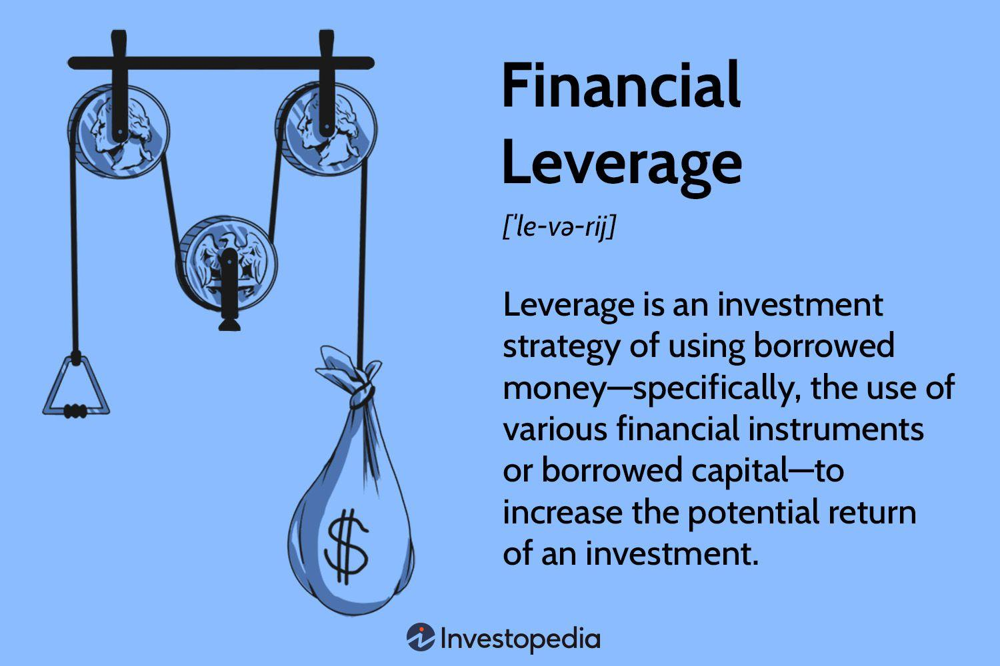

In the evolving landscape of finance, leveraging financial instruments and technology has become essential for optimizing returns and managing risks effectively. The rapid development of financial markets and technological advances has transformed the way financial strategies are conceived and implemented, making it increasingly important for both businesses and investors to stay agile and informed.

This article explores the critical concepts of financial leverage and leverage finance, which form the backbone of modern financial strategies. Financial leverage refers to the use of borrowed capital to increase the potential return on investment. By carefully structuring leverage, businesses and investors can access greater opportunities and enhance overall capital efficiency without necessarily diluting equity. However, the use of leverage is accompanied by the dual-edge risk of amplifying losses, which necessitates a sound understanding and prudent management of such strategies.



Furthermore, the integration of technology, particularly algorithmic trading, revolutionizes finance by employing computer programs to execute trades at optimal times, significantly reducing human error and increasing efficiency. Algorithmic trading, when combined with leverage, can amplify the effectiveness of trading strategies by expanding market exposure. Yet, it is imperative that such systems incorporate robust risk management to mitigate the potential dangers associated with increased volatility and technological dependability.

In this article, we will explore the intersection of financial leverage with algorithmic trading, discussing how these technological advancements can be leveraged to enhance financial strategies while considering the inherent risks and challenges. This dynamic blend of financial techniques and technological prowess underscores the importance of a well-balanced approach that leverages both strategic insight and cutting-edge technology to navigate the complexities of modern finance.

## Table of Contents

## Understanding Financial Leverage

Financial leverage refers to the strategic use of borrowed funds to increase the potential return on investment. It allows investors and companies to amplify the outcomes of their investment activities by employing debt, which can be crucial for a variety of financial endeavors. 

Businesses often leverage debt for various strategic purposes, such as expansions, acquisitions, or investing in new growth opportunities. By doing so, they reduce the need to raise capital through equity, which can dilute current shareholders' stakes. This approach can be particularly attractive in cases where the expected returns on an investment exceed the cost of borrowing. Mathematically, financial leverage can be expressed as:

$$
\text{Leverage Ratio} = \frac{\text{Total Debt}}{\text{Shareholders' Equity}}
$$

A higher leverage ratio indicates a greater proportion of debt in the company's capital structure relative to its equity. 

Leverage is crucial in maximizing potential returns. For instance, if a company exhibits a high return on assets (ROA) greater than the [interest rate](/wiki/interest-rate-trading-strategies) on its borrowed funds, leverage can significantly boost the return on equity (ROE). The relationship between ROA, ROE, and financial leverage can be conceptualized using the DuPont equation:

$$
\text{ROE} = \text{ROA} \times \text{Equity Multiplier}
$$

Where the Equity Multiplier (a representation of leverage) is:

$$
\text{Equity Multiplier} = \frac{\text{Total Assets}}{\text{Total Equity}}
$$

However, financial leverage is not without risks. The same mechanism that amplifies gains can also exacerbate losses. If the investments financed through leveraged funds do not perform as expected, or if the cost of debt outweighs returns, businesses can face significant financial distress. Additionally, overly leveraged firms might suffer from reduced financial flexibility and the inability to secure further debt in future needs, as creditors may perceive them as high risk.

Therefore, while financial leverage offers the potential for enhanced returns, it requires careful balancing of its risks and rewards to ensure sustainable financial health. Companies must manage leverage prudently, considering financial conditions and market environments, to optimize their capital structure and investment outcomes efficiently.

## Importance of Financial Leverage in Finance

Financial leverage is a fundamental component in finance that enables both businesses and investors to access larger investment opportunities than would be possible through equity financing alone. By utilizing borrowed funds, companies can potentially accelerate growth, expand operations, and enhance their overall capital efficiency without the immediate need to raise equity, which may dilute their current shareholders' ownership stakes.

One of the key advantages of financial leverage is its ability to amplify profits. For instance, when a business uses debt to finance new initiatives or projects and these generate returns higher than the cost of the debt, the excess returns accrue to the equity holders, thus boosting the return on equity (ROE). To illustrate this, consider the basic formula for ROE:

$$
ROE = \frac{Net \ Income}{Shareholder's \ Equity}
$$

When leverage is involved, the company can invest more than its equity base, potentially increasing the net income numerator while maintaining the equity denominator, leading to a higher ROE. This scenario is attractive to businesses aiming to maximize shareholder value over short and long-term horizons.

For companies seeking growth through new projects or expansions, leverage offers a strategic advantage by allowing them to invest extensively without depleting their cash reserves or altering the equity structure. Such strategic deployment of leverage is often seen in sectors where heavy initial capital investments are necessary, like real estate, telecommunications, or utilities.

Despite these advantages, it is essential to recognize that financial leverage also carries risks. A venture's success hinges on its ability to generate returns that exceed the cost of debt; otherwise, it can lead to financial distress. The company must service its debt obligations regardless of economic conditions, which can strain cash flows during downturns. Therefore, prudent risk assessment and management are critical when integrating leverage into financial strategies.

In summary, financial leverage serves as a powerful tool in finance, offering the potential for enhanced profitability and capital efficiency. However, businesses must carefully balance the leverage employed with the accompanying risks, ensuring the leverage aligns with their financial goals and operating environment.

## Algorithmic Trading and Leverage

Algorithmic trading is a computationally driven approach where sophisticated algorithms and computer programs are used to execute trades at optimal times. This method is designed to minimize human error and capitalize on market inefficiencies. By systematically processing market data and implementing trading strategies at high speed, [algorithmic trading](/wiki/algorithmic-trading) can outperform manual trading in terms of execution precision and timing.

One of the key advantages of integrating financial leverage into algorithmic trading is the amplification of market exposure. Financial leverage allows traders to use borrowed funds to increase their trading positions beyond their existing capital. This potentially enhances the returns on investment when the trades are successful. The basic formula to calculate the leverage ratio is:

$$
\text{Leverage Ratio} = \frac{\text{Total Exposed Value}}{\text{Equity}}
$$

In practice, a trader employing a leverage ratio of 5:1 could control trading positions worth $500,000 with an equity of $100,000. The amplified exposure increases the potential profits from small market movements, which is particularly advantageous in algorithmic trading where high-frequency trades are made based on minute price differences.

However, leveraging algorithmic trading strategies demands precise risk management. The increased market exposure due to leverage enhances not only potential profits but also potential losses. Algorithmic systems must therefore incorporate risk management protocols to mitigate the downside risks. This is often achieved through setting stop-loss orders to automatically liquidate positions at predetermined loss thresholds, thus preventing excessive capital loss. Additionally, [volatility](/wiki/volatility-trading-strategies) targeting and position sizing are crucial elements of risk management in leveraged algorithmic trading. 

Implementing robust risk-control measures within the algorithm's code is critical. For instance, in Python, a simple risk control mechanism can be coded as follows:

```python
def calculate_position_size(balance, risk_per_trade, stop_loss_amount):
    # Calculate position size based on balance, risk per specified trade, and stop-loss distance
    return (balance * risk_per_trade) / stop_loss_amount

# Example usage:
balance = 100000  # account balance
risk_per_trade = 0.02  # risk 2% of account balance per trade
stop_loss_amount = 50  # stop-loss value in monetary units

position_size = calculate_position_size(balance, risk_per_trade, stop_loss_amount)
print(f"Position Size: {position_size}")
```

In summary, algorithmic trading combined with leverage provides an effective approach to maximizing market engagement and investment returns. Nonetheless, it necessitates comprehensive risk management strategies to safeguard against amplified losses and ensure long-term trading success.

## Benefits and Risks of Leveraged Algo Trading

Leveraged algorithmic trading offers distinct advantages and challenges that traders and firms must carefully consider. One significant benefit is the increase in market efficiency. By leveraging algorithmic strategies, traders can execute orders with greater speed and precision, reducing the bid-ask spread and enhancing overall [liquidity](/wiki/liquidity-risk-premium). This rapid execution capability ensures that markets operate smoothly, even at high trading volumes, thus maintaining stability.

Another notable benefit is the potential for higher profits through amplified positions. Leveraged trading allows participants to control a larger position size than their capital would typically permit. With sophisticated algorithms, traders can identify and capitalize on market inefficiencies or trends, maximizing their profit potential. For instance, algorithms can quickly detect and exploit [arbitrage](/wiki/arbitrage) opportunities that would be challenging to capture manually.

Despite these benefits, leveraged algo trading is not without risks. Market volatility poses a significant threat, as rapid price fluctuations can lead to substantial losses. When positions are leveraged, even small adverse price movements can exponentially increase potential losses, potentially wiping out the trader's capital. This is particularly concerning in high-frequency trading environments where decisions are executed in fractions of a second.

Technological dependencies also present inherent risks. Algorithmic trading relies on complex software and hardware systems, which can be prone to failures or glitches. Any malfunction, whether due to a coding error or hardware failure, can result in significant financial damage. Moreover, given the increasing reliance on digital infrastructure, there is a heightened risk of cybersecurity threats, which could compromise trading operations and data integrity.

To mitigate these risks, understanding and employing rigorous risk management strategies is crucial. These include setting stop-loss orders to limit potential losses and utilizing rigorous [backtesting](/wiki/backtesting) to ensure algorithm reliability under various market conditions. Additionally, maintaining robust technological systems with regular updates and security audits helps protect against potential operational failures.

In summary, while leveraged algorithmic trading offers promising opportunities for enhanced profits and market efficiency, it demands disciplined risk management and technological resilience to navigate its complex landscape effectively.

## Key Strategies in Leveraged Algo Trading

Trend-following, mean reversion, and arbitrage are recognized as fundamental strategies within the domain of algorithmic trading. Each strategy employs distinct mechanisms to extract profit from financial markets, and the inclusion of leverage serves to amplify their respective efficacies.

**Trend-following** capitalizes on sustained movements in market prices. This strategy assumes that securities which have been rising or falling steadily will continue to do so. Leveraged trend-following can amplify returns by acquiring larger positions than would otherwise be possible with unleveraged funds. The mathematical underpinning of this approach often involves moving averages or momentum indicators. Traders might utilize a simple moving average (SMA) or exponential moving average (EMA) to gauge entry and exit points. In Python, a basic implementation can be achieved using libraries like NumPy and Pandas:

```python
import pandas as pd

data = pd.read_csv('market_data.csv')
data['SMA'] = data['close'].rolling(window=20).mean()

# Determine buy signal
data['Signal'] = 0
data.loc[data['close'] > data['SMA'], 'Signal'] = 1
data.loc[data['close'] < data['SMA'], 'Signal'] = -1
```

**Mean reversion** looks to profit from price corrections. The underlying principle is that prices will eventually return to an average or historical mean. Algorithmic trading strategies exploit deviations from this average. Leverage can intensify potential returns when prices snap back to the mean, but also increase risk if prices continue to deviate. Mathematical models commonly used include z-scores or Bollinger Bands, which help determine whether a security is statistically overbought or oversold.

**Arbitrage** exploits price discrepancies in different markets or instruments. Leveraging this strategy could significantly enhance profitability by increasing the scale of trades. Transactions must be executed swiftly, often requiring high-frequency trading systems to minimize latency. The law of one price, which assumes that identical assets should trade at the same price in efficient markets, is a central premise. Computational algorithms hunt for these anomalies to execute timely trades.

A crucial component in all leveraged algorithmic strategies is risk management. Leverage increases exposure and thus magnifies both potential profits and losses. Stop-loss orders are vital tools in risk mitigation, allowing traders to cap losses when trades move unfavorably. For instance, a trader might set a stop-loss order at a specific percentage below a stock’s purchase price, ensuring automatic [exit](/wiki/exit-strategy) from the position under adverse conditions. In essence, effective risk management and the strategic use of leverage are indispensable for successful algorithmic trading in dynamic financial markets.

## Conclusion

Leverage finance and financial leverage are essential components in modern algorithmic trading strategies, offering pathways to significant financial growth while presenting distinct challenges. By employing leverage, traders and investors can amplify their market positions, thereby enhancing the potential for higher returns. This ability to manage larger positions with relatively smaller capital outlays enables firms and individual investors to exploit opportunities that would otherwise remain outside their reach.

However, the prospects for financial gain are accompanied by inherent risks. Leverage can increase exposure to market volatility, potentially leading to substantial losses if trading positions are not carefully managed. The requirement for precise risk management is paramount to mitigate these risks, especially in algorithmic trading, where decisions are executed rapidly and automatically.

A balanced approach is vital for effectively harnessing leverage. This involves integrating sophisticated risk management techniques, such as stop-loss orders and position sizing, with algorithmic trading strategies like trend-following or mean reversion. Furthermore, the role of technology cannot be overstated. Advanced computing and data analytics provide the necessary tools to process vast amounts of market data and execute trades with high precision and speed.

In conclusion, while leveraging financial instruments in algorithmic trading provides significant opportunities for profit, the approach must be tempered with robust risk management practices. By combining strategic insight with technological prowess, traders can optimize the benefits of leverage while minimizing potential drawbacks, ultimately achieving a sustainable financial growth trajectory.

## References & Further Reading

[1]: Bergstra, J., Bardenet, R., Bengio, Y., & Kégl, B. (2011). ["Algorithms for Hyper-Parameter Optimization."](https://papers.nips.cc/paper/4443-algorithms-for-hyper-parameter-optimization) Advances in Neural Information Processing Systems 24.

[2]: ["Advances in Financial Machine Learning"](https://www.amazon.com/Advances-Financial-Machine-Learning-Marcos/dp/1119482089) by Marcos Lopez de Prado

[3]: ["Evidence-Based Technical Analysis: Applying the Scientific Method and Statistical Inference to Trading Signals"](https://www.amazon.com/Evidence-Based-Technical-Analysis-Scientific-Statistical/dp/0470008741) by David Aronson

[4]: ["Machine Learning for Algorithmic Trading"](https://github.com/PacktPublishing/Machine-Learning-for-Algorithmic-Trading-Second-Edition) by Stefan Jansen

[5]: ["Quantitative Trading: How to Build Your Own Algorithmic Trading Business"](https://www.amazon.com/Quantitative-Trading-Build-Algorithmic-Business/dp/0470284889) by Ernest P. Chan