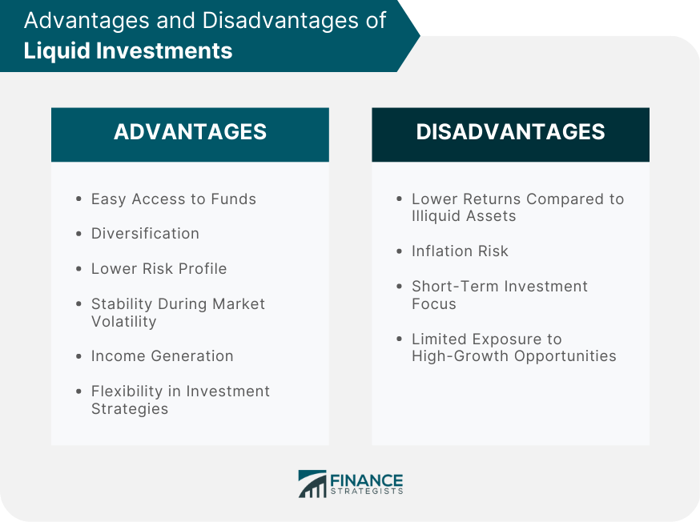

## Table of Contents

## What is financial liquidity?

Financial liquidity refers to how easily an asset can be converted into cash without affecting its market price. Cash is the most liquid asset because it's already in the form that can be used for transactions. Other assets, like stocks or bonds, are also considered liquid because they can be sold quickly on the market. However, some assets, like real estate or certain types of equipment, are less liquid because it takes more time and effort to sell them.

Liquidity is important for individuals and businesses because it helps them meet their short-term financial obligations. For example, a business needs enough liquid assets to pay its bills, employees, and suppliers on time. If a company can't convert its assets into cash quickly, it might face financial difficulties. Similarly, an individual might need liquid assets to cover unexpected expenses or emergencies. Understanding liquidity helps in managing finances effectively and avoiding potential cash flow problems.

## What are the main asset classes?

The main asset classes are cash, stocks, bonds, and real estate. Cash is the most straightforward asset because it's money you can use right away. Stocks are pieces of ownership in a company. When you buy stocks, you're hoping the company does well and the value of the stock goes up. Bonds are like loans you give to a company or government. They promise to pay you back with interest over time. Real estate is property like houses or land that you can own and might increase in value.

Another important asset class is commodities, which include things like gold, oil, and agricultural products. These are physical goods that people need or use every day. Commodities can be a good way to diversify your investments because their prices can move differently from stocks and bonds. Lastly, there are alternative investments like art, wine, or cryptocurrencies. These can be riskier and less predictable but might offer high returns. Understanding these asset classes helps you build a balanced investment portfolio that matches your financial goals and risk tolerance.

## How does liquidity affect different asset classes?

Liquidity affects different asset classes in important ways. Cash is the most liquid asset because it's already money you can spend right away. Stocks and bonds are also pretty liquid because you can sell them quickly on the stock market. But, the price you get might go up or down depending on how many people want to buy them at that time. Real estate, like houses or land, is much less liquid. It can take a long time to sell a house, and you might have to lower the price to find a buyer quickly.

Commodities like gold or oil can be liquid if there's a big market for them, but sometimes they can be hard to sell quickly too. Alternative investments, like art or cryptocurrencies, are often the least liquid. It can be really tough to find someone to buy your art piece or a rare coin at the price you want, and it might take a long time. So, when you're thinking about investing, it's important to know how easy or hard it will be to turn your assets into cash when you need it.

## What are the advantages of high liquidity in assets?

High [liquidity](/wiki/liquidity-risk-premium) in assets makes it easier to get cash when you need it. For example, if you own stocks that are easy to sell, you can quickly turn them into money if you have an emergency or a good investment opportunity. This is really helpful because it means you don't have to worry about waiting a long time to get your money. It's like having a safety net that lets you handle unexpected expenses or take advantage of new chances without stress.

Another advantage of high liquidity is that it helps keep the value of your assets stable. When you can sell something quickly, you're less likely to have to sell it for a lot less than it's worth. This is important because it means your investments are safer and more predictable. For businesses, having liquid assets means they can pay their bills on time and keep running smoothly, which is crucial for their success.

## What are the disadvantages of low liquidity in assets?

Low liquidity in assets can make it hard to get your money when you need it. Imagine you own a house and you need cash quickly. It might take months to find a buyer, and you might have to sell it for less than you want. This can be a big problem if you have bills to pay or an emergency. It's like being stuck with something valuable but not being able to use it when you need to.

Another disadvantage of low liquidity is that it can make your investments riskier. If you can't sell your asset quickly, its value can go up and down a lot. This means you might lose money if you have to sell it in a hurry. For businesses, low liquidity can cause big problems too. If they can't turn their assets into cash fast enough, they might not be able to pay their employees or suppliers on time, which can lead to financial trouble.

## Can you provide examples of highly liquid assets?

Cash is the most liquid asset you can have. It's money you can use right away to buy things or pay bills. If you have cash in your wallet or in your bank account, you can spend it whenever you need to. It's like having a tool that's always ready to use.

Stocks and bonds are also pretty liquid. If you own stocks, you can sell them on the stock market and get your money quickly. The same goes for bonds, which are like loans you give to a company or government. They promise to pay you back with interest, and you can sell them to someone else if you need cash fast. Just remember, the price you get might change depending on how many people want to buy them at that time.

## Can you provide examples of less liquid assets?

Real estate is a good example of a less liquid asset. If you own a house or land, it can take a long time to find someone who wants to buy it. You might have to wait months or even years, and you might have to lower the price to sell it quickly. This can be a problem if you need money fast for an emergency or to pay bills.

Another example of a less liquid asset is art. If you own a painting or a sculpture, it can be hard to find someone who wants to buy it at the price you want. Art markets can be small and it might take a long time to sell your piece. This means you might not be able to turn your art into cash when you need it.

Commodities like gold can also be less liquid depending on the market. While gold can be sold relatively quickly in large markets, it might not be as easy in smaller or less active markets. You might have to wait or accept a lower price to sell it fast.

## How do liquidity levels impact investment strategies?

Liquidity levels play a big role in how you plan your investments. If you need money quickly, you'll want to have more liquid assets like cash or stocks. These are easy to sell and turn into cash when you need it. For example, if you might need money for an emergency or to take advantage of a new investment opportunity, having liquid assets helps you stay ready and flexible. It's like having a safety net that lets you handle unexpected situations without stress.

On the other hand, if you're investing for the long term and don't need to get your money out quickly, you might choose less liquid assets like real estate or art. These can offer higher returns over time, but they're harder to sell fast. This means you need to be okay with waiting and not needing that money right away. Understanding your liquidity needs helps you build a balanced investment strategy that matches your goals and how soon you might need your money.

## What are the liquidity risks associated with various asset classes?

Liquidity risk is the chance that you won't be able to sell your asset quickly enough or at a good price when you need to. For cash, there's almost no liquidity risk because you can use it right away. Stocks and bonds have some liquidity risk because their prices can change a lot depending on how many people want to buy them at that time. If lots of people are selling and not many are buying, you might have to sell your stocks or bonds for less than you hoped.

Real estate has a big liquidity risk. It can take a long time to find someone who wants to buy your house or land, and you might have to lower the price to sell it quickly. This can be a problem if you need money fast for an emergency. Art and other collectibles also have high liquidity risk because it's hard to find buyers who are willing to pay what you want. Commodities like gold can have liquidity risk too, especially in smaller markets where it might be harder to sell them quickly without losing value.

## How can investors measure the liquidity of an asset?

Investors can measure the liquidity of an asset by looking at how quickly and easily it can be turned into cash. For stocks and bonds, one way to check this is by looking at the trading volume, which shows how many shares or bonds are bought and sold every day. If the trading volume is high, it means there are a lot of buyers and sellers, so it's easier to sell your asset quickly without losing much value. Another way is to look at the bid-ask spread, which is the difference between the highest price someone is willing to pay and the lowest price someone is willing to sell for. A smaller spread means the asset is more liquid because it's easier to agree on a price.

For less liquid assets like real estate or art, measuring liquidity can be trickier. You can look at how long it usually takes to sell similar properties or artworks in the market. If it takes a long time, that's a sign of low liquidity. You can also check how much the price has to be lowered to sell the asset quickly. If you need to drop the price a lot to find a buyer, that shows there's more liquidity risk. Understanding these measures helps investors know how easy or hard it will be to get their money back when they need it.

## What strategies can be used to manage liquidity in a portfolio?

Managing liquidity in a portfolio means making sure you can get your money when you need it. One way to do this is by keeping some of your money in cash or in assets that are easy to sell, like stocks or bonds. This way, if you have an emergency or a good chance to invest, you can quickly turn those assets into cash. It's like having a safety net that helps you stay ready for anything.

Another strategy is to spread your money across different types of assets. This is called diversification. By having some money in liquid assets and some in less liquid ones like real estate or art, you can balance your need for quick cash with the chance to make more money over time. It's important to think about when you might need your money and plan your investments so you can get it when you need it without losing too much value.

## How do global economic conditions influence asset liquidity?

Global economic conditions can really change how easy it is to sell your assets. When the economy is doing well, people feel more confident and are more likely to buy things like stocks, bonds, and real estate. This means these assets become more liquid because there are more buyers, so you can sell them quickly without losing much value. But if the economy is struggling, people might be scared to spend money. They might not want to buy stocks or houses, making it harder and slower to sell your assets. This is when liquidity goes down, and you might have to sell your assets for less than you hoped.

Different parts of the world can affect each other's economies too. For example, if a big country like the United States has a financial problem, it can make people all over the world worried about their money. This can lead to less buying and selling in markets everywhere, which means lower liquidity for assets. On the other hand, if global trade is going well and countries are working together, it can make people feel more secure and willing to invest, which boosts liquidity. So, keeping an eye on what's happening around the world can help you understand how easy or hard it might be to turn your assets into cash.

## How can liquidity be combined with algorithmic trading?

Algorithmic trading significantly benefits from financial liquidity, as it facilitates rapid trade execution, which is crucial for strategies that depend on narrow price spreads and minimal market impact. In an environment where high liquidity is prevalent, algorithms can operate with greater efficiency, executing a high [volume](/wiki/volume-trading-strategy) of trades in milliseconds. This high-frequency trading capability allows traders to exploit minor price discrepancies, thereby optimizing profit margins.

Analyzing liquidity trends is a vital aspect of [algorithmic trading](/wiki/algorithmic-trading), as it informs decision-making processes, helping algorithms adapt to varying market conditions. By incorporating liquidity metrics into their models, algorithms can determine the most opportune times to enter or [exit](/wiki/exit-strategy) positions. For instance, during periods of high liquidity, the cost of executing trades tends to be lower due to tighter bid-ask spreads. Conversely, in low-liquidity conditions, wider spreads and slippage can increase transaction costs, necessitating more conservative strategies.

To illustrate this, consider the liquidity-adjusted capital asset pricing model (LCAPM). The LCAPM incorporates a liquidity [factor](/wiki/factor-investing) into the traditional CAPM, allowing for a more nuanced risk and return assessment:

$$
E(R_i) = R_f + \beta_i \times (E(R_m) - R_f) + \lambda \times L_i
$$

Where:
- $E(R_i)$ is the expected return of asset $i$.
- $R_f$ is the risk-free rate.
- $E(R_m)$ is the expected return of the market.
- $\beta_i$ is the beta of asset $i$.
- $\lambda$ is the liquidity risk premium.
- $L_i$ represents the liquidity of asset $i$.

This model allows algorithmic traders to consider both market risk and liquidity risk when developing their trading strategies.

The integration of algorithmic trading with liquidity trends underlines the importance of robust financial systems. Such systems must be capable of handling the rapid data processing and complex calculations inherent in algorithmic trading while adapting to dynamic liquidity conditions. These capabilities ensure that trading algorithms can sustain performance even when market conditions change, thereby maximizing returns and enhancing stability in financial markets. Continued advancements in technology and data analytics are expected to further refine this integration, presenting new opportunities and challenges in the financial sector.

## References & Further Reading

[1]: Amihud, Y., & Mendelson, H. (1986). ["Asset pricing and the bid-ask spread."](https://www.sciencedirect.com/science/article/pii/0304405X86900656) Journal of Financial Economics, 17(2), 223-249.

[2]: Hasbrouck, J. (2003). ["Intraday Price Formation in US Equity Markets: An Empirical Analysis of the Evolution of Liquidity."](https://onlinelibrary.wiley.com/doi/10.1046/j.1540-6261.2003.00609.x) Journal of Financial Markets.

[3]: Lopez de Prado, M. (2018). ["Advances in Financial Machine Learning."](https://www.amazon.com/Advances-Financial-Machine-Learning-Marcos/dp/1119482089) Wiley.

[4]: Chan, E. P. (2008). ["Quantitative Trading: How to Build Your Own Algorithmic Trading Business."](https://github.com/ftvision/quant_trading_echan_book) Wiley.

[5]: Jovanovic, F., & Le Gall, P. (2001). ["Does financial learning converge towards the use of automatic procedures?"](https://www.scirp.org/reference/referencespapers?referenceid=3282533)00039-3) European Journal of Operational Research, 130(2), 221-236.