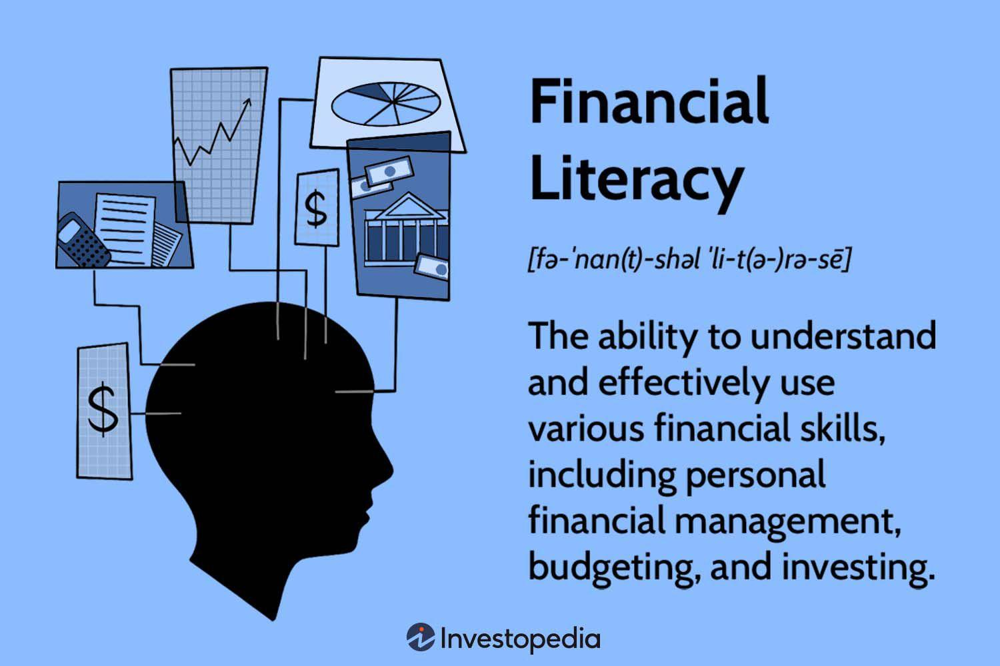

## Table of Contents

## What is financial literacy and why is it important?

Financial literacy is knowing how to manage money well. It includes understanding how to make a budget, save money, invest, and handle debt. It's like learning the rules of a game, but the game is about using money smartly.

Being financially literate is important because it helps people make good choices with their money. When you understand financial basics, you can avoid problems like too much debt or not saving enough for the future. It also means you can reach your money goals, like buying a house or retiring comfortably. In short, financial literacy gives you the tools to live a more secure and happy life.

## Who are independent financial advisors and what role do they play in financial literacy?

Independent financial advisors are professionals who help people manage their money. They are called "independent" because they do not work for a big bank or a specific company that sells financial products. Instead, they give advice that is best for the person they are helping, not for the company they work for. This means they can look at all the options out there and pick the ones that fit best for their clients.

These advisors play a big role in improving financial literacy. They teach people about money, like how to make a budget, save for the future, and invest wisely. By working with an independent financial advisor, people can learn a lot about managing their money. The advisor can explain things in a simple way and help their clients make smart choices. This can lead to a better understanding of money and help people feel more confident about their financial decisions.

## What are some common financial literacy initiatives offered by independent advisors?

Independent financial advisors often run workshops and seminars to teach people about money. These events cover topics like making a budget, saving for the future, and understanding investments. The advisors explain these ideas in a way that's easy to understand, so everyone can learn, no matter how much they already know about money. By attending these sessions, people can ask questions and get advice that fits their own situation.

Another common initiative is one-on-one financial coaching. In these sessions, an advisor sits down with a person to look at their money situation closely. They help set goals, like saving for a house or paying off debt, and make a plan to reach those goals. The advisor might also teach the person how to use tools like budgeting apps or investment accounts. This personal attention helps people feel more confident and in control of their finances.

Some advisors also offer online resources, like blogs, videos, and webinars. These tools are great for people who want to learn at their own pace. They cover a wide range of topics and can be a good starting point for someone who is new to financial literacy. By using these resources, people can slowly build up their knowledge and start making better money choices.

## How can beginners benefit from financial literacy programs offered by independent advisors?

Beginners can really benefit from financial literacy programs offered by independent advisors because these programs are designed to help people who are just starting to learn about money. The advisors explain things in a simple way, so it's easy to understand even if you don't know much about finance yet. They cover the basics, like how to make a budget, save money, and start investing. By going to workshops or one-on-one sessions, beginners can ask questions and get advice that fits their own situation. This personal touch helps them feel more confident and less overwhelmed by money matters.

Another big advantage is that independent advisors can help beginners set and reach their financial goals. Whether it's saving for a new car, paying off student loans, or planning for retirement, the advisor works with the beginner to create a plan that makes sense for them. They might also introduce tools like budgeting apps or investment accounts, showing how to use them step by step. Over time, as beginners learn more and make better money choices, they become more financially independent and secure.

## What are the key components of a successful financial literacy program?

A successful financial literacy program needs to be easy to understand and helpful for everyone, no matter how much they already know about money. It should start with the basics, like making a budget and saving money. The program should also teach about more complex topics, like investing and managing debt, but explain these in a way that's simple and clear. Hands-on activities, like using budgeting apps or playing money games, can make learning fun and practical. It's also important for the program to let people ask questions and get advice that fits their own situation.

Another key part of a successful financial literacy program is setting goals and making plans to reach them. This could be saving for a big purchase, like a house, or planning for retirement. The program should help people figure out what they want and show them the steps to get there. It's also helpful if the program keeps people motivated by checking in on their progress and celebrating their successes. By doing all these things, a financial literacy program can help people feel more confident and in control of their money.

## How do independent advisors tailor financial literacy initiatives to different demographics?

Independent advisors know that people are different, so they make their financial literacy programs fit each group's needs. For young people just starting out, advisors might focus on basics like budgeting and saving for things like a car or school. They use fun ways to teach, like games or apps, to keep young people interested. For families, advisors might talk about saving for their kids' education or planning for a family vacation. They help families set up a budget that works for everyone in the house. For older folks, advisors might focus on retirement planning and how to make their money last. They explain things in a way that makes sense for someone who's thinking about their later years.

Advisors also think about where people live and what their culture is like. For example, if they're working with a community that doesn't speak English well, they might offer classes in the local language or use pictures and simple words to explain things. If people in a certain area have jobs that pay less, advisors might focus on ways to save money and stretch every dollar. By understanding what's important to different groups, advisors can make sure their financial literacy programs really help people improve their money skills and reach their goals.

## What are the challenges faced by independent advisors in promoting financial literacy?

Independent advisors face a few big challenges when they try to teach people about money. One big problem is that many people don't know about financial literacy programs or don't think they need them. It can be hard to get people interested and to show them how important it is to learn about money. Advisors have to work hard to reach out to different groups and explain why financial literacy matters. They also need to find ways to make their programs fun and easy to understand, so people will want to join and keep learning.

Another challenge is that people come from all different backgrounds and have different needs. Advisors have to figure out how to help everyone, from young people just starting out to older folks planning for retirement. This means they need to change their programs to fit each group. It can be tough to find the right way to teach everyone, especially when some people might not speak English well or have less money to work with. Advisors have to be creative and patient to make sure their programs work for everyone.

Lastly, independent advisors often have to compete with big banks and financial companies that have more money and resources. These big companies can run big ad campaigns and offer fancy programs that might seem more appealing. Independent advisors have to find ways to stand out and show that their advice is better because it's not tied to selling products. It's a challenge to build trust and show people that they can get good, honest help from an independent advisor.

## How can technology be utilized by independent advisors to enhance financial literacy initiatives?

Independent advisors can use technology to make their financial literacy programs better and reach more people. They can create online courses and webinars that people can watch from home. This means someone living far away can still learn about money without having to travel. Advisors can also use apps and games to teach money skills in a fun way. For example, a budgeting app can help people see where their money goes and plan how to save more. By using technology, advisors can make learning about money easier and more interesting for everyone.

Another way technology helps is by letting advisors give personal advice to many people at once. They can use chatbots to answer common questions and help people with simple money problems. This frees up time for advisors to focus on giving detailed advice to people who need it more. Also, advisors can use social media to share quick tips and remind people about important money dates, like when to file taxes. By using technology, advisors can keep people interested and help them learn about money in a way that fits their busy lives.

## What metrics are used to measure the effectiveness of financial literacy programs?

Independent advisors use different ways to see if their financial literacy programs are working well. One way is to look at how much people know about money before and after the program. They might give a test at the start and then another one at the end to see if people learned more. Another way is to see if people are doing better with their money. Advisors might check if people are saving more, paying off debt, or making smarter choices with their money. They can also ask people if they feel more confident about handling their finances.

Another important measure is how many people keep coming back to the program. If a lot of people return for more classes or advice, it means they find the program helpful. Advisors also look at feedback from people who took part in the program. If people say they liked it and learned a lot, that's a good sign. By using these different ways to measure success, advisors can see what's working and what they might need to change to help people even more.

## How do independent advisors collaborate with other organizations to expand their financial literacy initiatives?

Independent advisors often work with other groups like schools, community centers, and non-profits to reach more people and make their financial literacy programs better. By teaming up with schools, advisors can teach students about money early on, which can help them make good choices later in life. Community centers are great places to hold workshops and classes because they're easy for local people to get to. Non-profits can help advisors reach people who might not have a lot of money or resources. By working together, advisors can share their knowledge and tools with more people and make a bigger difference.

Sometimes, independent advisors also partner with businesses and government agencies. Businesses might sponsor programs or offer space for classes, which can help advisors reach employees and teach them about money at work. Government agencies can provide funding or support to make programs bigger and more effective. These partnerships help advisors get the word out about financial literacy and show people how important it is to learn about money. By working with others, advisors can create a strong network that helps more people understand and manage their finances better.

## What are some advanced topics covered in financial literacy programs for expert audiences?

For people who already know a lot about money, financial literacy programs might talk about things like advanced investing and tax planning. Advisors might teach about different ways to invest, like stocks, bonds, and real estate. They explain how to build a good investment portfolio that fits someone's goals and how much risk they want to take. Advisors also help with tax planning, showing ways to save money on taxes by using things like retirement accounts or other special tax rules. These topics are more complex, but advisors break them down so people can understand and use them to make their money grow.

Another advanced topic is estate planning, which is about what happens to someone's money and things after they pass away. Advisors help people make plans to pass on their wealth in the best way possible, often using tools like wills and trusts. They also talk about how to manage money during retirement, making sure it lasts as long as needed. These discussions can include strategies for drawing money from different accounts and planning for things like healthcare costs. By covering these advanced topics, financial literacy programs help experts make the most of their money and plan for the future.

## What future trends are expected in financial literacy initiatives by independent advisors?

In the future, independent advisors will likely use more technology to teach people about money. They might use apps and online tools to make learning easier and more fun. For example, they could create games that teach about investing or budgeting. They might also use [artificial intelligence](/wiki/ai-artificial-intelligence) to give personal advice to more people at once. This means someone could get help with their money questions anytime, even if they can't meet with an advisor in person. By using technology, advisors can reach more people and help them learn about money in a way that fits their busy lives.

Another trend will be working with schools and communities to teach young people about money early on. Advisors might partner with schools to add financial literacy classes to the curriculum. This way, kids can start learning about money from a young age and make good choices when they grow up. Advisors will also work more with community groups to reach people who might not have a lot of money or resources. By teaming up with different groups, advisors can help more people understand and manage their finances better. These trends show that financial literacy will become even more important and accessible in the future.

## References & Further Reading

[1]: Lusardi, A., & Mitchell, O. S. (2014). ["The Economic Importance of Financial Literacy: Theory and Evidence."](https://www.nber.org/papers/w18952) Journal of Economic Literature, 52(1), 5-44.

[2]: Pompian, M. M. (2012). ["Behavioral Finance and Wealth Management: How to Build Optimal Portfolios That Account for Investor Biases"](https://onlinelibrary.wiley.com/doi/book/10.1002/9781119202400). Wiley Finance.

[3]: Massey, A. P., Montoya, M., & Graza, G. (2007). ["Financial Literacy: An Essential Objective for Finance Education"](https://www.jstor.org/stable/4132333). Review of Financial Studies.

[4]: Barberis, N., & Thaler, R. (2003). ["A Survey of Behavioral Finance."](https://www.sciencedirect.com/science/article/pii/S1574010203010276) In G. Constantinides, M. Harris, & R. Stultz (Eds.), Handbook of the Economics of Finance.

[5]: Hull, J. C. (2017). ["Risk Management and Financial Institutions"](https://books.google.com/books/about/Risk_Management_and_Financial_Institutio.html?id=1J1QDwAAQBAJ). Wiley.

[6]: Allen, F., & Carletti, E. (2008). ["The Role of Liquidity in Financial Crises."](https://papers.ssrn.com/sol3/papers.cfm?abstract_id=1268367) In Financial Crises: Understanding the Post-War Experience.

[7]: Grinold, R. C., & Kahn, R. N. (2000). ["Active Portfolio Management: A Quantitative Approach for Producing Superior Returns and Controlling Risk"](https://www.amazon.com/Active-Portfolio-Management-Quantitative-Controlling/dp/0070248826) (2nd ed.). McGraw-Hill.