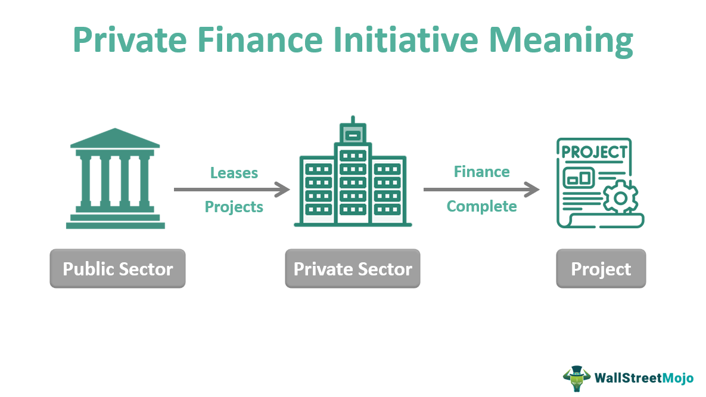

Financial literacy is the ability to understand and effectively use various financial skills, including personal financial management, budgeting, and investing. In today's fast-paced economy, financial literacy is more important than ever as individuals are required to make complex financial decisions in a landscape characterized by evolving financial products and services. A strong foundation in financial literacy enables individuals to make informed choices, optimize their financial resources, and ultimately achieve economic security.

Financial education, comprising formal courses, workshops, and other resources, plays a crucial role in enhancing financial literacy. This education equips individuals with the knowledge and skills necessary to navigate the financial system and make prudent investment and savings decisions. By integrating financial education in schools and continuing it through adult learning programs, a more financially savvy population is cultivated, empowering individuals to improve their financial well-being.

Independent financial advisors are professionals who provide unbiased financial guidance tailored to an individual's specific circumstances and goals. Unlike advisors tied to financial institutions, independent advisors operate without conflicts of interest, which makes their advice particularly valuable. They help bridge the gap in financial literacy by crafting personalized strategies that consider clients' unique financial situations. Their relevance has grown as more individuals seek personalized advice to navigate complex financial landscapes.

Algorithmic trading, a method of executing orders using automated and pre-programmed trading instructions, has increasingly penetrated the financial markets. This technology leverages advanced statistical models and algorithms to make trading decisions at speeds and frequencies that human traders cannot match. As a result, algorithmic trading now accounts for a significant portion of volume traded in global markets, introducing both opportunities and challenges for investors.

The objective of this article is to explore the intersections of financial literacy, education, independent financial advisors, and algorithmic trading. By examining how these elements interact, the article aims to provide insights into how individuals can better manage their financial affairs and make informed investment decisions in a rapidly changing financial world.

## Table of Contents

## Understanding Financial Literacy

Financial literacy is the ability to understand and use various financial skills, including personal financial management, budgeting, and investing. It encompasses a wide range of skills, knowledge, and attitudes essential for making informed economic decisions, ensuring a solid foundation for financial well-being. The core components of financial literacy include budgeting, which involves planning income and expenditures to optimize financial outcomes; saving, a strategy for setting aside money for future use or emergencies; and investing, the process of allocating resources, typically money, to generate income or profit.

Globally, financial literacy remains a significant issue, with varying levels of understanding observed across different regions. According to the Standard & Poor's Global Financial Literacy Survey, only 33% of adults worldwide are financially literate, meaning they have the ability to make informed judgments and effective decisions regarding the use and management of money. High-income countries tend to have a better literacy rate, whereas developing nations struggle due to limited access to education and financial services.

Financial literacy plays a vital role in personal finance management and economic well-being. Individuals with a strong grasp of financial concepts are more likely to manage their finances effectively, avoid debt, and build a secure future. This literacy helps individuals make sound investment decisions, plan for retirement, and navigate financial markets with greater confidence. Additionally, it leads to better national economic outcomes, as financially literate populations are more likely to participate in financial markets and contribute to economic growth.

Numerous initiatives are targeting the improvement of financial literacy across different age groups. Governments, non-profit organizations, and educational institutions worldwide have developed programs to enhance financial understanding. For children and adolescents, integrating financial education into school curricula is crucial for establishing a strong foundation early in life. For adults, various resources such as workshops, online courses, and community programs are available to promote lifelong financial education. Programs like the OECD's International Network on Financial Education (INFE) provide comprehensive guidelines and resources, aimed at improving financial literacy globally across all demographics.

## The Role of Financial Education

Financial education is a critical component in developing the skills necessary for making informed financial decisions. It serves as the groundwork for individuals to understand the basic principles of money management, including budgeting, saving, investing, and borrowing. By equipping people with the knowledge to navigate complex financial products and services, financial education fosters confidence and competence in their financial dealings.

A variety of platforms and resources are available to support financial education. Online courses, offered by organizations such as Coursera, edX, and Khan Academy, provide convenient and accessible learning opportunities on topics ranging from personal finance basics to advanced investment strategies. Workshops hosted by financial institutions, community organizations, and educational nonprofits offer hands-on experiences and professional guidance. Additionally, literature including [books](/wiki/algo-trading-books), articles, and research papers remain valuable resources for self-guided learning.

Early financial education plays a significant role in shaping lifelong financial habits and attitudes. Integrating financial literacy into school curricula from a young age helps students develop a foundational understanding of money management. Programs like the National Endowment for Financial Education's High School Financial Planning Program are designed to fit seamlessly into existing curricula, providing students with essential knowledge before they enter adulthood. Studies have shown that students exposed to financial education in school are more likely to save, budget, and have better credit scores in adulthood.

Adult financial education extends these opportunities by offering lifelong learning in finance. Many adults seek financial knowledge through community college courses, seminars, and employer-sponsored programs. This type of education is particularly crucial as individuals face complex financial decisions at different life stages, such as buying a home, planning for retirement, or managing debt. Lifelong learning platforms like LinkedIn Learning and Udemy offer adults the chance to upgrade their financial literacy skills at their own pace, addressing their specific needs and circumstances.

In conclusion, financial education is the bedrock for informed financial decision-making, supporting individuals of all ages in achieving financial stability and security. Through diverse educational resources, early intervention, and continuous learning opportunities, people can enhance their understanding of financial concepts and apply them effectively in their daily lives.

## Independent Financial Advisors

Independent financial advisors (IFAs) play a crucial role in guiding individuals towards personal financial growth. Unlike financial advisors employed by banks or large financial institutions, IFAs operate independently, which allows them to provide unbiased advice that is not influenced by the sale of specific financial products. They are typically compensated through fees or commissions based on the services they provide, aligning their interests more closely with those of their clients.

One of the primary benefits of seeking advice from independent financial advisors compared to traditional institutions is the level of personalized service and objectivity. IFAs can offer a wide range of financial products because they are not bound by the offerings of a single institution. This independence enables them to tailor their advice to best suit the individual needs and goals of their clients, rather than prioritizing the promotion of proprietary products. This personalized strategy is particularly beneficial in bridging the gap in financial literacy.

Personalization in financial advising is achieved through comprehensive assessments of a client's financial situation, goals, risk tolerance, and life stage. Advisors often conduct detailed analyses of income, expenses, investments, and debts, using this data to craft tailored financial plans. For example, they may use retirement planning models to estimate the required savings for a comfortable retirement, or investment simulations to determine the most suitable asset allocation strategies. Through these personalized strategies, IFAs can help clients understand complex financial concepts, thereby improving their financial literacy.

The relationship between independent financial advisors and their clients is fundamentally built on trust. Clients must feel confident that the advice they receive is in their best interest and not influenced by external pressures. Trust is cultivated through transparency in fee structures, clear communication of strategies, regular updates, and responsiveness to client inquiries. Furthermore, IFAs engage in ongoing education to remain informed about the latest developments in financial markets and products, which enhances their ability to provide informed recommendations.

Customization of financial plans also reflects in how advisors adapt strategies to changing market conditions and life events. They provide continuous support and adjust financial plans as needed, helping clients navigate through significant events such as marriage, childbirth, or career changes. This adaptability not only aids in achieving immediate financial goals but also ensures long-term financial security.

In summary, independent financial advisors provide a valuable service to individuals seeking to enhance their personal financial management. Through personalized and objective advice, they bridge the gap in financial literacy and foster trustful relationships with clients, enabling the creation of highly customized and flexible financial strategies.

## Exploring Algorithmic Trading

Algorithmic trading, often referred to as algo trading, involves the use of computer algorithms to automate trading decisions and execute orders in financial markets. These algorithms are designed to follow a set of predetermined criteria, such as timing, price, or [volume](/wiki/volume-trading-strategy), to execute trades. Over the past few decades, [algorithmic trading](/wiki/algorithmic-trading) has gained prominence due to advancements in technology and the increasing availability of data, dramatically transforming traditional trading methods.

Technological innovations, particularly in computing power and data analysis capabilities, have been instrumental in evolving trading paradigms. Algorithms can analyze large datasets at unprecedented speeds, enabling traders to identify opportunities and execute trades more efficiently than human traders. Furthermore, high-frequency trading ([HFT](/wiki/high-frequency-trading-strategies)), a subset of algorithmic trading, utilizes algorithms to execute a large number of orders at extremely fast speeds, taking advantage of small price inefficiencies in the market.

The advantages of algorithmic trading for individual investors are significant. These include increased speed and accuracy of trades, reduced transaction costs due to minimized human intervention, and the ability to backtest strategies using historical data, which can enhance the probability of success. Additionally, algorithmic trading can operate 24/7 and manage multiple markets simultaneously, providing broader exposure and diversification.

However, algorithmic trading also poses several risks. Market [volatility](/wiki/volatility-trading-strategies) can be exacerbated by the sheer speed and volume of trades executed by algorithms, as evidenced by market events such as the "Flash Crash" of 2010. There's also the risk of technical failures or flawed algorithms leading to significant financial losses. Moreover, the complexity of algorithmic strategies can make them opaque and difficult to understand, potentially leading to misuse by inexperienced investors.

Given these potential pitfalls, financial literacy is crucial when considering algorithmic trading as an investment strategy. A solid understanding of financial principles and market dynamics can help investors to critically assess algorithmic strategies and their inherent risks. Equipping oneself with knowledge about the tools and technologies available in algorithmic trading can empower investors to make informed decisions and utilize these advanced trading methods responsibly.

## The Intersection of Financial Literacy, Advisors, and Algo Trading

Enhanced financial literacy plays a pivotal role in empowering individuals to leverage independent advisors effectively. By understanding financial concepts, individuals are better equipped to evaluate the advice provided by independent advisors, fostering a collaborative relationship where both parties can work towards customized financial strategies. Independent advisors often tailor their recommendations based on a client's financial knowledge and goals, and a well-informed client can actively participate in this process, leading to more robust and personalized financial planning.

Financial education is also critical in understanding and utilizing algorithmic trading responsibly. Algorithmic trading (algo trading) involves using computer algorithms to execute trades based on pre-defined criteria, which requires a solid understanding of both market mechanics and technological aspects. Financial education enables potential investors to grasp concepts such as data analysis, risk management, and market trends, which are essential for evaluating algo trading strategies. Understanding these principles helps individuals discern between effective algorithmic trading applications and overly risky or unsuitable systems.

There are several case studies highlighting individuals who have successfully integrated financial literacy, independent advisory services, and algorithmic trading for financial success. For instance, a study on high-net-worth individuals who use independent advisors revealed that those with higher financial literacy levels tend to achieve better investment outcomes. They leverage advisors to fine-tune automated trading strategies, ensuring that these strategies align with their overall financial goals and risk tolerance. This synergy between knowledge, advice, and automated strategies facilitates a comprehensive approach to wealth management.

Despite the potential benefits, there are challenges and barriers in combining these areas. One significant challenge is the varying levels of financial literacy among individuals, which can hinder effective communication with advisors and limit the understanding required to engage in algo trading. Additionally, the complexity of algorithmic trading can pose a barrier to entry for those without a background in technology or finance. 

To address these challenges, a multifaceted approach is recommended. Enhancing financial literacy through targeted education programs can bridge the knowledge gap, while independent advisors can offer tailored educational resources and workshops to help their clients understand automated trading systems. Furthermore, incorporating user-friendly interfaces in trading platforms and providing decision-support tools can make algo trading more accessible.

In conclusion, the intersection of financial literacy, independent financial advisors, and algorithmic trading offers substantial opportunities for individuals to manage their finances more effectively. By fostering financial education, supporting the advisor-client relationship, and simplifying access to trading technologies, individuals can navigate these complex areas with confidence and strategy.

## Future Trends and Opportunities

## Future Trends and Opportunities

Financial literacy and education are on the cusp of significant transformation due to advances in technology and evolving financial landscapes. As technology becomes more integrated into financial systems, several emerging trends are likely to shape the future of these domains.

### Emerging Trends in Financial Literacy and Education

1. **Digital Financial Education Platforms**: The proliferation of digital platforms dedicated to financial education is expected to continue. These platforms offer interactive and personalized learning experiences, making financial literacy more accessible to diverse audiences. Tools such as mobile apps and online courses can provide real-time feedback and adapt to individual learning paces, enhancing user engagement and knowledge retention.

2. **Gamification**: Applying game-like elements to financial education can increase motivation and reinforce learning outcomes. Gamification strategies, such as earning points for completing modules or advancing through levels by demonstrating financial competencies, are gaining traction.

3. **Virtual Reality (VR) and Augmented Reality (AR)**: These technologies can create immersive learning environments that simulate real-world financial scenarios. By experiencing these simulations, users—both novices and seasoned investors—can better understand the implications of their financial decisions.

### Innovations in Financial Advising and Trading Technology

1. **AI-Driven Financial Advisory Services**: Artificial intelligence (AI) offers personalized financial advice by analyzing vast quantities of data to identify trends and opportunities. Machine learning algorithms can provide insights tailored to individual financial situations, enhancing the traditional roles of financial advisors.

2. **Robo-Advisors**: These automated platforms use algorithms to manage investment portfolios with minimal human intervention, offering an affordable entry point for novice investors while providing sophisticated options for those more experienced. 

3. **Blockchain Technology**: Blockchain has the potential to improve transparency and security in financial transactions and records, appealing to both financial advisors and their clients. Its application in smart contracts can automate and thereby streamline asset management.

4. **Ethical and Sustainable Investing**: Increasingly, investors are looking towards investments that align with their ethical values. Advancements in data analytics and AI can assist in identifying and evaluating companies based on environmental, social, and governance (ESG) criteria, supporting this growing trend.

### Opportunities for Businesses and Educators

As these technological advances unfold, businesses and educators have unprecedented opportunities to enhance financial literacy and advising services:

- **Collaboration with Tech Firms**: By partnering with technology firms, educational institutions and financial advisors can integrate cutting-edge tools into their curricula and services. This may include AI tools for predictive analytics in financial markets or VR applications for interactive learning experiences.

- **Developing Comprehensive Curricula**: Educational entities can create comprehensive programs that focus on both traditional financial principles and modern financial technologies. These programs should be designed for continuous adaptation to incorporate evolving innovations.

- **Customized Advisory Services**: Leveraging AI and machine learning, businesses can create highly customized advisory services. These services can adapt to clients' changing financial circumstances and market conditions, improving satisfaction and outcomes.

### The Role of AI and Technology

AI and technology are reshaping financial decisions and education by providing sophisticated tools for analysis, prediction, and personalized learning. These technologies enable not only improved investment decisions but also more informed financial management practices:

- **Predictive Analytics**: By employing AI algorithms, predictive analytics can identify market trends and investment opportunities, empowering investors to make proactive, informed decisions.

- **Adaptive Learning Technologies**: In educational settings, AI can deliver personalized learning experiences by recognizing individual learning patterns and adjusting content delivery accordingly.

Overall, the integration of AI and advanced technology presents significant opportunities to improve financial literacy and empower individuals in managing their finances effectively. However, it also demands greater digital literacy and ongoing education to navigate these tools responsibly.

## Conclusion

In summary, the article underscores the crucial interplay between financial literacy, financial education, independent financial advisors, and algorithmic trading. Each component plays a pivotal role in empowering individuals with the skills and knowledge necessary to navigate the complexities of modern finance. Financial literacy acts as the cornerstone, enabling individuals to make sound financial decisions by understanding budgeting, saving, and investing. Education complements this by providing structured and continuous learning opportunities, which are essential in fostering well-rounded financial competencies.

Independent financial advisors enhance personal financial growth through customized strategies and trusted guidance, bridging the gap in financial literacy for many. Their expertise can be instrumental in translating complex financial concepts into actionable plans tailored to individual needs. On the other hand, algorithmic trading represents the technological advancements reshaping the trading landscape. While it offers significant potential for investors, it also necessitates a deep understanding and careful consideration of associated risks, emphasizing the need for robust financial literacy.

Given the fast-evolving financial landscape, it is imperative for individuals to engage in continuous learning and adaptation. Financial education should be a lifelong journey, where individuals strive to enhance their financial acumen and keep abreast of emerging trends and technologies. This ongoing process is vital not only for personal economic well-being but also for achieving broader financial goals.

To facilitate this, readers are encouraged to actively enhance their financial knowledge and seek professional financial advice when needed. Leveraging the expertise of independent advisors and embracing educational resources can significantly bolster one's financial planning and investment strategies. Ultimately, connecting financial literacy, education, advisors, and algorithmic trading positions individuals to navigate the financial world with confidence and competence, fostering a more secure and prosperous financial future.

## References & Further Reading

[1]: Lusardi, A., & Mitchell, O. S. (2014). ["The Economic Importance of Financial Literacy: Theory and Evidence."](https://www.nber.org/papers/w18952) Journal of Economic Literature, 52(1), 5-44.

[2]: Pompian, M. M. (2012). ["Behavioral Finance and Wealth Management: How to Build Optimal Portfolios That Account for Investor Biases"](https://onlinelibrary.wiley.com/doi/book/10.1002/9781119202400). Wiley Finance.

[3]: Massey, A. P., Montoya, M., & Graza, G. (2007). ["Financial Literacy: An Essential Objective for Finance Education"](https://www.jstor.org/stable/4132333). Review of Financial Studies.

[4]: Barberis, N., & Thaler, R. (2003). ["A Survey of Behavioral Finance."](https://www.sciencedirect.com/science/article/pii/S1574010203010276) In G. Constantinides, M. Harris, & R. Stultz (Eds.), Handbook of the Economics of Finance.

[5]: Hull, J. C. (2017). ["Risk Management and Financial Institutions"](https://books.google.com/books/about/Risk_Management_and_Financial_Institutio.html?id=1J1QDwAAQBAJ). Wiley.

[6]: Allen, F., & Carletti, E. (2008). ["The Role of Liquidity in Financial Crises."](https://papers.ssrn.com/sol3/papers.cfm?abstract_id=1268367) In Financial Crises: Understanding the Post-War Experience.

[7]: Grinold, R. C., & Kahn, R. N. (2000). ["Active Portfolio Management: A Quantitative Approach for Producing Superior Returns and Controlling Risk"](https://www.amazon.com/Active-Portfolio-Management-Quantitative-Controlling/dp/0070248826) (2nd ed.). McGraw-Hill.