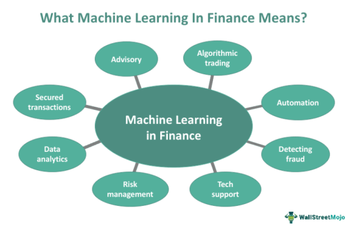

Financial machine learning is fundamentally transforming the landscape of algorithmic trading by providing sophisticated tools and methodologies to enhance decision-making processes. As technology continues to evolve, traders are leveraging machine learning algorithms to interpret vast datasets, uncovering intricate patterns and trends that inform more accurate trading decisions. These advancements are not only improving the precision of trading strategies but also enabling rapid adaptation to fluctuating market conditions.

This article will present an overview of key projects and initiatives that are at the forefront of financial machine learning, offering insights into their practical applications in algorithmic trading. By examining popular tools and methodologies that have been successfully implemented, traders and developers are equipped with the knowledge required to refine their own strategies. Through the use of advanced analytical techniques, these projects offer the potential to optimize trade performance, manage risk more effectively, and ultimately improve outcomes in the trading sector.



The integration of machine learning with trading platforms presents numerous benefits, such as automation of complex tasks, enhanced risk assessment, and the ability to backtest trading strategies against historical data. By analyzing how these machine learning projects function in real-world scenarios, the article aims to provide a comprehensive understanding of their efficacy and impact. With this understanding, both traders and developers can stay competitive in the fast-paced world of financial markets, leveraging cutting-edge technology to achieve superior trading results.

## Table of Contents

## The Role of Machine Learning in Algo Trading

Machine learning models have become increasingly pivotal in [algorithmic trading](/wiki/algorithmic-trading), allowing the analysis of extensive datasets to identify patterns and trends that are not immediately apparent through traditional methods. By leveraging the computational power of modern [machine learning](/wiki/machine-learning) algorithms, traders can develop predictive models that automate trading strategies, enhancing efficiency and effectiveness.

One of the primary advantages of integrating AI into trading systems is the ability to execute trades more rapidly and manage risks with greater precision. Machine learning algorithms can be trained using historical market data to recognize potential trading opportunities. This allows traders to backtest strategies to determine their feasibility and adjust parameters for optimal results. For instance, given a dataset containing features $X$ and target variable $y$, a trader can implement a predictive model like a random forest or [neural network](/wiki/neural-network) to forecast future price movements:

```python
from sklearn.ensemble import RandomForestRegressor
model = RandomForestRegressor(n_estimators=100, random_state=42)
model.fit(X_train, y_train)
predictions = model.predict(X_test)
```

The ability of machine learning algorithms to adapt in real-time is critical in today’s dynamically changing markets. Unlike static rule-based systems, machine learning models can learn from new data and adjust their strategies accordingly. This real-time adaptability ensures that trading decisions remain aligned with current market conditions. This automatic adjustment is essential for maintaining competitiveness and mitigating risks associated with market [volatility](/wiki/volatility-trading-strategies).

In conclusion, the application of machine learning in algorithmic trading is transforming traditional trading paradigms. By processing extensive data and adjusting strategies dynamically, machine learning models facilitate faster execution, enhanced risk management, and increased profitability. These capabilities underline the critical role of machine learning in the ongoing evolution of financial markets.

## Key Financial Machine Learning Projects

Hudson and Thames' 'mlfinlab' stands out as a comprehensive library designed explicitly for implementing financial machine learning models. This toolkit offers a range of functions that assist in the development and testing of sophisticated trading strategies. It includes implementations of multiple algorithmic components—such as sampling methods, labeling, and feature importance—that are integral to the construction of machine learning models in financial contexts. By consolidating these tools, 'mlfinlab' empowers developers and traders to focus on crafting models that are both efficient and robust.

Another notable project is the Awesome-Quant-Machine-Learning-Trading repository, which encompasses a curated collection of resources, libraries, and strategies tailored for quant trading. This repository acts as a centralized hub for information, offering everything from basic educational materials to complex algorithmic frameworks. The collaborative nature of this project encourages continuous enhancements, allowing traders to remain at the forefront of technological advancements in trading methodologies.

The Financial Data Science's CFDS project exemplifies the integration of cutting-edge technologies such as Python and PyTorch for data analysis and predictive modeling. This initiative focuses on leveraging [deep learning](/wiki/deep-learning) techniques to derive actionable insights from financial datasets. By using PyTorch, a powerful machine learning library, CFDS enables rapid prototyping and experimentation, facilitating the creation of models that capitalize on intricate patterns within the data.

These projects collectively provide an essential foundation for traders eager to build and refine their algorithmic trading strategies. Their open-source nature ensures they are constantly evolving, with contributions from a global community of developers and researchers driving innovation. This dynamic is particularly beneficial in the fast-paced world of finance, where adaptability and continuous improvement are crucial for sustaining competitive edges.

## Common Machine Learning Techniques in Trading

Common machine learning techniques in trading involve the application of various algorithms and models to analyze and interpret financial data for better decision-making. These techniques focus on uncovering patterns, identifying trends, and predicting market movements through quantitative methods. 

Linear regression is a fundamental statistical method applied to model the relationship between a dependent variable and one or more independent variables. In the context of trading, linear regression is employed to forecast prices and returns, providing insight into potential future market behavior. The formula for a simple linear regression model is:

$$
Y = \beta_0 + \beta_1 X + \epsilon
$$

where $Y$ is the dependent variable, $X$ is the independent variable, $\beta_0$ and $\beta_1$ are coefficients, and $\epsilon$ is the error term. Logistic regression, on the other hand, is used for binary classification problems, such as determining the probability of a stock price going up or down.

In addition to regression techniques, algorithms like Random Forests and Support Vector Machines (SVM) are extensively used for classification and regression tasks in trading. Random Forests, a type of ensemble learning method, constructs multiple decision trees during training and outputs the mode of classes (classification) or mean prediction (regression) of the individual trees. This approach enhances prediction accuracy and handles overfitting. SVMs are effective in high-dimensional spaces and are used to construct hyperplanes that can segregate different classes in a dataset. In trading, SVMs can help in predicting stock movements by analyzing historical price data.

Deep learning, an advancement of traditional neural networks, is increasingly employed for complex data analysis in trading. Techniques such as neural networks and Long Short-Term Memory networks (LSTMs) are particularly useful for processing sequential data and predicting stock prices based on historical sequence patterns. LSTMs are a type of recurrent neural network that can capture long-term dependencies within data series, making them suitable for time-series analysis.

Other techniques like K-Nearest Neighbors (KNN) and decision trees are instrumental in forming robust trading strategies. KNN is a non-parametric method used for classification and regression by analyzing the 'k' nearest data points in the dataset. Decision trees, on the other hand, provide a hierarchical structure for making tailored trading decisions based on various input features. Decision trees are easy to interpret and can model complex decision boundaries.

By leveraging these methods, traders and developers can enhance the efficiency and profitability of trading activities. The collective use of these techniques allows for better risk assessment, prediction accuracy, and market adaptability, thus equipping traders with the tools to navigate complex financial environments.

## Implementation Challenges

The implementation of machine learning models in algorithmic trading presents several challenges, foremost among them being data quality and availability. Accurate model performance hinges on high-quality and comprehensive datasets. Inadequate or noisy data can result in misleading patterns, ultimately impairing the model's effectiveness. Financial data often comes with noise, missing values, and other discrepancies that require thorough preprocessing and cleaning to ensure the reliability of outputs.

One critical issue encountered in financial machine learning is the risk of overfitting. Overfitting occurs when a model learns the training data too well, capturing noise and random fluctuations rather than the underlying distribution. As a result, such models perform excellently on past data but fail to generalize to new, unseen data. Techniques such as cross-validation, regularization, and pruning are commonly employed to mitigate overfitting. For instance, using cross-validation involves dividing the data into multiple subsets and training the model iteratively to ensure it doesn't overly conform to any specific dataset portion.

Integrating and optimizing these machine learning models also demands specialized skills and resources. Expertise in data science, finance, and programming is essential to develop robust models capable of processing financial data. This integration process often involves writing complex algorithms, tuning hyperparameters, and leveraging computational resources for extensive processing power. Resource-intensive tasks such as hyperparameter optimization and model selection can be executed using Python libraries like Scikit-learn, which provides tools for model validation and performance tuning.

Moreover, the dynamic nature of financial markets necessitates continuous monitoring and updating of machine learning models. As new data becomes available and market conditions shift, models require recalibration to maintain their predictive validity and performance. This involves setting up feedback loops where models are periodically retrained with fresh data, adjusting their parameters to better fit the evolving market landscape. Automated systems can be established to constantly evaluate model performance and trigger updates when a deviation from expected results is detected.

Addressing these challenges is critical for algorithmic trading success. Implementing a robust data management system, employing techniques to counteract overfitting, and ensuring the models are adaptable to real-time market changes can significantly enhance trading strategies. By overcoming these hurdles, financial institutions and traders can achieve consistent and reliable outcomes in their trading endeavors, harnessing the full potential of machine learning technologies.

## Real-World Applications and Case Studies

Taaffeite Capital Management exemplifies the integration of machine learning in financial markets through its proprietary systems, which enable fully systematic trading strategies. These advanced systems are designed to leverage historical and real-time data, enabling the identification of profitable trading opportunities without human intervention. The automation facilitated by machine learning provides Taaffeite Capital with the ability to execute trades rapidly and with precision, optimizing performance and minimizing human error.

In another notable example, the Man Group's AHL Dimension program illustrates the substantial role [artificial intelligence](/wiki/ai-artificial-intelligence) plays in asset management. With over $5.1 billion in assets under management, the program employs sophisticated AI algorithms to enhance trading outcomes. By incorporating vast data sets, these algorithms can make informed predictions regarding market trends and asset movements, thus facilitating superior decision-making and risk management processes.

Several case studies further underscore the efficacy of machine learning in predicting market movements. For instance, the deployment of machine learning models in trading desks has proven successful in identifying patterns that traditional methodologies might overlook. These models utilize historical price data, trading volumes, and even sentiment analysis derived from news and social media to forecast market direction with considerable accuracy.

Organizations deploying machine learning in trading benefit significantly from reduced latency and enhanced trade execution efficiencies. By automating key components of the trading process, firms can respond to market conditions more swiftly than human traders, gaining a competitive advantage in timing and execution. This improvement is critical in high-frequency trading environments, where milliseconds can mean the difference between profit and loss.

The adaptability of machine learning algorithms is essential in navigating the dynamic and rapidly changing landscape of financial markets. These algorithms are capable of adjusting to new information in real-time, improving their predictions and recommendations continually. As a result, they offer a powerful tool for handling the inherent volatility and uncertainty that characterize modern financial trading environments.

In summary, the real-world application of machine learning in financial markets provides not only a strategic advantage in terms of performance and efficiency but also propels the industry towards more advanced and systematic trading methodologies.

## Future Trends in Financial Machine Learning

As financial markets continue to evolve, emerging trends in machine learning are poised to enhance algorithmic trading strategies significantly. One major trend is the advancement of sophisticated trading models driven by continuous technological improvements. These models are being shaped by the integration of [alternative data](/wiki/best-alternative-data) sources, which expand the breadth of information available for better decision-making and refined predictive capabilities. Alternative data, such as social media sentiment, news analytics, and satellite imagery, offers new dimensions of market insight that can be harnessed alongside traditional financial data to improve forecasting accuracy.

Enhanced algorithms are increasingly focused on combining market sentiment with quantitative data. Techniques such as natural language processing (NLP) are employed to assess the sentiment expressed in news articles and social media posts, translating qualitative information into actionable trading signals. The ability to quantify market sentiment provides traders with a comprehensive view of market dynamics, leading to more nuanced strategy formulation and execution.

Another key trend is the development of explainable AI, which seeks to address the opacity often associated with complex machine learning models, commonly referred to as "black-box models." Explainable AI aims to make the decision-making process of these models more transparent, allowing traders and analysts to understand the rationale behind specific predictions or actions. This transparency is crucial for building trust in AI-driven trading systems and ensuring compliance with regulatory standards.

The future of financial machine learning also promises a greater adoption of AI across the trading landscape. As machine learning frameworks and computational power become more accessible, even smaller trading firms can leverage AI-driven models for competitive advantage. Innovations in cloud computing and distributed systems are facilitating the deployment and scaling of sophisticated models, enabling quicker adaptation to changing market conditions.

In summary, continued advancements in technology are set to drive more sophisticated trading models through the integration of diverse data sources, the coupling of market sentiment with quantitative analysis, the emergence of explainable AI, and wider AI adoption across different sectors of financial markets. These trends hold the potential to reshape trading strategies, offering improved performance and a more nuanced understanding of financial markets.

## Conclusion

Financial machine learning is fundamentally transforming algorithmic trading, offering innovative ways to navigate and capitalize on the complex dynamics of financial markets. By harnessing the capabilities of artificial intelligence, traders and financial institutions are achieving unprecedented levels of accuracy and operational efficiency. This transformation is largely driven by the ability of machine learning algorithms to process and analyze vast datasets, identifying intricate patterns that traditional methods might overlook.

As technology continues to evolve, the role of machine learning in trading strategies is set to expand further. The integration of AI-driven models allows for adaptive strategy formulation, enabling traders to respond rapidly to market fluctuations and emerging trends. These advancements are not only improving the precision of trading decisions but also optimizing execution processes, contributing to overall market efficiency.

Collaboration between financial experts and data scientists is proving to be crucial in driving future developments. This interdisciplinary approach ensures that machine learning models are not only technologically advanced but also grounded in financial theory and market realities. Such collaboration promotes the creation of robust models that can withstand the volatility and unpredictability of financial markets.

For trading professionals seeking to maintain a competitive edge, leveraging insights from financial machine learning becomes essential. As the industry continues to grow and adopt these technologies, continuous learning and adaptation will be vital for success. By effectively implementing machine learning into their trading frameworks, market participants can enhance their strategies and secure a performance advantage in an increasingly competitive landscape.

## FAQs

What are the common machine learning techniques used in financial trading?

In financial trading, a range of machine learning techniques are employed to analyze data and develop predictive models. Linear regression is frequently used for predicting future prices by modeling the relationship between a dependent variable and one or more independent variables. Logistic regression is utilized for classification tasks, such as predicting whether a stock price will go up or down. Random Forests and Support Vector Machines (SVMs) are popular for both classification and regression due to their ability to model complex relationships. Deep learning, particularly through neural networks and Long Short-Term Memory (LSTM) networks, is used for capturing intricate patterns in sequential data. Finally, K-Nearest Neighbors (KNN) and decision trees provide straightforward methods for developing trading strategies based on historical datasets.

How can machine learning models be implemented to reduce trading risks?

Machine learning models mitigate trading risks by using predictive analytics to foresee market trends and adjust trading strategies accordingly. Models can be trained on historical data to identify patterns indicative of potential risks, allowing traders to make informed decisions. Regular [backtesting](/wiki/backtesting) of these strategies against historical data is essential to validate their effectiveness. Moreover, ensemble methods such as bagging and boosting can increase model robustness by combining multiple models to improve prediction accuracy. Implementing these models in real-time trading platforms enables proactive risk management, and continually updating the models with new data ensures adaptability to market changes.

What are some challenges of using machine learning in algorithmic trading?

Several challenges complicate the use of machine learning in algorithmic trading. Data quality and availability can significantly impact model performance, as inaccurate or incomplete data can lead to flawed predictions. Overfitting is another concern, where models perform well on historical data but fail to generalize to unseen data, rendering them ineffective in live trading scenarios. The integration and optimization of machine learning models require specialized knowledge and technical resources, which can be a barrier for many traders. Additionally, continuously monitoring and updating models to align with current market conditions is necessary to maintain their effectiveness over time.

How do real-world applications demonstrate the effectiveness of these systems?

Real-world applications provide ample evidence of the effectiveness of machine learning in financial trading. For instance, Taaffeite Capital utilizes proprietary machine learning systems to conduct fully systematic trading, illustrating the successful application of AI in executing trades with high precision. Similarly, the Man Group's AHL Dimension program employs AI to manage substantial assets, showcasing the scalability and efficiency improvements offered by machine learning models. These implementations highlight how reduced latency and enhanced trade execution efficiencies can be achieved, as machine learning systems adapt and react to market movements swiftly and accurately.

What future trends should traders be aware of in the context of financial machine learning?

The future of financial machine learning is set to see several significant developments. Technological advancements are expected to drive the creation of more sophisticated trading models. The integration of alternative data sources, such as social media sentiment and other unconventional market indicators, will likely enhance decision-making processes. Future algorithms might focus on combining quantitative data with market sentiment to improve prediction accuracy. Additionally, developments in explainable AI could provide better insights into black-box models, increasing their transparency for traders. Collectively, these trends suggest a growing reliance on AI and machine learning within the trading landscape, making them critical capabilities for traders aiming to remain competitive.

## References & Further Reading

[1]: Bergstra, J., Bardenet, R., Bengio, Y., & Kégl, B. (2011). ["Algorithms for Hyper-Parameter Optimization."](https://papers.nips.cc/paper/4443-algorithms-for-hyper-parameter-optimization) Advances in Neural Information Processing Systems 24.

[2]: ["Advances in Financial Machine Learning"](https://www.amazon.com/Advances-Financial-Machine-Learning-Marcos/dp/1119482089) by Marcos Lopez de Prado

[3]: ["Evidence-Based Technical Analysis: Applying the Scientific Method and Statistical Inference to Trading Signals"](https://www.amazon.com/Evidence-Based-Technical-Analysis-Scientific-Statistical/dp/0470008741) by David Aronson

[4]: ["Machine Learning for Algorithmic Trading"](https://github.com/PacktPublishing/Machine-Learning-for-Algorithmic-Trading-Second-Edition) by Stefan Jansen

[5]: ["Quantitative Trading: How to Build Your Own Algorithmic Trading Business"](https://books.google.com/books/about/Quantitative_Trading.html?id=j70yEAAAQBAJ) by Ernest P. Chan