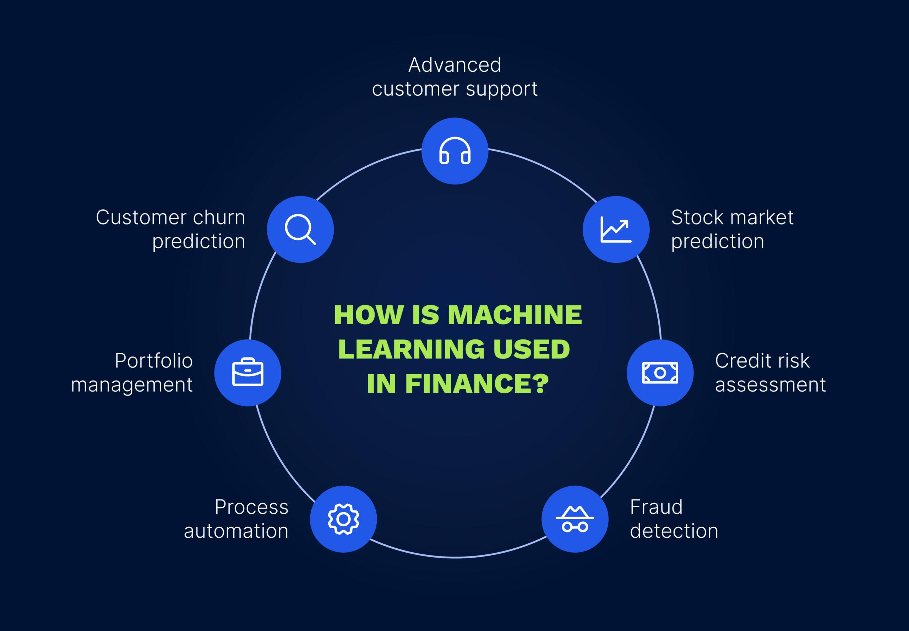

## Table of Contents

## What is financial machine learning?

Financial machine learning is a way of using computers and math to make better decisions about money. It combines ideas from finance, like how markets work and how to invest, with machine learning, which is a type of artificial intelligence. This helps people predict things like stock prices or how much risk there is in an investment. By using lots of data and special computer programs, financial machine learning can find patterns that humans might miss.

One big use of financial machine learning is in trading. Traders use it to make quick decisions about buying and selling stocks or other financial products. The computer can look at tons of information very fast and decide what to do next. This can help traders make more money and avoid big losses. But it's not just for trading; it can also help with things like managing a portfolio of investments or figuring out how much money a bank should keep in reserve.

Even though financial machine learning can be very helpful, it's not perfect. Sometimes the predictions can be wrong, and it can be hard to understand why the computer made a certain decision. Also, the financial world changes a lot, so the computer needs to keep learning and updating its knowledge. Despite these challenges, many people in finance are using machine learning to try to get an edge in the market.

## How does machine learning differ from traditional statistical methods in finance?

Machine learning and traditional statistical methods both help us understand and predict things in finance, but they do it in different ways. Traditional statistical methods often start with a clear idea about what we want to predict and how different factors might affect it. For example, we might think that a company's stock price depends on its earnings and then use [statistics](/wiki/bayesian-statistics) to see if that's true. These methods are good at testing specific ideas and giving us clear answers, but they can be limited if we don't know exactly what to look for.

On the other hand, [machine learning](/wiki/machine-learning) is more flexible and can find patterns in data that we might not have thought of. It's like letting the computer explore the data and figure out what's important on its own. This can be really useful in finance because there are so many factors that can affect things like stock prices, and it's hard for us to think of all of them. Machine learning can handle lots of different types of data at once and keep learning as new information comes in, which is great for the fast-changing world of finance.

However, machine learning isn't perfect. Sometimes it can be hard to understand why the computer made a certain prediction, which can be a problem in finance where clear explanations are important. Also, machine learning models can sometimes find patterns that don't really mean anything or that only work for a short time. So while machine learning can be a powerful tool, it's often best used alongside traditional statistical methods to get the best results.

## What are the basic data types used in financial machine learning?

In financial machine learning, we use different types of data to help us make predictions and decisions. The main types of data are numbers, like stock prices and trading volumes, and dates, which tell us when things happened. These numbers and dates are often organized into tables where each row is a different time, like a day or a minute, and each column is a different piece of information, like the opening price or the closing price of a stock.

Another important type of data is text, like news articles or company reports. Computers can read these texts and turn them into numbers that can be used in machine learning models. This helps us understand how news or other information might affect the stock market. There's also data from pictures or videos, like satellite images of a company's factories or stores, but this type of data is used less often in finance.

Finally, we have what's called categorical data, which are labels or categories, like the industry a company is in or whether a stock went up or down. This type of data helps us group things together and see patterns across different groups. All these types of data together help financial machine learning models learn and make better predictions about the financial world.

## What are some common machine learning algorithms used in finance?

In finance, people use different machine learning algorithms to help them make decisions. One popular algorithm is called linear regression. It's used to predict things like stock prices by looking at how different factors, like a company's earnings, affect the price. Another common algorithm is called decision trees. They work by splitting data into smaller groups based on different rules, which helps to make predictions about whether a stock will go up or down. Random forests are also used a lot. They are like a bunch of decision trees working together, which makes the predictions more accurate.

Another type of algorithm used in finance is called support vector machines (SVMs). They are good at finding patterns in data and can be used to predict things like whether a loan will be paid back or not. Neural networks are also very popular. They are like a computer's way of thinking and can learn from lots of data to predict stock prices or detect fraud. Lastly, there's something called clustering, which groups similar data together. This can be used to find groups of stocks that move in similar ways, which helps with managing a portfolio.

These algorithms are just a few examples of the many tools used in financial machine learning. Each one has its own strengths and can be used for different tasks in finance. By using these algorithms, people in finance can make better predictions and decisions, which can help them make more money and avoid big losses.

## How can machine learning be applied to predict stock prices?

Machine learning can help predict stock prices by looking at lots of data and finding patterns that might be hard for people to see. For example, it can use numbers like a company's earnings, the price of the stock in the past, and even things like news articles or social media posts. The computer can learn from this data to make guesses about what the stock price might do next. One way to do this is by using something called a neural network, which is like a computer's way of thinking. It can learn from lots of examples and get better at predicting over time.

Another way machine learning can predict stock prices is by using algorithms like linear regression or decision trees. Linear regression can look at how different factors, like a company's earnings, affect the stock price and use that to make predictions. Decision trees work by splitting the data into smaller groups based on different rules, which helps to guess if the stock price will go up or down. These methods can be combined with other techniques, like random forests, which use many decision trees together to make more accurate predictions. By using these tools, machine learning can help people in finance make better guesses about where stock prices might be headed.

## What is the role of feature engineering in financial machine learning?

Feature engineering is a very important part of financial machine learning. It's about taking the data we have and turning it into something that the computer can use to make predictions. For example, if we're trying to predict stock prices, we might start with raw data like the price of the stock each day, the company's earnings, and news articles. Feature engineering helps us turn this raw data into useful pieces of information, called features, that the machine learning model can understand. This might mean calculating things like the average price over the last month or figuring out how often certain words appear in news articles about the company.

The goal of feature engineering is to make the data as helpful as possible for the machine learning model. Good features can help the model find patterns in the data that it might miss otherwise. For example, instead of just looking at the daily stock price, we might create a feature that shows how much the price has changed from one day to the next. This can give the model a better idea of the stock's [volatility](/wiki/volatility-trading-strategies). By carefully choosing and creating these features, we can help the machine learning model make more accurate predictions about things like stock prices or how much risk there is in an investment.

## How do you handle overfitting in financial machine learning models?

Overfitting is when a machine learning model learns too much from the data it's trained on and doesn't work well with new data. In finance, this can be a big problem because the model might make bad predictions about stock prices or other things. To stop overfitting, we can use a few tricks. One way is to use more data for training. The more data the model sees, the better it can understand the real patterns and not just the quirks in the training data. Another way is to make the model simpler. If the model is too complicated, it might start to fit the training data too closely. By keeping it simpler, it's less likely to overfit.

Another trick to handle overfitting is called cross-validation. This means we split the data into different parts and train the model on some parts while testing it on others. By doing this many times, we can see how well the model works on data it hasn't seen before. If it does well, it's less likely to be overfitting. We can also use something called regularization, which adds a penalty to the model for being too complex. This helps keep the model from fitting the training data too closely and makes it better at working with new data. By using these methods, we can make sure our financial machine learning models are more reliable and useful.

## What are the challenges of implementing machine learning in high-frequency trading?

Implementing machine learning in high-frequency trading comes with some big challenges. One big challenge is the speed. High-frequency trading is all about making decisions very quickly, often in milliseconds. Machine learning models can be slow to make predictions, especially if they are complex. So, traders need to find a way to make these models fast enough to keep up with the fast pace of the market. Another challenge is the amount of data. High-frequency trading uses a lot of data, and machine learning models need to process this data quickly and accurately. If the data is too messy or there's too much of it, the models can get confused and make bad predictions.

Another challenge is overfitting. In high-frequency trading, the market can change very quickly, so a model that works well today might not work tomorrow. If a model overfits to the data it's trained on, it won't be able to adapt to these changes. Traders need to keep updating their models and use techniques like cross-validation and regularization to stop overfitting. Finally, there's the problem of understanding why the model made a certain decision. In high-frequency trading, it's important to know why a trade was made, but machine learning models can be hard to explain. Traders need to find ways to make these models more transparent so they can trust the decisions they're making.

## How can machine learning be used to manage portfolio risk?

Machine learning can help manage portfolio risk by looking at lots of data and finding patterns that might be hard for people to see. For example, it can use numbers like how much a stock goes up and down, how different stocks move together, and even things like news articles or social media posts. By learning from this data, machine learning can predict how risky a portfolio might be. It can also suggest ways to make the portfolio less risky, like by adding or removing certain stocks or by changing how much money is invested in different places.

One way machine learning helps with portfolio risk is by using something called clustering. This groups similar stocks together, which helps to see how different parts of the portfolio might move. Another way is by using algorithms like decision trees or neural networks. These can learn from past data to predict how much risk there might be in the future. By using these tools, people who manage portfolios can make better decisions about how to keep their investments safe and still make money.

## What are the ethical considerations in using machine learning for financial decision-making?

Using machine learning for financial decisions brings up some big ethical questions. One big worry is fairness. If the data used to train the machine learning models has biases, like if it only includes information from certain groups of people, the model might make unfair decisions. For example, it might not give loans to people from certain backgrounds, even if they deserve them. This can hurt people and make the financial world less fair. Another worry is privacy. Machine learning models often use a lot of personal data, like how much money someone makes or what they buy. If this data isn't kept safe, it can be used in bad ways, like stealing someone's identity.

Another ethical issue is transparency. It's important for people to understand why a machine learning model made a certain decision, especially in finance where decisions can have a big impact on people's lives. But machine learning models can be hard to explain, which makes it tough to trust them. Finally, there's the question of responsibility. If a machine learning model makes a bad decision, who should be blamed? The person who made the model, the company that used it, or the model itself? These ethical issues need to be thought about carefully to make sure machine learning is used in a way that's fair and good for everyone.

## How does one validate the performance of a financial machine learning model?

To check if a financial machine learning model is working well, we use something called validation. This means we split the data into two parts: one part to train the model and another part to test it. The training data helps the model learn, while the testing data shows us how well it can predict things it hasn't seen before. We look at how accurate the model's predictions are on the test data. If the model does well on the test data, it means it's not just memorizing the training data but actually understanding the patterns. We also use a technique called cross-validation, where we split the data into many parts and train and test the model many times. This helps us see if the model is reliable and not just getting lucky with one set of data.

Another way to validate the model's performance is by looking at how it does in the real world. We can use a smaller amount of real money to see if the model's predictions help us make good financial decisions. This is called [backtesting](/wiki/backtesting), where we use past data to see how the model would have done if we had used it then. If the model makes good decisions with real money, it's a sign that it's working well. But we also need to keep an eye on the model over time because the financial world changes a lot. If the model stops working well, we need to update it with new data and maybe change how it works. This helps make sure the model stays useful and trustworthy.

## What are the latest advancements in deep learning applied to financial markets?

Deep learning is making big steps in the world of finance. One cool thing is using something called recurrent neural networks (RNNs) and [long short](/wiki/equity-long-short)-term memory (LSTM) networks to predict stock prices. These models are good at understanding patterns over time, which is super important in finance where past prices can tell us a lot about the future. Another new thing is using deep learning to read news and social media. By understanding the words and feelings in these texts, deep learning can guess how the market might react to new information. This helps traders make better decisions faster.

Another advancement is using deep [reinforcement learning](/wiki/reinforcement-learning) to make trading strategies. This is like teaching a computer to play a game where it learns the best moves by trying different things and seeing what works. In finance, it can help find the best times to buy and sell stocks. Also, deep learning is being used to spot fraud and other bad things in financial data. By looking at lots of information, these models can find strange patterns that might mean someone is doing something wrong. All these new uses of deep learning are helping make finance smarter and safer.

## What types of machine learning techniques are used in trading?

Machine learning techniques have become pivotal in forming modern [algorithmic trading](/wiki/algorithmic-trading) strategies. Three prominent types of machine learning methods—supervised learning, unsupervised learning, and reinforcement learning—each offer unique advantages and applications within financial markets.

### Supervised Learning for Predictive Modeling

Supervised learning is extensively utilized in the development of predictive models in trading. The primary goal is to learn the mapping between input variables (features) and the target variable (output), which is often the future price or direction of an asset. Algorithms like linear regression, decision trees, and support vector machines are common in this domain, relying on historical labeled data to train models. For example, a linear regression model might aim to predict future stock prices based on historical prices, trading [volume](/wiki/volume-trading-strategy), and other financial indicators.

The predictive accuracy of supervised learning models is highly contingent on the quality of input data and feature engineering. Common metrics used to evaluate the performance of these models include Mean Squared Error (MSE) for regression tasks and accuracy or F1-score for classification tasks.

A simple linear regression can be represented mathematically as:

$$
Y = \beta_0 + \beta_1X_1 + \beta_2X_2 + \cdots + \beta_nX_n + \epsilon
$$

where $Y$ is the dependent variable, $X_1, X_2, ..., X_n$ are independent variables, $\beta_0, \beta_1, ..., \beta_n$ are coefficients, and $\epsilon$ is the error term.

### Unsupervised Learning for Clustering Financial Data

Unsupervised learning does not rely on labeled data, which makes it suitable for identifying patterns or structures within datasets. Clustering and dimensionality reduction are two primary applications in trading. Techniques such as K-means clustering and principal component analysis (PCA) aid in segmenting financial time series data, detecting outliers, or reducing noise.

For instance, clustering can be employed to group stocks with similar trading behaviors, which can then inform diversification strategies or the construction of a portfolio. Similarly, PCA can reduce the dimensionality of large datasets to ease computational loads while retaining critical information.

A basic K-means clustering algorithm partitions data into $K$ clusters by minimizing the variance within each cluster and is defined mathematically as:

$$
\arg \min_S \sum_{i=1}^K \sum_{x \in S_i} \|x - \mu_i\|^2
$$

where $S$ is the set of clusters and $\mu_i$ is the centroid of cluster $S_i$.

### Reinforcement Learning for Developing Trading Agents

Reinforcement learning (RL) differs significantly from supervised and unsupervised approaches as it is geared toward developing decision-making [agents](/wiki/agents). In trading, RL agents learn to make trades by interacting with an environment and receiving feedback in the form of rewards or penalties. Techniques like Q-learning and more advanced methods like deep Q-networks (DQN) have been successfully used to create trading policies that adapt dynamically to changing market conditions.

The RL framework involves defining states, actions, and rewards, where the agent’s objective is to maximize cumulative rewards over time. A typical reward in trading might be the profit or loss associated with a particular trading action over a given time period.

The core algorithmic principle in Q-learning involves updating a Q-value, which represents the expected utility of taking a given action in a given state, as per:

$$
Q(s, a) \leftarrow Q(s, a) + \alpha [r + \gamma \max_{a'} Q(s', a') - Q(s, a)]
$$

where $\alpha$ is the learning rate, $\gamma$ is the discount factor, $r$ is the reward, $s$ and $s'$ are the current and next states, respectively, and $a$ and $a'$ are actions.

The integration of these machine learning techniques into trading strategies is revolutionizing the way financial markets are analyzed, providing sophisticated tools for prediction, pattern recognition, and decision-making.

## What are the popular machine learning algorithms for trading?

Linear Regression, Random Forests, and Neural Networks are extensively utilized in the domain of algorithmic trading, serving as foundational building blocks for developing predictive models and automated strategies.

### Linear Regression

Linear Regression is one of the simplest and most widely used statistical methods for predictive analysis in trading. It aims to model the relationship between a dependent variable (usually a stock price or return) and one or more independent variables (such as economic indicators, company performance metrics, or technical indicators). The model estimates coefficients that represent the impact of each independent variable on the dependent variable, mathematically expressed as:

$$

Y = \beta_0 + \beta_1X_1 + \beta_2X_2 + \cdots + \beta_nX_n + \epsilon 
$$

Where:
- $Y$ is the dependent variable.
- $\beta_0$ is the intercept.
- $\beta_i$ are the coefficients for the independent variables $X_i$.
- $\epsilon$ is the error term.

**Use Cases**: Linear Regression is commonly used for price prediction and risk management. For instance, it helps in forecasting asset prices by analyzing historical price data and identifying trends, aiding traders in making informed buy or sell decisions. 

### Random Forests

Random Forests is an ensemble learning method that constructs multiple decision trees during training and outputs the mode of the classes (classification) or mean prediction (regression) of individual trees. This method offers robustness against overfitting and improves accuracy. 

**Use Cases**: In trading, Random Forests are applied for asset ranking and price prediction. They are particularly useful in capturing complex interactions between variables and can efficiently handle large datasets with higher dimensionality, making them suitable for applications like feature selection and anomaly detection in financial data.

### Neural Networks

Neural Networks, especially [deep learning](/wiki/deep-learning) models, have revolutionized trading strategies by enabling the capture of complex patterns in vast amounts of data. A standard [neural network](/wiki/neural-network) consists of an input layer, one or more hidden layers, and an output layer, with nodes (or neurons) interconnected through weights.

**Use Cases**: Neural networks are frequently used in constructing pricing models, algorithmic trading systems, and sentiment analysis. Their ability to process and analyze non-linear relationships makes them ideal for financial forecasting and modeling market behaviors under various scenarios.

### Emerging Trends

#### Deep Learning

Deep learning extends the capabilities of standard neural networks by adding depth to models, allowing for intricate pattern recognition and improved forecasting accuracy. Techniques such as Long Short-Term Memory (LSTM) networks are particularly effective in handling sequence prediction problems found in time-series analysis of stock prices.

#### Generative Adversarial Networks (GANs)

GANs, comprising a generative model and a discriminative model, have shown promise in finance for generating synthetic time-series data, which can be useful for stress testing trading models or simulating rare market conditions. This capability is invaluable for understanding potential market scenarios beyond historical data.

Overall, the adoption of these machine learning algorithms and the exploration of emerging trends are central to the advancement of algorithmic trading, offering sophisticated tools for enhancing predictive accuracy and creating robust trading strategies.

## References & Further Reading

[1]: Bergstra, J., Bardenet, R., Bengio, Y., & Kégl, B. (2011). ["Algorithms for Hyper-Parameter Optimization."](https://papers.nips.cc/paper/4443-algorithms-for-hyper-parameter-optimization) Advances in Neural Information Processing Systems 24.

[2]: ["Advances in Financial Machine Learning"](https://www.amazon.com/Advances-Financial-Machine-Learning-Marcos/dp/1119482089) by Marcos Lopez de Prado

[3]: ["Evidence-Based Technical Analysis: Applying the Scientific Method and Statistical Inference to Trading Signals"](https://www.amazon.com/Evidence-Based-Technical-Analysis-Scientific-Statistical/dp/0470008741) by David Aronson

[4]: ["Machine Learning for Algorithmic Trading"](https://github.com/stefan-jansen/machine-learning-for-trading) by Stefan Jansen

[5]: ["Quantitative Trading: How to Build Your Own Algorithmic Trading Business"](https://www.amazon.com/Quantitative-Trading-Build-Algorithmic-Business/dp/1119800064) by Ernest P. Chan