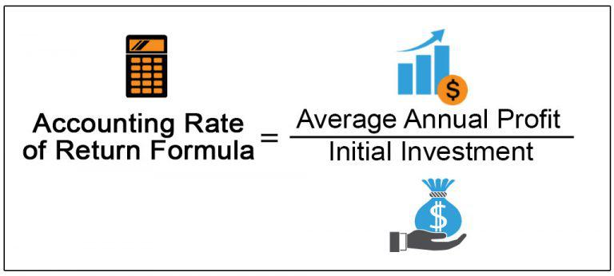

The financial management rate of return (FMRR) is a sophisticated metric employed to evaluate the performance of real estate investments. Unlike traditional methods such as the Internal Rate of Return (IRR), FMRR accounts for the complexities of investment duration and the risks inherent in cash flow variations over time. This makes FMRR particularly useful for analyzing Real Estate Investment Trusts (REITs), where investments often come with varied cash flows and timelines.

FMRR differs from IRR by integrating two key aspects: the duration of the investment and the associated risk factors. While IRR calculates the annualized rate of return by assuming reinvestment of interim cash flows at the same rate, FMRR incorporates the concept of different reinvestment and safe rates, providing a broader perspective on cash flow dynamics. For investors, particularly those engaged in Real Estate Investment Trusts (REITs), FMRR offers a reliable comparative platform across different investment opportunities, highlighting both risks and returns over varying timeframes.

This article will examine the concept of FMRR, exploring its unique calculation and implications in financial management, including its impact on algorithmic trading. Investors can leverage FMRR to understand potential returns more accurately and align their strategies with long-term financial goals. By prioritizing this metric, modern real estate investors can access deeper insights into their investment portfolios, ensuring decisions are informed by both present conditions and future expectations.

## Table of Contents

## What Is Financial Management Rate of Return (FMRR)?

The Financial Management Rate of Return (FMRR) is a sophisticated metric specifically devised to assess the overall performance of real estate investments. It evaluates cash inflows and outflows to provide a comprehensive understanding of an investment’s profitability over time. FMRR distinguishes itself from traditional metrics by using two distinct rates: the safe rate and the reinvestment rate. These rates are crucial for accounting for both the safety and potential returns of reinvested cash flows.

The safe rate is used to discount negative cash flows. It represents a low-risk interest rate, reflecting the cost of capital necessary to cover any immediate liabilities or negative cash positions. This rate is conservative, aiming to ensure sufficient liquidity in challenging financial periods, thus mitigating risk for the investor.

Conversely, the reinvestment rate applies to positive cash flows. It is generally higher than the safe rate, assuming the additional risk that accompanies long-term reinvestment. This reflects the potential for increased returns through reinvestment in other opportunities with varying risk profiles and durations. By recognizing these distinct cash flow patterns and their timing, FMRR provides a more nuanced picture compared to the Internal Rate of Return (IRR), which typically assumes a single reinvestment rate at the IRR itself.

This dual-rate mechanism allows FMRR to account for [liquidity](/wiki/liquidity-risk-premium) and time factors, making it a valuable tool for evaluating complex real estate investments that may exhibit varying cash flow patterns over different time periods. The incorporation of these elements offers a more realistic and detailed estimation of an investment's performance, appealing to investors who prioritize both liquidity management and maximizing return potential.

## The Financial Management Rate of Return Explained

The Financial Management Rate of Return (FMRR) offers a refined approach to evaluating investment performance by addressing some of the inherent limitations of the Internal Rate of Return (IRR). While IRR focuses on equating the net present value of cash inflows with outflows, it often falls short due to its assumption of constant reinvestment rates and potential oversights in liquidity assessments. FMRR, in contrast, seeks to provide a more realistic projection of returns, particularly by accounting for time sensitivity and liquidity considerations.

One of the core components of FMRR is the "safe rate", which represents a conservative [interest rate](/wiki/interest-rate-trading-strategies) applied to manage negative cash flows. This rate is usually aligned with low-risk investments, ensuring that essential outflows are met promptly. By using the safe rate, FMRR adapts to the need for immediate liquidity, distinguishing it from IRR, which might not [factor](/wiki/factor-investing) in the urgency of covering negative cash flows.

Additionally, FMRR employs reinvestment rates that are typically higher than the safe rate. These rates assume the possibility of investing surplus cash flows into opportunities that entail greater risk but also the potential for higher returns. This distinction acknowledges the variability in investment environments and offers a more comprehensive understanding of expected returns over a longer-term horizon.

The dual-rate system embedded in FMRR enhances the precision of return predictions across specified holding periods. By differentiating between immediate liquidity needs and strategic reinvestment potentials, FMRR supersedes the conventional IRR. This methodology enables investors to gain clearer insights into the temporal dynamics of their investments, ultimately guiding more informed decision-making. As such, FMRR proves to be an invaluable tool for those seeking a more accurate analysis of investment viability over time.

## Calculating FMRR

Calculating the Financial Management Rate of Return (FMRR) involves a detailed process that typically requires iterative computation. This complexity arises from the need to accurately account for the different cash flow patterns over time, which may vary due to changes in market conditions or investment strategies. FMRR calculations emphasize the integration of both safe rates and reinvestment rates, which are pivotal in providing a comprehensive evaluation of an investment.

To begin with, the process of calculating FMRR involves two primary steps: discounting and compounding. Discounting is applied to negative cash flows using the safe rate, which reflects a low-risk interest rate suitable for covering these immediate cash requirements. Conceptually, the safe rate addresses the need for liquidity by ensuring that any negative cash excursions are managed efficiently.

Conversely, positive cash flows are compounded at the reinvestment rate. This rate is inherently higher than the safe rate and reflects the potential returns from reinvesting positive cash flows over a more extended period. It assumes additional risks associated with holding investments for longer durations and aims to leverage potential growth opportunities in the market.

The culmination of these calculations provides an integrated approach to forecasting investment returns. Specifically, FMRR offers a unified measure that captures both the liquidity aspect of negative cash flow management and the potential growth from reinvesting positive cash flows. This dual assessment is essential to achieving a nuanced understanding of the real estate investment's performance and potential long-term viability.

Given the intricate nature of these calculations, specialized software tools are often employed to perform the necessary iterative computations. These tools assist in the precise application of discounting and compounding processes and handle the iteration required to isolate a singular FMRR value that accurately reflects the investment's potential.

Despite the sophistication of FMRR, investors often complement its use with simpler metrics. These additional metrics provide a more holistic view of financial analysis, ensuring that all dimensions of the investment landscape are covered. By doing so, investors can reconcile the detailed insights from FMRR with broader, more general financial trends and patterns.

In summary, while the process of calculating FMRR is complex, its ability to merge elements of liquidity management and reinvestment strategies makes it an invaluable tool for rigorous financial analysis. Its integration into investment decision-making processes can significantly enhance the understanding of both the immediate and future prospects of an investment.

## FMRR in Financial Management and Algorithmic Trading

In [algorithmic trading](/wiki/algorithmic-trading), the Financial Management Rate of Return (FMRR) serves as a valuable metric for evaluating the sustainability of investment strategies chosen through complex data analysis. By focusing on both inflow and outflow of cash within a given period, FMRR aids in determining the true financial performance of an asset, which is essential in developing robust algorithmic trading strategies.

Algorithmic models leverage FMRR to optimize investment portfolios, particularly by balancing projected cash flow and associated risks. The FMRR calculation incorporates two crucial interest rates: the safe rate for negative cash flows and the reinvestment rate for positive cash flows. This dual-rate approach allows algorithms to strategically manage cash flow according to varying market conditions and investment durations.

For example, consider an algorithm tasked with selecting assets with long-term growth potential. The use of FMRR enables the algorithm to evaluate not just the current performance of these assets but also their ability to sustain returns over time, factoring in liquidity and reinvestment opportunities.

By integrating FMRR into trading algorithms, traders can enhance their decision-making processes. FMRR provides a more realistic picture of potential investment yields, enabling traders to align their portfolio choices with both current market conditions and future projections. In this light, FMRR is more adaptable than traditional metrics like the Internal Rate of Return (IRR), which often fail to account for the nuances of cash flow timing and investor liquidity preferences.

The utilization of FMRR in algorithmic trading exemplifies its potential to guide strategic investment decisions. As trading algorithms incorporate increasingly sophisticated datasets and forecasting models, FMRR's detailed perspective on cash flow and risk becomes crucial for driving investment success in rapidly evolving financial markets.

## Conclusion

The Financial Management Rate of Return (FMRR) emerges as a crucial instrument in the landscape of contemporary financial management. It is particularly significant in the rapidly evolving and data-centric environment of algorithmic trading. By adeptly balancing time sensitivity and risk considerations, FMRR offers a sophisticated framework for evaluating investment performance in real estate and other sectors.

Incorporating both the safe rate and the reinvestment rate allows FMRR to present a more nuanced perspective on investment returns. This dual-rate model enhances the accuracy of forecasting by ensuring that different stages of cash flow, characterized by varying risk levels, are appropriately accounted for. Despite its intricacy, which might initially appear daunting to some investors, the profound insights derived from FMRR make it a valuable addition to comprehensive financial analyses. This metric provides a more granular understanding of cash flow dynamics, benefitting investors who prioritize both liquidity and long-term value accumulation.

As technological advancements continue to reshape the financial industry, FMRR's potential for evolution is evident. Its capacity to integrate with algorithm-driven strategies positions it as an increasingly critical component of sophisticated trading algorithms. With ongoing innovations in computation and data processing capabilities, FMRR is likely to assume an even greater role in the strategic formulation of investment portfolios, transcending its current applications to become integral to future financial strategies.

## References & Further Reading

[1]: Block, R. L. (2011). ["Investing in REITs: Real Estate Investment Trusts."](https://www.amazon.com/Investing-REITs-Estate-Investment-Trusts/dp/1118004450) Bloomberg Press.

[2]: Brown, G. R., & Matysiak, G. A. (2000). ["Real Estate Investment: A Capital Market Approach."](https://archive.org/details/realestateinvest0000brow) Financial Times Prentice Hall.

[3]: ["Introduction to Algorithmic Trading: Basic to Advanced Strategies."](https://archive.org/details/introductiontoal0000lesh) by Edward Leshik and Jane Cralle

[4]: Brueggeman, W. B., & Fisher, J. D. (2010). ["Real Estate Finance and Investments."](https://www.semanticscholar.org/paper/Real-Estate-Finance-and-Investments-Brueggeman-Fisher/e2edab62457a6b506c551ee095bc9510c266193c) McGraw-Hill Education.

[5]: Damodaran, A. (1996). ["Investment Valuation: Tools and Techniques for Determining the Value of Any Asset."](https://archive.org/details/investmentvaluat0000damo_n6k9) Wiley Finance.