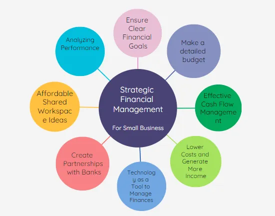

## Table of Contents

## What is financial management and why is it important for small businesses?

Financial management is all about handling money wisely in a business. It includes making budgets, keeping track of money coming in and going out, and making smart choices about where to spend or invest money. For small businesses, good financial management means they can pay their bills on time, save for the future, and grow their business.

It's really important for small businesses because they usually don't have a lot of extra money to play with. If they manage their money well, they can avoid running out of cash, which can be a big problem. Good financial management also helps small business owners make better decisions, like knowing when it's a good time to buy new equipment or hire more staff. This can help the business do better and last longer.

## How can a small business set up a basic financial management system?

To set up a basic financial management system, a small business should start by opening a business bank account. This keeps business money separate from personal money, making it easier to track and manage. Next, they need to choose a simple accounting software that fits their needs. There are many options available, some even free, that can help record sales, expenses, and generate basic reports. It's important to pick one that's easy to use so they can keep up with it regularly.

Once the software is set up, the business owner should record all transactions, including sales, purchases, and any other money coming in or going out. This helps them see where their money is going and if they're making a profit. They should also set up a simple budget to plan for future expenses and make sure they have enough money to cover them. Regularly reviewing this budget and comparing it to actual spending will help them stay on track and make adjustments if needed.

Lastly, keeping good records is key. This means saving receipts, invoices, and bank statements. Good records help with tax time and can show if the business is doing well or if there are areas that need improvement. By following these steps, a small business can set up a basic financial management system that helps them manage their money better and plan for the future.

## What are the essential financial statements that small business owners should understand?

Small business owners should understand three main financial statements: the income statement, the balance sheet, and the cash flow statement. The income statement, also called the profit and loss statement, shows how much money the business made and spent over a certain time, like a month or a year. It tells you if the business made a profit or a loss by subtracting expenses from revenue. This helps owners see if their business is doing well or if they need to cut costs or find ways to make more money.

The balance sheet is like a snapshot of what the business owns and owes at a specific moment. It lists assets, which are things the business owns like cash, equipment, and inventory, and liabilities, which are what the business owes, like loans or bills. The difference between assets and liabilities is called equity, which shows the net worth of the business. This statement helps owners understand the financial health of their business and make decisions about borrowing or investing.

The cash flow statement tracks the money coming in and going out of the business over time. It shows how much cash the business has on hand and helps owners see if they have enough money to pay bills and keep the business running. This statement is important because even if a business is making a profit, it might run into trouble if it doesn't have enough cash to cover its immediate needs. Understanding these three statements helps small business owners manage their finances better and plan for the future.

## How can small businesses manage their cash flow effectively?

Managing cash flow effectively is crucial for small businesses because it helps them keep enough money on hand to pay bills and keep the business running smoothly. One way to do this is by keeping a close eye on when money comes in and goes out. This means sending invoices quickly and following up on late payments. Offering discounts for early payments can also encourage customers to pay sooner. On the other hand, small businesses should try to delay paying their own bills until they're due, as long as it doesn't harm their relationship with suppliers.

Another important part of managing cash flow is making a budget and sticking to it. This helps small businesses plan for future expenses and make sure they have enough money to cover them. It's also a good idea to set aside some money as a buffer for unexpected costs. Keeping good records of all transactions and regularly checking the cash flow statement can help business owners see where their money is going and make adjustments if needed. By doing these things, small businesses can avoid cash flow problems and keep their business healthy.

## What are some common financial mistakes small businesses should avoid?

One common mistake small businesses make is mixing personal and business money. It can be tempting to use the same account for everything, but this can lead to confusion and make it hard to see if the business is doing well. It's important to keep business money separate by opening a business bank account. This helps with tracking expenses, paying taxes, and understanding the true financial health of the business.

Another mistake is not keeping good financial records. Many small business owners get busy and forget to record all their transactions, but this can cause big problems later. Good records help with managing cash flow, preparing for taxes, and making smart business decisions. Using simple accounting software and setting aside time each week to update records can make a big difference.

Lastly, small businesses sometimes fail to plan for the future. This includes not setting a budget, not saving for emergencies, or not thinking about how to grow the business. A budget helps control spending and make sure there's enough money for important things. Saving a little money each month can help cover unexpected costs. And having a plan for growth can guide the business towards success. By avoiding these mistakes, small businesses can manage their money better and build a stronger future.

## How can budgeting help small businesses in financial planning?

Budgeting helps small businesses by giving them a clear plan for their money. It shows how much money the business expects to make and how much it needs to spend on things like rent, supplies, and salaries. By making a budget, small business owners can see if they have enough money to cover all their costs. If they find out they don't have enough, they can look for ways to make more money or spend less. This helps them avoid running out of money and keeps the business running smoothly.

A budget also helps small businesses plan for the future. It lets them set aside money for things they know are coming, like buying new equipment or paying taxes. It can also help them save for emergencies, so they're ready if something unexpected happens. By sticking to a budget, small business owners can make better decisions about where to spend their money. This can help them grow their business and make it stronger over time.

## What role does financial forecasting play in the growth of a small business?

Financial forecasting helps small businesses plan for the future by guessing how much money they will make and spend. It's like looking into a crystal ball to see what might happen with the business's money. By making a good guess about future sales, costs, and profits, a small business can decide if it's a good time to grow. For example, if the forecast shows that the business will make more money next year, the owner might decide to open a new location or hire more staff.

Using financial forecasting also helps small businesses avoid surprises. If the forecast shows that there might not be enough money to cover costs in the future, the business can start saving or find ways to make more money now. This helps the business stay healthy and ready for growth. By planning ahead with financial forecasting, a small business can make smart choices that help it grow bigger and stronger over time.

## How can small businesses optimize their tax strategies?

Small businesses can optimize their tax strategies by keeping good records of all their income and expenses. This helps them see exactly how much money they made and spent, which is important for figuring out how much tax they need to pay. By keeping track of everything, they can also find deductions and credits they might not have known about. Deductions are things they can subtract from their income before paying taxes, like the cost of supplies or travel for work. Credits are like discounts on the tax they owe. Knowing about these can help them pay less in taxes.

Another way small businesses can save on taxes is by choosing the right business structure. For example, being a sole proprietor is simple, but it might mean paying more in taxes than if they were a corporation or an LLC. Each structure has different rules about how taxes work, so it's worth learning about them. Small businesses should also think about when they pay taxes. If they can, they might want to delay some income until the next year or pay some bills early to get more deductions this year. Talking to a tax professional can help them make the best choices and save money on taxes.

## What are the best practices for managing debt in a small business?

Managing debt in a small business starts with understanding how much debt the business has and what it's being used for. It's important to keep track of all loans, credit cards, and any other money the business owes. A good practice is to use debt for things that help the business grow, like buying equipment or expanding, rather than for everyday costs. This way, the business can make more money to pay back the debt. It's also a good idea to have a plan for paying off the debt, like setting up a schedule to make regular payments. This helps the business avoid getting into more debt than it can handle.

Another important practice is to shop around for the best loan terms. Different lenders might offer different interest rates and repayment options, so it's worth taking the time to compare them. Small businesses should also try to pay off high-interest debt first because it costs more over time. If the business is having trouble making payments, it's better to talk to the lender early rather than waiting. Lenders might be willing to change the payment plan or offer other help. By managing debt carefully, a small business can keep its finances healthy and focus on growing.

## How can small businesses use financial ratios to assess their performance?

Small businesses can use financial ratios to understand how well they are doing by comparing different numbers from their financial statements. One important ratio is the profit margin, which shows how much profit the business makes for every dollar of sales. To find the profit margin, you divide the net profit by the total sales. A higher profit margin means the business is keeping more money from each sale, which is a good sign. Another useful ratio is the current ratio, which helps see if the business can pay its short-term bills. You find it by dividing current assets by current liabilities. A current ratio above 1 means the business has enough assets to cover its debts, which is important for staying financially healthy.

Another ratio that small businesses should look at is the debt-to-equity ratio. This tells them how much of the business is funded by debt compared to what the owners have put in. To calculate it, divide total liabilities by total equity. A lower debt-to-equity ratio means the business is not relying too much on borrowed money, which can be safer. By regularly checking these ratios, small business owners can see if they need to make changes to improve their performance. For example, if the profit margin is low, they might need to find ways to cut costs or increase sales. Using financial ratios helps small businesses make smart decisions and keep their finances in good shape.

## What advanced financial tools and software can enhance financial management for small businesses?

Small businesses can use advanced financial tools and software to make managing their money easier and more effective. One popular tool is QuickBooks, which helps with bookkeeping, invoicing, and tracking expenses. It can also create financial reports and help with tax preparation. Another useful software is Xero, which is great for managing cash flow and keeping everything organized. Xero also connects with other apps, like payroll and inventory management, so small businesses can see everything in one place. Using these tools helps small businesses save time and make better financial decisions.

Another advanced tool is FreshBooks, which is especially helpful for businesses that need to send a lot of invoices. It makes it easy to create and send invoices, track time, and manage projects. For small businesses that want to plan for the future, software like PlanGuru can be really helpful. It helps with financial forecasting and budgeting, so business owners can see how different choices might affect their money. By using these advanced tools, small businesses can keep their finances in good shape and focus on growing their business.

## How can small businesses prepare for financial audits and ensure compliance with financial regulations?

Small businesses can prepare for financial audits by keeping good records of all their money coming in and going out. This means saving receipts, invoices, and bank statements. They should also use accounting software like QuickBooks or Xero to keep everything organized. It's important to make sure all the numbers in their financial statements are correct. If they find any mistakes, they should fix them right away. Before an audit, they should review their records and make sure everything is ready for the auditors to look at. Talking to an accountant or a financial advisor can also help them get ready and make the audit go smoothly.

Ensuring compliance with financial regulations is also important for small businesses. They need to know the rules about taxes, how to report their income, and any other laws that apply to their business. This might mean keeping track of how much they pay their employees, making sure they pay the right amount of taxes, and following rules about keeping financial records. Small businesses can stay compliant by staying up to date with changes in the law and using software that helps with tax filing and reporting. If they're not sure about something, they can ask a professional for help. By doing these things, small businesses can avoid problems and keep their finances in good shape.

## What are Advanced Financial Statements and Reports?

Financial statements are foundational tools that offer detailed insights into the financial dynamics of a business. They are imperative for evaluating an organization's fiscal health, guiding both day-to-day management and long-term strategic planning. By understanding and utilizing financial statements—such as income statements, balance sheets, and cash flow statements—business owners can make informed decisions to foster growth and sustainability.

### Income Statements

The income statement, or profit and loss statement, provides a summary of a company's revenues and expenses over a specific period. It highlights the net income or loss by detailing the difference between total revenue and total expenses. Key components of an income statement include:

1. **Revenue**: Total income generated from goods sold or services provided.
2. **Cost of Goods Sold (COGS)**: Direct costs attributable to production, such as materials and labor.
3. **Gross Profit**: Calculated as Revenue minus COGS.
4. **Operating Expenses**: Indirect costs such as salaries, rent, and utilities.
5. **Net Profit**: The remaining income after all expenses, taxes, and costs have been subtracted from total revenue.

An example formula for net profit is:
$$
\text{Net Profit} = \text{Revenue} - \text{COGS} - \text{Operating Expenses} - \text{Taxes}
$$

### Balance Sheets

A balance sheet provides a snapshot of a company's financial position at a given point in time. It details the organization's assets, liabilities, and equity. The balance sheet is anchored by the fundamental accounting equation:

$$
\text{Assets} = \text{Liabilities} + \text{Equity}
$$

- **Assets**: Resources owned by the company that have economic value, such as cash, inventory, and real estate.
- **Liabilities**: Obligations the company owes to outside parties, like loans and accounts payable.
- **Equity**: The residual interest in the assets after deducting liabilities, representing ownership interest.

Analyzing balance sheets helps identify financial strength and gives insight into how assets are financed.

### Cash Flow Statements

The cash flow statement outlines the inflow and outflow of cash within an organization, categorized into three main activities:

1. **Operating Activities**: Cash generated or used in regular business operations.
2. **Investing Activities**: Cash spent on or generated from long-term investments, like property or equipment.
3. **Financing Activities**: Transactions with owners or creditors affecting the equity and debt structure.

This statement answers crucial questions regarding a company’s [liquidity](/wiki/liquidity-risk-premium) and solvency, indicating how efficiently a company manages its cash to meet obligations and fund operations.

### Impact on Strategic Planning and Growth

Comprehensive financial reporting is vital for strategic planning, allowing businesses to set realistic goals, allocate resources efficiently, and measure progress. By analyzing financial statements, companies can identify trends, forecast future financial positions, and understand economic strengths and weaknesses.

Engaging in regular financial analysis can reveal opportunities for growth, such as areas to cut costs, invest in new ventures, or expand operations. Furthermore, precise financial reporting supports transparency and aids in building trust with stakeholders, including investors and creditors.

In summary, mastering the interpretation and application of advanced financial statements is essential for small business owners aiming to achieve sustained growth and maintain a competitive edge. These documents do not only offer a historical view but also provide actionable insights for future planning and decision-making.

## References & Further Reading

[1]: Bergstra, J., Bardenet, R., Bengio, Y., & Kégl, B. (2011). ["Algorithms for Hyper-Parameter Optimization."](https://proceedings.neurips.cc/paper/2011/file/86e8f7ab32cfd12577bc2619bc635690-Paper.pdf) Advances in Neural Information Processing Systems 24.

[2]: ["Advances in Financial Machine Learning"](https://www.amazon.com/Advances-Financial-Machine-Learning-Marcos/dp/1119482089) by Marcos Lopez de Prado

[3]: ["Evidence-Based Technical Analysis: Applying the Scientific Method and Statistical Inference to Trading Signals"](https://www.amazon.com/Evidence-Based-Technical-Analysis-Scientific-Statistical/dp/0470008741) by David Aronson

[4]: ["Machine Learning for Algorithmic Trading"](https://github.com/PacktPublishing/Machine-Learning-for-Algorithmic-Trading-Second-Edition) by Stefan Jansen

[5]: ["Quantitative Trading: How to Build Your Own Algorithmic Trading Business"](https://books.google.com/books/about/Quantitative_Trading.html?id=j70yEAAAQBAJ) by Ernest P. Chan