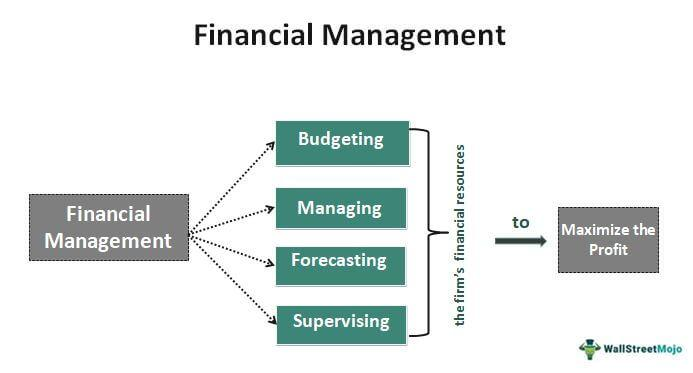

In today's fast-paced business environment, effective financial management is crucial for the success of small businesses. Small business accounting, financial management, and business finance form a triad that supports the sustainability and growth of these enterprises. Accounting serves as the backbone by enabling accurate tracking of expenses, revenues, and financial health. Without a robust accounting system, businesses can falter due to mismanaged resources and lack of insightful financial data.

Financial management, on the other hand, helps businesses strategize their operations by utilizing financial data to make informed decisions. It encompasses budgeting, forecasting, and analysis of financial statements to ensure long-term profitability. This involves using various financial tools and techniques to align resources with business objectives, thereby ensuring optimal financial performance.



An emerging aspect of financial management is the role of algorithmic trading in optimizing financial strategies for small business owners. Algorithmic trading employs automated, pre-programmed trading instructions to execute trades in financial markets at speeds and frequencies that would be impossible for a human trader. For small businesses, incorporating algorithmic trading can enhance investment strategies, improve asset management, and optimize returns on investments. It offers a modern approach to financial management, providing data-driven insights and minimizing the risks associated with market volatility.

Understanding these elements equips entrepreneurs with the necessary tools to navigate and thrive in a competitive market. By integrating sound accounting practices, leveraging technological advancements in financial management, and exploring innovative strategies such as algorithmic trading, small business owners can secure a competitive edge and build a strong financial foundation for their enterprises.

## Table of Contents

## The Importance of Accounting in Small Business Financial Management

Accounting is fundamental to the financial management of small businesses, serving as a critical tool for monitoring and controlling fiscal operations. A well-designed accounting system provides businesses with the ability to track expenses, measure revenues, and assess overall financial health. This is achieved through meticulous record-keeping and methodical tracking, enabling small business owners to make informed financial decisions.

The first step in establishing an effective accounting system is to choose an appropriate accounting method. The two principal methods are cash accounting and accrual accounting. Cash accounting recognizes revenue and expenses only when money changes hands. This method is straightforward but can provide an incomplete financial picture. Accrual accounting, on the other hand, records income and expenses when they are earned or incurred, regardless of cash transactions. This method offers a more comprehensive view of financial performance and is generally preferred by businesses with more complex operations.

Accurate financial records are integral to maintaining this system. This involves detailed documentation of every financial transaction, which aids in tracking business performance over time. Typical records include sales receipts, purchase invoices, payroll records, and bank statements. Utilizing digital tools for recording transactions can enhance accuracy and reduce the risk of human error. Regular reconciliation of these records with bank statements ensures consistency and highlights any discrepancies that may exist.

Consider an example in Python for a small business that wants to track its expenses and revenues using simple lists and dictionary structures:

```python
# Example of tracking finances in a small business
expenses = {'rent': 2000, 'utilities': 300, 'salaries': 5000, 'supplies': 400}
revenues = {'product_sales': 10000, 'services': 2000}

# Calculate total expenses and revenues
total_expenses = sum(expenses.values())
total_revenues = sum(revenues.values())

# Calculate net profit
net_profit = total_revenues - total_expenses

print(f"Total Expenses: ${total_expenses}")
print(f"Total Revenues: ${total_revenues}")
print(f"Net Profit: ${net_profit}")
```

In this simple script, we define dictionaries for expenses and revenues, sum up their values, and calculate the net profit, providing an uncomplicated snapshot of business performance.

The implementation of effective accounting systems is essential not only for internal management but also for external reporting. By ensuring that financial records are accurate and up-to-date, small businesses can produce reliable financial statements that are crucial for strategic decision-making, engaging with investors, and meeting regulatory requirements. Such comprehensive financial oversight enables business owners to identify trends, forecast future performance, and ultimately supports the organization's growth and sustainability.

## Basic Bookkeeping Practices for Small Businesses

Effective bookkeeping is essential for maintaining the financial integrity and transparency of small businesses. Proper bookkeeping practices ensure that all financial transactions are accurately recorded, providing a solid foundation for informed financial decision-making. Here, we explore key practices that are critical for small business bookkeeping.

Recording daily transactions is a fundamental aspect of bookkeeping. Every financial activity, including sales, purchases, payments, and receipts, must be documented systematically. This can be done using accounting software or traditional ledger [books](/wiki/algo-trading-books). Accurately recording transactions helps businesses maintain a clear and up-to-date view of their financial status. To maximize efficiency, small businesses should consider leveraging digital tools that can automate data entry and reduce the potential for human errors.

Managing cash flow is another crucial practice. Cash flow refers to the movement of money in and out of a business and is a significant indicator of financial health. Effective cash flow management involves monitoring cash inflows and outflows to ensure that a business can meet its short-term obligations and have enough [liquidity](/wiki/liquidity-risk-premium) for operations. Techniques to enhance cash flow include optimizing invoicing processes to encourage prompt customer payments, negotiating favorable terms with suppliers, and maintaining a cash reserve to cover unexpected expenses.

Reconciling bank statements is vital for verifying the accuracy of recorded transactions. This process involves comparing a business's internal financial records with the statements provided by the bank to ensure consistency and to identify any discrepancies. Regular reconciliation helps detect errors, prevent fraud, and ensure that financial records remain accurate. It is advisable for small businesses to reconcile their bank statements at least monthly to maintain an accurate reflection of their financial position.

In summary, by recording daily transactions, managing cash flow effectively, and regularly reconciling bank statements, small business owners can ensure robust bookkeeping practices. These practices not only uphold financial integrity and transparency but also provide a foundation for informed and strategic financial decision-making.

## Advanced Financial Statements and Reports

Financial statements are foundational tools that offer detailed insights into the financial dynamics of a business. They are imperative for evaluating an organization's fiscal health, guiding both day-to-day management and long-term strategic planning. By understanding and utilizing financial statements—such as income statements, balance sheets, and cash flow statements—business owners can make informed decisions to foster growth and sustainability.

### Income Statements

The income statement, or profit and loss statement, provides a summary of a company's revenues and expenses over a specific period. It highlights the net income or loss by detailing the difference between total revenue and total expenses. Key components of an income statement include:

1. **Revenue**: Total income generated from goods sold or services provided.
2. **Cost of Goods Sold (COGS)**: Direct costs attributable to production, such as materials and labor.
3. **Gross Profit**: Calculated as Revenue minus COGS.
4. **Operating Expenses**: Indirect costs such as salaries, rent, and utilities.
5. **Net Profit**: The remaining income after all expenses, taxes, and costs have been subtracted from total revenue.

An example formula for net profit is:
$$
\text{Net Profit} = \text{Revenue} - \text{COGS} - \text{Operating Expenses} - \text{Taxes}
$$

### Balance Sheets

A balance sheet provides a snapshot of a company's financial position at a given point in time. It details the organization's assets, liabilities, and equity. The balance sheet is anchored by the fundamental accounting equation:

$$
\text{Assets} = \text{Liabilities} + \text{Equity}
$$

- **Assets**: Resources owned by the company that have economic value, such as cash, inventory, and real estate.
- **Liabilities**: Obligations the company owes to outside parties, like loans and accounts payable.
- **Equity**: The residual interest in the assets after deducting liabilities, representing ownership interest.

Analyzing balance sheets helps identify financial strength and gives insight into how assets are financed.

### Cash Flow Statements

The cash flow statement outlines the inflow and outflow of cash within an organization, categorized into three main activities:

1. **Operating Activities**: Cash generated or used in regular business operations.
2. **Investing Activities**: Cash spent on or generated from long-term investments, like property or equipment.
3. **Financing Activities**: Transactions with owners or creditors affecting the equity and debt structure.

This statement answers crucial questions regarding a company’s liquidity and solvency, indicating how efficiently a company manages its cash to meet obligations and fund operations.

### Impact on Strategic Planning and Growth

Comprehensive financial reporting is vital for strategic planning, allowing businesses to set realistic goals, allocate resources efficiently, and measure progress. By analyzing financial statements, companies can identify trends, forecast future financial positions, and understand economic strengths and weaknesses.

Engaging in regular financial analysis can reveal opportunities for growth, such as areas to cut costs, invest in new ventures, or expand operations. Furthermore, precise financial reporting supports transparency and aids in building trust with stakeholders, including investors and creditors.

In summary, mastering the interpretation and application of advanced financial statements is essential for small business owners aiming to achieve sustained growth and maintain a competitive edge. These documents do not only offer a historical view but also provide actionable insights for future planning and decision-making.

## Navigating Tax Obligations and Deductions

Tax compliance is essential for the financial health and legal standing of small businesses. Understanding and managing tax obligations is crucial for avoiding penalties and optimizing financial performance. Small businesses must be aware of several key tax obligations, including income tax, payroll tax, sales tax, and self-employment tax, depending on the geographical location and business structure.

### Key Tax Obligations:

1. **Income Tax:** Small businesses are required to report annual income to federal, and often state, tax authorities. The structure of the business (e.g., sole proprietorship, partnership, C corporation, S corporation, LLC) determines how income tax obligations are calculated and filed. For example, LLCs typically benefit from pass-through taxation, where income is reported on the owner's personal tax return.

2. **Payroll Tax:** Employers must withhold payroll taxes from employee wages for federal and state income taxes and contribute to Social Security and Medicare taxes. Additionally, businesses are responsible for unemployment tax. Failure to accurately withhold and pay these taxes can result in severe penalties.

3. **Sales Tax:** Depending on the jurisdiction, businesses must collect sales tax on goods and services provided and remit these to the appropriate tax authority. It's important to stay updated with local sales tax regulations as rates and rules frequently change.

4. **Self-Employment Tax:** In the case of small business owners operating as sole proprietors or partnerships, self-employment tax, which covers Social Security and Medicare, is mandatory. This is calculated based on business profits.

### Tracking Deductible Expenses:

Deductions can significantly reduce taxable income, leading to potential savings. Common deductible expenses include:

- **Operating Expenses:** These include rent, utilities, office supplies, and other day-to-day costs necessary for running the business.
- **Depreciation:** This is the allocation of the cost of an asset over its useful life. Businesses can deduct depreciation for assets like vehicles, machinery, and real estate.
- **Travel and Meals:** Business-related travel expenses and a portion of meal costs are deductible, provided they are ordinary and necessary for conducting business.
- **Home Office Expenses:** For those running a business from home, a portion of home expenses such as mortgage interest, insurance, utilities, and repairs can be deducted as part of home office deductions.

### Strategies for Optimizing Tax Filings:

1. **Accurate Record-Keeping:** Maintaining meticulous records of all financial transactions is crucial. This includes invoices, receipts, and other documentation that supports deductions and tax credits.

2. **Utilizing Tax Software:** Employing tax preparation software can help small businesses stay organized, easily track deductible expenses, and generate necessary reports for tax filings. Popular options include TurboTax, H&R Block, and TaxSlayer.

3. **Consulting a Tax Professional:** Given the complexity of tax laws and frequent changes, consulting with a tax advisor or accountant can help ensure compliance and identify potential savings opportunities.

4. **Estimated Tax Payments:** Businesses that are expected to owe more than a certain amount at the end of the tax year may need to make quarterly estimated tax payments to avoid penalties.

By understanding tax obligations, effectively tracking deductibles, and employing strategic planning, small business owners can optimize their tax filings, ultimately enhancing their overall financial management and sustainability.

## The Role of Software in Streamlining Accounting and Finance

In recent years, modern accounting software has become an indispensable tool for small businesses seeking to enhance operational efficiency. The adoption of these digital solutions allows business owners to streamline their accounting and financial processes, minimizing manual intervention and reducing the likelihood of human error. Accounting software automates various tasks such as bookkeeping, invoicing, and financial reporting, enabling businesses to focus on strategic activities that foster growth.

One of the primary benefits of leveraging accounting tools is their ability to simplify bookkeeping activities. Automated recording of transactions ensures that all financial data is captured accurately and consistently, facilitating real-time tracking and analysis of financial health. Such systems allow business owners to monitor cash flow and profits seamlessly, offering insights crucial for informed decision-making.

Furthermore, accounting software enhances the invoicing process by providing templates, setting automatic reminders, and enabling electronic payments. This not only accelerates payment cycles but also reduces the administrative burden associated with tracking outstanding invoices. Consequently, small businesses can maintain healthy cash flow and improve relationships with clients by ensuring timely payments.

Another significant advantage of accounting software lies in its ability to generate comprehensive financial reports with ease. Financial statements, including income statements, balance sheets, and cash flow statements, can be automatically prepared and customized. These reports provide valuable insights into the financial performance of the business, enabling strategic planning and effective management decisions.

When exploring software options, several popular platforms cater to the diverse needs and requirements of small businesses. QuickBooks, for instance, is renowned for its user-friendly interface and robust feature set that includes payroll management and tax compliance. Xero, another popular choice, offers cloud-based accounting solutions that allow for real-time collaboration and integration with various third-party applications. FreshBooks is particularly favored by freelancers and small service-based businesses for its intuitive invoicing capabilities.

Ultimately, the integration of accounting software into financial management processes empowers small businesses to operate with greater efficiency and accuracy, laying a solid foundation for sustainable growth and success. By adopting these technological advancements, entrepreneurs can allocate more time and resources towards scaling their operations and achieving long-term objectives.

## Outsourcing Accounting Services: Pros and Cons

Outsourcing accounting services is a strategic consideration for small business owners facing constraints on time, expertise, and financial resources. One of the primary advantages of outsourcing is cost savings. By engaging external professionals, small businesses can avoid the expenses associated with hiring full-time, in-house accountants. These expenses often include salaries, benefits, training, and office infrastructure. Outsourcing allows businesses to pay only for the services they require, which can be particularly beneficial for small firms with fluctuating accounting needs.

Another benefit of outsourcing is access to expertise and advanced technologies. Professional accounting firms typically employ skilled accountants who are well-versed in the latest financial regulations, tax laws, and best practices. Additionally, these firms often utilize sophisticated accounting software, which can enhance accuracy and efficiency, ultimately providing small businesses with high-quality financial analyses and reports.

Despite these advantages, outsourcing accounting services also presents potential challenges. One significant disadvantage is the potential loss of direct financial control. By delegating accounting tasks to an external party, businesses may face delays in obtaining financial data and may lack immediate oversight of their financial processes. This can be particularly concerning if the business makes time-sensitive financial decisions.

Furthermore, data security is a critical consideration when outsourcing. Sharing sensitive financial information with third-party providers requires robust protocols to ensure data confidentiality and compliance with relevant data protection regulations.

To mitigate risks associated with outsourcing, choosing the right external accounting partner is crucial. Businesses should evaluate potential providers based on their reputation, expertise in relevant industries, technological capabilities, and security measures. It is also essential to establish clear communication channels and set expectations regarding the scope of work, timelines, and fees.

In summary, while outsourcing accounting services can provide significant benefits in terms of cost savings and expertise, it is essential for small businesses to carefully weigh these advantages against potential drawbacks, such as reduced control and data security concerns. Making informed decisions and selecting a reliable accounting partner can help small businesses optimize their financial management while maintaining operational control.

## Integrating Algorithmic Trading in Business Finance

Algorithmic trading has evolved as a powerful tool for small businesses seeking to refine their investment strategies and improve financial outcomes. At its core, [algorithmic trading](/wiki/algorithmic-trading) involves the use of computer programs and algorithms to execute trades based on pre-defined criteria. This technology-driven approach offers several advantages that bolster investment strategies, particularly for small businesses with limited resources.

**Understanding Algorithmic Trading**

Algorithmic trading automates the trading process, allowing for quicker decision-making and execution without human intervention. The algorithms are designed to follow a set of rules and parameters, such as timing, price, or quantity, aiming to maximize investment returns and minimize risks. Python, a versatile and widely-used programming language, offers libraries such as NumPy, pandas, and TA-Lib that are instrumental in developing and [backtesting](/wiki/backtesting) trading algorithms.

For instance, an algorithm can be coded to buy a stock when its price falls below a certain moving average, indicating a potential undervaluing. Here is a simple Python script snippet demonstrating such a concept using pandas:

```python
import pandas as pd

def moving_average_strategy(data, short_window, long_window):
    signals = pd.DataFrame(index=data.index)
    signals['signal'] = 0.0

    # Compute the short and long moving averages
    signals['short_mavg'] = data['Close'].rolling(window=short_window, min_periods=1, center=False).mean()
    signals['long_mavg'] = data['Close'].rolling(window=long_window, min_periods=1, center=False).mean()

    # Generate the signals
    signals['signal'][short_window:] = np.where(signals['short_mavg'][short_window:] 
                                                 > signals['long_mavg'][short_window:], 1.0, 0.0)   

    # Generate trading orders
    signals['positions'] = signals['signal'].diff()

    return signals
```

**Enhancing Money Management and Asset Growth**

Through algorithmic trading, small businesses can enhance money management by using strategies such as mean reversion, [market making](/wiki/market-making), and [trend following](/wiki/trend-following). These strategies can lead to more disciplined trading and better risk management, which are essential for preserving capital and encouraging steady asset growth.

1. **Mean Reversion**: This strategy is based on the principle that asset prices and returns eventually return to their long-term mean or average level. Small businesses can utilize mean reversion algorithms to identify overbought or oversold conditions, and thus, optimizing entry and exit points.

2. **Market Making**: Algorithms can create liquidity by providing quotes on both the buy and sell sides, profiting from the bid-ask spread. This can be particularly beneficial for small businesses actively trading in the equities or commodities markets.

3. **Trend Following**: Identifying and capitalizing on the current market trends, trend-following algorithms can help small businesses capitalize on market movements to increase investment returns.

**Optimizing Trade Execution and Investment Returns**

Algorithmic trading also optimizes trade execution by minimizing the impact of human emotion and error, ensuring consistency and precision in trades. Advanced algorithms can deploy strategies like statistical [arbitrage](/wiki/arbitrage), where price inefficiencies between related financial instruments are exploited, or employ smart order routing to discover the best combination of available liquidity pools.

Given these capabilities, algorithmic trading enables small business investors to harness quantitative and qualitative data more effectively than traditional trading methods may allow. This, in turn, results in increased efficiency, reduced transaction costs, and optimized returns.

**Conclusion**

By integrating algorithmic trading into their financial management strategies, small businesses can unlock significant advantages in trade execution and investment. Understanding and employing algorithms like moving averages, mean reversion, and trend following can lead to smarter investment strategies and growth in assets, ultimately fortifying the financial standing of small businesses in competitive markets.

## Best Practices for Small Business Financial Management

Adopting best practices in financial management is integral to the sustained success and growth of small businesses. By implementing these practices, businesses can ensure robust financial health and make informed strategic decisions.

One fundamental practice is maintaining separate business accounts. This involves keeping personal and business finances distinct, thereby facilitating clearer financial tracking and reporting. Separating accounts helps avoid the commingling of funds, which simplifies tax preparation and enhances the credibility of financial statements. This practice is not only vital for legal and tax compliance but also for maintaining an accurate picture of the business's financial status.

Regularly reviewing financial statements is another essential practice. Financial statements, including income statements, balance sheets, and cash flow statements, provide a snapshot of a business’s financial performance and position. By periodically analyzing these documents, small business owners can identify trends, assess financial health, and detect early warning signs of financial distress. This review process supports strategic planning and decision-making by offering insights into revenue streams, cost management, and profitability.

Seeking professional advice, such as consulting with accountants or financial advisors, can greatly benefit small business owners. Professionals bring expertise and an external perspective that can help identify financial patterns and potential problems that might not be apparent to business owners immersed in daily operations. Their guidance can be crucial for developing effective tax strategies, optimizing cash flow, and planning for future growth.

Implementing these best practices contributes to a strong financial foundation, enabling small businesses to navigate uncertainties and seize new opportunities in the marketplace. Such practices lay the groundwork for a sound financial structure, fostering transparency, accountability, and strategic foresight essential for achieving long-term business success.

## Conclusion: Building a Strong Financial Foundation for Success

Effective financial management is crucial for the sustainability and growth of small businesses. Through the integration of sound accounting practices, the use of technology, and innovative trading strategies, entrepreneurs can gain a competitive advantage in today's market. 

Implementing robust accounting practices lays the groundwork for any business. Accurate financial records are essential for tracking income, expenses, and overall financial health, providing the data necessary for informed decision-making. Technology, including modern accounting software, can significantly streamline these processes, automating tasks such as bookkeeping, invoicing, and report generation. These tools not only save time but also increase accuracy, contributing to better operational efficiency.

Furthermore, leveraging innovative trading strategies like algorithmic trading can enhance investment approaches, potentially leading to optimal trade execution and increased returns. Algorithmic trading uses automated systems to execute trades based on pre-defined criteria, a method that can mitigate human error and capitalize on market opportunities swiftly.

The interplay of good accounting practices, technology, and trading strategies forms a comprehensive framework for effective financial management. By understanding and applying these elements, small business owners can build a strong financial foundation that supports sustainable growth and long-term success. Collectively, these strategies empower entrepreneurs to navigate the complex world of finance, ensuring their businesses remain resilient and competitive in a dynamic economic landscape.

## References & Further Reading

[1]: Bergstra, J., Bardenet, R., Bengio, Y., & Kégl, B. (2011). ["Algorithms for Hyper-Parameter Optimization."](https://proceedings.neurips.cc/paper/2011/file/86e8f7ab32cfd12577bc2619bc635690-Paper.pdf) Advances in Neural Information Processing Systems 24.

[2]: ["Advances in Financial Machine Learning"](https://www.amazon.com/Advances-Financial-Machine-Learning-Marcos/dp/1119482089) by Marcos Lopez de Prado

[3]: ["Evidence-Based Technical Analysis: Applying the Scientific Method and Statistical Inference to Trading Signals"](https://www.amazon.com/Evidence-Based-Technical-Analysis-Scientific-Statistical/dp/0470008741) by David Aronson

[4]: ["Machine Learning for Algorithmic Trading"](https://github.com/PacktPublishing/Machine-Learning-for-Algorithmic-Trading-Second-Edition) by Stefan Jansen

[5]: ["Quantitative Trading: How to Build Your Own Algorithmic Trading Business"](https://books.google.com/books/about/Quantitative_Trading.html?id=j70yEAAAQBAJ) by Ernest P. Chan