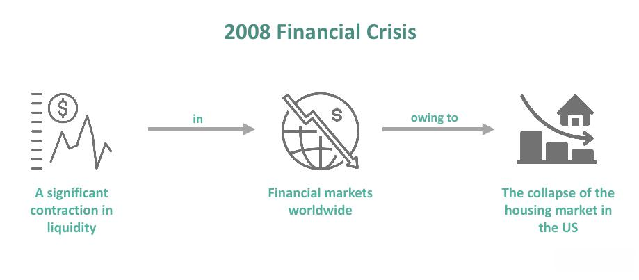

## Table of Contents

## What was the Financial Market Crisis of 2008?

The Financial Market Crisis of 2008, also known as the Global Financial Crisis, was a severe worldwide economic downturn that started in the United States. It began when many people could not pay back their home loans, leading to a collapse in the housing market. Banks had given out too many risky loans and when people defaulted on these loans, the banks lost a lot of money. This caused a big problem because banks were not only losing money, but they also stopped lending money to each other and to businesses, which made the economy slow down.

As the crisis spread, it affected economies all around the world. Stock markets crashed, and many businesses went bankrupt. Governments and central banks had to step in to help by giving money to banks and trying to boost the economy. The crisis led to a lot of job losses and many people struggled financially. It took years for the global economy to recover, and it changed the way banks and financial systems work to try to prevent such a crisis from happening again.

## What were the main causes of the 2008 Financial Crisis?

The 2008 Financial Crisis was caused by a few big problems. One main cause was the housing bubble in the United States. Banks were giving out loans to people who couldn't afford them, called subprime mortgages. These loans let people buy homes they couldn't really pay for. When house prices started to fall, many people couldn't pay back their loans, and banks lost a lot of money. Another problem was that banks were selling these risky loans to other investors as safe investments. When the loans went bad, it caused a lot of trouble for everyone who had bought them.

Another cause was that banks were taking too many risks. They were borrowing a lot of money to make more loans and investments. This is called leverage, and it can make banks a lot of money if things go well, but it can also make them lose a lot if things go badly. When the housing market crashed, banks that had borrowed a lot of money were in big trouble. They didn't have enough money to cover their losses, and this made them stop lending to each other and to businesses. This caused a credit crunch, where it was hard for anyone to get loans, and it made the economy slow down.

Lastly, there was a lack of good regulation and oversight. The government and financial regulators didn't do enough to stop banks from taking these big risks. They didn't make sure that banks had enough money to cover their losses, and they didn't stop banks from selling risky loans as safe investments. This lack of oversight let the problems grow until they caused a big crisis. It took a lot of effort from governments and central banks around the world to fix the mess and start the economy growing again.

## How did the subprime mortgage market contribute to the crisis?

The subprime mortgage market played a big role in causing the 2008 Financial Crisis. Banks were giving out loans to people who couldn't really afford them, called subprime mortgages. These loans had low interest rates at first, but then the rates would go up a lot. People thought they could keep up with the payments because house prices were going up, but when prices started to fall, many couldn't pay back their loans. This led to a lot of people losing their homes, which was called a housing market crash. Banks lost a lot of money because they had given out too many of these risky loans.

The problem got even bigger because banks were selling these risky loans to other investors as safe investments. They did this by bundling the loans together into things called mortgage-backed securities and selling them to investors all over the world. Investors thought these securities were safe because they were rated highly by credit rating agencies. But when people started defaulting on their loans, these securities lost a lot of value. This caused a lot of trouble for banks and investors who had bought them, and it helped spread the crisis around the world.

## What role did financial derivatives like mortgage-backed securities play in the crisis?

Financial derivatives like mortgage-backed securities played a big part in making the 2008 Financial Crisis worse. Banks took the risky subprime mortgages they had given out and bundled them together into these securities. They then sold these securities to investors all around the world, saying they were safe investments. But these securities were actually very risky because they were based on loans that people couldn't pay back. When people started defaulting on their mortgages, the value of these securities dropped a lot. This caused big losses for the banks and investors who had bought them.

The problem spread quickly because these securities were traded all over the world. When their value went down, it didn't just hurt the banks in the United States; it affected investors everywhere. This made the crisis bigger and harder to stop. Banks that had bought a lot of these securities lost a lot of money and had trouble lending money to others. This led to a credit crunch, where it was hard for anyone to get loans, and it made the economy slow down even more. So, the way these financial derivatives were used helped turn a housing market problem into a global financial crisis.

## Which major financial institutions were most affected by the crisis?

Some big banks and financial companies got hit hard by the 2008 Financial Crisis. Lehman Brothers, a big investment bank, went bankrupt because it had too many risky loans and investments. This was a big shock to everyone and made the crisis worse. Bear Stearns, another big investment bank, was in trouble too and had to be bought by JP Morgan Chase to stop it from going under. AIG, a huge insurance company, lost a lot of money because it had sold insurance on those risky mortgage-backed securities. The government had to step in and give AIG a lot of money to keep it from failing.

Other big banks like Citigroup and Bank of America also had big problems. They had a lot of bad loans and securities that lost value. The government had to help them too, by giving them money and taking stakes in the companies. Fannie Mae and Freddie Mac, which are big companies that help people get home loans, were taken over by the government because they were in such bad shape. These were some of the biggest and most important financial institutions that were hit hard by the crisis, and their problems made the crisis spread and get worse.

## How did the government respond to the 2008 Financial Crisis?

The government took big steps to stop the 2008 Financial Crisis from getting worse. They made a plan called the Troubled Asset Relief Program, or TARP, which let them use a lot of money to help banks that were in trouble. The government bought bad loans and securities from banks to stop them from going bankrupt. They also gave money directly to banks to keep them going. This was important because if big banks failed, it would hurt the whole economy. The government also helped big companies like AIG and car makers like General Motors and Chrysler, which were struggling because people weren't buying cars.

Another big thing the government did was to change the rules for banks. They made new laws like the Dodd-Frank Act to make sure banks wouldn't take such big risks again. The government also lowered interest rates and spent more money on things like roads and schools to help the economy grow again. This was called a stimulus package. It took a long time, but these steps helped the economy start to get better. The government's actions were important to stop the crisis from getting even worse and to help the country recover.

## What was the impact of the crisis on the global economy?

The 2008 Financial Crisis had a big impact on the whole world. It started in the United States but quickly spread to other countries. Many banks and companies around the world had invested in the risky loans and securities from the U.S., so when these lost value, they lost a lot of money too. This led to a global credit crunch, where it was hard for anyone to get loans. Stock markets crashed, and many businesses went bankrupt. This caused a lot of job losses and made it hard for people to buy things, which slowed down the economy even more.

Countries everywhere had to deal with the effects of the crisis. Governments and central banks had to step in to help their economies. They lowered interest rates, spent more money on things like roads and schools, and sometimes even took over banks to stop them from failing. It took years for the global economy to start growing again. The crisis changed the way banks and financial systems work, with new rules to try to stop such a big problem from happening again. But it also left a lot of people struggling financially and made many countries more careful about how they manage their economies.

## How did the crisis affect ordinary citizens and their financial stability?

The 2008 Financial Crisis hit ordinary people hard. Many lost their jobs because businesses were struggling and couldn't keep everyone working. This made it tough for families to pay their bills and buy what they needed. A lot of people also lost their homes because they couldn't keep up with their mortgage payments. The value of houses went down, so even if people could sell their homes, they might not get enough money to pay off their loans. Savings and retirement accounts lost value too, as the stock market crashed. This made it hard for people to plan for the future and feel secure.

On top of losing jobs and homes, people found it harder to get loans. Banks were scared to lend money because they were in trouble themselves. This made it difficult for people to buy cars, start businesses, or even go to college. The crisis left many families feeling stressed and worried about money. It took a long time for things to get better, and some people never fully recovered from the financial hit they took during those tough years.

## What were the long-term economic effects of the 2008 Financial Crisis?

The 2008 Financial Crisis had a big impact on the world's economy that lasted for many years. After the crisis, governments and central banks worked hard to fix the economy, but it took a long time for things to get better. Many countries had to deal with slow growth and high unemployment for years. People were more careful with their money, which made it hard for businesses to grow. Governments also had to spend a lot of money to help banks and companies, which led to big debts that they had to pay back over time. This meant they had less money to spend on things like schools and roads.

The crisis also changed the way banks and financial systems work. New rules were made to stop banks from taking big risks again. These rules, like the Dodd-Frank Act in the United States, made banks safer but also made it harder for them to lend money. This affected how quickly the economy could grow. The crisis also made people more aware of how connected the world's economies are. When one country has problems, it can affect others too. So, countries started working together more to try to prevent future crises. Even though the economy eventually got better, the effects of the 2008 crisis are still felt today in how people and governments manage money.

## What regulatory changes were implemented as a result of the crisis?

After the 2008 Financial Crisis, governments around the world made new rules to stop big financial problems from happening again. In the United States, they passed a law called the Dodd-Frank Act. This law made banks keep more money in reserve, so they could handle losses better. It also created a new group called the Consumer Financial Protection Bureau to make sure banks treated people fairly. The Dodd-Frank Act made it harder for banks to take big risks, but it also made it tougher for them to lend money, which affected how fast the economy could grow.

Other countries made changes too. In Europe, they set up tougher rules for banks and made a group called the European Banking Authority to watch over them. They wanted to make sure banks didn't get into trouble like they did in 2008. Around the world, countries started working together more to share information and stop financial problems from spreading. These new rules and groups were all about making the financial system safer and more stable, so people wouldn't lose their jobs and homes like they did during the crisis.

## How have financial markets evolved since the 2008 crisis to prevent future crises?

Since the 2008 crisis, financial markets have changed a lot to try to stop big problems from happening again. Banks now have to keep more money in reserve, which means they can handle losses better if things go wrong. They also have to be more careful about the risks they take. Governments and financial watchdogs have set up new rules to make sure banks don't do risky things like they did before. They also keep a closer eye on banks to make sure they're following the rules. This has made the financial system safer, but it also means banks can't lend as much money as they used to, which can slow down the economy a bit.

Another big change is that countries work together more now. They share information and try to stop financial problems from spreading from one country to another. This is important because the 2008 crisis showed how connected the world's economies are. Also, new technology has helped make financial markets more open and easier to watch. People can see what's happening in the markets more clearly, which helps stop bad things from happening. Overall, these changes have made the financial system stronger and less likely to have a big crisis like the one in 2008.

## What lessons can be learned from the 2008 Financial Crisis to better prepare for future economic downturns?

The 2008 Financial Crisis taught us that keeping an eye on banks and making sure they don't take too many risks is really important. Before the crisis, banks were giving out loans to people who couldn't pay them back and selling these risky loans to others as safe investments. This made the problem spread around the world. Now, we know that governments need to make rules to stop banks from doing this. They also need to check that banks have enough money to cover their losses if things go wrong. This helps make the financial system safer and stops one country's problems from affecting others.

Another big lesson is that it's important to help people and businesses when the economy is in trouble. During the crisis, many people lost their jobs and homes, and businesses went bankrupt. Governments stepped in with money to help banks and big companies, but they also needed to help ordinary people more. Now, we know that spending money on things like roads and schools can help the economy grow again. It's also important to make sure people can get loans when they need them, so they can keep buying things and businesses can keep running. By learning these lessons, we can be better ready for the next economic downturn and help stop it from getting as bad as the 2008 crisis.

## References & Further Reading

[1]: Geanakoplos, J. (2010). ["The leverage cycle."](https://www.journals.uchicago.edu/doi/full/10.1086/648285) National Bureau of Economic Research Working Paper No. 15530.

[2]: Gorton, G. B., & Metrick, A. (2012). ["Getting Up to Speed on the Financial Crisis: A One-Weekend-Reader's Guide."](https://www.nber.org/system/files/working_papers/w17778/w17778.pdf) Journal of Economic Literature, 50(1), 128-150.

[3]: Lewis, M. (2010). ["The Big Short: Inside the Doomsday Machine."](https://books.google.com/books/about/The_Big_Short_Inside_the_Doomsday_Machin.html?id=eParwQ0YdrcC) W. W. Norton & Company.

[4]: MacKenzie, D. (2015). ["Mechanizing the Merc: Computers and the Chicago Futures Markets."](https://www.jstor.org/stable/24468735?pq-origsite=summon) Social Studies of Science, 45(6), 822-844.

[5]: Stiglitz, J. E. (2010). ["Freefall: America, Free Markets, and the Sinking of the World Economy."](https://archive.org/details/freefallamericaf0000stig) W. W. Norton & Company.

[6]: The Financial Crisis Inquiry Commission. (2011). ["The Financial Crisis Inquiry Report."](https://www.govinfo.gov/app/details/GPO-FCIC/) U.S. Government Publishing Office.

[7]: Wilmott, P., & Orrell, D. (2017). ["The Money Formula: Dodgy Finance, Pseudo Science, and How Mathematicians Took Over the Markets."](https://www.wiley.com/en-us/The%20Money%20Formula:%20Dodgy%20Finance,%20Pseudo%20Science,%20and%20How%20Mathematicians%20Took%20Over%20the%20Markets-p-9781119358619) Wiley.