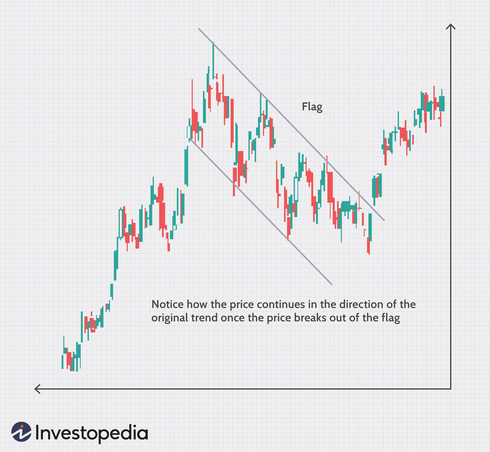

Financial markets are characterized by a complex interplay of various factors, where randomness and cycles coexist to form a unique ecosystem. The behavior of these markets can often appear chaotic, yet beneath the surface, patterns can emerge that offer insight into potential trends. Understanding whether market behavior is predominantly random or cyclical is crucial for traders and investors aiming to gain an advantage amidst the noise.

Algorithmic trading plays a significant role in this context. By leveraging advanced computational techniques and data-driven approaches, algorithmic traders can identify and exploit market inefficiencies. These inefficiencies may arise from a myriad of sources, including delayed information dissemination and structural anomalies within the market. Through statistical analysis and machine learning, algorithmic trading systems are equipped to recognize patterns that might be overlooked by human traders, thus providing opportunities for strategic gain.



This article takes a closer look at the nuanced dynamics of financial markets, focusing specifically on the elements of randomness, market cycles, and the role of algorithmic trading. By analyzing these core concepts, we can better understand the forces that shape current financial markets, as well as the tactics employed by modern traders to navigate and succeed within this ever-evolving landscape.

## Table of Contents

## Efficient Market Theory vs. Random Walk

The Efficient Market Hypothesis (EMH) and Random Walk Theory are cornerstone concepts in understanding financial market behavior. Proposed by Eugene Fama in the 1960s, the Efficient Market Hypothesis asserts that financial markets are “informationally efficient,” meaning that asset prices always incorporate and reflect all relevant information available at any given time. Under this theory, it is hypothesized that it is impossible for investors to achieve returns consistently above average market returns on a risk-adjusted basis, since any new information is instantly reflected in stock prices.

According to EMH, markets operate in a manner where price changes result from the assimilation of new data, both anticipated and unanticipated, and thus follow a "random walk." The Random Walk Theory, closely related to EMH, was popularized by the economist Burton Malkiel. It suggests that the stock price movements are random and unpredictable, resembling a path akin to flipping a coin. This implies that future stock prices cannot be predicted based on past movements or any patterns.

While both EMH and Random Walk Theory highlight the inherent randomness in financial markets, they have also faced substantial criticism. Critics of these theories, such as behavioral economists, argue that markets are frequently impacted by human behavior, which can result in identifiable patterns. Humans are not always rational, and factors like emotions, psychology, and speculative bubbles contribute to market inefficiencies and deviations from the hypothetical efficient market model. Behavioral finance, for instance, emphasizes that cognitive biases and herd behavior among investors can lead to predictable patterns, thereby challenging the strong forms of EMH.

Additionally, empirical evidence often shows that stock prices exhibit short-term predictability and tend to follow discernible patterns or trends over time, contradicting the random walk perspective. For instance, market anomalies, such as [momentum](/wiki/momentum) and the January effect, suggest that certain stocks or sectors can experience abnormal returns over specific periods, pointing to at least some level of predictability.

In summary, while the Efficient Market Hypothesis and Random Walk Theory provide foundational views on market unpredictability, ongoing research and practical evidence contribute to a more nuanced understanding, positing that financial markets, although predominantly random, have elements of predictability influenced by human behavior and inefficiencies.

## Cyclicality in Financial Markets

Market cycles refer to the recurring phases of expansion and contraction that characterize financial markets. These cycles are integral to understanding price movements and making informed investment decisions. Market cycles can be broadly categorized into different phases, typically including periods of accumulation, uptrend, distribution, and downtrend. Each phase signifies a shift in investor sentiment and economic conditions, impacting asset prices accordingly.

Fundamental analysis provides insights into how business cycles influence stock valuations over time. Economic indicators such as GDP growth rates, interest rates, and employment [statistics](/wiki/bayesian-statistics) serve as benchmarks for assessing the state of the economy. Fundamental analysts consider these indicators to evaluate the intrinsic value of companies, aiming to identify mispriced stocks. During expansion phases, characterized by economic growth and higher consumer spending, stock valuations often rise as corporate earnings increase. Conversely, during contraction phases, marked by economic slowdowns and reduced consumer spending, stock valuations tend to decrease.

Technical analysis, on the other hand, focuses on price patterns such as support and resistance levels as hallmark indicators of market cycles. Support levels are price points where a downtrend is expected to pause due to a concentration of buying interest, while resistance levels are points where an uptrend is likely to pause due to selling pressures. Technical analysts study historical price charts to identify these patterns, using them to anticipate future price movements. Key technical tools include moving averages, trendlines, and relative strength indices, which help traders recognize potential cycle phases and make decisions accordingly.

Cycles introduce predictability within a market often characterized by randomness and uncertainty. By understanding market cycles, traders and investors can devise strategies that align with the prevailing phase of the market, improving the timing of entry and [exit](/wiki/exit-strategy) points. For example, investors may adopt a more conservative approach during a market's distribution phase to mitigate potential losses, while seeking to capitalize on the demand surges during an accumulation phase.

Recognizing and understanding market cycles is crucial for both investors and traders. The ability to discern these cycles aids in navigating the inherent complexities and apparent randomness of financial markets, providing opportunities for strategic gains through informed decision-making.

## Algorithmic Trading and Market Inefficiencies

Algorithmic trading strategies are an essential component of modern financial markets, enabling traders to exploit market inefficiencies through advanced computational techniques. These strategies are underpinned by sophisticated statistical and [machine learning](/wiki/machine-learning) methods, which facilitate the identification and exploitation of minor anomalies often invisible to the human eye.

Market inefficiencies may arise due to several factors, including delayed dissemination of information, inherent behavioral biases among market participants, and structural anomalies within the trading environment. For instance, when information about a company's earnings is released, it may not be immediately reflected in the stock price due to processing delays or differing interpretations of the data among traders. Algorithmic trading systems can process news feeds almost instantaneously, identifying and reacting to opportunities before human traders can even blink.

Behavioral biases, such as fear or overconfidence, can also create inefficiencies. These biases may cause traders to either overreact or underreact to market events, leading to prices that do not accurately reflect underlying values. Algorithmic trading systems, immune to emotions, can exploit these biases by executing trades based purely on data-driven insights.

Additionally, structural anomalies, such as those arising from different rules and regulations across markets or the bottlenecks in transaction processing systems, can be capitalized on through [algorithmic trading](/wiki/algorithmic-trading). These systems can adjust their strategies in real-time to accommodate and benefit from such structural disparities.

A powerful tool in the arsenal of algorithmic trading is spectral analysis. This technique allows traders to identify and measure cyclical patterns within the market data that are often overlooked by traditional analysis methods. These periodic cycles can signify recurring opportunities for profitability, such as seasonal fluctuations or regular intraday price movements, and enable traders to construct models that anticipate these cycles.

The computational power available to algorithmic traders enables processing vast amounts of data at incredible speeds, revealing opportunities that are not salient to human traders. For example, consider an algorithm that uses machine learning to analyze historical market data for patterns:

```python
import numpy as np
from sklearn.linear_model import LinearRegression

# Hypothetical market data
np.random.seed(0)
market_data = np.random.randn(100, 3)  # 100 samples, 3 features
prices = np.random.randn(100)

# Linear regression model
model = LinearRegression()
model.fit(market_data, prices)

# Predict future prices
future_data = np.random.randn(5, 3)
predicted_prices = model.predict(future_data)
print(predicted_prices)
```

In this example, the algorithm utilizes a linear regression model to estimate future prices based on past market behaviors. The ability to process and model such complex datasets far exceeds the capabilities of human traders, providing a decisively advantageous edge.

Moreover, these algorithmic systems are continuously evolving, incorporating emerging technologies such as [artificial intelligence](/wiki/ai-artificial-intelligence) to further refine their strategies. Through the continuous assessment and optimization of their models, algorithmic trading strategies adapt to ever-changing market conditions, ensuring they remain at the forefront of exploiting market inefficiencies.

## Randomness vs. Determinism: The Trader's Dilemma

Randomness introduces a level of unpredictability in financial markets, compelling traders to discern between outcomes that result from chance and those that derive from skill. This uncertainty underscores the importance of probabilistic thinking, which forms the backbone of effective risk management and strategic development in trading. Probabilistic thinking allows traders to approach market uncertainty with a structured framework, evaluating the likelihood of various market outcomes and aligning their strategies accordingly.

One of the methodologies that traders employ to deal with randomness is Monte Carlo simulations. These simulations use randomness to model and analyze complex systems and processes, allowing traders to assess potential risk scenarios comprehensively. By generating a multitude of random scenarios, Monte Carlo simulations help traders estimate the range of possible outcomes and their probabilities, thus facilitating informed decision-making. For example, a trader might simulate the future price paths of an asset to understand the range of potential payoffs and the associated risks, helping them to make more calculated trading decisions.

Balancing random events with deterministic patterns is crucial for formulating robust trading strategies. While random events are inherent and unavoidable in financial markets, certain deterministic patterns or trends can often be discerned through rigorous analysis. Recognizing these patterns enables traders to establish strategies that account for both random fluctuations and identifiable trends. By achieving this balance, traders can mitigate risk and enhance their potential for profit.

A simple Python example of a Monte Carlo simulation for asset pricing might look like this:

```python
import numpy as np
import matplotlib.pyplot as plt

# Parameters
S0 = 100  # initial asset price
mu = 0.05  # expected return
sigma = 0.2  # volatility
T = 1.0  # time horizon in years
num_steps = 50  # time steps
num_simulations = 1000  # number of simulations

# Time array
dt = T / num_steps

# Monte Carlo simulation
np.random.seed(42)  # for reproducibility
price_paths = np.zeros((num_steps + 1, num_simulations))
price_paths[0] = S0

for t in range(1, num_steps + 1):
    # Simulating the random component
    z = np.random.standard_normal(num_simulations)
    # Calculating the price at each step
    price_paths[t] = price_paths[t - 1] * np.exp((mu - 0.5 * sigma ** 2) * dt + sigma * np.sqrt(dt) * z)

# Plotting results
plt.figure(figsize=(10, 6))
plt.plot(price_paths)
plt.title('Monte Carlo Simulated Price Paths')
plt.xlabel('Time Step')
plt.ylabel('Price')
plt.show()
```

This simulation visualizes possible future price paths based on initial parameters. By analyzing the spread and direction of these paths, traders can evaluate risk exposures and potential returns, aiding in the creation of strategies that incorporate both randomness and determinism.

## Market Behavior: The Human Factor

Human behavior significantly impacts the dynamics of financial markets, influencing both random and cyclical movements. Psychological factors such as fear, greed, and overconfidence often drive market [volatility](/wiki/volatility-trading-strategies). Fear can lead to panic selling, while greed may result in speculative bubbles. Overconfidence in markets might cause traders to underestimate risks, amplify losses, or pursue aggressive strategies.

Behavioral finance studies these emotional biases, fundamentally challenging the traditional assumption of fully rational market participants. This field underscores the necessity of understanding cognitive biases like anchoring, loss aversion, and herd behavior that can skew decision-making, thereby affecting market outcomes. For example, anchoring bias might cause traders to rely too heavily on initial information when making investment decisions, potentially leading to suboptimal portfolio performance.

Understanding and adapting to these behavioral dynamics is crucial for developing successful trading strategies. Traders who incorporate insights from behavioral finance can better anticipate and react to market movements. Strategies like contrarian investing, which involves going against prevalent market trends, can capitalize on behavioral anomalies. Additionally, the use of statistical models and algorithms that [factor](/wiki/factor-investing) in human psychological patterns can help mitigate risks associated with emotional decision-making.

Developing robust trading strategies often involves probabilistic thinking and the use of tools to assess behavioral influences systematically. For instance, algorithmic trading platforms might incorporate sentiment analysis to interpret public mood based on news or social media data, providing an edge in predicting market trends. Such approaches highlight the importance of both technical tools and an understanding of human psychology in navigating financial markets effectively.

## The Future of Financial Markets and Algo Trading

The evolution of financial markets is increasingly intertwined with advancements in artificial intelligence (AI) and machine learning (ML). These technologies are poised to redefine the landscape of algorithmic trading (algo trading) by developing new strategies to address emerging market structures. As markets grow more complex, understanding the interplay between randomness and cyclical patterns becomes essential for both traders and AI-driven models.

AI and ML enhance algo trading by processing vast datasets beyond human capability, identifying intricate patterns and correlations that traditional methods might miss. For instance, [deep learning](/wiki/deep-learning) algorithms can analyze price movements, trading volumes, and external economic indicators to make predictive models more robust. An example of such an application is the use of recurrent neural networks (RNNs) for time series analysis, which can effectively capture the temporal dependencies in financial data.

Algorithmic trading is also evolving through innovations in data analytics and algorithmic models. Enhanced preprocessing techniques, such as feature selection and dimensionality reduction, improve model precision and reduce overfitting. For example, principal component analysis (PCA) can be utilized to decrease the data complexity by transforming high-dimensional data into a lower-dimensional form without significant loss of information:

```python
from sklearn.decomposition import PCA

# Assuming 'data' is a pandas DataFrame containing financial data
pca = PCA(n_components=5)  # Reducing to 5 dimensions
new_data = pca.fit_transform(data)
```

Furthermore, advancements in unsupervised learning can discover hidden structures in data without labeled outputs, valuable in anomaly detection or identifying new trading signals.

In this evolving landscape, understanding the blend of randomness and cycles will remain crucial for success. Algo trading strategies must account for market volatility and the non-linear nature of financial data, integrating stochastic processes with deterministic cycles. A popular approach involves stochastic differential equations (SDEs) to model asset price dynamics while incorporating cyclical trends.

The future of financial markets is likely to see increased collaboration between human intuition and machine efficiency. As AI-driven models continue to advance, they will augment human decision-making by uncovering insights from complex data patterns, ultimately shaping the future landscape of trading. These developments promise a dynamic future where adaptability and technological integration will be key drivers of competitive advantage.

## Conclusion

Financial markets encompass both randomness and cyclical trends, presenting a multifaceted challenge to traditional financial analysis. The inherent randomness in these markets signifies their complexity and the difficulty in predicting short-term price movements. Stock prices often exhibit characteristics akin to a random walk, where future movements are not reliably predictable based on past data alone. This unpredictability is paramount in many theoretical frameworks, such as the Efficient Market Hypothesis, suggesting that achieving consistent excess returns is a formidable endeavor.

However, amid this randomness, market cycles offer significant opportunities for those who can recognize and understand them. These cycles, defined by recurring phases of boom and bust, are influenced by broader economic factors and investor behavior. Identifying such cyclical trends enables traders and investors to make informed decisions, potentially gaining a strategic advantage in timing market entry and exit points.

Algorithmic trading represents a cutting-edge approach in this arena, leveraging advanced technology to decode and exploit market dynamics. By using sophisticated algorithms and high-speed computations, algorithmic traders aim to detect inefficiencies and capitalize on subtle market patterns that are not immediately evident to human traders. Techniques such as spectral analysis and machine learning allow these algorithms to discern periodic trends and irregularities within market noise, enabling them to execute trades with precision and speed.

The dual nature of financial markets—a blend of randomness and identifiable cycles—requires traders to adeptly navigate both elements to succeed. Mastery over this complex environment involves developing robust trading strategies that incorporate probabilistic thinking and a deep understanding of cyclical behaviors. Successful traders, therefore, excel by balancing the unpredictability of random events with the predictability offered by cycles, using tools like algorithmic trading as both a guide and a shield against market uncertainties.

## References & Further Reading

[1]: Fama, E. F. (1970). ["Efficient Capital Markets: A Review of Theory and Empirical Work."](https://www.jstor.org/stable/2325486) Journal of Finance, 25(2), 383-417.

[2]: Malkiel, B. G. (1973). "A Random Walk Down Wall Street." W.W. Norton & Company.

[3]: Kahneman, D. (2011). ["Thinking, Fast and Slow."](https://link.springer.com/article/10.1007/s00362-013-0533-y) Farrar, Straus and Giroux.

[4]: Barberis, N., & Thaler, R. (2003). ["A Survey of Behavioral Finance."](https://www.nber.org/papers/w9222) In Handbook of the Economics of Finance (Vol. 1, pp. 1053-1128). 

[5]: Chan, E. (2009). ["Quantitative Trading: How to Build Your Own Algorithmic Trading Business."](https://github.com/ftvision/quant_trading_echan_book) Wiley.

[6]: Lopez de Prado, M. (2018). ["Advances in Financial Machine Learning."](https://www.amazon.com/Advances-Financial-Machine-Learning-Marcos/dp/1119482089) Wiley.

[7]: Jansen, S. (2020). ["Machine Learning for Algorithmic Trading."](https://github.com/stefan-jansen/machine-learning-for-trading) Packt Publishing.

[8]: Shiller, R. J. (2000). ["Irrational Exuberance."](https://press.princeton.edu/books/paperback/9780691173122/irrational-exuberance) Princeton University Press.

[9]: Aronson, D. (2006). ["Evidence-Based Technical Analysis: Applying the Scientific Method and Statistical Inference to Trading Signals."](https://www.amazon.com/Evidence-Based-Technical-Analysis-Scientific-Statistical/dp/0470008741) Wiley.