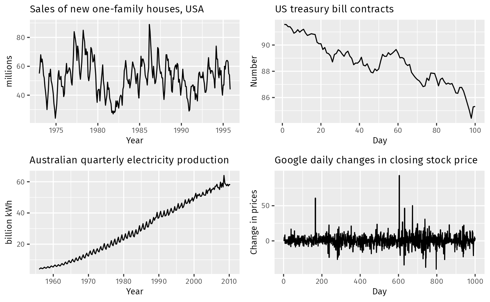

## Table of Contents

## What are financial market patterns?

Financial market patterns are shapes or trends that appear on charts of stock prices, currency values, or other financial data. Traders and investors look at these patterns to try to predict what might happen next in the market. Some common patterns include head and shoulders, double tops and bottoms, and triangles. These patterns can help people decide when to buy or sell, but they are not always right because the market can be unpredictable.

People use different tools and methods to find these patterns. They might use technical analysis, which involves studying past market data to spot trends. Another method is fundamental analysis, which looks at a company's financial health and the overall economy. Both methods can help identify patterns, but they require a lot of practice and knowledge. It's important to remember that while patterns can give clues about the market, they don't guarantee success, and it's wise to use them along with other information.

## What is the difference between randomness and cyclicality in financial markets?

Randomness in financial markets means that prices and events happen without a clear pattern or reason. It's like flipping a coin – you can't predict if it will be heads or tails. In the markets, this randomness can make it hard to predict what will happen next. For example, a stock might go up or down suddenly because of unexpected news or just because many people decide to buy or sell at the same time. Traders who believe in randomness often use strategies that spread their risk, like buying a mix of different stocks or using statistical models to make decisions.

Cyclicality, on the other hand, means that there are repeating patterns or cycles in the markets. These cycles can be based on seasons, economic conditions, or even human behavior. For example, some industries, like retail, might do better during the holiday season every year. Investors who believe in cyclicality look for these patterns and try to buy and sell at the right times to make the most profit. They might use charts and historical data to spot these cycles and plan their moves accordingly.

Understanding the difference between randomness and cyclicality can help investors and traders make better decisions. While some believe the markets are mostly random, others see clear cycles and try to take advantage of them. The truth might be a mix of both – some parts of the market might be more random, while others follow clearer cycles. It's important for anyone investing to consider both ideas and use them to build a strategy that works for them.

## How can beginners identify random patterns in financial markets?

For beginners, identifying random patterns in financial markets can be tricky because randomness means things happen without a clear reason or pattern. Imagine you're watching a stock's price go up and down. If it seems to jump around a lot without any clear reason, that might be randomness at work. You might see the price go up one day and down the next, and it's hard to predict what will happen. To spot this, beginners can look at short-term price movements and see if they can find any reason behind the changes. If there's no clear cause, like news or economic reports, it might just be random.

One way to get better at spotting randomness is by keeping a trading journal. Write down what happens each day and try to see if you can find any patterns. If you can't, and the market seems to move in ways you can't explain, that's a sign of randomness. Another tip is to use simple tools like moving averages, which smooth out price data over time. If the price keeps crossing above and below the moving average without any clear trend, that could be randomness too. Remember, randomness is normal in markets, and it's okay if you can't always predict what will happen next.

## What are some common cyclical patterns observed in financial markets?

Cyclical patterns in financial markets are trends that repeat over time. One common pattern is the seasonal cycle. For example, retail stocks often do better around the holiday season because more people are shopping. Another example is the agriculture sector, where companies might see more business during planting and harvesting times. These seasonal cycles can help investors know when to buy and sell to make the most profit.

Another cyclical pattern is the economic cycle, which includes periods of growth and recession. During a boom, stocks and other investments usually go up as the economy grows. But when a recession hits, prices can fall as people spend less and businesses struggle. Investors who understand these economic cycles might buy more stocks when prices are low during a recession, hoping to sell them for a profit when the economy recovers. These cycles can last for years and affect many different parts of the market.

There are also shorter-term cycles, like weekly or monthly patterns. For instance, some stocks might go up at the end of the month because of how funds and investors manage their portfolios. These shorter cycles can be harder to spot, but they can still help traders make better decisions. By looking at historical data and charts, beginners can start to see these patterns and use them to guide their investing choices.

## How do economic cycles influence financial market patterns?

Economic cycles have a big impact on financial market patterns. When the economy is growing, people feel more confident and spend more money. This can make stock prices go up because companies are making more profit. During these good times, investors might see patterns where stocks keep going up, and they might want to buy more to make money. But when the economy starts to slow down or goes into a recession, people spend less, and companies make less money. This can make stock prices fall, and investors might see patterns where stocks keep going down. Understanding these economic cycles can help investors know when to buy and sell to make the most profit.

These cycles can last for years and affect many different parts of the market. For example, during a boom, not just stocks but also real estate and commodities might go up in value. Investors who see these patterns might buy more of these assets when prices are low during a recession, hoping to sell them for a profit when the economy gets better. By looking at historical data and charts, investors can start to see these economic cycles and use them to guide their investing choices. It's important to remember that while these cycles can give clues about the market, they don't guarantee success, and it's wise to use them along with other information.

## What role does investor psychology play in creating market patterns?

Investor psychology plays a big role in creating market patterns. When lots of people feel the same way about the market, they tend to do the same things, like buying or selling at the same time. This can make prices go up or down quickly. For example, if everyone is excited about a new tech company, they might all buy its stock, making the price go up fast. But if bad news comes out, and everyone gets scared, they might all sell at once, making the price drop a lot. These big moves in the market create patterns that other investors can see and try to use to make money.

These patterns can happen because of something called "herd behavior," where people follow what others are doing without thinking too much about it. If everyone is buying a certain stock, others might jump in too, thinking they'll miss out if they don't. This can create bubbles, where prices get too high because of excitement, not because the company is worth that much. On the flip side, if everyone starts selling and panic spreads, it can lead to crashes. Understanding how people feel and why they act the way they do can help investors see these patterns coming and make better choices about when to buy or sell.

## Can statistical models accurately predict random versus cyclical market movements?

Statistical models can help predict market movements, but they are not perfect. When it comes to random movements, these models use past data to find patterns, but since random events don't follow a clear pattern, the predictions can be off. For example, if a stock price jumps around a lot without any clear reason, a statistical model might guess wrong because it's hard to predict randomness. Still, some models, like those using machine learning, can get better at spotting these random moves over time by learning from more data.

For cyclical movements, statistical models can do a better job because these patterns repeat over time. By looking at past cycles, like how retail stocks go up during the holiday season, models can predict when similar patterns might happen again. These models use things like moving averages and seasonal adjustments to spot these cycles. But even with cyclical patterns, surprises can happen, and the models might not catch everything. So, while statistical models can help, they work best when used with other tools and a good understanding of the market.

## How have historical market patterns influenced current investment strategies?

Historical market patterns have a big impact on how people invest today. Investors look at what happened in the past to guess what might happen next. For example, if stocks always go up during the holiday season, investors might buy more stocks before the holidays to make money when prices go up. They also look at big economic cycles, like booms and recessions, to decide when to buy and sell. If they see that stocks usually go down during a recession, they might wait to buy until prices are low and then sell when the economy gets better. By understanding these patterns, investors can make smarter choices and hopefully make more money.

But it's not just about following the same old patterns. Investors also learn from the past to come up with new ways to invest. For example, after big market crashes, like the one in 2008, investors started using more risk management strategies to protect their money. They might use things like stop-loss orders to sell a stock if it drops too much, or they might spread their money across different types of investments to lower the risk. By looking at what went wrong in the past, investors can find new ways to keep their money safe and still make good returns.

## What are the advanced techniques used to analyze cyclical patterns in financial markets?

Advanced techniques for analyzing cyclical patterns in financial markets often involve using complex mathematical models and computer algorithms. One common method is time series analysis, which looks at data points collected over time to find repeating patterns. This can help investors see how prices move in cycles, like how they might go up during certain months or seasons. Another technique is spectral analysis, which breaks down market data into different frequencies to spot regular cycles. By using these methods, investors can better predict when prices might go up or down and make smarter decisions about when to buy or sell.

Another advanced technique is using machine learning and artificial intelligence. These tools can look at huge amounts of data to find patterns that might be too hard for humans to see. For example, a machine learning model might find that certain stocks go up every time a specific economic report comes out. These models can also learn from new data and get better at predicting future cycles over time. By using these advanced techniques, investors can get a deeper understanding of market cycles and use this knowledge to improve their investment strategies.

## How do global events impact the randomness and cyclicality of financial markets?

Global events can make financial markets act more randomly. When something big happens, like a war or a natural disaster, it can surprise everyone and make stock prices jump around a lot. For example, if there's a big earthquake in a country that makes a lot of cars, the price of car stocks might suddenly drop because people worry about the damage. These surprises can make it hard to predict what will happen next in the market, because they don't follow any clear pattern. Investors might see the market move in ways they can't explain, and this randomness can make it tough to make good investment choices.

On the other hand, global events can also affect the cyclical patterns in financial markets. Some events, like elections or changes in trade policies, happen in a more predictable way and can create cycles. For instance, if a country has elections every four years, investors might see stock prices go up or down around election time because they know it's coming. These events can make certain cycles stronger or change how they work. By understanding how global events can create both randomness and cycles, investors can better prepare for what might happen and make smarter decisions about their money.

## What are the limitations of relying solely on historical patterns for market predictions?

Relying only on historical patterns for market predictions can be risky because the future might not be the same as the past. The market can change because of new technology, different laws, or big world events. For example, a pattern that worked well in the past might not work now if a new law changes how companies can make money. Also, the market can be affected by random things that no one can predict, like a sudden health crisis or a big natural disaster. If investors only look at what happened before, they might miss these new changes and make bad choices.

Another problem is that historical patterns can sometimes trick people into seeing things that aren't really there. This is called "overfitting," where investors think they see a pattern in the data, but it's just a coincidence. If they base their decisions on these fake patterns, they might lose money when the market doesn't do what they expected. It's important for investors to use historical patterns as just one part of their strategy and also look at other information, like what's happening in the world right now and what experts are saying. This way, they can make better guesses about what might happen next in the market.

## How can expert investors use an understanding of randomness and cyclicality to optimize their portfolios?

Expert investors can use their understanding of randomness and cyclicality to make their portfolios better by balancing their investments. They know that some parts of the market might move in cycles, like how retail stocks often do well during the holiday season. By recognizing these cycles, they can buy stocks before the cycle starts and sell them when prices go up. But they also know that the market can be random and surprise everyone. So, they spread their money across different types of investments to lower the risk. If one part of their portfolio goes down because of a random event, other parts might still do well, keeping their overall investment safe.

By understanding both randomness and cyclicality, expert investors can make smarter choices about when to buy and sell. They might use tools like moving averages to spot cycles and keep a close eye on the news to catch any random events that could affect the market. This way, they can adjust their portfolios to take advantage of good times and protect their money during bad times. It's all about finding the right balance between following patterns and being ready for surprises, so their investments can grow over time.

## References & Further Reading

[1]: Fama, E. F. (1970). ["Efficient Capital Markets: A Review of Theory and Empirical Work."](https://www.jstor.org/stable/2325486) Journal of Finance, 25(2), 383-417.

[2]: Malkiel, B. G. (1973). "A Random Walk Down Wall Street." W.W. Norton & Company.

[3]: Kahneman, D. (2011). ["Thinking, Fast and Slow."](https://link.springer.com/article/10.1007/s00362-013-0533-y) Farrar, Straus and Giroux.

[4]: Barberis, N., & Thaler, R. (2003). ["A Survey of Behavioral Finance."](https://www.nber.org/papers/w9222) In Handbook of the Economics of Finance (Vol. 1, pp. 1053-1128). 

[5]: Chan, E. (2009). ["Quantitative Trading: How to Build Your Own Algorithmic Trading Business."](https://github.com/ftvision/quant_trading_echan_book) Wiley.

[6]: Lopez de Prado, M. (2018). ["Advances in Financial Machine Learning."](https://www.amazon.com/Advances-Financial-Machine-Learning-Marcos/dp/1119482089) Wiley.

[7]: Jansen, S. (2020). ["Machine Learning for Algorithmic Trading."](https://github.com/stefan-jansen/machine-learning-for-trading) Packt Publishing.

[8]: Shiller, R. J. (2000). ["Irrational Exuberance."](https://press.princeton.edu/books/paperback/9780691173122/irrational-exuberance) Princeton University Press.

[9]: Aronson, D. (2006). ["Evidence-Based Technical Analysis: Applying the Scientific Method and Statistical Inference to Trading Signals."](https://www.amazon.com/Evidence-Based-Technical-Analysis-Scientific-Statistical/dp/0470008741) Wiley.