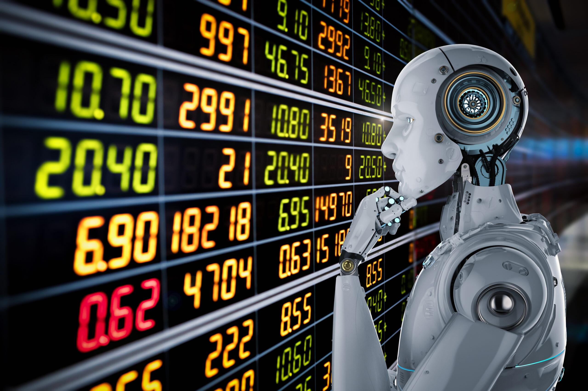

In the ever-evolving landscape of financial markets, intelligence and efficiency are key to staying ahead. Algorithmic trading, commonly referred to as algo trading, has transformed the ways traders engage with these markets. By employing complex algorithms and artificial intelligence, investors are enabled to execute trades at unparalleled speeds and frequencies that remain beyond the reach of human capabilities. This article examines the intricacies of financial markets intelligence via algorithmic trading, exploring the benefits, challenges, and future prospects of this technological advancement. In doing so, it underlines the importance of understanding algorithmic trading for investors keen on refining their trading strategies and gaining a competitive advantage.

Algorithmic trading systems operate by processing vast volumes of market data, identifying patterns, and executing trades based on pre-defined criteria. These systems enhance trading efficiency and accuracy by significantly reducing human errors and removing emotional biases from trading decisions. Through their ability to analyze data at exceptional speeds, algorithmic trading platforms allow investors to capitalize on even the smallest market fluctuations, thereby contributing to more consistent trading outcomes.



The deployment of artificial intelligence within these algorithms further amplifies their capabilities. AI enables these systems to learn from historical data, adapt to market variations, and refine their strategies accordingly, thereby continuously enhancing performance. This adaptability is crucial as it allows algo trading systems to remain relevant in dynamically changing market environments.

As we explore the future of algorithmic trading, advancements in artificial intelligence, machine learning, and data science are likely to play a crucial role in shaping its trajectory. The integration of these sophisticated technologies promises even greater autonomy and accuracy in trading systems, making them indispensable tools in financial markets. For traders looking to stay ahead, a comprehensive understanding of algorithmic trading is not only advantageous but essential in unlocking potential opportunities and maintaining a competitive edge.

## Table of Contents

## Understanding Algorithmic Trading

Algorithmic trading, commonly referred to as algo trading, leverages sophisticated computer programs to automate trading strategies with precision and speed. At the core, these systems are built on algorithms — structured sets of instructions designed to process market data and uncover profitable trading opportunities. These algorithms systematically analyze market trends, evaluate financial data, and execute trades on behalf of human traders. 

The primary objective of algorithmic trading is to enhance trading efficiency and precision while minimizing human error. By removing the subjective and often emotion-driven aspect of human decision-making, algorithmic trading allows for more consistent and reliable execution of trading strategies.

One of the significant advantages of [algorithmic trading](/wiki/algorithmic-trading) is its capacity to oversee multiple markets simultaneously and execute trades at speeds unattainable by manual traders. For example, in the time it takes for a human to analyze one market, an algorithm can scan and execute trades across several, ensuring that even the smallest price discrepancies are exploited.

The integration of [artificial intelligence](/wiki/ai-artificial-intelligence) (AI) into algorithmic trading systems significantly bolsters their capabilities. AI enables these systems to learn from historical data and recognize patterns that may not be immediately evident to human traders. By employing [machine learning](/wiki/machine-learning) techniques, algorithms can adapt to evolving market conditions, continuously refining their models to improve predictive accuracy.

For instance, consider a simple moving average crossover strategy, which buys or sells assets based on the intersection of two moving averages. A basic implementation in Python might look like this:

```python
def moving_average(data, window_size):
    return data.rolling(window=window_size).mean()

short_window = 20
long_window = 50

signals = pd.DataFrame(index=data.index)
signals['signal'] = 0.0

signals['short_mavg'] = moving_average(data['price'], short_window)
signals['long_mavg'] = moving_average(data['price'], long_window)

signals['signal'][short_window:] = np.where(signals['short_mavg'][short_window:] 
                                            > signals['long_mavg'][short_window:], 1.0, 0.0)

signals['positions'] = signals['signal'].diff()
```

This code sets up a basic signal for buying and selling based on moving average crossovers and can be part of a larger algorithmic trading strategy. It illustrates the principle of trading algorithms analyzing data and reacting to it through predefined logic.

Thus, by harnessing AI and sophisticated data analysis methods, algorithmic trading systems provide traders with vital insights and the ability to execute trades efficiently in a way that maximizes profitability and minimizes risk.

## The Benefits of Algorithmic Trading

Algorithmic trading offers significant advantages in terms of speed and efficiency. Automated systems can process and execute a multitude of trades within seconds, allowing traders to benefit from even minimal market fluctuations. This capability surpasses the reaction time of manual trading, providing a competitive edge in capturing momentary price discrepancies.

A notable benefit of algorithmic trading is the reduction in human errors and emotional biases. Automated trading systems adhere strictly to pre-defined rules, which helps ensure consistency and objectivity in trading decisions. This adherence to strategy diminishes the risk of impulsive decisions driven by fear or greed, traits often attributed to human traders.

Moreover, algorithmic trading permits [backtesting](/wiki/backtesting), a powerful tool for strategy evaluation. By simulating a strategy over historical data, traders can assess its performance and make necessary adjustments before deploying it in live markets. This application of hindsight in testing trading strategies helps refine approaches and improves their robustness.

Another benefit is increased market [liquidity](/wiki/liquidity-risk-premium), as algorithms can efficiently handle large volumes of trades. High-frequency trading contributes to liquidity by continuously participating in the market, which can facilitate narrower bid-ask spreads and potentially reduce transaction costs for all market participants.

Ultimately, algorithmic trading not only optimizes the mechanics of trade execution but also enhances the overall market functioning by providing stability through its systematic and rapid processing capabilities.

## Challenges and Risks of Algorithmic Trading

While algorithmic trading presents a range of benefits in terms of speed and efficiency, it also brings challenges that need careful consideration. A primary concern is technical failures. Due to the reliance on sophisticated software and hardware, glitches or malfunctions can result in substantial financial losses if not promptly resolved. The complex nature of these systems means that identifying and correcting errors can be intricate and time-consuming.

Market [volatility](/wiki/volatility-trading-strategies) poses another challenge to algorithmic trading. Algorithms are designed to follow pre-set instructions based on historical market data. However, during periods of unexpected market movements or unprecedented events, these predefined strategies may not perform effectively. The inability of algorithms to adapt to rapid changes can lead to suboptimal trading decisions.

The dependence on historical data is a further limitation. Algorithms often utilize past market behavior to forecast future movements. This approach proves limiting when applied to uncertain markets influenced by novel factors that historical data cannot account for. Thus, algorithmic strategies may not always align with current market conditions, potentially leading to erroneous trades.

Additionally, regulatory scrutiny is a significant [factor](/wiki/factor-investing) for consideration. Financial authorities are increasingly monitoring algorithmic trading to ensure it does not disrupt markets or lead to unfair advantages. Compliance with evolving regulations necessitates continual adaptation, and failure to do so can result in penalties or restrictions.

Despite these challenges, technological advancements are continuously being developed to enhance the robustness of algorithmic trading systems. Improvements in data processing and analysis, together with innovations in artificial intelligence, are enabling algorithms to become more adaptable and resilient. As the sector progresses, these developments are expected to address many of the existing limitations and risks associated with algorithmic trading.

## The Future of Algorithmic Trading

The future of algorithmic trading is marked by the increasing integration of advanced artificial intelligence techniques. Machine learning and [deep learning](/wiki/deep-learning) technologies are expected to play a pivotal role in making trading systems more autonomous and predictive. These technologies enable systems to adapt dynamically to market changes, improving their ability to forecast market trends and optimize trading strategies.

Data is becoming a critical asset in algorithmic trading, with data-driven strategies gaining prominence. The ability to process and analyze large volumes of data allows trading algorithms to identify complex patterns and make informed trading decisions. As machine learning algorithms continue to evolve, they will likely become more adept at handling diverse data sets and deriving actionable insights from them.

The advent of quantum computing is poised to potentially transform algorithmic trading by offering unprecedented computational power and efficiency. Quantum computers can solve complex problems much faster than classical computers, which could significantly enhance the speed and accuracy of trade executions. This development could lead to the creation of more sophisticated trading algorithms capable of processing and analyzing vast amounts of data in real time.

Personalized and adaptive trading algorithms are expected to become more prevalent, as they offer the ability to evolve with changing market conditions. These algorithms can adjust their parameters and strategies in response to new information, thereby maintaining their effectiveness over time. This adaptability is crucial in volatile and rapidly changing markets, where rigid strategies may become obsolete.

Regulatory developments will continue to shape the future landscape of algorithmic trading. As algorithmic trading becomes more widespread, regulators are likely to implement measures to ensure its responsible and sustainable evolution. This includes addressing issues related to market fairness, transparency, and systemic risk management. Adhering to regulatory standards will be essential for maintaining the trust and stability of financial markets as they become increasingly reliant on algorithmic technologies.

## Conclusion

Algorithmic trading is revolutionizing financial markets by enhancing efficiency and precision in trading strategies. It leverages advanced algorithms and artificial intelligence to make swift trading decisions, often outpacing traditional human-driven trading methods. The reliability and versatility of algorithmic systems continually improve as technology evolves, addressing existing challenges and paving the way for more robust trading practices.

For traders and investors, algorithmic trading offers a competitive edge by capitalizing on market opportunities that might otherwise go unnoticed. Its ability to process and analyze data at high speeds allows for more informed decision-making, mitigating the impact of human error and emotional biases.

Staying informed about regulatory developments and technological advancements is essential for participants in this rapidly changing field. As regulations evolve, they shape the operational landscape of algorithmic trading, ensuring that its growth is sustainable and responsible.

The fusion of human intelligence with automated systems signals a shift towards more dynamic and efficient financial markets. By harnessing both the analytical power of machines and the strategic insights of humans, traders can optimize their approaches and enhance market fluidity.

As algorithmic trading continues to integrate more sophisticated AI techniques and explores the potential of quantum computing, it holds the promise of transforming how financial transactions are conducted, offering unprecedented levels of efficiency and adaptability.

## References & Further Reading

[1]: ["Algorithmic Trading and DMA: An Introduction to Direct Access Trading Strategies"](https://www.amazon.com/Algorithmic-Trading-DMA-introduction-strategies/dp/0956399207) by Barry Johnson

[2]: ["Advances in Financial Machine Learning"](https://www.amazon.com/Advances-Financial-Machine-Learning-Marcos/dp/1119482089) by Marcos Lopez de Prado

[3]: ["Machine Learning for Algorithmic Trading"](https://github.com/stefan-jansen/machine-learning-for-trading) by Stefan Jansen

[4]: Aldridge, I. (2013). ["High Frequency Trading: A Practical Guide to Algorithmic Strategies and Trading Systems."](https://onlinelibrary.wiley.com/doi/pdf/10.1002/9781119203803.fmatter) Wiley.

[5]: Cartea, Á., Jaimungal, S., & Penalva, J. (2015). ["Algorithmic and High-Frequency Trading."](https://assets.cambridge.org/97811070/91146/frontmatter/9781107091146_frontmatter.pdf) Cambridge University Press.

[6]: Chan, E. P. (2009). ["Quantitative Trading: How to Build Your Own Algorithmic Trading Business."](https://github.com/egorpe/EPChan-QuantitativeTrading/blob/master/example7_6.m) Wiley.

[7]: Kissell, R. (2013). ["The Science of Algorithmic Trading and Portfolio Management."](https://www.sciencedirect.com/book/9780124016897/the-science-of-algorithmic-trading-and-portfolio-management) Academic Press.