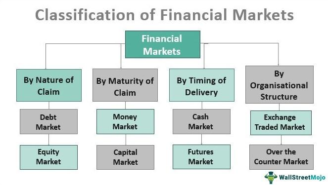

## Table of Contents

## What are financial markets and why are they important for investors?

Financial markets are places where people and businesses can buy and sell things like stocks, bonds, and commodities. These markets help people with money to invest it and help businesses and governments to get the money they need. Think of it like a big store where instead of buying clothes or food, you are buying pieces of companies or loans to governments.

These markets are really important for investors because they give them a way to grow their money. By buying stocks or bonds, investors can earn more money over time if the companies or governments do well. This can help people save for things like retirement or buying a house. Financial markets also help spread risk, so if one investment doesn't do well, an investor might still be okay because they have other investments that are doing better.

## What are the different types of financial markets?

Financial markets come in different types, each serving a specific purpose. One type is the stock market, where people can buy and sell shares of companies. When you buy a stock, you own a small piece of that company. Another type is the bond market, where governments and companies borrow money by selling bonds. When you buy a bond, you're lending money and will get it back with interest over time.

There are also commodity markets, where people trade things like oil, gold, and wheat. These markets help set prices for these important goods. Another type is the foreign exchange market, where different currencies are traded. This helps businesses and travelers when they need to use money from another country. Lastly, there's the derivatives market, where people trade contracts based on the value of other assets, like stocks or commodities. These can be used to manage risk or to bet on future price movements.

All these markets work together to help the economy run smoothly. They let people invest their money in different ways and help businesses and governments get the funds they need to grow and operate. By understanding these markets, investors can make better choices about where to put their money.

## How do stock markets work and what are the key terms investors should know?

Stock markets are places where people can buy and sell pieces of companies, called stocks or shares. When a company wants to raise money, it can sell these shares to the public. People who buy the shares become part-owners of the company. The price of a stock goes up and down based on how well the company is doing and what people think about its future. If more people want to buy the stock than sell it, the price goes up. If more people want to sell than buy, the price goes down. Stock markets are important because they let companies get money to grow and let people invest in those companies.

There are some key terms that investors should know. 'Stock' or 'share' is a piece of a company that you can buy. 'Dividend' is money that a company pays to its shareholders, usually from its profits. 'Portfolio' is all the different stocks and other investments that someone owns. 'Market capitalization' or 'market cap' is the total value of all a company's shares. 'Bull market' is when stock prices are going up and people feel good about investing. 'Bear market' is when stock prices are going down and people feel worried. Knowing these terms can help investors understand what's happening in the stock market and make better choices about where to put their money.

## What are bonds and how do they function within financial markets?

Bonds are like IOUs that governments or companies sell to people who want to lend them money. When you buy a bond, you're giving the government or company money, and they promise to pay you back with interest over time. The interest is like a reward for lending them your money. Bonds are a way for governments and companies to borrow money to do things like build roads or start new projects. They are also a way for people to invest their money and earn a steady return.

In financial markets, bonds work by helping to move money from people who have it to those who need it. When a government or company wants to borrow money, they issue bonds. Investors can then buy these bonds, and in return, they get regular interest payments until the bond matures, which is when the government or company pays back the money they borrowed. The price of bonds can go up or down based on things like interest rates and how safe people think the bond is. This makes bonds an important part of financial markets because they help spread money around and give people another way to invest.

## What role do commodities play in financial markets and how can investors engage with them?

Commodities are things like oil, gold, and wheat that people buy and sell in special markets called commodity markets. These markets help set the prices for these important goods, which are used every day around the world. Commodities are important in financial markets because they let businesses and countries trade these goods easily. This helps keep the economy running smoothly by making sure there's enough supply of things people need.

Investors can engage with commodities in a few ways. One way is by buying the actual goods, like buying gold bars or oil barrels, but this can be hard and expensive. A more common way is by trading commodity futures, which are agreements to buy or sell a certain amount of a commodity at a set price in the future. This lets investors bet on whether the price of a commodity will go up or down without having to store the goods themselves. By investing in commodities, people can spread their risk and maybe make money if they guess the prices right.

## How do foreign exchange markets impact investment strategies?

Foreign exchange markets, often called [forex](/wiki/forex-system) markets, are where people trade different countries' money. This impacts investment strategies because the value of one currency compared to another can change how much money an investor makes or loses. For example, if an investor from the U.S. buys stocks in Europe, they need to change their dollars into euros. If the euro gets stronger compared to the dollar, the investor's returns in dollars will be higher when they change the money back. But if the euro gets weaker, their returns will be lower.

Because of this, investors need to think about currency changes when they make their plans. They might use special tools called currency hedges to protect themselves from big changes in currency values. Or they might choose to invest in countries where they think the currency will get stronger. By understanding how foreign exchange markets work, investors can make smarter choices and maybe earn more money.

## What are derivatives and how are they used by investors?

Derivatives are financial contracts that get their value from something else, like stocks, bonds, or commodities. They're like bets on what will happen to the price of these things in the future. For example, a farmer might use a derivative to lock in a price for their crops before they're even harvested. This way, they know how much money they'll get, even if prices go down later.

Investors use derivatives in different ways. One way is to manage risk. If an investor owns a lot of stocks, they might use derivatives to protect themselves if the stock prices go down. It's like buying insurance for their investments. Another way is to make money by guessing which way prices will move. If an investor thinks the price of oil will go up, they might buy a derivative that will pay them if they're right. By using derivatives, investors can try to make more money or protect what they already have, but it can also be risky if they guess wrong.

## How can investors analyze market trends and make informed decisions?

Investors can analyze market trends and make informed decisions by looking at different kinds of information. They can start by studying charts and graphs that show how prices have changed over time. This can help them see patterns and figure out if prices are going up or down. Another way is to read news and reports about companies and the economy. This can give them clues about what might happen next. They can also use special tools called technical analysis to look at things like moving averages and other indicators that help predict future price movements.

Another important thing for investors is to understand what other people are thinking and doing. They can do this by looking at things like investor sentiment, which is how people feel about the market. If a lot of people are feeling good and buying stocks, it might be a good time to invest. But if people are feeling worried and selling, it might be a time to be careful. By putting all this information together, investors can make better guesses about where the market is going and decide when to buy or sell.

It's also helpful for investors to keep learning and staying up to date. They can join investment clubs or online groups to talk with other investors and share ideas. Reading [books](/wiki/algo-trading-books) and taking classes about investing can also help them understand the market better. By always trying to learn more, investors can make smarter choices and maybe earn more money over time.

## What are the risks associated with investing in financial markets and how can they be mitigated?

Investing in financial markets can be risky because the value of your investments can go up and down a lot. One big risk is market risk, which means the whole market might go down and take your investments with it. Another risk is that a single company you've invested in might do badly, which is called company-specific risk. There's also the chance that you might not know enough about investing and make bad choices, which is called lack of knowledge risk. And if you put all your money into one type of investment, you could lose a lot if that investment doesn't do well, which is known as concentration risk.

To lower these risks, investors can do a few things. One good way is to spread their money around, which is called diversification. This means investing in different types of things, like stocks, bonds, and commodities, so if one goes down, the others might still do well. Another way is to learn more about investing, so you can make better choices. You can read books, take classes, or talk to other investors to get smarter. It's also a good idea to think about how long you plan to keep your money invested. If you can leave it in for a long time, you might be able to wait out the ups and downs of the market. By doing these things, you can make your investments safer and maybe earn more money over time.

## How do economic indicators influence financial markets and investment decisions?

Economic indicators are like clues that tell us how the economy is doing. Things like unemployment rates, inflation, and how much people are spending can show if the economy is growing or shrinking. When these indicators change, they can make the prices of stocks, bonds, and other investments go up or down. For example, if unemployment goes down, it might mean more people have jobs and are spending money, which can be good for companies and their stocks. But if inflation goes up a lot, it might make people worry about the future and cause them to sell their investments.

Investors pay close attention to these economic indicators because they help them decide when to buy or sell. If the indicators show the economy is doing well, investors might feel more confident and buy more stocks, hoping to make money as the market grows. On the other hand, if the indicators suggest the economy might be heading for trouble, investors might sell their stocks to avoid losing money. By understanding these indicators, investors can make smarter choices and maybe earn more money over time.

## What advanced strategies can expert investors use to optimize their portfolios?

Expert investors can use a few advanced strategies to make their portfolios better. One strategy is called asset allocation, which means deciding how much money to put into different types of investments, like stocks, bonds, and commodities. They might use something called modern portfolio theory to figure out the best mix that can give them good returns without too much risk. Another strategy is called rebalancing, where they check their portfolio from time to time and make changes to keep it in line with their goals. This can mean selling some investments that have done well and buying more of those that haven't, to keep the right balance.

Another advanced strategy is using derivatives, like options and futures, to manage risk or make money. For example, an investor might use options to protect their stocks from big price drops, or they might use futures to bet on the price of commodities. Expert investors might also use a strategy called hedging, where they make investments that will go up if their main investments go down, to protect themselves from losses. By using these strategies, expert investors can try to get the best returns possible while keeping their risks under control.

## How do global events and geopolitical risks affect financial markets and what strategies can investors employ to navigate these challenges?

Global events and geopolitical risks can shake up financial markets a lot. When things like wars, elections, or big policy changes happen, they can make people worried about the future. This worry can cause stock prices to go down and make investors want to sell their investments to be safe. For example, if there's a big fight between countries, it might make people think that trade will be harder and companies will make less money. This can make the whole market feel shaky and cause big changes in prices.

To handle these challenges, investors can use a few smart strategies. One way is to spread their money around in different countries and types of investments, so if one place has problems, the others might still do well. This is called diversification. Another way is to keep an eye on the news and try to guess what might happen next. If they think a big event might cause trouble, they might move their money into safer investments like bonds or gold. By staying calm and thinking ahead, investors can try to protect their money even when the world feels unsure.

## What are investor strategies in financial markets?

Investor strategies in financial markets cater to diverse investment objectives and risk preferences, primarily classified into passive and active strategies. Each category employs distinct techniques to achieve specific financial goals like long-term growth, income generation, and capital preservation.

### Passive vs. Active Strategies

**Passive Strategies**: Passive investment strategies involve minimal buying and selling, aiming to replicate the performance of specific market indices. A well-known passive strategy is index fund investing, where investors seek returns by holding a basket of stocks that mirror the index. Exchange-Traded Funds (ETFs) are often used in passive strategies due to their lower cost structures and diversification benefits. The primary objective here is to achieve average market returns while minimizing fees.

**Active Strategies**: Active strategies, on the other hand, involve frequent trades as investors attempt to outperform the market benchmarks through careful security analysis and market timing. Investors in this category employ several approaches including stock picking, sector rotation, and tactical asset allocation. Active fund managers leverage market inefficiencies to generate alpha, although this approach can incur higher costs and risks.

### Techniques in Investment Strategies

**Diversification**: Diversification is a crucial element across both passive and active strategies. By spreading investments across various asset classes, sectors, and geographies, investors can reduce portfolio risk. The reasoning behind diversification is that different assets often perform differently in varied market conditions, ensuring that poor performance in one segment is offset by gains in another.

For instance, if an investor allocates their portfolio into stocks, bonds, and commodities, the formula for expected portfolio return ($E(R_p)$) and variance ($\sigma_p^2$) is given by:

$$
E(R_p) = w_1E(R_1) + w_2E(R_2) + \ldots + w_nE(R_n)
$$

$$
\sigma_p^2 = \sum_{i=1}^{n} \sum_{j=1}^{n} w_i w_j Cov(R_i, R_j)
$$

where $w$ represents the weights and $E(R)$ denotes expected returns of individual assets, while $Cov$ indicates covariances between assets.

**Risk Management**: Effective risk management is imperative to mitigate potential losses. Strategies such as stop-loss orders, options hedging, and tail-risk management allow investors to protect their portfolios against significant downturns. For example, the use of options—both calls and puts—enables investors to hedge against adverse price movements.

**Market Timing**: Market timing involves making buy or sell decisions of financial assets by predicting future market price movements. While it's a vital aspect of active investing, it requires precision and is often associated with higher risk. Technical analysis techniques, like moving averages and momentum indicators, are frequently utilized to make informed timing decisions.

In conclusion, selecting suitable investment strategies necessitates a comprehensive understanding of risk tolerance and financial goals. While passive strategies emphasize steady, long-term growth, active strategies offer potential for higher returns, albeit with increased risk. Employing diversification, risk management, and market timing effectively enhances the likelihood of achieving favorable investment outcomes.

## What are the market investment opportunities?

Investment opportunities are diverse, ranging from traditional markets like stocks and bonds to alternative markets such as real estate and commodities. Each of these markets presents unique prospects and challenges, making it essential for investors to conduct thorough analyses before committing capital.

Traditional markets, including stocks and bonds, remain primary investment vehicles. Stocks represent equity in a company and offer potential for capital appreciation as well as dividends. Bonds, on the other hand, are debt instruments that provide regular interest income and are generally considered less risky than stocks. Analyzing these markets requires a mix of fundamental and technical analysis.

Fundamental analysis involves assessing a company’s financial statements, industry conditions, and economic indicators to estimate the intrinsic value of a security. For example, the price-to-earnings ratio (P/E ratio), calculated as:

$$
\text{P/E Ratio} = \frac{\text{Market Price per Share}}{\text{Earnings per Share (EPS)}}
$$

is widely used to evaluate whether a stock is over or undervalued relative to its earnings.

Technical analysis, in contrast, relies on historical price and [volume](/wiki/volume-trading-strategy) data to predict future price movements. Tools like moving averages and relative strength index (RSI) are commonly employed to identify trends and entry or [exit](/wiki/exit-strategy) points.

Alternative markets, such as real estate and commodities, offer diversification benefits. Real estate investments involve acquiring property interests and can provide income, tax advantages, and inflation hedging. Commodities like gold, oil, and agricultural products can serve as a hedge against market [volatility](/wiki/volatility-trading-strategies) and currency risk.

Emerging trends are reshaping investment landscapes, with [ESG](/wiki/esg-investing) (Environmental, Social, and Governance) investing gaining prominence. ESG investing evaluates companies based on their environmental practices, social impact, and governance policies. This approach not only aligns investments with ethical and sustainable principles but also responds to increasing evidence that well-governed, socially conscious companies can offer competitive returns. According to Morningstar's "Global Sustainable Fund Flows" report, the first quarter of 2021 saw a record $185.3 billion flow into ESG funds, indicating growing investor interest in sustainability [1].

In conclusion, the continuous evolution of investment opportunities necessitates comprehensive analysis and an adaptive strategy. By staying informed and responsive to market dynamics, investors can effectively engage with both traditional and emerging markets to potentially enhance their portfolios.

[1] Morningstar. "Global Sustainable Fund Flows: Q1 2021 in Brief". Morningstar, 2021.

## What is the Role of Algorithmic Trading?

Algorithmic trading fundamentally transforms the landscape of modern investing by utilizing computer algorithms to execute trades based on pre-defined criteria. This approach eradicates human biases and emotional influences from trading decisions, thereby enhancing the objectivity and efficiency of trade execution. By relying on algorithms, traders can capitalize on market opportunities more systematically and consistently.

There are various [algorithmic trading](/wiki/algorithmic-trading) strategies that investors might employ:

1. **Trend-Following**: One of the most popular strategies, trend-following algorithms capitalize on market momentum by identifying and riding price trends. The core principle is the assumption that asset prices moving in a particular direction will continue to do so. This strategy typically involves moving averages or other technical indicators to generate buy or sell signals.
$$
   \text{{Signal}} = 
      \begin{cases} 
      \text{{Buy}}, & \text{if } \text{MA}_{\text{short-term}} > \text{MA}_{\text{long-term}} \\
      \text{{Sell}}, & \text{if } \text{MA}_{\text{short-term}} < \text{MA}_{\text{long-term}}
      \end{cases}

$$

2. **Mean Reversion**: Contrary to trend-following, mean reversion strategies are based on the principle that prices will eventually revert to their historical mean. Traders using this strategy identify overbought or oversold conditions and bet on the price moving back to its average.
$$
   \text{{Price Deviation}} = \text{Current Price} - \text{Mean Price}

$$

   If the deviation exceeds a certain threshold, a reversion trade is executed.

3. **Arbitrage**: This strategy exploits price discrepancies in identical or similar financial instruments across different markets or forms. Real-time data analysis ensures the capture of minimal price differentials before markets correct these inefficiencies.
$$
   \text{{Profit}} = \text{Price}_{\text{Market A}} - \text{Price}_{\text{Market B}}

$$

4. **Volatility-Based Strategies**: These strategies assess market volatility levels to determine the timing and size of trades. Options trading frequently employs volatility models, predicting periods of high or low volatility to maximize profit or minimize risk exposure.

Algorithmic trading offers significant advantages:
- **Speed**: The rapid execution of trades allows investors to capitalize on market movements within fractions of a second, making the strategy particularly advantageous in high-frequency trading (HFT).
- **Accuracy**: Algorithms minimize human error in trade placement, ensuring consistent execution per predefined parameters.
- **Backtesting**: Traders can evaluate the effectiveness of their strategies by testing them against historical data, allowing for refinement and optimization without putting capital at risk.

Given these attributes, algorithmic trading becomes an indispensable tool for modern investors seeking to systematically approach the complexities of financial markets. As technology advances, the role of algorithmic trading continues to evolve, offering more sophisticated tools and methods for successful investment strategies.

## References & Further Reading

[1]: Bergstra, J., Bardenet, R., Bengio, Y., & Kégl, B. (2011). ["Algorithms for Hyper-Parameter Optimization."](https://dl.acm.org/doi/10.5555/2986459.2986743) Advances in Neural Information Processing Systems 24.

[2]: ["Advances in Financial Machine Learning"](https://www.amazon.com/Advances-Financial-Machine-Learning-Marcos/dp/1119482089) by Marcos Lopez de Prado

[3]: ["Evidence-Based Technical Analysis: Applying the Scientific Method and Statistical Inference to Trading Signals"](https://www.amazon.com/Evidence-Based-Technical-Analysis-Scientific-Statistical/dp/0470008741) by David Aronson

[4]: ["Machine Learning for Algorithmic Trading"](https://github.com/stefan-jansen/machine-learning-for-trading) by Stefan Jansen

[5]: ["Quantitative Trading: How to Build Your Own Algorithmic Trading Business"](https://www.amazon.com/Quantitative-Trading-Build-Algorithmic-Business/dp/1119800064) by Ernest P. Chan