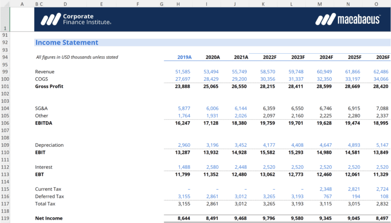

## Table of Contents

## What is financial modeling and why is it important?

Financial modeling is a way to use numbers and math to predict how a business will do in the future. It's like making a guess about how much money a company will make or spend, using a computer or a spreadsheet. People use financial models to see if a business idea is good, to plan for the future, or to decide if they should buy or sell a company.

Financial modeling is important because it helps people make better decisions. By looking at different scenarios, like what happens if sales go up or down, people can plan for different possibilities. This can help businesses avoid problems and find new opportunities. For example, a company might use a financial model to see if it's a good idea to start selling a new product, or if they should borrow money to grow their business.

## What are the basic components of a financial model?

The first part of a financial model is the income statement. This shows how much money a company makes and spends over a certain time, like a year. It starts with the money coming in from sales, then subtracts the costs of making those sales, like materials and labor. After that, it subtracts other costs like rent and salaries. What's left is the profit or loss for that period.

The second part is the balance sheet. This is like a snapshot of what the company owns and owes at a specific time. It lists assets, which are things like cash, buildings, and equipment. It also lists liabilities, which are debts the company has to pay, like loans. The difference between assets and liabilities is called equity, which is the value of the company that belongs to the owners.

The third part is the cash flow statement. This tracks the actual money moving in and out of the business. It shows money coming in from sales and investments, and money going out for expenses and investments. It's important because even if a company is making a profit, it might run out of cash if it's not managing its money well. Together, these three parts help people understand how a business is doing and where it might be headed.

## How do you start building a simple financial model?

To start building a simple financial model, you first need to gather all the important numbers about your business. This includes how much money you make from sales, how much you spend on things like materials and salaries, and how much money you have in the bank. You can use a spreadsheet program like Microsoft Excel to put all these numbers in one place. Start by setting up your spreadsheet with sections for the income statement, balance sheet, and cash flow statement. In the income statement section, list your sales at the top, then subtract your costs to find out your profit or loss.

Next, you fill in the balance sheet section with what your business owns, like cash and equipment, and what it owes, like loans. The difference between what you own and what you owe is your equity. Then, in the cash flow statement section, you track the actual money coming in and going out. This helps you see if you have enough cash to keep the business running. Once you have all these numbers in your spreadsheet, you can start playing with them to see what happens if things change, like if your sales go up or your costs go down. This is how you can use your simple financial model to make better decisions for your business.

## What are the different types of financial models used in business?

There are several types of financial models that businesses use, each serving a different purpose. One common type is the three-statement model, which includes the income statement, balance sheet, and cash flow statement. This model is used to get a complete picture of a company's financial health and to forecast future performance. Another type is the discounted cash flow (DCF) model, which helps estimate the value of a company or an investment by looking at its future cash flows and discounting them back to today's value. This is often used for investment analysis and valuation.

Other types of financial models include the leveraged buyout (LBO) model, which is used to analyze the financial feasibility of buying a company using a lot of borrowed money. This model helps investors see if they can make money by buying, improving, and then selling a company. The merger and acquisition (M&A) model is used to analyze the financial impact of combining two companies, helping to determine if the merger or acquisition makes sense financially. Lastly, the budgeting model helps businesses plan their finances for the future, setting targets for revenue and expenses and helping to manage cash flow. Each of these models helps businesses make better decisions by providing a structured way to analyze financial data.

## What software tools are commonly used for financial modeling?

People often use Microsoft Excel for financial modeling because it's easy to use and very flexible. You can make spreadsheets with numbers and formulas to predict how a business will do. Excel has lots of tools that help with things like making charts and doing calculations. Many businesses use Excel because it's good for making detailed financial models and it's something a lot of people already know how to use.

Another popular tool is Google Sheets, which is like Excel but works online. It's good for working with other people because everyone can see and change the model at the same time. For bigger and more complex models, some people use specialized software like Argus or Adaptive Insights. These programs have special features that make it easier to do things like forecasting and budgeting. They can be more expensive, but they're very helpful for big businesses that need to do a lot of financial modeling.

## How do you ensure the accuracy of a financial model?

To make sure a financial model is accurate, you need to start with good, reliable data. This means using real numbers from your business's past records, like how much you sold last year or how much you spent on supplies. It's also important to check these numbers carefully to make sure they are correct. If you use wrong numbers, your whole model will be off. You can also talk to people who know a lot about your business to make sure your assumptions, like how much sales might grow, are realistic.

Another way to keep your financial model accurate is to test it with different scenarios. This means changing some numbers to see how they affect the results. For example, you might want to see what happens if sales go down or if costs go up. If your model still makes sense with these changes, it's a good sign that it's accurate. It's also a good idea to have someone else look at your model. They might spot mistakes or have new ideas that can make your model better. By doing these things, you can trust that your financial model will help you make good decisions for your business.

## What are common pitfalls to avoid in financial modeling?

One common pitfall in financial modeling is using bad data. If you start with numbers that aren't correct or up-to-date, your whole model will be wrong. It's like trying to build a house on a shaky foundation. Always double-check your data and make sure it comes from reliable sources. Another mistake is making assumptions that are too hopeful or not realistic. For example, if you think your sales will grow by 50% every year without a good reason, your model won't be useful. It's better to use numbers that are based on what's really happening in your business and the market.

Another pitfall is not testing your model with different scenarios. If you only look at one possible future, you might miss important risks or opportunities. Try changing some numbers to see what happens if things don't go as planned. This can help you prepare for different situations. Also, many people make the mistake of not getting a second opinion on their model. Having someone else look at your work can help you find mistakes and improve your model. By avoiding these common pitfalls, you can make a financial model that really helps you make good decisions for your business.

## How can financial modeling be used for forecasting and decision making?

Financial modeling helps businesses see into the future by using numbers to guess how things might go. It's like making a plan based on what you think will happen with your sales, costs, and money in the bank. By putting all these numbers into a model, you can see if a new idea, like starting to sell a different product, will make or lose money. This helps you decide if it's a good idea to try it. For example, if your model shows that selling the new product will bring in more money than it costs, you might decide to go ahead with it.

Using financial models also helps businesses make smart choices by looking at different possibilities. You can change the numbers in your model to see what happens if things go differently than you expect. Maybe you want to see what would happen if sales dropped or if costs went up. By testing these different scenarios, you can plan for problems and find new opportunities. This makes your business more ready for whatever might happen, and it helps you make decisions that are based on facts, not just guesses.

## What advanced techniques can enhance a financial model's effectiveness?

One advanced technique to make a financial model better is using something called Monte Carlo simulations. This is a fancy way of saying you run your model many times with different numbers to see all the possible outcomes. It's like playing a game where you roll the dice a lot to see all the ways the game could end. This helps you understand the risks better and make smarter decisions because you can see not just one future, but many possible futures.

Another technique is called sensitivity analysis. This means you change one thing at a time in your model, like the price of your product or how much you spend on supplies, to see how it affects your results. It's like testing how sensitive your model is to changes. By doing this, you can find out which parts of your business are most important to watch closely. This can help you focus on what really matters and make your model more useful for planning and making decisions.

## How do you integrate macroeconomic factors into a financial model?

To include big picture things like the economy in your financial model, you start by looking at things like interest rates, inflation, and how the economy is growing. These are called macroeconomic factors. You can add them to your model by using numbers that show what's happening in the economy. For example, if interest rates are going up, you might put that into your model to see how it changes the cost of borrowing money for your business. This helps you see how big changes in the world might affect your business.

Once you have these numbers in your model, you can play around with them to see what happens if the economy does something different than you expect. Maybe you want to see what would happen if inflation goes up a lot or if the economy starts to shrink. By doing this, you can prepare your business for different situations and make better plans. It's like having a map that shows you different paths your business could take depending on what happens in the world around you.

## What role does financial modeling play in mergers and acquisitions?

Financial modeling is really important when companies are thinking about joining together or one company buying another. It's like a tool that helps them see if it's a good idea. When two companies are thinking about merging, they use a financial model to look at things like how much money they will make together, how much they will have to spend, and if the whole thing will be worth it. The model helps them figure out if the merger will make the new company stronger and more profitable.

In an acquisition, where one company buys another, financial modeling helps the buyer see if the price they are paying is fair. They put numbers into the model to see how much the company they want to buy is really worth. They look at things like how much money the company makes, how much it spends, and how much it might make in the future. This helps them decide if the acquisition is a smart move that will help their business grow and make more money.

## How can one validate and stress test a complex financial model?

To make sure a complex financial model is right and strong, you first need to check all the numbers and guesses you used. This means looking at where your numbers come from and making sure they are correct. You can also ask someone else to look at your model to see if they spot any mistakes or if they think your guesses about the future are realistic. This is like having a friend check your homework to make sure you did it right. By doing this, you can trust that your model is based on good information.

After you've checked your model, you can make it even stronger by stress testing it. This means you change some of the numbers to see what happens if things go differently than you expect. For example, you might want to see what would happen if sales dropped a lot or if costs went up suddenly. By trying out these different scenarios, you can see if your model still makes sense and if your business can handle tough situations. This helps you prepare for the future and make better decisions because you know your model can handle different challenges.

## What is Understanding Financial Modeling?

Financial modeling involves the process of creating a numerical representation of a company's financial performance. These models are developed using spreadsheets that structure and manipulate complex financial data to provide insights into potential business outcomes. A key objective of financial modeling is to enable analysts to assess the potential impacts of business decisions and various market fluctuations. By organizing data into structured formats, analysts can predict how changes might affect key financial metrics and the overall health of a company.

Commonly employed models in financial analysis include discounted cash flow (DCF) analysis and sensitivity analysis. Discounted cash flow analysis is instrumental in valuation tasks. It involves estimating the value of an investment based on its expected future cash flows. The present value of these cash flows is calculated by discounting them using a required rate of return. The formula for calculating DCF is:

$$

DCF = \sum_{t=1}^{n} \frac{CF_t}{(1 + r)^t} 
$$

where $CF_t$ is the cash flow in time period $t$, $r$ is the discount rate, and $n$ is the number of time periods. This model aids in making informed decisions regarding investments and corporate finance activities.

Sensitivity analysis, another critical component, involves altering model assumptions to see how changes in input variables impact outcomes. This type of analysis helps identify which variables most significantly affect profits or valuations and therefore require closer scrutiny in decision-making processes.

Effective financial modeling is crucial for various corporate needs, including accurate valuation, budget planning, and strategic decision-making. Companies rely on these models to plan budgets, forecast cash flows, conduct valuation exercises, evaluate business decisions, and develop corporate strategy. To achieve accuracy, the quality of the input data and underlying assumptions is paramount. High-quality data ensures that the models reflect true economic conditions, thus providing reliable outputs.

Moreover, the assumptions used in these models must be realistic and based on thorough analysis and factual information. Analysts must evaluate the credibility and relevance of input data to maintain model reliability.

As these models become more sophisticated, the use of technological tools is essential for developing dynamic and flexible spreadsheets capable of handling complex datasets. The integration of quantitative techniques and software tools can significantly enhance the capability of financial models, providing businesses with the ability to make informed and strategic financial decisions.

## References & Further Reading

[1]: Bergstra, J., Bardenet, R., Bengio, Y., & Kégl, B. (2011). ["Algorithms for Hyper-Parameter Optimization."](https://papers.nips.cc/paper/4443-algorithms-for-hyper-parameter-optimization) Advances in Neural Information Processing Systems 24.

[2]: ["Advances in Financial Machine Learning"](https://www.amazon.com/Advances-Financial-Machine-Learning-Marcos/dp/1119482089) by Marcos Lopez de Prado

[3]: ["Evidence-Based Technical Analysis: Applying the Scientific Method and Statistical Inference to Trading Signals"](https://www.amazon.com/Evidence-Based-Technical-Analysis-Scientific-Statistical/dp/0470008741) by David Aronson

[4]: ["Machine Learning for Algorithmic Trading"](https://github.com/PacktPublishing/Machine-Learning-for-Algorithmic-Trading-Second-Edition) by Stefan Jansen

[5]: ["Quantitative Trading: How to Build Your Own Algorithmic Trading Business"](https://www.amazon.com/Quantitative-Trading-Build-Algorithmic-Business/dp/1119800064) by Ernest P. Chan