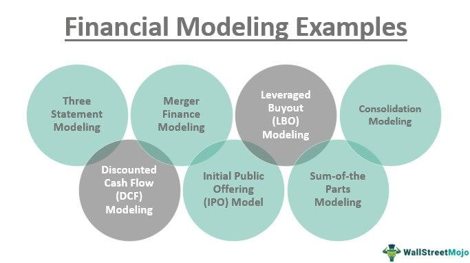

The integration of technology into financial domains, specifically in financial modeling, economic forecasting, and financial analysis, has led to profound transformations in traditional trading methods. At the forefront of this evolution is algorithmic trading, which leverages advanced financial models and economic indicators to automate and optimize the trading process. This article aims to explore how these interconnected fields are collectively empowering modern trading systems.

Understanding these domains not only demystifies the complexities of contemporary trading for seasoned professionals but also provides invaluable insights for newcomers to the financial sector. Financial modeling serves as the backbone of predictive analytics by translating intricate financial data into actionable insights through structured spreadsheets and mathematical models. Similarly, economic forecasting employs diverse economic indicators to project market behaviors, offering foresight into variables such as GDP growth, inflation, and interest rates. When these models are applied within algorithmic trading, they enhance the efficiency and accuracy of trade executions by automating decision-making processes based on predefined rules and real-time data analytics.



The goal of this exploration is to elucidate how the synergistic use of these tools not only augments trading efficiency but also improves the precision of market engagements. As we progress through this article, a detailed understanding of each component—financial modeling, economic forecasting, and financial analysis—will illustrate their indispensable role in the mechanics of algorithmic trading. By examining these domains, we uncover the potential for these technologies to redefine the landscape of financial markets, ensuring that both current practitioners and future entrants are well-equipped to capitalize on the opportunities presented by these advancements.

## Table of Contents

## Understanding Financial Modeling

Financial modeling involves the process of creating a numerical representation of a company's financial performance. These models are developed using spreadsheets that structure and manipulate complex financial data to provide insights into potential business outcomes. A key objective of financial modeling is to enable analysts to assess the potential impacts of business decisions and various market fluctuations. By organizing data into structured formats, analysts can predict how changes might affect key financial metrics and the overall health of a company.

Commonly employed models in financial analysis include discounted cash flow (DCF) analysis and sensitivity analysis. Discounted cash flow analysis is instrumental in valuation tasks. It involves estimating the value of an investment based on its expected future cash flows. The present value of these cash flows is calculated by discounting them using a required rate of return. The formula for calculating DCF is:

$$

DCF = \sum_{t=1}^{n} \frac{CF_t}{(1 + r)^t} 
$$

where $CF_t$ is the cash flow in time period $t$, $r$ is the discount rate, and $n$ is the number of time periods. This model aids in making informed decisions regarding investments and corporate finance activities.

Sensitivity analysis, another critical component, involves altering model assumptions to see how changes in input variables impact outcomes. This type of analysis helps identify which variables most significantly affect profits or valuations and therefore require closer scrutiny in decision-making processes.

Effective financial modeling is crucial for various corporate needs, including accurate valuation, budget planning, and strategic decision-making. Companies rely on these models to plan budgets, forecast cash flows, conduct valuation exercises, evaluate business decisions, and develop corporate strategy. To achieve accuracy, the quality of the input data and underlying assumptions is paramount. High-quality data ensures that the models reflect true economic conditions, thus providing reliable outputs.

Moreover, the assumptions used in these models must be realistic and based on thorough analysis and factual information. Analysts must evaluate the credibility and relevance of input data to maintain model reliability.

As these models become more sophisticated, the use of technological tools is essential for developing dynamic and flexible spreadsheets capable of handling complex datasets. The integration of quantitative techniques and software tools can significantly enhance the capability of financial models, providing businesses with the ability to make informed and strategic financial decisions.

## Economic Forecasting and Its Role

Economic forecasting is vital in understanding the expected future behavior of various economic variables. By leveraging numerous economic indicators, forecasters aim to predict both short-term and long-term market conditions, influencing key areas such as GDP growth rates, inflation, unemployment rates, and the impacts of monetary policies.

GDP growth rates serve as a foundational indicator for economic forecasting. They provide insights into the overall economic performance and guide stakeholders in making informed decisions. Similarly, inflation rates are closely monitored, as they affect consumer purchasing power and can influence central banks' monetary policy decisions. Unemployment rates, another critical indicator, reflect labor market conditions and impact economic stability and growth perspectives.

Monetary policy impacts are also a crucial aspect of economic forecasting. Changes in interest rates or money supply can have direct and indirect effects on economic activity, influencing business investments, consumer spending, and inflationary trends.

In recent years, the field of economic forecasting has witnessed significant advancements due to the integration of sophisticated econometric models and [machine learning](/wiki/machine-learning) techniques. These tools enhance the accuracy and reliability of predictions, allowing analysts to process large datasets and identify complex patterns that traditional methods might overlook. For instance, machine learning algorithms can be employed to model non-linear relationships between economic variables, offering more nuanced forecasts.

To demonstrate the potential of machine learning in economic forecasting, consider a simple Python example that uses linear regression to predict GDP growth based on historical data of various economic indicators:

```python
import pandas as pd
from sklearn.model_selection import train_test_split
from sklearn.linear_model import LinearRegression
from sklearn.metrics import mean_squared_error

# Load dataset
data = pd.read_csv('economic_data.csv')

# Feature selection
X = data[['inflation_rate', 'unemployment_rate', 'interest_rate']]
y = data['gdp_growth']

# Split the dataset into train and test sets
X_train, X_test, y_train, y_test = train_test_split(X, y, test_size=0.2, random_state=0)

# Train a linear regression model
model = LinearRegression()
model.fit(X_train, y_train)

# Make predictions
predictions = model.predict(X_test)

# Evaluate the model
mse = mean_squared_error(y_test, predictions)
print(f'Mean Squared Error: {mse}')
```

This example illustrates how economic forecasting can be applied using data-driven approaches to expect future economic climates better. Such forecasts inform policy-making, business strategies, and investor decisions, thereby playing a significant role in shaping economic landscapes. As forecasting techniques continue to evolve, they promise even greater precision and utility in guiding economic decision-making.

## Financial Analysis: Evaluating Corporate Health

Financial analysis is a crucial component in assessing a company's financial health, operational effectiveness, and growth potential. This section will cover the primary techniques and methodologies used in financial analysis, as well as the role of technology in enhancing these techniques.

Financial analysis involves the examination of financial statements which include the balance sheet, income statement, and cash flow statement. Analysts employ various techniques to evaluate a company's performance and identify trends that may indicate potential risks or opportunities. Key techniques include ratio analysis, trend analysis, and financial benchmarking.

Ratio analysis is pivotal in evaluating a company's financial ratios, such as [liquidity](/wiki/liquidity-risk-premium) ratios, profitability ratios, and leverage ratios. Liquidity ratios, like the current ratio and quick ratio, measure a company's ability to meet short-term obligations. Profitability ratios, such as return on assets (ROA) and return on equity (ROE), assess the efficiency of a company in generating profits from its resources. Leverage ratios, including the debt-to-equity ratio, highlight the extent of a company's financial leverage.

Trend analysis involves comparing a company's historical financial data over different periods. This method helps to identify patterns or trends in financial performance, providing insights into areas of consistent growth or decline. For example, plotting revenue growth over several years can reveal whether a company is expanding consistently or experiencing [volatility](/wiki/volatility-trading-strategies).

Financial benchmarking compares a company's performance with industry standards or competitors. This technique enables analysts to evaluate how well a company is performing relative to its peers. Metrics like gross margin and net income can be compared against industry averages to assess competitive position.

The integration of technology into financial analysis has significantly expanded its capabilities. Advanced data analytics and software tools allow for more accurate and efficient analysis of large datasets. Machine learning algorithms can identify patterns that may not be immediately apparent to human analysts, enhancing predictive accuracy. Python, a popular programming language in finance, offers various packages for financial analysis, such as pandas for data manipulation and NumPy for numerical calculations. An example Python script to calculate a financial ratio might involve:

```python
import pandas as pd

# Sample data
data = {'Total Assets': [1000000], 'Total Liabilities': [500000]}
df = pd.DataFrame(data)

# Calculate leverage ratio
df['Leverage Ratio'] = df['Total Liabilities'] / df['Total Assets']
print(df['Leverage Ratio'])
```

Investors and analysts rely heavily on financial analysis to make informed investment decisions and strategic planning. A deep understanding of a company's financial condition aids in assessing investment risks and identifying potential growth opportunities. 

As the financial landscape continues to evolve, leveraging technology and data analytics becomes critical to maintaining precision and scope in financial analysis. These advancements not only streamline traditional processes but also provide a deeper understanding of financial complexities that drive corporate strategy and investment decisions.

## The Mechanics of Algorithmic Trading

Algorithmic trading automates the execution of trades by leveraging computer algorithms that are designed based on various trading strategies and market data. These algorithms operate at speeds and frequencies unreachable by manual trading, allowing for the swift execution of large volumes of transactions, often within milliseconds. The sophistication of these algorithms stems from the integration of quantitative models and [artificial intelligence](/wiki/ai-artificial-intelligence) (AI), which aid in formulating strategies that can adapt to the ever-changing market dynamics.

The capability to process extensive datasets in real-time is a fundamental advantage of [algorithmic trading](/wiki/algorithmic-trading). This computational efficiency is achieved through advanced data processing techniques, enabling market participants to analyze and act upon real-time market information faster than traditional trading approaches. For example, an algorithm might evaluate live price feeds, trading volumes, and other relevant market indicators to determine optimal entry and [exit](/wiki/exit-strategy) points for trades.

Mathematical models and machine learning are integral to the development of algorithmic trading strategies. By employing techniques such as regression analysis, neural networks, and clustering, traders can identify patterns and predict future price movements with greater accuracy. A simple example of a trading algorithm might be based on a moving average crossover strategy, where a short-term moving average (e.g., 50-day) is compared to a long-term moving average (e.g., 200-day) to signal buy or sell actions:

```python
def moving_average_crossover(prices, short_window=50, long_window=200):
    short_m_avg = prices.rolling(window=short_window).mean()
    long_m_avg = prices.rolling(window=long_window).mean()
    signals = (short_m_avg > long_m_avg).astype(int) - (short_m_avg < long_m_avg).astype(int)
    return signals
```

Despite offering significant efficiency improvements, algorithmic trading also presents unique challenges. Software errors, also known as bugs, can lead to unintended trading actions and significant financial losses. Moreover, the high-frequency nature of algorithmic trading can exacerbate market volatility, particularly during times of market stress. Algorithms must be rigorously tested and continuously monitored to mitigate these risks.

Additionally, the regulatory environment surrounding algorithmic trading is continuously evolving to address concerns about market fairness and stability. Traders and firms engaging in algorithmic trading must ensure compliance with laws and guidelines set forth by regulatory bodies.

In summary, algorithmic trading represents a major advancement in the trading domain, providing unmatched speed, efficiency, and analytical capability. However, it requires careful design, implementation, and oversight to manage its associated risks and potential market impacts.

## Integrating Financial Modeling and Analysis in Trading Algorithms

Modern trading algorithms increasingly rely on robust financial modeling and analysis to enhance their decision-making capabilities. By integrating financial models into trading algorithms, these systems can effectively adapt to varying market conditions and execute strategic trades with greater precision.

One of the key advantages of this integration is its ability to support predictive analytics. Financial models, such as those based on time series analysis or machine learning techniques, enable algorithms to forecast market trends more accurately. For instance, algorithms can utilize historical price data and other economic indicators to predict future price movements, allowing traders to make informed decisions.

Collaboration between financial analysts and data scientists is essential in designing effective algorithmic strategies. Financial analysts provide domain expertise, identifying relevant data and economic variables that should be included in models. Data scientists contribute by developing and optimizing algorithms that can process these data efficiently, ensuring that the models can be used effectively in real-time trading scenarios.

Successful integration of financial modeling into trading algorithms also results in reduced reaction times and improved agility in trading operations. For example, a well-designed algorithm can process market data, execute trades, and adjust its strategy in milliseconds, far quicker than a human trader could react. This swift response is particularly beneficial in fast-paced markets where opportunities may be short-lived.

Python, being a popular language for both financial modeling and algorithmic trading, facilitates this integration. Libraries such as NumPy, Pandas, and Scikit-learn are commonly used for data manipulation and machine learning tasks. Below is an example of how one might implement a simple trading algorithm using these tools:

```python
import pandas as pd
import numpy as np
from sklearn.linear_model import LinearRegression

# Load historical market data
data = pd.read_csv('market_data.csv')

# Feature engineering - creating lag features for time series data
data['lag_1'] = data['price'].shift(1)
data['lag_2'] = data['price'].shift(2)

# Drop missing values
data.dropna(inplace=True)

# Set up features (X) and target (y)
X = data[['lag_1', 'lag_2']]
y = data['price']

# Train a simple linear regression model
model = LinearRegression()
model.fit(X, y)

# Predict future prices
data['predicted_price'] = model.predict(X)

# Define a simple trading strategy
data['signal'] = np.where(data['predicted_price'] > data['price'], 1, -1)  # Buy if predicted price is higher

# Execute trades based on the signal
def execute_trade(signal):
    if signal == 1:
        print("Executing Buy Order")
    elif signal == -1:
        print("Executing Sell Order")

# Simulate trades
for signal in data['signal']:
    execute_trade(signal)
```

In the future, as financial markets continue to evolve, the integration of financial modeling and algorithmic trading is expected to deepen, driven by advancements in AI and machine learning. By adopting these integrated approaches, traders can enhance their capacity to navigate complex markets, optimizing investment outcomes effectively.

## Challenges and Future Prospects

Despite the numerous benefits, financial modeling and algorithmic trading face several challenges that must be navigated to leverage their full potential. One of the primary challenges in these domains is the issue of data privacy. As trading algorithms often rely on vast amounts of data, ensuring the privacy and security of this information is crucial. Mishandling or data breaches can lead to significant financial and reputational losses. Consequently, companies must invest in robust cybersecurity measures to safeguard sensitive information.

Market unpredictability is another persistent challenge. Financial models and algorithms depend on historical data and defined patterns to make predictions. However, unforeseen events, such as geopolitical tensions or natural disasters, can lead to market volatilities that these models cannot predict accurately. This unpredictability necessitates the development of more adaptable algorithms capable of adjusting to rapid market changes.

Adapting to regulatory changes is also essential for sustaining algorithmic trading operations. Regulatory bodies worldwide continuously update their policies to mitigate systemic risks associated with high-frequency trading. Traders and financial institutions must remain agile, ensuring compliance with these regulations to avoid penalties and maintain operational integrity. Maintaining data integrity amidst these regulatory shifts is paramount, as accurate data is foundational to reliable predictions and trade executions.

The future of algorithmic trading and financial modeling appears promising with the anticipated integration of artificial intelligence (AI) and machine learning. These technologies are poised to enhance the sophistication of financial algorithms, allowing for more accurate and nuanced market analysis. Machine learning, for example, can identify complex patterns and relationships in datasets that traditional models might overlook. This capability will enable smarter, more predictive trading strategies.

Moreover, global connectivity and advancements in computational power are set to drive further progress in financial technology. As traders and institutions around the world become increasingly interconnected, there is an unprecedented opportunity for collaboration and data sharing, leading to enhanced market insights and strategies. Enhanced computational power will enable the processing of larger datasets, facilitating real-time data analysis and decision-making.

To remain competitive in this rapidly evolving landscape, stakeholders must prioritize continuous innovation. This means not only adapting to technological and regulatory changes but also proactively seeking new methodologies and frameworks that can improve trading outcomes. Embracing a culture of innovation will be crucial for businesses aiming to lead in the future of financial markets.

In summary, while financial modeling and algorithmic trading present some challenges related to data privacy, market unpredictability, and regulatory compliance, the future prospects with advancements in AI and global collaboration offer exciting opportunities. Maintaining a competitive edge will require stakeholders to embrace and drive technological innovations continually.

## Conclusion

The integration of financial modeling, economic forecasting, and algorithmic trading represents a pivotal evolution in financial markets. These disciplines form a harmonious synergy that collectively empowers market participants with the ability to both predict and efficiently respond to market trends. Financial modeling provides the structured framework necessary to interpret complex financial data, while economic forecasting offers a lens through which future economic conditions are understood. Algorithmic trading, driven by these insights, allows for the automation and execution of trades with unprecedented speed and precision.

Professionals operating in today’s dynamic financial landscape must continually update and refine their technical knowledge to fully leverage these innovations. Staying informed about advancements in technology, such as machine learning and artificial intelligence, is crucial for adapting strategies to the ever-evolving market environment.

Nonetheless, the advancement of these technologies introduces ethical considerations that must not be overlooked. Ensuring data privacy, adhering to regulatory standards, and mitigating risks associated with algorithmic trade execution are imperative to maintain market integrity and trust.

Ultimately, by embracing and thoughtfully integrating these technological advancements, traders and analysts can enhance the effectiveness of their investment decisions. This evolution not only optimizes outcomes but also contributes to the development of more resilient and responsive financial markets, setting the stage for future progress and innovation.

## References & Further Reading

[1]: Bergstra, J., Bardenet, R., Bengio, Y., & Kégl, B. (2011). ["Algorithms for Hyper-Parameter Optimization."](https://papers.nips.cc/paper/4443-algorithms-for-hyper-parameter-optimization) Advances in Neural Information Processing Systems 24.

[2]: ["Advances in Financial Machine Learning"](https://www.amazon.com/Advances-Financial-Machine-Learning-Marcos/dp/1119482089) by Marcos Lopez de Prado

[3]: ["Evidence-Based Technical Analysis: Applying the Scientific Method and Statistical Inference to Trading Signals"](https://www.amazon.com/Evidence-Based-Technical-Analysis-Scientific-Statistical/dp/0470008741) by David Aronson

[4]: ["Machine Learning for Algorithmic Trading"](https://github.com/PacktPublishing/Machine-Learning-for-Algorithmic-Trading-Second-Edition) by Stefan Jansen

[5]: ["Quantitative Trading: How to Build Your Own Algorithmic Trading Business"](https://www.amazon.com/Quantitative-Trading-Build-Algorithmic-Business/dp/1119800064) by Ernest P. Chan