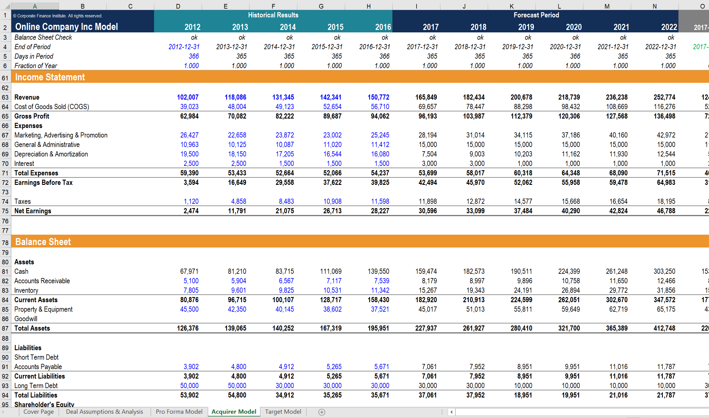

## Table of Contents

## What is a financial model and why is Excel commonly used for creating them?

A financial model is a tool that helps people predict how a business will do in the future. It uses numbers and math to guess things like how much money a company will make, how much it will spend, and if it will be profitable. People use financial models to make important decisions, like whether to start a new project or invest in a company.

Excel is commonly used for creating financial models because it is easy to use and very flexible. You can put numbers into cells, do calculations, and make charts all in one place. Excel also has lots of built-in functions that help with financial calculations, which saves time. Plus, many people already know how to use Excel, so it's easy for teams to work together on a financial model.

## How do you set up a basic financial model in Excel?

To set up a basic financial model in Excel, start by opening a new spreadsheet. In the first few rows, write down the name of your model and any important notes about what it's for. Then, set up your timeline across the top row, starting from column B. You can use months or years, depending on what you need. Next, list your main categories like revenue, expenses, and profit in the first column, starting from row 2. Fill in the numbers for each category and time period. For example, if you're predicting monthly sales, put those numbers in the revenue row under each month.

Once you have your basic numbers in place, you can use Excel formulas to do calculations. For example, to find out your profit, you can subtract your total expenses from your total revenue. You can write a formula like "=B2-B3" in cell B4 if B2 is your revenue and B3 is your expenses. As you add more numbers, the formula will automatically update. You can also use functions like SUM to add up rows or columns quickly. Finally, you can make charts to show your data visually. Just select your data and choose a chart type from the Insert menu. This will help you see trends and make better decisions.

## What are the key components of a financial model in Excel?

The key components of a financial model in Excel include inputs, calculations, and outputs. Inputs are the numbers you put into the model, like how much money you think you'll make or spend. These numbers go into cells on the spreadsheet. Calculations are the formulas you use to figure out things like profit or how much money you'll have left. You write these formulas in other cells, and they use the input numbers to do the math. Outputs are the results you get from your calculations, like a chart showing your profit over time or a number telling you how much money you'll have at the end of the year.

Another important part of a financial model is the timeline. This is the row or column where you list the time periods you're looking at, like months or years. The timeline helps you see how things change over time. Assumptions are also key. These are the guesses you make about things like how fast your sales will grow or how much prices will change. You write these assumptions down clearly so everyone knows what the model is based on. Finally, sensitivity analysis can be useful. This means changing some of your assumptions to see how they affect your results. It helps you understand what could happen if things don't go as planned.

## How can you use Excel formulas to automate calculations in financial models?

Excel formulas are a powerful way to automate calculations in financial models. You can use them to add up numbers, subtract, multiply, or divide, and much more. For example, if you want to know your profit, you can write a simple formula like "=B2-B3" in a cell. Here, B2 might be your revenue and B3 your expenses. When you change the numbers in B2 or B3, the formula automatically updates to show the new profit. This saves time because you don't have to do the math yourself every time something changes.

You can also use more advanced functions to make your financial model even better. Functions like SUM can add up a whole row or column of numbers quickly. For example, "=SUM(B2:B10)" will add up all the numbers from B2 to B10. Another useful function is IF, which lets you do different calculations based on certain conditions. For example, "=IF(B2>1000, B2*0.1, B2*0.05)" will multiply B2 by 10% if it's over 1000, or by 5% if it's not. By using these formulas and functions, you can make your financial model work automatically and accurately, helping you make better decisions.

## What are some common financial modeling techniques used in Excel?

Financial modeling in Excel often involves using techniques like the three-statement model and the discounted cash flow (DCF) model. The three-statement model links the income statement, balance sheet, and cash flow statement together. This helps you see how changes in one part of your business affect the others. For example, if you increase your sales, you can see how that impacts your profits and cash reserves. This model is great for understanding the overall financial health of a business.

Another common technique is the discounted cash flow (DCF) model. This method is used to figure out how much a business or project is worth based on its future cash flows. You predict how much money the business will make in the future and then use a discount rate to bring those future amounts back to today's value. This helps you decide if it's a good investment. Both the three-statement and DCF models are powerful tools that help you make smarter financial decisions by showing you the big picture of your business's finances.

## How do you incorporate assumptions and scenarios into an Excel financial model?

In an Excel financial model, assumptions are the guesses you make about things like how fast your sales will grow or how much prices will change. You should write these assumptions clearly in your spreadsheet so everyone knows what the model is based on. For example, you might assume that your sales will grow by 5% each year. You can put this number in a cell and use it in your calculations. If you change the assumption later, the whole model will update automatically. This makes it easy to see how different guesses affect your results.

Scenarios are different sets of assumptions that you want to compare. You can set up different scenarios in Excel to see what would happen if things go differently than you expect. For example, you might have a "best case" scenario where sales grow quickly, and a "worst case" scenario where sales grow slowly. You can use Excel's Scenario Manager tool to switch between these scenarios and see how they change your model's outputs. This helps you plan for different possibilities and make better decisions.

## What are the best practices for formatting and organizing financial models in Excel?

When you make a financial model in Excel, it's important to keep it neat and easy to read. Start by using clear headings for different sections like revenue, expenses, and profit. Put these headings in the first column and use bold text so they stand out. Use different colors to separate different parts of your model, but don't use too many colors because that can make it hard to read. Make sure your numbers are lined up in rows and columns so it's easy to see patterns and do calculations. Also, use cell borders to make it clear where one section ends and another begins.

Another good practice is to keep your inputs and assumptions in one place, like at the top of your spreadsheet. This way, if you need to change an assumption, you can do it in one spot and the whole model will update. Use clear labels for these inputs so everyone knows what they mean. It's also a good idea to add notes or comments to explain any complicated parts of your model. This helps other people understand your work and makes it easier to check for mistakes. By following these simple tips, you can make your financial model clear, easy to use, and more reliable.

## How can you use Excel's data validation and protection features to enhance your financial models?

Using Excel's data validation feature can make your financial models more accurate and easier to use. Data validation lets you set rules for what people can enter into certain cells. For example, you can make sure that someone only enters numbers between 1 and 100 in a cell, or that they choose from a list of options you provide. This helps prevent mistakes because people can't enter numbers that don't make sense. It also makes your model more user-friendly because it guides people to enter the right information.

Excel's protection features are also very helpful for keeping your financial models safe and reliable. You can lock certain cells or sheets so that only you or people with a password can change them. This is useful for protecting your formulas and assumptions from being accidentally changed or tampered with. By protecting your model, you can share it with others without worrying that they'll mess it up. This makes your financial model more trustworthy and easier to work with in a team.

## What advanced Excel functions are useful for complex financial modeling?

Advanced Excel functions like VLOOKUP and INDEX/MATCH are very useful for complex financial modeling. VLOOKUP lets you find information in a big table by looking up a value in the first column. For example, if you have a list of products and their prices, VLOOKUP can help you find the price of a specific product quickly. INDEX/MATCH is even better because it's more flexible. It can look up values in any column, not just the first one. This is handy when you need to pull data from different parts of your model.

Another useful function is XNPV, which calculates the net present value of cash flows that happen at different times. This is important for figuring out how much an investment is worth when the money comes in at irregular intervals. The SUMIFS function is also great for adding up numbers based on multiple conditions. For example, you can use it to sum up all sales in a certain region for a specific product. By using these advanced functions, you can make your financial models more accurate and powerful, helping you make better decisions.

## How do you perform sensitivity analysis in Excel financial models?

Sensitivity analysis in Excel helps you see how changing one thing can affect your whole financial model. You start by picking the key numbers you want to test, like how much your sales might grow or what interest rate you'll pay on a loan. Then, you change these numbers a little bit to see how they impact your results. For example, if you think your sales might grow by 5% each year, you can try changing it to 4% or 6% and see what happens to your profit.

To do this in Excel, you can use the Data Table feature. First, set up your model with all your numbers and formulas. Then, make a table where you list different values for the number you want to test. In another column, you can show how each value changes your key results, like your profit. When you use the Data Table tool, Excel will automatically calculate the results for each value you list. This way, you can quickly see how sensitive your model is to changes in your assumptions, helping you understand what could happen if things don't go as planned.

## What are some common pitfalls and errors to avoid when building financial models in Excel?

When you're building financial models in Excel, it's easy to make mistakes if you're not careful. One common problem is linking cells incorrectly. If you accidentally link to the wrong cell, your whole model can give you the wrong answers. Another big mistake is using hard-coded numbers in your formulas instead of using cells with your assumptions. This makes it hard to change your model later and can lead to errors if you forget to update those numbers. Also, be careful with circular references, where a formula depends on itself, because these can cause your model to break or give you wrong results.

Another pitfall to watch out for is not organizing your model well. If your model is messy and hard to read, it's easy to make mistakes or for others to misunderstand it. Make sure to use clear labels and keep your inputs and assumptions in one place. It's also important to double-check your formulas and calculations to make sure they're right. A small mistake in a formula can mess up your whole model. By avoiding these common errors and being careful with your work, you can build better and more reliable financial models in Excel.

## How can you integrate Excel financial models with other software and tools for more advanced analysis?

You can connect your Excel financial models with other software to do more advanced analysis. One way to do this is by using Power Query to pull data from different places like databases or other Excel files. This helps you bring all your information into one place so you can analyze it together. Another way is to use Power BI, which can take your Excel data and turn it into cool charts and dashboards. This makes it easier to see trends and share your findings with others.

Another tool you can use is VBA, which lets you write small programs to automate tasks in Excel. For example, you can use VBA to run your financial model every month without having to do it manually. You can also use Excel's add-ins like Solver to find the best solutions for complex problems in your model. By linking your Excel models with these other tools, you can make your analysis more powerful and get better insights for making decisions.

## What is the Power of Excel in Financial Modeling?

Excel has long been a cornerstone tool in financial analysis and modeling due to its versatility and power. It serves as a ubiquitous platform in the finance industry, where its extensive capabilities are leveraged for tasks ranging from straightforward data organization to complex financial projections. The prevalence of Excel is owed to several factors, including its widespread availability, user-friendly interface, and adaptability to cater to diverse financial modeling needs.

### Excel in Developing Financial Models

Excel is instrumental in creating detailed financial models, which are essential tools in analyzing a company's financial performance and estimating its value. These models provide a framework for simulating various business scenarios and assessing their potential impact on key financial metrics. Excel's grid layout and comprehensive suite of functions allow users to build models that incorporate intricate calculations and projections.

1. **Company Financial Models**: A fundamental application of Excel is in developing company financial models, where users input historical financial data to forecast future performance. This involves creating detailed projections of financial statements, including income statements, balance sheets, and cash flow statements. Analysts can manipulate these models to evaluate potential changes in business strategy or external economic conditions.

2. **Valuation Models**: Excel is also essential in constructing valuation models, such as discounted cash flow (DCF) models. These models estimate a company's value by projecting its future cash flows and discounting them back to present value using the formula:
$$
   \text{Discounted Cash Flow} = \frac{CF_1}{(1 + r)^1} + \frac{CF_2}{(1 + r)^2} + \cdots + \frac{CF_n}{(1 + r)^n}

$$

   In such models, Excel’s data tables and scenario analysis tools are invaluable for testing assumptions and performing sensitivity analysis to understand how different variables impact valuations.

### Advantages of Using Excel

1. **Accessibility**: Excel's accessibility is unparalleled; it is readily available and widely taught, reducing the barrier to entry for financial professionals. Most professionals in finance are trained in Excel, making it a default choice for financial modeling.

2. **Cost-Effectiveness**: Compared to specialized financial modeling software, Excel is a cost-effective solution. Its inclusion in Microsoft Office suites means that many organizations already utilize Excel, eliminating additional costs associated with purchasing or subscribing to dedicated modeling tools.

3. **Customization and Flexibility**: One of Excel's greatest strengths lies in its customization potential. Users can design models tailored to specific needs, incorporating unique assumptions and intricate calculations that bespoke software packages might not support. Through the use of Excel formulas, functions, and Visual Basic for Applications (VBA) macros, users can automate numerous processes within their models, enhancing efficiency and accuracy.

   For instance, leveraging Excel’s VBA can simplify repetitive tasks such as updating data sets or running iterative simulations, thereby reducing manual effort and the likelihood of errors. A simple example code to automate a repetitive task in Excel with VBA might look like this:

   ```vba
   Sub UpdateData()
       Dim ws As Worksheet
       For Each ws In ThisWorkbook.Worksheets
           ws.Cells(1, 1).Value = "Updated"
       Next ws
   End Sub
   ```

By enabling deep customization, Excel positions itself as an irreplaceable tool in the arsenal of finance professionals, empowering them to analyze vast amounts of data and make data-driven decisions confidently.

## References & Further Reading

[1]: Fairhurst, D. S. (2017). ["Financial Modeling in Excel For Dummies."](https://www.amazon.com/Financial-Modeling-Excel-Dummies-Danielle/dp/8126569182) For Dummies.

[2]: Rees, M. (2018). ["Principles of Financial Modelling: Model Design and Best Practices Using Excel and VBA."](https://onlinelibrary.wiley.com/doi/book/10.1002/9781118903933) Wiley.

[3]: Holden, C. W. (2015). ["Excel Modeling in Investments."](https://www.pearson.com/en-us/subject-catalog/p/excel-modeling-in-investments/P200000005923/9780205987245) Pearson.

[4]: Jansen, S. (2020). ["Machine Learning for Algorithmic Trading: Predictive models to extract signals from market and alternative data for systematic trading strategies with Python."](https://github.com/stefan-jansen/machine-learning-for-trading) Packt Publishing.

[5]: Chan, E. P. (2009). ["Quantitative Trading: How to Build Your Own Algorithmic Trading Business."](https://github.com/ftvision/quant_trading_echan_book) Wiley.