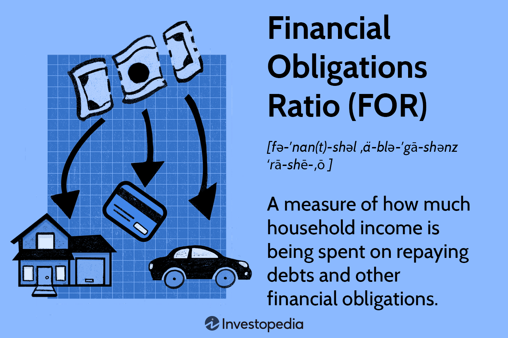

## Table of Contents

## What is the Financial Obligations Ratio (FOR)?

The Financial Obligations Ratio (FOR) is a measure used to understand how much of a household's income goes towards paying debts and other financial obligations. It includes payments like mortgages, credit card debts, car loans, rent, and other regular payments. By looking at the FOR, we can see how much of people's earnings are used for these payments each month.

This ratio is important because it helps us understand the financial health of households. If the FOR is high, it means that a large part of people's income is going towards paying off debts, which might leave them with less money for other needs like food, savings, or emergencies. Economists and policymakers use the FOR to make decisions about economic policies and to help people manage their finances better.

## How is the Financial Obligations Ratio calculated?

The Financial Obligations Ratio (FOR) is calculated by dividing a household's total required debt and lease payments by their disposable personal income. This gives us a percentage that shows how much of a household's income goes towards paying off debts and other financial obligations each month. The payments included in the numerator of the ratio are things like mortgages, credit card payments, car loans, rent, and other regular payments that must be made.

To find the FOR, you first add up all the required payments for debts and leases that a household has to make each month. Then, you find out the household's disposable personal income, which is the money they have left after taxes. You divide the total payments by the disposable income and multiply by 100 to get the FOR as a percentage. A higher FOR means that more of the household's income is being used to pay off debts and obligations, which can be a sign of financial stress.

## Why is the Financial Obligations Ratio important for financial planning?

The Financial Obligations Ratio (FOR) is important for financial planning because it shows how much of your money goes towards paying bills and debts each month. If your FOR is high, it means you're using a big part of your income to pay for things like your home, car, and credit cards. This can make it hard to save money or handle unexpected costs, so knowing your FOR helps you see if you need to change your spending or find ways to earn more.

By keeping an eye on your FOR, you can make better choices about taking on new debts or loans. If your FOR is already high, adding more debt could make things even tougher. But if it's low, you might have more room to borrow for things like a new car or a house without hurting your financial health. Using the FOR in your planning helps you stay on track and avoid money troubles down the road.

## What are the components included in the numerator of the FOR formula?

The numerator of the Financial Obligations Ratio (FOR) includes all the payments a household has to make each month. This means things like mortgage payments for a house, rent if you don't own your home, and car loan payments. It also includes payments for things you might have bought on credit, like furniture or electronics, and any money you owe on credit cards.

On top of that, the numerator counts lease payments for things like apartments or cars, and any other regular payments that you have to make. This could be payments for student loans, personal loans, or even things like alimony or child support. All these payments together show how much money a household needs to pay out each month for their financial obligations.

## What are the components included in the denominator of the FOR formula?

The denominator of the Financial Obligations Ratio (FOR) is all about the money a household has left after paying taxes. This is called disposable personal income. It's the money you can use to pay for things like your bills, food, and fun stuff after the government takes out taxes from your paycheck.

Knowing your disposable personal income is important because it shows how much money you really have to work with each month. When you divide your total monthly payments by this income, you get the FOR. This helps you see if you're spending too much of your money on bills and debts, or if you have enough left over for other things.

## How does the FOR differ from the Debt Service Ratio (DSR)?

The Financial Obligations Ratio (FOR) and the Debt Service Ratio (DSR) both help us understand how much of a household's money goes towards paying off debts and other obligations. But they look at slightly different things. The FOR includes a wider range of payments, like mortgages, rent, car loans, credit card payments, and even lease payments for apartments or cars. It also includes other regular payments like alimony or child support. This makes the FOR a more complete picture of a household's financial responsibilities.

On the other hand, the DSR focuses only on payments that are related to debt. This means it includes things like mortgage payments, car loans, and credit card payments, but it doesn't include rent or lease payments. The DSR is a bit narrower than the FOR because it only looks at how much of a household's income goes towards paying off what they owe, without considering other regular payments that aren't debts. Both ratios are useful, but they give us slightly different information about a household's financial health.

## What is considered a good Financial Obligations Ratio?

A good Financial Obligations Ratio (FOR) is usually around 15% or less. This means that less than 15% of your money after taxes goes to paying bills like your mortgage, car loans, and credit cards. If your FOR is low, it's easier to save money, spend on things you enjoy, and handle surprise costs without stress. It shows that you're managing your money well and not using too much of it to pay off what you owe.

If your FOR is higher than 15%, it might be a sign that you need to look at your spending and debts. A high FOR means you're using a big part of your income to pay bills, which can make it hard to save or deal with unexpected expenses. It's a good idea to try to lower your FOR by paying off debts faster, cutting back on spending, or finding ways to earn more money. Keeping your FOR low helps you stay financially healthy and gives you more freedom with your money.

## How can the FOR be used to assess an individual's or household's financial health?

The Financial Obligations Ratio (FOR) is a helpful tool to check if someone or a family is doing well with their money. It shows how much of their income after taxes goes towards paying bills like mortgages, car loans, and credit cards. If the FOR is low, like 15% or less, it means they have more money left over for saving, spending on fun things, or dealing with surprise costs. A low FOR is a good sign that they're managing their money well and not using too much of it to pay off what they owe.

If the FOR is high, it might mean that they need to look at their spending and debts more closely. A high FOR, say more than 15%, means a big part of their income is going to bills, which can make it hard to save money or handle unexpected expenses. By keeping an eye on their FOR, they can make smart choices about taking on new debts, paying off what they owe faster, or finding ways to earn more money. This helps them stay financially healthy and gives them more freedom with their money.

## What are the potential impacts of a high FOR on an individual's financial stability?

A high Financial Obligations Ratio (FOR) can make it hard for someone to stay financially stable. When a big part of their money goes to paying bills like mortgages, car loans, and credit cards, they have less left over for other important things. This can make it tough to save money or handle unexpected costs like a car repair or a medical bill. If something unexpected happens, they might need to borrow more money or use credit cards, which can make their FOR even higher and lead to more financial stress.

Over time, a high FOR can also affect someone's ability to reach their long-term goals. If most of their income is going towards paying off debts, it's hard to save for things like buying a house, starting a business, or retiring comfortably. This can lead to a cycle where they keep struggling to make ends meet, and it might feel like they're not getting ahead. Keeping the FOR low helps people stay in control of their finances and work towards a more secure future.

## How has the average FOR changed over time, and what factors have influenced these changes?

Over the years, the average Financial Obligations Ratio (FOR) in the United States has gone up and down because of different things happening in the economy and with people's money habits. In the late 1980s and early 1990s, the FOR was pretty high because a lot of people were borrowing money to buy houses and cars, and interest rates were high too. But then, in the early 2000s, the FOR started to go down a bit. This was because interest rates got lower, and people were more careful about taking on new debts after the dot-com bubble burst.

More recently, the FOR went up again before the 2008 financial crisis because people were getting more loans and using more credit, especially for houses. After the crisis, the FOR dropped because people were scared to borrow money, and banks were more careful about giving out loans. Since then, the FOR has been slowly going up again as the economy got better and people felt more comfortable borrowing money. Things like changes in interest rates, how easy it is to get loans, and how people feel about the economy all play a big role in what the average FOR looks like at any given time.

## Can the FOR be used as a predictive tool for economic trends, and if so, how?

The Financial Obligations Ratio (FOR) can be used as a predictive tool for economic trends because it shows how much of people's money is going towards paying bills and debts. When the FOR is high, it means a lot of money is being used to pay off what people owe, which can be a sign that people might be feeling squeezed financially. If the FOR keeps going up, it could mean that people might start spending less on other things, which can slow down the economy. Economists watch the FOR to see if people are taking on too much debt, which could lead to problems like a financial crisis if too many people can't pay back what they owe.

On the other hand, if the FOR is low or going down, it can be a good sign for the economy. It means people have more money left over after paying their bills, so they might spend more on things like going out to eat or buying new stuff. This can help the economy grow because businesses make more money when people spend more. By keeping an eye on the FOR, economists can predict if the economy might be heading for good times or tough times, and they can use this information to help make decisions about things like interest rates or helping people manage their debts better.

## How do different economic policies and interest rates affect the Financial Obligations Ratio?

Economic policies and interest rates can change how much money people need to pay for their bills and debts, which affects the Financial Obligations Ratio (FOR). When interest rates go up, the cost of borrowing money goes up too. This means that people who have loans, like mortgages or car loans, have to pay more each month. If interest rates are high, the FOR can go up because a bigger part of people's money goes to paying these higher bills. On the other hand, if the government decides to lower interest rates, it can make borrowing cheaper, which might help lower the FOR because people's monthly payments go down.

Economic policies, like how easy it is to get loans or how much help people get with their debts, also play a big role in the FOR. If the government makes it easier for people to borrow money, more people might take out loans, which can push the FOR up because they have more bills to pay. But if the government helps people pay off their debts or gives them money to spend on other things, the FOR might go down because people have more money left over after paying their bills. So, the FOR can go up or down depending on what the government does with interest rates and other economic policies.

## What is the Financial Obligations Ratio and how can it be understood?

The Financial Obligations Ratio (FOR) is a financial metric released by the Federal Reserve that quantifies the percentage of household income directed towards servicing debt obligations. This metric provides a comprehensive view of the financial burden faced by households, as it encompasses various forms of debt, thereby influencing financial decision-making and disposable income levels.

The FOR includes a wide array of debt payments, notably mortgages, automobile loans, credit card payments, rental payments, property taxes, and insurance payments. By aggregating these different forms of credit and obligations, the FOR offers an encompassing view of household financial stress and effective income utilization.

Mathematically, the Financial Obligations Ratio can be expressed as:

$$

\text{FOR} = \frac{\text{Total Debt Payments}}{\text{Disposable Personal Income}} \times 100 
$$

Here, Total Debt Payments include all recurring debt servicing commitments, and Disposable Personal Income refers to the income available to an individual or household after taxes and other mandatory charges.

In comparison, the Debt Service Ratio (DSR) is a similar indicator but usually covers only the minimum required payments on home mortgages and consumer debt. This makes the FOR a broader measure, reflecting not just necessary debt obligations but also other recurring financial commitments.

Understanding the differences between FOR and DSR is crucial for assessing the full scope of household financial strain. A high FOR might suggest limited capacity for increased expenditure or additional credit, potentially constraining economic growth at a macroeconomic level.

Moreover, the FOR’s implications extend beyond household financial health assessments. Analysts and policymakers monitor this ratio to gauge economic stability and consumer confidence, as high or rising levels of FOR may presage reductions in consumer spending, triggering broader economic effects. Therefore, the ratio not only informs individual financial behavior but also serves as a leading indicator of overall economic conditions.

## What is the importance of financial ratios in analyzing obligations?

Financial ratios serve as essential tools for analyzing financial obligations both at the household and corporate levels. These metrics provide insights into the financial health and stability of entities by encapsulating various aspects of financial performance and risk. Among these ratios, the Financial Obligations Ratio (FOR) is pivotal in assessing the extent of debt burden on households. It offers a snapshot of how much income is consumed by debt payments, which influences a household's disposable income and financial decision-making.

In addition to the FOR, other important ratios include the debt-to-equity ratio and leverage ratios. The debt-to-equity ratio, a staple in corporate finance, measures the relative proportion of a company's debt to its equity. It is calculated as:

$$
\text{Debt-to-Equity Ratio} = \frac{\text{Total Liabilities}}{\text{Shareholders' Equity}}
$$

This ratio indicates how much debt is used to finance assets relative to the value of shareholders’ equity. A higher debt-to-equity ratio typically signals higher risk, as it suggests greater reliance on borrowed funds.

Leverage ratios, on the other hand, extend beyond just the debt-to-equity consideration to encompass various forms of debt relative to different aspects of a company’s financial foundation, such as total assets or operating income. These ratios help in evaluating the extent of a company’s fixed costs and its ability to cover these costs through operations, informing stakeholders about the level of financial risk and stability.

Understanding these ratios is crucial for investors and economists as they provide a quantitative basis for predicting broader economic health. They enable stakeholders to craft strategies that anticipate market fluctuations and mitigate financial risks. For instance, investors can assess a company’s resilience to economic changes and potential growth prospects by analyzing its leverage and debt-to-equity measures.

Incorporating these financial ratios into evaluations facilitates strategic decision-making and risk assessment, ensuring that both households and companies can navigate financial landscapes with informed outlooks. This allows for the development of robust financial strategies that can withstand economic pressures, further emphasizing the indispensable role of financial ratios in financial analysis.

## How can one craft trading strategies based on financial metrics?

Traders utilize financial ratios to craft strategies that balance risk management with the objective of maximizing returns. These ratios provide critical insights into leverage decisions, asset allocation, and risk management, which are key components of algorithmic trading strategies.

**Leverage Decisions**: Financial leverage ratios, such as the debt-to-equity ratio, guide traders in determining the borrowing limits relative to equity holdings. A well-informed leverage decision helps in amplifying potential returns without overexposing the portfolio to risk. For example, maintaining a lower debt-to-equity ratio can safeguard against volatility, whereas higher leverage might be justified under stable market conditions. The formula for debt-to-equity ratio is:

$$
\text{Debt-to-Equity Ratio} = \frac{\text{Total Debt}}{\text{Shareholders' Equity}}
$$

**Asset Allocation**: Ratios assist in the optimized allocation of assets across various financial instruments. By analyzing profitability ratios, such as return on assets (ROA) and return on equity (ROE), traders can identify sectors or companies likely to provide higher returns. Consider a situation where Python code is used to compare ROA among different stocks to prioritize investment choices:

```python
import pandas as pd

# Sample data
data = {'Stock': ['A', 'B', 'C'],
        'Net Income': [50000, 60000, 55000],
        'Total Assets': [300000, 400000, 350000]}

df = pd.DataFrame(data)
df['ROA'] = df['Net Income'] / df['Total Assets']

# Select stocks with highest ROA
optimal_stocks = df[df['ROA'] > df['ROA'].mean()]
print(optimal_stocks)
```

This code snippet illustrates how traders can computationally determine stocks that meet or exceed average ROA levels, thereby aiding asset allocation decisions.

**Risk Management**: Ratios also inform risk management strategies by aligning potential risks with expected returns. Market risk metrics, such as beta (β), measure a stock's volatility relative to the market. Implementing these ratios within an algorithm helps in maintaining a balanced risk-reward ratio. Here's an example of how traders might incorporate risk ratios to determine position sizing based on volatility constraints:

```python
# Assuming a trader's risk limit is 1% of the portfolio
portfolio_value = 100000  # total portfolio value in dollars
risk_per_trade = 0.01 * portfolio_value  # $1000 risk per trade
stop_loss = 0.05  # 5% stop-loss level

# Calculate position size based on risk-per-trade and stop-loss
def calculate_position_size(market_price):
    position_size = risk_per_trade / (stop_loss * market_price)
    return position_size

market_price = 50  # example market price in dollars
position_size = calculate_position_size(market_price)
print(f"Position Size: {position_size} shares")
```

This simple Python function calculates how many shares should be bought or sold, given a fixed percentage risk per trade of total portfolio value, demonstrating how financial ratios can be integrated into a broader risk management strategy.

By using these financial metrics and coding applications, traders can craft informed and balanced algorithmic trading strategies that optimize leverage, streamline asset allocation, and manage risk effectively.

## References & Further Reading

[1]: ["Federal Reserve Economic Data (FRED) - Financial Obligations Ratio"](https://fred.stlouisfed.org/series/FODSP) - Federal Reserve Bank of St. Louis

[2]: Lopez de Prado, M. (2018). ["Advances in Financial Machine Learning"](https://www.amazon.com/Advances-Financial-Machine-Learning-Marcos/dp/1119482089). Wiley.

[3]: Chan, E. P. (2009). ["Quantitative Trading: How to Build Your Own Algorithmic Trading Business"](https://github.com/ftvision/quant_trading_echan_book). Wiley.

[4]: Jansen, S. (2020). ["Machine Learning for Algorithmic Trading"](https://github.com/stefan-jansen/machine-learning-for-trading). Packt.

[5]: Aronson, D. (2006). ["Evidence-Based Technical Analysis: Applying the Scientific Method and Statistical Inference to Trading Signals"](https://www.amazon.com/Evidence-Based-Technical-Analysis-Scientific-Statistical/dp/0470008741). Wiley.

[6]: Verbeek, M. (2008). ["A Guide to Modern Econometrics"](https://www.archive.org/download/econometrics_books/A%20Guide%20to%20Modern%20Econometrics%20-%20M.%20Verbeek.pdf). Wiley.