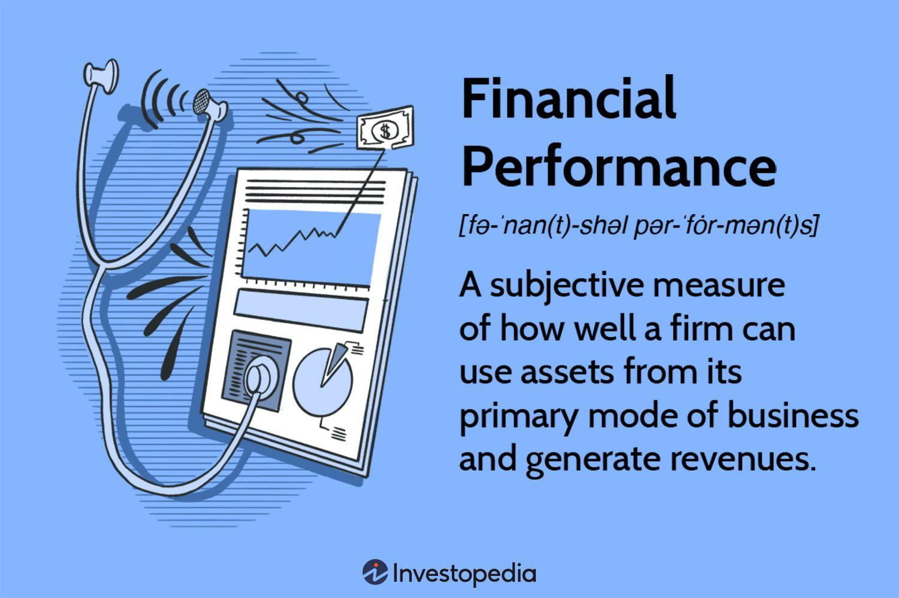

Business finance, financial performance, financial analysis, and algorithmic trading represent interconnected facets of the financial landscape. These elements collectively influence the decision-making processes of businesses and investors alike. Understanding a business's financial performance is crucial for internal stakeholders, such as management, employees, and board members, to ensure the company is on a trajectory that aligns with its strategic objectives. It also provides external stakeholders, namely investors and creditors, with insights into a company's operational efficacy and profitability.

Financial performance is typically assessed through various metrics and ratios, which offer quantitative measures of an organization's success or areas in need of improvement. These metrics include, but are not limited to, gross profit margin, net profit margin, return on equity, and liquidity ratios. Such indicators are derived from financial statements—including income statements, balance sheets, and cash flow statements—that provide a structured representation of a company's financial outcomes and financial position.



Financial analysis builds upon the data drawn from these statements, applying techniques such as ratio analysis, trend analysis, and benchmarking to uncover deeper insights. It allows businesses and investors to make informed conclusions around stability and growth potential, identifying the strengths and weaknesses of financial strategies. Effective financial analysis is additionally instrumental in forecasting future performance, setting the groundwork for sound investment decisions.

In parallel, algorithmic (algo) trading has emerged as a transformative force in modern financial markets. This efficient trading methodology leverages computer algorithms to automate trading decisions, executing buy and sell orders at speeds and volumes unattainable by human traders. Algorithms are built on logical, predefined criteria, and can adjust dynamically to market movements, facilitating optimal trading operations and enhancing market liquidity.

The integration of financial analysis into algorithmic trading is a natural evolution. By incorporating robust financial metrics and trends into algorithms, traders are equipped with sophisticated tools to predict market behaviors and capitalize on opportunities with precision. The combination of quantitative financial analysis and high-frequency trading algorithms helps optimize investment outcomes and provides a competitive advantage in fast-paced financial markets.

This article explores the intersection of these vital components, offering insights into their individual roles and the synergistic benefits they provide when combined effectively. Understanding these connections is pivotal for stakeholders aiming to bolster financial decision-making and maximize market engagement efficacy.

## Table of Contents

## Understanding Business Finance

Business finance is the study and management of funds within a business. It involves planning, procuring, controlling, and monitoring financial resources to ensure the financial health and efficiency of an organization. By maintaining a solid understanding of business finance, companies can maintain stability, support growth, and enhance their ability to compete in the market.

### Importance of Business Finance

Business finance is critical for maintaining and evaluating the economic well-being of a company. It provides the foundation for strategic planning, budgeting, and financial forecasting. Effective financial management allows businesses to allocate resources proficiently, meet their financial obligations, and achieve long-term objectives. For investors and internal stakeholders, such as managers and employees, having a clear view of the company's financial status aids in informed decision-making and contributes to business sustainability and growth.

### Key Concepts in Business Finance

1. **Capital Structure**: 
   Capital structure refers to the mix of debt and equity that a company uses to finance its operations and growth. The decision on capital structure affects the risk and value of the firm. Debt can be cheaper than equity because of tax deductibility of interest, but excessive debt increases financial risk.

   Formula for capital structure can be represented as:
$$
   \text{Capital Structure Ratio} = \frac{\text{Total Debt}}{\text{Total Equity}}

$$

2. **Asset Management**:
   Asset management involves optimizing the use of a company's assets to maximize value creation and operational efficiency. It encompasses the acquisition, utilization, and divestment of assets in line with the financial strategy of the business.

3. **Liquidity Management**:
   Liquidity management ensures that a company has access to sufficient cash flow to meet its short-term obligations. It is crucial for avoiding [liquidity](/wiki/liquidity-risk-premium) crises, which can lead to insolvency. Key liquidity metrics include the current ratio and quick ratio, calculated as follows:
$$
   \text{Current Ratio} = \frac{\text{Current Assets}}{\text{Current Liabilities}}

$$
$$
   \text{Quick Ratio} = \frac{\text{Current Assets} - \text{Inventory}}{\text{Current Liabilities}}

$$

### Tools and Techniques in Financial Analysis

1. **Ratio Analysis**: 
   Ratio analysis is a quantitative tool used to evaluate financial statements to gauge a company's performance and financial health. Important types of ratios include liquidity ratios, profitability ratios, and solvency ratios.

2. **Trend Analysis**:
   Trend analysis examines financial data over time to identify patterns and make forecasts. By comparing historical performance, businesses can pinpoint strengths and weaknesses and project future financial outcomes.

3. **Financial Modeling**:
   Financial modeling involves creating a structured representation of a company's financial performance. Models are used to assess the impact of strategic decisions, predict future earnings, and support valuation estimates.

In summary, understanding business finance is imperative for managing a company's economic resources effectively. By leveraging key concepts such as capital structure, asset and liquidity management, alongside sophisticated tools like ratio and trend analysis, businesses can sustain their financial health and promote strategic growth.

## Financial Performance: Key Metrics and Analysis

Financial performance is a critical assessment of how well a company utilizes its assets to generate revenue, manage costs, and produce profits. It is a significant area of interest for stakeholders such as investors, creditors, and management because it provides insight into a company's operational efficiency, profitability, and viability for growth. Understanding financial performance helps stakeholders make informed decisions regarding investments, credit lending, and strategic management.

**Key Financial Performance Metrics**

1. **Gross Profit Margin**: This metric measures the proportion of revenue that exceeds the cost of goods sold (COGS). It is expressed as a percentage and calculated using the formula:
$$
   \text{Gross Profit Margin} = \left( \frac{\text{Revenue} - \text{COGS}}{\text{Revenue}} \right) \times 100

$$

   A higher gross profit margin indicates that a company efficiently produces or procures its goods, offering good profitability at the initial production level.

2. **Net Profit Margin**: This represents the percentage of revenue that remains as profit after all operating expenses, interest, taxes, and other expenses have been subtracted. It is calculated using the formula:
$$
   \text{Net Profit Margin} = \left( \frac{\text{Net Income}}{\text{Revenue}} \right) \times 100

$$

   A higher net profit margin is indicative of effective cost management, leading to greater profitability.

3. **Return on Equity (ROE)**: ROE measures a corporation's profitability by revealing how much profit a company generates with the money shareholders have invested. It is expressed as:
$$
   \text{ROE} = \left( \frac{\text{Net Income}}{\text{Shareholder's Equity}} \right) \times 100

$$

   A high ROE suggests that the company is effective in converting the equity financing into greater net earnings.

**Recording Financial Performance**

Financial performance indicators are duly recorded and presented through structured financial statements, which are pivotal for analysis.

- **Income Statement**: This statement provides a summary of a company's revenues, expenses, and profits over a specific period. It reflects the company's ability to generate sales, manage costs, and achieve profitability.

- **Balance Sheet**: A snapshot of the company’s financial condition at a single point in time, showcasing assets, liabilities, and shareholder equity. It indicates the company's liquidity and capital structure, informing stakeholders about financial stability and borrowing capacity.

- **Cash Flow Statement**: This statement reports a company’s cash inflows and outflows over a period, segmented into operating, investing, and financing activities. It highlights the company's ability to generate cash from operations and its strategy concerning asset management and capital sourcing.

Together, these financial statements offer a comprehensive overview of an entity’s financial performance, guiding stakeholders in evaluating past outcomes and predicting future business potential. Understanding and analyzing these metrics and statements are crucial for assessing the economic health and operational success of a business.

## The Role of Financial Analysis in Business

Financial analysis serves as a crucial tool for understanding the strengths and weaknesses of a company, as well as its potential for future growth. By providing insights into the firm's financial health, it aids various stakeholders—such as management, investors, creditors, and analysts—in making informed decisions.

One of the fundamental elements of financial analysis is the utilization of ratio analysis. This method involves evaluating relationships between different financial statement items to gain insights into a company's performance and financial health. Common financial ratios include:

1. **Liquidity Ratios**: These measure a company's ability to meet its short-term obligations. A common liquidity ratio is the Current Ratio, calculated as:
$$
   \text{Current Ratio} = \frac{\text{Current Assets}}{\text{Current Liabilities}}

$$

2. **Profitability Ratios**: These assess a company's ability to generate profits relative to its revenue, assets, or equity. One such ratio is the Return on Equity (ROE), defined as:
$$
   \text{Return on Equity} = \frac{\text{Net Income}}{\text{Shareholder's Equity}}

$$

3. **Solvency Ratios**: These evaluate a company's capability to sustain operations long-term by examining its debt levels. The Debt-to-Equity Ratio is calculated as:
$$
   \text{Debt-to-Equity Ratio} = \frac{\text{Total Liabilities}}{\text{Shareholder's Equity}}

$$

4. **Efficiency Ratios**: These measure how effectively a company utilizes its assets and liabilities. The Inventory Turnover Ratio, for instance, is computed as:
$$
   \text{Inventory Turnover Ratio} = \frac{\text{Cost of Goods Sold}}{\text{Average Inventory}}

$$

In addition to ratio analysis, trend analysis forms a pivotal component of financial analysis. This method involves examining financial data over multiple periods to identify patterns or trends that can indicate future performance. For instance, tracking revenue growth over several quarters or years can reveal whether the company is expanding or contracting.

Financial analysis plays a key role in shaping business strategies and improving decision-making. By identifying areas where a company excels or underperforms, management can tailor strategies to capitalize on strengths and address weaknesses. Financial analysis also enables companies to benchmark their performance against peers, industry standards, or historical performance, facilitating strategic planning and goal-setting.

Moreover, through detailed financial scrutiny, companies can enhance operational efficiencies, optimize capital allocation, and improve profitability. Armed with accurate financial insights, decision-makers can mitigate risks, seize opportunities, and steer the company towards sustainable growth. This comprehensive understanding of financial health is instrumental in crafting robust business strategies and ensuring better financial decision-making.

 to Algorithmic Trading

Algorithmic trading, commonly referred to as algo trading, is a method of executing trades using automated, pre-programmed trading instructions. These instructions are based on a variety of variables, such as time, price, and [volume](/wiki/volume-trading-strategy). Algo trading's significance in financial markets lies in its ability to execute orders at speeds and frequencies that are impossible for human traders. By leveraging complex algorithms, traders can analyze vast datasets to identify trading opportunities more efficiently and with greater precision.

Algo trading uses sophisticated computer algorithms to execute trading orders. These algorithms can process financial indicators, historical data, and market conditions to make rapid, informed trading decisions. A crucial aspect of algo trading is its reliance on predetermined criteria, which guide the buying or selling of financial instruments. For instance, a simple algorithm could be programmed to purchase a stock when its 50-day moving average exceeds its 200-day moving average, a common indicator of an upward trend. This automation allows for a high degree of consistency and removes the emotional component often present in manual trading.

The evolution of [algorithmic trading](/wiki/algorithmic-trading) has been substantial, beginning in the 1970s with the introduction of computerized trading systems. By the 1980s and 1990s, advancements in technology and the proliferation of electronic communication networks (ECNs) enabled more sophisticated algorithms and reduced transaction costs. Fast forward to the present day, algo trading accounts for a significant portion of trading volume in major financial markets. One primary impact of algorithmic trading on market efficiency is its ability to reduce the bid-ask spread, thereby enhancing liquidity and tightening price quotations.

Despite its benefits, algorithmic trading also presents certain challenges and risks, such as the potential for systemic risk and market manipulation. Highly automated processes can sometimes exacerbate market [volatility](/wiki/volatility-trading-strategies), exemplified by events like the "Flash Crash" of 2010. Nevertheless, the efficiency gains provided by algo trading continue to drive its adoption and evolution, making it an integral component of modern financial markets.

In summary, algorithmic trading represents a significant advancement in trading technology, offering enhanced market efficiency and the capability to process vast amounts of data at rapid speeds. Its development reflects the broader trend toward automation and data-driven decision-making in finance, promising continued transformation in how trades are conducted.

## Popular Algorithmic Trading Strategies

Algorithmic trading, a dominant force in today's financial markets, involves a variety of strategies that utilize mathematical models and computational techniques. Among the most prevalent strategies are [trend following](/wiki/trend-following), [arbitrage](/wiki/arbitrage), [market making](/wiki/market-making), and [statistical arbitrage](/wiki/statistical-arbitrage). These strategies leverage data analytics and [machine learning](/wiki/machine-learning) to enhance trading accuracy and efficiency. Understanding their methodologies and inherent risks is crucial for successful deployment.

### Trend Following

Trend following is a popular strategy that relies on capturing market [momentum](/wiki/momentum) to generate profits. It identifies and exploits trends in asset prices, based on the assumption that prices will continue to move in the same direction. This strategy typically involves:

- **Simple Moving Averages (SMA):** Comprised of the average price of a security over a specified period. For example, a 50-day SMA strategy buys when a short-term moving average crosses above a long-term moving average and sells when it crosses below.

  ```python
  def moving_average(data, window_size):
      return data.rolling(window=window_size).mean()
  ```

- **Benefits:** High potential returns when trends are present, and relatively simple implementation.
- **Risks:** Vulnerability to whipsaw losses in sideways or volatile markets without clear trends.

### Arbitrage

Arbitrage involves exploiting price discrepancies of the same or related financial instruments across different markets or forms. This might include:

- **Spatial Arbitrage:** Capitalizing on price differences for the same asset in different markets.
- **Convergence Arbitrage:** Trading the spread between two converging asset prices.

- **Benefits:** Low-risk potential due to price disparity exploitation and inefficiencies.
- **Risks:** High-speed execution requirements and diminishing opportunities as market efficiency improves.

### Market Making

Market making involves providing liquidity to the market by quoting both buy and sell prices. Market makers profit from the spread, the difference between the bid and ask prices. Key components include:

- **Order Books Management:** Using algorithms to continuously update offers and fill orders.

  ```python
  def update_orders(order_book, current_price):
      bid = current_price - 0.01
      ask = current_price + 0.01
      order_book['bids'].append(bid)
      order_book['asks'].append(ask)
  ```

- **Benefits:** Profits from bid-ask spreads and reduced volatility in the market.
- **Risks:** Exposure to rapid price movements and the potential for large losses if spreads aren't managed effectively.

### Statistical Arbitrage

Statistical arbitrage involves modeling asset prices and identifying deviations from predicted price relations using statistical methods:

- **Pairs Trading:** Identifying pairs of correlated assets, betting on the convergence of price spreads.

- **Benefits:** Data-driven and can operate in both trending and non-trending markets.
- **Risks:** Dependency on historical data and model assumptions, which may not always hold in future market conditions.

### The Role of Data Analytics and Machine Learning

The integration of data analytics and machine learning has propelled these strategies to a new level of sophistication. Machine learning assists in identifying patterns and optimizing strategies by:

- **Predictive Modeling:** Utilizing algorithms like Random Forests or Support Vector Machines to forecast price movements.
- **Adaptive Learning Models:** Continuously improving strategy performance based on market feedback.

Their use in algorithmic trading allows for more robust decision-making capabilities, although they introduce complexity and necessitate advanced computational resources.

In summary, popular algorithmic trading strategies such as trend following, arbitrage, market making, and statistical arbitrage each have their benefits and risks. Data analytics and machine learning play crucial roles in enhancing these strategies, adding predictive power and adaptability to handle the complexities of modern trading environments. As these tools become more integrated, traders stand to gain precise and profitable insights, provided they are aware of the strategies' limitations and requirements.

## Integrating Financial Analysis and Algorithmic Trading

The integration of financial analysis with algorithmic trading holds the potential to significantly enhance trading strategies, offering more informed and precise decision-making capabilities. Financial analysis provides critical insights into a company's financial health, market trends, and economic conditions, which can be leveraged to develop sophisticated trading algorithms. By incorporating financial indicators and metrics into algo trading models, traders can optimize their strategies to improve returns and manage risks.

**Financial Indicators and Metrics in Trading Algorithms**

Financial analysis involves the evaluation of various indicators such as price-to-earnings ratio, debt-to-equity ratio, and liquidity ratios, which provide quantitative information about a company's performance and market standing. These indicators can be incorporated into trading algorithms to make informed decisions. For instance, a trend-following algorithm might use moving averages calculated from historical price data to identify potential buy or sell signals.

Let's consider a Python example using moving averages:

```python
import pandas as pd
import numpy as np

# Example stock price data
data = {'Date': ['2023-01-01', '2023-01-02', '2023-01-03', '2023-01-04', '2023-01-05'],
        'Close': [150, 155, 157, 153, 160]}
df = pd.DataFrame(data)

# Calculate moving averages
df['Short_MA'] = df['Close'].rolling(window=2).mean()
df['Long_MA'] = df['Close'].rolling(window=3).mean()

# Trading signal based on moving averages
df['Signal'] = np.where(df['Short_MA'] > df['Long_MA'], 1, -1)  # Buy if short MA is above long MA

print(df)
```

In this example, the algorithm generates a buy signal when the short-term moving average crosses above the long-term moving average. This approach demonstrates how financial metrics can be systematically implemented to guide trading actions.

**Examples of Financial Analysis Complementing Algo Trading**

Consider statistical arbitrage, a popular algorithmic trading strategy that relies on statistical methods to identify mispricings between correlated securities. Financial analysis can enhance this strategy by providing insights into the fundamental value of the correlated assets, helping to refine the criteria for identifying potential arbitrage opportunities.

Another example is risk management, where financial analysis assists in evaluating the volatility and beta of stocks, which can be embedded into algorithms to adjust position sizes and manage portfolio risk dynamically. This creates a framework for balancing risk and reward in algorithmic trading strategies.

**Optimization of Investment Outcomes**

The integration of financial analysis with algorithmic trading leads to more robust trading models that adapt to market conditions. By continuously analyzing financial data and adjusting algorithms accordingly, traders can optimize their strategies to achieve better investment outcomes. These adaptations can include refining entry and [exit](/wiki/exit-strategy) points, calculating dynamic stop-loss levels, and adjusting leverage ratios based on current financial conditions.

In conclusion, the synergy between financial analysis and algorithmic trading paves the way for advanced trading models that are both reactive and anticipatory. By embedding financial expertise into algorithmic frameworks, traders can build more effective and sustainable trading strategies, maximizing returns while mitigating associated risks. This convergence emphasizes the importance of informed financial decision-making in the constantly evolving landscape of financial markets.

## Conclusion

The intersection of business finance, financial performance, financial analysis, and algorithmic trading represents a sophisticated framework that modern businesses and investors leverage to achieve optimal financial outcomes. Understanding the intricate connections among these components is pivotal for both internal stakeholders and external investors aiming to make informed decisions.

At the heart of this interconnectedness is financial analysis, serving as a foundational tool that deciphers a company's financial health and prospects through detailed examination of financial statements and performance metrics. These analyses enable stakeholders to identify strengths, weaknesses, and areas of potential growth, forming the backbone for effective strategic planning and decision-making.

Algorithmic trading, on the other hand, has revolutionized financial markets by employing quantitative models and computer algorithms to execute trades based on predefined criteria. This approach leverages financial indicators and metrics derived from rigorous financial analysis, integrating data-driven insights to enhance trading efficiency and effectiveness. By using comprehensive financial analysis, algorithmic traders can refine trading algorithms, resulting in more precise and profitable investment strategies.

The synergy between advanced financial analysis and algorithmic trading cannot be overstated. Financial analysis provides the necessary insights and data integrity required to inform algorithmic trading strategies, allowing for dynamic adjustments and optimizations in response to market conditions. For instance, machine learning techniques in algorithmic trading can be trained on historical financial performance data to predict future trends and market behaviors, thus facilitating more robust risk management and decision-making.

To ensure continued proficiency and efficacy in financial decision-making, it is essential to further explore and adopt these integrated techniques. Embracing technological advancements and data analytics can propel financial operations and investment strategies to new heights, fostering an era of enhanced financial proficiency and innovation in trading practices. Thus, businesses and investors are encouraged to pursue continuous development and application of these tools, ensuring they remain at the forefront of financial innovation and competitive advantage.

## References & Further Reading

[1]: Bergstra, J., Bardenet, R., Bengio, Y., & Kégl, B. (2011). ["Algorithms for Hyper-Parameter Optimization."](https://dl.acm.org/doi/10.5555/2986459.2986743) Advances in Neural Information Processing Systems 24.

[2]: ["Advances in Financial Machine Learning"](https://www.amazon.com/Advances-Financial-Machine-Learning-Marcos/dp/1119482089) by Marcos Lopez de Prado

[3]: ["Evidence-Based Technical Analysis: Applying the Scientific Method and Statistical Inference to Trading Signals"](https://www.amazon.com/Evidence-Based-Technical-Analysis-Scientific-Statistical/dp/0470008741) by David Aronson

[4]: ["Machine Learning for Algorithmic Trading"](https://github.com/stefan-jansen/machine-learning-for-trading) by Stefan Jansen

[5]: ["Quantitative Trading: How to Build Your Own Algorithmic Trading Business"](https://www.amazon.com/Quantitative-Trading-Build-Algorithmic-Business/dp/1119800064) by Ernest P. Chan