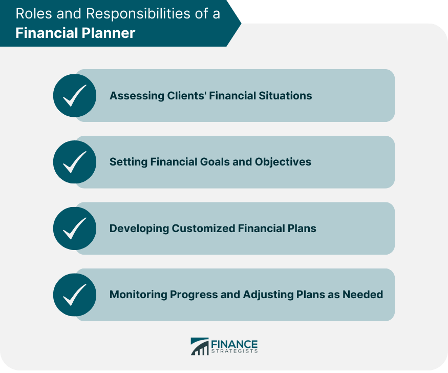

## Table of Contents

## What is a financial planner?

A financial planner is a person who helps you manage your money. They give you advice on how to save, invest, and spend your money wisely. They look at your whole financial situation, like your income, expenses, debts, and goals, and then make a plan that fits you best.

Financial planners can help you with many things. They can help you plan for retirement, save for your kids' education, or even buy a house. They use their knowledge and tools to make sure you are on the right track to meet your financial goals. It's like having a guide to help you make smart money choices.

## What are the primary roles of a financial planner?

A financial planner helps you make a plan for your money. They look at how much you earn, what you spend, and what you owe. Then, they help you set goals, like saving for a house or retiring. They give you advice on how to reach these goals. They might suggest ways to save more, invest your money, or pay off debts faster.

Financial planners also keep an eye on your money over time. They check if your plan is working and make changes if needed. For example, if you get a raise at work, they might suggest new ways to use that extra money. They can also help you when big things happen, like if you lose your job or if you inherit money. They make sure your money plan stays on track no matter what happens.

## How does a financial planner help with budgeting?

A financial planner helps you make a budget by looking at all the money you earn and all the money you spend. They help you see where your money goes each month. They might ask you to list all your bills, like rent, utilities, and groceries, and all your fun spending, like eating out or buying clothes. Then, they help you figure out how much you can spend in each category without going over your income. This way, you can save money for things you want in the future, like a new car or a vacation.

Financial planners also help you stick to your budget. They might suggest tools or apps to track your spending. If you find it hard to stay within your budget, they can help you find ways to cut back on spending or increase your income. They can also help you set up automatic savings plans so you save money without even thinking about it. By working with a financial planner, you can make sure your budget works for you and helps you reach your financial goals.

## What is the importance of a financial planner in investment planning?

A financial planner is really important when it comes to investment planning. They help you figure out the best ways to grow your money. They look at how much risk you're okay with and what you want to achieve with your investments. For example, if you want to save for a house in five years, they might suggest safer investments. But if you're planning for retirement that's far away, they might recommend riskier investments that could grow more over time.

Financial planners also keep an eye on your investments to make sure they're doing well. They might change your investment plan if things like the economy or your life change. This way, your money keeps growing in the best way possible. They help you understand the ups and downs of the market and keep you calm when things get bumpy. By working with a financial planner, you can feel more confident that your investments are on the right track to help you reach your goals.

## How can a financial planner assist with retirement planning?

A financial planner can help you plan for retirement by figuring out how much money you'll need when you stop working. They look at how much you earn now, how much you spend, and how long you might live after you retire. Then, they help you set up a plan to save enough money. They might suggest ways to save more, like putting money into a retirement account, or investing your money so it grows over time. They also help you think about things like Social Security and any pensions you might have.

Financial planners also keep an eye on your retirement plan as you get closer to retiring. They check if you're on track to have enough money. If things change, like if you get a raise or if the economy changes, they can adjust your plan. They might suggest you save more or change how you invest your money. This way, you can feel confident that you'll have enough money to live comfortably when you retire.

## What qualifications should you look for in a financial planner?

When looking for a financial planner, it's important to find someone with the right qualifications. One key qualification to look for is a certification like Certified Financial Planner (CFP). This means they have passed tough exams and have experience in financial planning. They also have to follow strict rules about how they treat their clients. Another good qualification is a degree in finance, economics, or a related field. This shows they have a strong understanding of money and how it works.

It's also a good idea to check if the financial planner has any special areas of expertise. Some planners focus on things like retirement planning, estate planning, or investment management. If you have specific needs, like planning for your kids' education, you might want to find a planner who knows a lot about that. Finally, make sure the planner is a fiduciary. This means they have to put your interests first and give you advice that's best for you, not just for them.

## How do you evaluate the experience of a potential financial planner?

To evaluate the experience of a potential financial planner, start by looking at how long they have been working in the field. The more years they have been a financial planner, the more likely they are to have seen many different situations and know how to handle them. Ask them about their past clients and the types of financial planning they have done. If they have worked with people in situations similar to yours, that's a good sign. You can also ask for references or testimonials from their clients to get a sense of their experience and how well they have helped others.

It's also important to consider the specific areas of financial planning where the planner has experience. Some planners might be experts in retirement planning, while others might focus on investment management or estate planning. Think about your own financial goals and find a planner whose experience matches what you need help with. For example, if you're planning for your kids' education, a planner with experience in education savings plans would be a good choice. By looking at both their overall experience and their specific areas of expertise, you can better evaluate if they are the right fit for you.

## What are the different fee structures for financial planners?

Financial planners can charge you in different ways. One common way is by the hour. This means you pay them for the time they spend helping you with your money. Another way is a flat fee, where you pay one amount for a specific service, like making a financial plan. Some planners charge a retainer, which is like a regular payment for ongoing help with your money.

Another fee structure is a percentage of the assets they manage for you. If you have them invest your money, they might take a small part of your total investments as their fee. This is often called an "assets under management" (AUM) fee. Some planners might also earn money through commissions, which they get when they sell you certain financial products. It's important to know how your planner is paid so you can understand if their advice is in your best interest.

## How can one assess the ethical standards of a financial planner?

One way to assess the ethical standards of a financial planner is to check if they are a fiduciary. A fiduciary has to put your interests first and give you advice that is best for you, not just for them. You can ask them directly if they are a fiduciary. If they say yes, that's a good sign they will act ethically. Another way is to look at their certifications, like the Certified Financial Planner (CFP) certification. Planners with a CFP have to follow a strict code of ethics, which means they have to be honest and fair with their clients.

You can also look at reviews and ask for references from past clients. If other people had good experiences and felt that the planner was honest and trustworthy, that's a good sign. It's also important to ask the planner about any potential conflicts of interest. For example, if they earn money from selling you certain financial products, they might be tempted to recommend those products even if they're not the best for you. By talking openly about how they are paid and any conflicts, you can better understand if they will act ethically and in your best interest.

## What advanced strategies do expert financial planners use for wealth management?

Expert financial planners use advanced strategies to help their clients manage their wealth. One strategy they use is called tax-efficient investing. This means they look for ways to invest money that will help their clients pay less in taxes. For example, they might suggest putting money into certain types of accounts or investments that have tax benefits. Another strategy is diversification, which means spreading money across different types of investments to reduce risk. By not putting all their money in one place, clients can protect their wealth from big losses if one investment doesn't do well.

Another advanced strategy is estate planning, which helps clients plan what will happen to their money after they pass away. Financial planners might help set up trusts or other legal arrangements to make sure money goes to the right people in the right way. They also use something called asset allocation, which means deciding how much money to put into different kinds of investments, like stocks, bonds, and real estate. By carefully choosing how to spread out the money, planners can help their clients reach their financial goals while managing risk. These strategies show how expert financial planners use their knowledge to help clients grow and protect their wealth.

## How do financial planners adapt their strategies for different economic conditions?

Financial planners change their strategies based on what's happening in the economy. If the economy is doing well, they might suggest putting more money into investments that could grow a lot, like stocks. But if the economy is not doing so well, they might tell their clients to be more careful. They might move money into safer investments, like bonds, to protect it from big losses. They also keep an eye on things like interest rates and inflation, which can affect how much money their clients make or spend.

When things in the economy change quickly, like during a recession, financial planners might need to make big changes to their clients' plans. They might suggest saving more money or cutting back on spending to make sure their clients can still reach their goals. They also look at how their clients' jobs and incomes might be affected and adjust the plans accordingly. By keeping up with economic news and trends, financial planners can help their clients stay on track no matter what's happening in the world.

## What role does technology play in modern financial planning?

Technology plays a big role in modern financial planning. It helps financial planners do their jobs better and faster. They use special software and apps to keep track of their clients' money. This software can show them all the money coming in and going out, and help them make plans that fit each client's needs. They can also use technology to look at different investments and see how they might grow over time. This makes it easier for planners to give good advice and help their clients reach their goals.

Technology also makes it easier for clients to work with their financial planners. Many planners use online tools that let clients see their money plans anytime they want. They can check their investments, see how much they're saving, and even talk to their planner through the app or website. This means clients can stay updated and make changes to their plans without having to go to the planner's office. Technology helps make financial planning more convenient and helps clients feel more in control of their money.

## References & Further Reading

[1]: Bergstra, J., Bardenet, R., Bengio, Y., & Kégl, B. (2011). ["Algorithms for Hyper-Parameter Optimization."](https://dl.acm.org/doi/10.5555/2986459.2986743) Advances in Neural Information Processing Systems 24.

[2]: ["Advances in Financial Machine Learning"](https://www.amazon.com/Advances-Financial-Machine-Learning-Marcos/dp/1119482089) by Marcos Lopez de Prado

[3]: ["Evidence-Based Technical Analysis: Applying the Scientific Method and Statistical Inference to Trading Signals"](https://www.amazon.com/Evidence-Based-Technical-Analysis-Scientific-Statistical/dp/0470008741) by David Aronson

[4]: ["Machine Learning for Algorithmic Trading"](https://github.com/stefan-jansen/machine-learning-for-trading) by Stefan Jansen

[5]: ["Quantitative Trading: How to Build Your Own Algorithmic Trading Business"](https://www.amazon.com/Quantitative-Trading-Build-Algorithmic-Business/dp/1119800064) by Ernest P. Chan