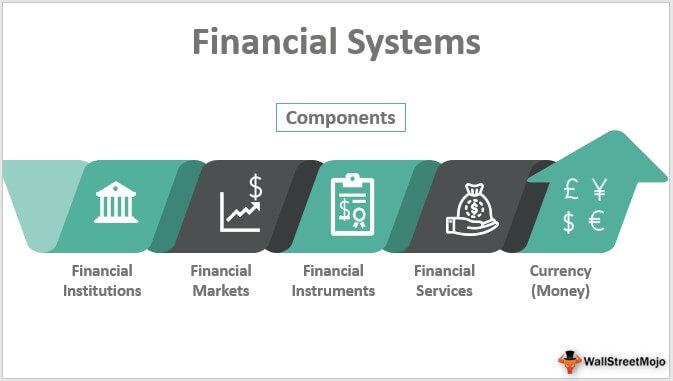

The world of finance has undergone a significant transformation with the advent of online tools and platforms. These digital innovations range from algorithmic trading systems, which automate and optimize trading strategies, to personal finance management applications that empower individuals in managing their finances more effectively. Collectively, such tools have reshaped the way both individuals and businesses engage with financial markets.

Algorithmic trading is one of the most notable developments, utilizing complex algorithms to execute trades at speeds and efficiencies unattainable by human traders. This technology revolutionizes investment strategies by offering real-time data analysis and the automated execution of trades based on pre-defined criteria. Personal finance management tools have also democratized financial planning, offering average individuals the capability to budget, track expenses, and manage investments through user-friendly interfaces and detailed analytics.



This article aims to provide a comprehensive overview of these significant advancements, exploring various financial platforms that serve as gateways to a multitude of financial services. It will discuss online finance tools that enhance financial literacy and decision-making, offer insight into financial portals that centralize financial information, and review algorithmic trading solutions that are transforming traditional investment methods. These tools not only simplify financial processes but also democratize access to sophisticated financial strategies, thus empowering both novice investors and experienced traders.

## Table of Contents

## Overview of Financial Platforms

Financial platforms are sophisticated systems designed to provide a wide spectrum of financial services to users. These platforms have evolved to become essential tools for investors, financial advisors, and portfolio managers, offering functionalities that cater to diverse financial needs. One of the primary features of financial platforms is their ability to integrate multiple financial products and services, creating an all-in-one solution for users.

Stock trading applications are among the most common types of financial platforms. These applications allow users to trade stocks, bonds, and other securities directly from their devices. Users have access to real-time market data, analytical tools, and trade execution capabilities. Noteworthy stock trading apps include Robinhood, E*TRADE, and TD Ameritrade, each offering unique features and fee structures to cater to different types of investors. 

In addition to trading apps, financial platforms encompass advanced investment management software. These platforms are typically used by financial professionals to manage large portfolios, perform sophisticated analyses, and execute trades with precision. They offer advanced features such as algorithmic trading, financial modeling, and risk management tools. Investment management software solutions like Bloomberg Terminal and Morningstar Direct are known for their robust analytics and comprehensive data offerings, which are crucial for informed decision-making in complex financial markets.

The integration capability of financial platforms is one of their most significant advantages. By linking various financial services such as banking, investing, credit management, and insurance, these platforms provide users with a streamlined experience. This integration not only enhances user convenience but also allows for a holistic view of one's financial health. For instance, platforms like Mint and Personal Capital aggregate financial data from various accounts, enabling users to track expenses, set budgets, and monitor their investment portfolios from a single interface.

Moreover, the rise of fintech has significantly contributed to the development and accessibility of financial platforms. Innovations in fintech have led to user-friendly platforms that incorporate advanced technologies such as [artificial intelligence](/wiki/ai-artificial-intelligence), [machine learning](/wiki/machine-learning), and blockchain. These technologies enhance the functionality and security of the platforms, providing users with a more efficient and secure financial service experience. 

In summary, financial platforms are pivotal in modern finance, offering a unified solution that combines trading, investment management, and financial planning. Whether through stock trading apps or comprehensive investment management software, these platforms are indispensable for individuals and businesses aiming to maximize their financial potential.

## Online Finance Tools

Online finance tools provide essential applications for both personal and professional financial management, catering to diverse needs such as budgeting, financial analysis, and forecasting. These tools streamline financial processes, enabling users to efficiently monitor and manage their financial activities.

At the personal level, these tools offer features like expense tracking, which allows users to categorize spending, visualize expenditure trends, and set savings goals. For example, applications like Mint and YNAB (You Need A Budget) offer robust platforms that integrate bank accounts, credit cards, and bills, giving users a comprehensive view of their financial health. Such platforms often include functionality for setting budgets, alerting users about upcoming bills, and recommending areas for potential savings.

For professional use, finance tools extend their capabilities to include portfolio management and advanced financial analysis. These tools cater to financial analysts, managers, and business owners needing greater insights into financial performance and strategic planning. Applications such as QuickBooks and Xero provide tools for tracking income and expenses, managing invoices, and generating financial reports, supporting the financial management of businesses from startups to seasoned enterprises.

Key players in the online finance tools industry are distinguished by their intuitive user interfaces, which decrease the learning curve for new users, and by their powerful analytics capabilities, which enable informed decision-making. For instance, some platforms utilize machine learning algorithms to analyze past financial data, offering predictive insights that guide future financial planning.

An example in Python to illustrate predictive budgeting could involve using libraries such as pandas and scikit-learn to develop a basic forecasting model:

```python
import pandas as pd
from sklearn.model_selection import train_test_split
from sklearn.linear_model import LinearRegression

# Example dataset: monthly expenses
data = {'Month': range(1, 13), 'Expenses': [2200, 2350, 2100, 2250, 2500, 2600, 2400, 2300, 2550, 2450, 2700, 2600]}
df = pd.DataFrame(data)

# Splitting data
X = df[['Month']]
y = df['Expenses']

X_train, X_test, y_train, y_test = train_test_split(X, y, test_size=0.2, random_state=42)

# Create and train the model
model = LinearRegression()
model.fit(X_train, y_train)

# Predict expenses in the coming month
new_month = pd.DataFrame({'Month': [13]})
predicted_expense = model.predict(new_month)

print(f"Predicted Expense for 13th month: ${predicted_expense[0]:.2f}")
```

This hypothetical script showcases how some tools might process and predict future financial conditions based on historical data. By integrating such analytical capabilities, online finance tools empower users with insights to make strategic financial decisions.

Overall, the evolution and sophistication of online finance tools continue to shape the landscape of financial management by providing accessible, efficient, and effective solutions that meet the needs of individual and business users alike.

## Financial Portals: A Central Hub

Financial portals serve as integral access points for a diverse range of financial data and information. These platforms consolidate various types of financial content, such as news articles, stock quotes, market analyses, and economic indicators, providing users with a centralized source of financial insights. This consolidation is beneficial for individual investors who often seek comprehensive information to make informed decisions. By aggregating content from multiple sources, financial portals save users time and effort, reducing the need to visit multiple websites or apps. 

Customizable features are a hallmark of these portals, enabling users to tailor their interface and alerts according to their specific preferences or investment strategies. For instance, investors can set up personalized dashboards to track preferred stocks or industries, receive notifications on breaking financial news, or access detailed reports on market trends. This level of customization enhances user engagement and empowers investors to focus on their areas of interest or concern.

Financial portals often provide interactive tools and calculators that can aid in investment planning and analysis. These may include charting tools that visually represent stock performance over time, financial ratios, or dividend calculators that help forecast the potential income from stock investments. By offering such tools, portals facilitate a deeper understanding of financial markets and investment strategies.

An exemplary feature of many financial portals is the integration of community forums or expert commentaries, which can provide additional perspectives on current financial events or potential investment opportunities. This feature connects users with a network of fellow investors or industry professionals, fostering a collaborative environment for sharing insights or advice.

Overall, financial portals stand as crucial resources that support investors by merging a wide spectrum of financial information and tools into a single, user-friendly platform. Through the aggregation of key financial data and customizable user experiences, these portals enhance the ability of individual investors to navigate the complexities of financial markets effectively.

## Algorithmic Trading: Transforming Investment Strategies

Algorithmic trading employs automated systems that execute trades based on predefined criteria without human intervention. By utilizing sophisticated mathematical models and statistical methods, this technology allows traders and financial firms to make investment decisions with a speed and accuracy that surpasses human capabilities.

The primary advantage of [algorithmic trading](/wiki/algorithmic-trading) lies in its ability to process and analyze large volumes of data in real-time. Algorithms can quickly identify market trends, price discrepancies, and trading opportunities across multiple assets and exchanges. This enables traders to execute trades at the optimal moment, maximizing potential returns and minimizing risks.

A typical algorithmic trading strategy might include a series of steps such as signal generation, risk management, and execution logic. Signal generation involves analyzing historical and real-time data to identify favorable trading conditions. Risk management components ensure that trades align with the trader's risk tolerance and portfolio goals. Execution logic determines the precise timing and size of trades to be made.

Several algorithmic trading platforms and software are available, each offering unique features to optimize trading strategies. For example:

1. **MetaTrader 4/5**: Widely used for forex and CFD trading, MetaTrader platforms offer algorithmic trading capabilities through "Expert Advisors" (EAs). These platforms support various trading strategies and allow users to backtest their algorithms using historical data.

2. **QuantConnect**: An open-source platform that supports algorithm development in Python, QuantConnect provides extensive data libraries for backtesting. It facilitates algorithmic strategies across multiple asset classes, including stocks, options, futures, and cryptocurrencies.

3. **NinjaTrader**: Known for its customizable interface and comprehensive charting tools, NinjaTrader offers algorithmic trading integration through automated trading systems (ATS). It supports various programming languages, enabling traders to create complex strategies.

4. **Interactive Brokers**: This platform offers robust API access for users looking to implement algorithmic strategies. The API supports multiple programming languages, including Python, Java, and C++, allowing seamless integration with custom trading software.

Algorithmic trading plays a crucial role in high-frequency trading ([HFT](/wiki/high-frequency-trading-strategies)), where the speed of trade execution is vital. HFT firms leverage co-location services, which place their trading systems in close proximity to exchange servers, reducing latency and gaining a competitive edge in the market.

In conclusion, algorithmic trading has transformed investment strategies by providing a means to analyze market data and execute trades with high precision and speed. As technology continues to advance, traders are likely to adopt more sophisticated algorithms to stay competitive and enhance their investment outcomes.

## Choosing the Right Platform

Selecting the right financial platform is a critical decision that can significantly impact your investment strategy and outcomes. This choice should be guided by your individual investment goals, experience level, and specific needs. Here are some important factors to consider when evaluating different financial platforms:

1. **User Interface (UI)**: A user-friendly interface is crucial for efficient and stress-free interaction with financial platforms. Look for platforms that offer intuitive navigation and clear layouts. Whether you're a newcomer to investing or a seasoned trader, a platform that matches your comfort with technology can streamline your trading activities. Platforms with customizable dashboards can enhance your user experience, allowing you to prioritize information that is most critical to your investment strategy.

2. **Data Analytics Capabilities**: Robust data analytics tools are essential for making informed decisions. Evaluate platforms based on their ability to provide comprehensive data analytics features, such as real-time market data, historical performance analysis, risk assessment tools, and predictive analytics. These features can equip you with insights necessary for strategic planning and risk management.

3. **Integration Options**: The ability to integrate with other financial tools and services is a significant advantage. Consider platforms that offer API access or integrations with popular financial tools, such as portfolio management software, tax accounting services, or payment systems. Integration can streamline your workflow and ensure a seamless interaction between different aspects of your financial management.

4. **Cost**: Cost is a pivotal factor and varies widely between platforms. Consider both the upfront costs and any hidden fees such as transaction charges, data feed costs, or withdrawal fees. Compare the features offered at various price points to ensure that you receive adequate value for the financial commitment. Some platforms may offer free trials or tiered pricing models based on the level of service required. This can be particularly useful for testing a platform's suitability before making a full commitment.

5. **Security Protocols**: Security is paramount when dealing with financial platforms. Investigate the security measures a platform has in place, such as encryption standards, two-factor authentication, and compliance with regulatory standards. A platform that prioritizes security will protect your sensitive financial data and transactions.

When making your decision, it is also beneficial to look for reviews from other users and expert opinions. Community forums and online reviews can provide insights into user satisfaction and potential issues with the platform. Additionally, consider your future needs, as a platform that supports scalability and growth can be more cost-effective in the long run. Ultimately, the right platform should align with your investment objectives, enhance your trading experience, and support your financial goals.

## Conclusion

The digitalization of financial services has significantly democratized access to markets and financial management tools for a diverse range of investors. Among the most transformative developments are financial portals, online tools, and algorithmic trading platforms. These innovations provide unprecedented opportunities to enhance investment strategies and improve financial oversight.

Financial portals act as comprehensive repositories of information, allowing investors to access an array of data, including market news, stock quotes, and expert analyses, all in one place. This centralization of information makes it easier for investors to stay informed and make data-driven decisions.

Online finance tools further offer investors the ability to manage personal budgets, analyze financial trends, and forecast future performance. Tools range from sophisticated budget management software to user-friendly expense tracking applications. They enable both novice and experienced investors to optimize their financial management with minimal effort, often featuring intuitive interfaces and advanced analytics.

Algorithmic trading platforms allow the execution of trades using automated systems based on specified criteria. This approach can lead to faster, more efficient trading, minimizing human error and potentially increasing profitability by harnessing the power of complex algorithms and significant computational power.

As these technologies continue to evolve, staying informed and adaptable becomes essential. Investors must engage with continuous learning and leverage these tools to their fullest potential, ensuring they remain competitive in a rapidly changing financial landscape. Ultimately, the digitalization of financial services not only democratizes access but also empowers investors to achieve their financial goals more effectively.

## References & Further Reading

[1]: Bergstra, J., Bardenet, R., Bengio, Y., & Kégl, B. (2011). ["Algorithms for Hyper-Parameter Optimization."](https://dl.acm.org/doi/10.5555/2986459.2986743) Advances in Neural Information Processing Systems 24.

[2]: ["Advances in Financial Machine Learning"](https://www.amazon.com/Advances-Financial-Machine-Learning-Marcos/dp/1119482089) by Marcos Lopez de Prado

[3]: ["Evidence-Based Technical Analysis: Applying the Scientific Method and Statistical Inference to Trading Signals"](https://www.amazon.com/Evidence-Based-Technical-Analysis-Scientific-Statistical/dp/0470008741) by David Aronson

[4]: ["Machine Learning for Algorithmic Trading"](https://github.com/stefan-jansen/machine-learning-for-trading) by Stefan Jansen

[5]: ["Quantitative Trading: How to Build Your Own Algorithmic Trading Business"](https://www.amazon.com/Quantitative-Trading-Build-Algorithmic-Business/dp/1119800064) by Ernest P. Chan