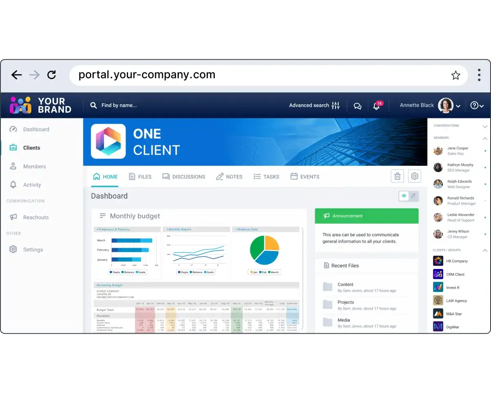

## Table of Contents

## What is a financial portal?

A financial portal is a website or app that helps people manage their money. It brings together different financial services and information in one place, making it easier for users to keep track of their finances. You can use a financial portal to check your bank accounts, investments, and even pay bills without having to visit multiple websites.

These portals often include tools to help with budgeting, planning for the future, and understanding your spending habits. They might also provide news and articles about the economy and personal finance to help you make better financial decisions. Financial portals are useful for both individuals and businesses because they simplify the way we handle money.

## What are the basic features of a financial portal?

A financial portal usually has a few key features that help people manage their money easily. One important feature is the ability to see all your accounts in one place. This means you can check your bank accounts, credit cards, and investments without having to log into different websites. Another common feature is the ability to pay bills directly from the portal. This makes it simple to keep track of when bills are due and pay them on time.

Another useful feature of financial portals is budgeting tools. These tools help you set up a budget and track your spending to see where your money goes each month. Some portals also offer investment tracking, where you can see how your investments are doing and get advice on where to invest next. Lastly, many financial portals provide educational resources like articles and videos about money management, which can help you learn more about saving, investing, and planning for the future.

## How does a financial portal help in managing personal finances?

A financial portal helps in managing personal finances by bringing everything together in one place. Instead of logging into different websites to check your bank account, credit card, or investments, you can see all of your financial information on one screen. This makes it easier to keep track of your money and see where you stand financially. You can also use the portal to pay your bills on time, which helps you avoid late fees and keep your credit score healthy.

Additionally, financial portals often have tools that help you create and stick to a budget. You can set spending limits for different categories like groceries or entertainment, and the portal will track your spending to see if you're staying within those limits. This can help you save money and avoid overspending. Some portals also provide educational resources, like articles and videos, that teach you about saving, investing, and planning for the future. By using these tools and resources, you can make smarter financial decisions and better manage your money.

## What security measures are typically implemented in financial portals?

Financial portals use many security measures to keep your money and information safe. One important measure is encryption, which is like a secret code that keeps your data safe when you send it over the internet. Financial portals also use strong passwords and two-[factor](/wiki/factor-investing) authentication, which means you need more than just a password to log in. This makes it harder for someone else to get into your account.

Another common security measure is monitoring for strange activity. If the portal sees something unusual, like someone trying to log in from a new place, it might ask you to verify it's really you. Financial portals also have firewalls and other tools to stop hackers from getting in. They regularly check for weak spots and fix them to keep your information secure.

## Can you explain the user interface of a typical financial portal?

The user interface of a typical financial portal is designed to be easy to use and understand. When you log in, you'll usually see a main dashboard that shows you an overview of your finances. This might include your bank account balances, recent transactions, and a summary of your investments. The dashboard is set up to give you a quick look at your money situation without having to dig through lots of menus.

From the main dashboard, you can navigate to different sections of the portal. There are usually tabs or buttons that take you to your accounts, where you can see detailed information about your money. You can also find sections for paying bills, setting up a budget, and tracking your spending. The interface often uses clear labels and simple icons to help you find what you need quickly. Everything is laid out in a way that makes it easy for you to manage your finances without feeling overwhelmed.

## How do financial portals integrate with other financial services?

Financial portals work together with other financial services to make managing your money easier. They connect with your bank accounts, credit cards, and investment accounts so you can see all your money in one place. When you link these accounts to the portal, it can pull in your balances and transactions automatically. This means you don't have to log into different websites to check your money. Some portals even let you move money between accounts without leaving the portal.

Besides connecting with your accounts, financial portals can also work with other tools and services. For example, they might link up with budgeting apps or financial advisors to give you better advice on managing your money. Some portals let you pay bills directly from the portal by connecting with bill payment services. This makes it easier to keep track of when bills are due and pay them on time. By working with these other services, financial portals help you handle all parts of your finances in one spot.

## What are the differences between free and paid financial portals?

Free financial portals are good for basic money management. They let you see your bank accounts, credit cards, and investments all in one place. You can also pay bills and set up a simple budget. But, free portals might have fewer features and less support. They might show you ads or try to sell you other services. The tools for tracking your spending or planning for the future might not be as detailed as what you get with a paid portal.

Paid financial portals offer more advanced features and better support. They might give you detailed reports on your spending, help you plan for retirement, or even connect you with financial advisors. These portals often have fewer ads and more personalized tools to help you manage your money better. While you have to pay for them, the extra features can be worth it if you want a more complete way to handle your finances.

## How can businesses benefit from using a financial portal?

Businesses can use financial portals to make managing their money easier. A financial portal lets a business see all its bank accounts, credit cards, and investments in one place. This helps the business keep track of its money and see where it's spending. It also makes it easier to pay bills on time, which can help the business avoid late fees and keep its credit good. By using a financial portal, a business can save time and make sure it's always on top of its finances.

Financial portals also offer tools that can help a business plan for the future. For example, a business can use the portal to set up a budget and track its spending to see where it can save money. Some portals even provide reports and advice on how to invest money to grow the business. By using these tools, a business can make smarter financial decisions and plan better for the future. This can help the business grow and be more successful.

## What advanced features might be available in premium financial portals?

Premium financial portals come with advanced features that can help you manage your money better. One important feature is detailed financial reports. These reports can show you exactly where your money is going each month, helping you see if you're spending too much in certain areas. Premium portals also offer advanced budgeting tools that let you set up different budgets for different parts of your life, like your home, your car, or your vacation plans. These tools can help you save money and reach your financial goals faster.

Another useful feature in premium financial portals is investment analysis. These portals can give you advice on where to invest your money to make it grow. They might even connect you with financial advisors who can help you plan for the future, like saving for retirement or buying a house. Some premium portals also offer tax planning tools, which can help you figure out how to pay less in taxes. By using these advanced features, you can make smarter decisions about your money and plan for a more secure financial future.

## How do financial portals handle data privacy and compliance with regulations?

Financial portals take data privacy very seriously because they know how important your money information is. They use strong security measures like encryption to keep your data safe when you send it over the internet. They also have rules about who can see your information and make sure only the people who need to see it can. Financial portals often have privacy policies that tell you how they use your data and how they keep it safe. They promise not to share your information with others without your permission.

Financial portals also have to follow laws about how they handle your money and data. These laws are called regulations, and they make sure that financial portals treat your information the right way. For example, in the United States, there's a law called the Gramm-Leach-Bliley Act that says financial companies have to tell you how they share your personal information. Financial portals follow these rules to make sure they are doing things the right way and keeping your information private.

## What role do APIs play in the functionality of financial portals?

APIs, which stands for Application Programming Interfaces, are really important for financial portals because they help different parts of the portal work together. Think of an API like a messenger that lets the portal talk to your bank, credit card company, or investment accounts. When you link your accounts to the portal, the API goes and gets your balances and transactions from those places. This way, you can see all your money in one spot without having to log into different websites.

APIs also help financial portals add more features and work with other tools. For example, if you want to use a budgeting app or get advice from a financial advisor, APIs can connect the portal to those services. This makes the portal more useful because it can do more things to help you manage your money. By using APIs, financial portals can keep your information up to date and give you a better way to handle your finances.

## What future trends are expected to influence the development of financial portals?

In the future, financial portals are expected to become even more personalized and smart. They will use [artificial intelligence](/wiki/ai-artificial-intelligence) to learn about your spending habits and give you advice that fits your needs. For example, the portal might suggest ways to save money or invest based on what it knows about you. It could also use your data to predict when you might need more money and help you plan for it. This makes managing your money easier and more tailored to you.

Another trend is that financial portals will connect with more services and devices. You might be able to use your portal on your phone, your smartwatch, or even in your car. This means you can check your money and pay bills from anywhere, making it more convenient. Also, financial portals will work with other apps and tools, like shopping apps or health apps, to give you a full picture of your life and money. This way, you can see how different parts of your life affect your finances and plan better for the future.

## References & Further Reading

[1]: Bergstra, J., Bardenet, R., Bengio, Y., & Kégl, B. (2011). ["Algorithms for Hyper-Parameter Optimization."](https://dl.acm.org/doi/10.5555/2986459.2986743) Advances in Neural Information Processing Systems 24.

[2]: ["Advances in Financial Machine Learning"](https://www.amazon.com/Advances-Financial-Machine-Learning-Marcos/dp/1119482089) by Marcos Lopez de Prado

[3]: ["Evidence-Based Technical Analysis: Applying the Scientific Method and Statistical Inference to Trading Signals"](https://www.amazon.com/Evidence-Based-Technical-Analysis-Scientific-Statistical/dp/0470008741) by David Aronson

[4]: ["Machine Learning for Algorithmic Trading"](https://github.com/stefan-jansen/machine-learning-for-trading) by Stefan Jansen

[5]: ["Quantitative Trading: How to Build Your Own Algorithmic Trading Business"](https://www.amazon.com/Quantitative-Trading-Build-Algorithmic-Business/dp/1119800064) by Ernest P. Chan