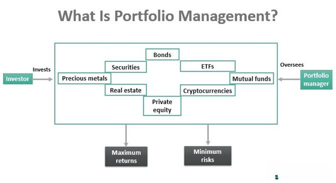

In today's complex financial landscape, effective portfolio creation and management are crucial for achieving investment success. As financial markets continue to evolve, the integration of traditional investment strategies with modern technological advancements has become increasingly important. Specifically, blending financial portfolio creation, investment management, and algorithmic trading can significantly enhance overall investment outcomes.

Financial portfolio creation involves selecting a mix of assets tailored to an investor's objectives and risk tolerance. Historically, this process depended heavily on human judgment, but the rise of big data and computational tools has revolutionized how portfolios are constructed. Algorithmic trading, which leverages complex mathematical models and real-time market data, offers a new dimension of precision and efficiency in executing trades. By automating trading decisions, algorithms can optimize trade execution and adjust portfolio allocations in response to market movements swiftly.



The intersection of these components allows for more dynamic and adaptive investment strategies. Portfolios can be managed with greater attention to risk-adjusted returns while capitalizing on market efficiencies. The integration of algorithmic trading within portfolio management not only augments the speed of trading operations but also enhances decision-making with data-driven insights. This synthesis of traditional finance principles and cutting-edge algorithms presents new opportunities to optimize investment strategies. As a result, the synergy between human expertise and technological advancement holds the potential to redefine success in the modern investment landscape.

## Table of Contents

## Understanding Financial Portfolios

A financial portfolio is a collection of investments that an individual or institution holds across various asset classes such as stocks, bonds, and commodities. The primary purpose of a financial portfolio is to achieve an optimal balance between risk and return through diversification. This strategy minimizes the potential negative impact of a single asset's poor performance on the overall investment returns, thereby stabilizing the portfolio's performance over time.

Diversification is achieved by allocating investments among different asset classes and sectors, which are expected to react differently to economic events. For instance, stocks may offer high returns but come with higher volatility, while bonds generally provide stable income with lower risk. The theory can be mathematically modeled using the principles of Modern Portfolio Theory (MPT), introduced by Harry Markowitz in 1952, which optimizes the expected return of a portfolio for a given level of risk. The formula to calculate the expected return of a portfolio is:

$$
E(R_p) = \sum_{i=1}^{n} w_i \cdot E(R_i)
$$

where $E(R_p)$ is the expected return of the portfolio, $w_i$ is the weight of each asset in the portfolio, and $E(R_i)$ is the expected return of each asset.

Different types of portfolios cater to a variety of investor objectives and risk tolerances. Aggressive portfolios, for example, consist predominantly of equities and are designed for investors with a high risk tolerance, aiming for substantial capital gains. Defensive portfolios, on the other hand, emphasize capital preservation and income through lower-risk investments like bonds and dividend-paying stocks, catering to investors with moderate to low risk tolerance.

Income-focused portfolios prioritize generating steady income streams. These portfolios typically consist of bonds, preferred stocks, and other income-generating securities and are suitable for investors seeking regular cash flow rather than capital appreciation.

Ultimately, the composition of a financial portfolio is driven by factors such as the investor's financial goals, time horizon, and risk appetite. By strategically combining different types of investments, a diversified portfolio aims to achieve a desired balance between risk and return, aligning with the specific needs and objectives of the investor.

## Portfolio Management Strategies

Portfolio management encompasses the strategic allocation of assets with the dual aim of meeting investment targets and managing risk. At its core, portfolio management seeks to maximize returns while minimizing risks through a well-considered mix of asset classes, such as equities, fixed-income securities, real estate, and alternative investments.

### Key Strategies

**Diversification**

Diversification is a fundamental strategy for balancing risk and return. By spreading investments across various asset classes, sectors, or geographic regions, investors can reduce unsystematic risk — the type of risk that is unique to a specific company or industry. This strategy is eloquently captured by the adage, "Don't put all your eggs in one basket." A well-diversified portfolio might include a mix of domestic and international stocks, bonds of varying maturities and credit qualities, real estate investments, and commodities.

**Regular Monitoring and Rebalancing**

Regular portfolio monitoring is essential for responding to market fluctuations and ensuring alignment with the investor's strategic objectives. Rebalancing involves adjusting the portfolio to maintain a desired asset allocation. For instance, if an investor's target allocation is 60% equities and 40% bonds, and a stock market rally causes equities to constitute 70% of the portfolio, rebalancing would involve selling some equities or buying more bonds to restore the original allocation.

The rebalancing process can be mathematically represented as follows:

$$
\text{Rebalanced Asset} = \frac{\text{Current Value of Portfolio} \times \text{Target Allocation Percentage}}{\text{Current Price of Asset}}
$$

**Qualitative and Quantitative Methods**

Effective portfolio managers leverage both qualitative and quantitative methods to optimize asset allocation. Qualitative methods may include [fundamental analysis](/wiki/fundamental-analysis), which evaluates an asset's intrinsic value based on economic indicators, industry conditions, and company-specific factors. Quantitative methods, on the other hand, often involve statistical models and algorithms to identify patterns and trends in market data.

A simple quantitative model might use a moving average crossover strategy, which signals buy or sell decisions based on the crossing of short-term and long-term moving averages. This can be implemented in Python as follows:

```python
import pandas as pd

# Assuming 'data' is a DataFrame with a 'Close' column for closing prices
short_window = 40
long_window = 100

signals = pd.DataFrame(index=data.index)
signals['Signal'] = 0.0

signals['Short_MA'] = data['Close'].rolling(window=short_window, min_periods=1).mean()
signals['Long_MA'] = data['Close'].rolling(window=long_window, min_periods=1).mean()

signals['Signal'][short_window:] = np.where(signals['Short_MA'][short_window:] 
                                               > signals['Long_MA'][short_window:], 1.0, 0.0)
signals['Positions'] = signals['Signal'].diff()
```

In conclusion, successful portfolio management requires a thoughtful combination of strategies to navigate market uncertainties and meet individual investment goals. By employing diversification, regular monitoring, and both qualitative and quantitative analysis, investors can optimize their portfolios for better risk-adjusted returns.

## The Role of Algorithmic Trading

Algorithmic trading automates the execution of trades through the use of pre-programmed instructions. These algorithms are designed to make trading decisions based on a series of defined rules and market data inputs, allowing for transactions without human intervention. One of the primary benefits of [algorithmic trading](/wiki/algorithmic-trading) is the ability to execute trades at optimal prices and speeds. This is achieved due to the ability of these algorithms to process real-time market data far quicker than a human could. 

Leveraging real-time market data allows algorithms to identify patterns, trends, and opportunities for trades that align with the criteria set by the investor. For instance, certain algorithms might look for [arbitrage](/wiki/arbitrage) opportunities or mean reversion scenarios and act on them immediately, often executing trades in milliseconds. This speed not only reduces the latency between decision and execution but also minimizes the impact of market fluctuations on transactions, thus securing better pricing.

Algorithmic trading can significantly enhance the efficiency and effectiveness of portfolio management. By automating routine trading tasks, it frees up portfolio managers to focus on more strategic activities. Additionally, it can aid in ensuring disciplined investment strategies by systematically adhering to pre-set trading conditions without emotional interference. This type of trading is also highly scalable; algorithms can handle a higher [volume](/wiki/volume-trading-strategy) of transactions across diverse asset classes more efficiently than manual trading. 

Moreover, algorithms can handle complex calculations and leverage advanced statistical methods to optimize buy and sell strategies. They can be programmed using Python, among other languages, to perform tasks such as:

```python
import pandas as pd
import numpy as np

# Sample algorithm for moving average crossing strategy
def moving_average_crossing(prices, short_window=40, long_window=100):
    signals = pd.DataFrame(index=prices.index)
    signals['price'] = prices
    # Short and long moving averages
    signals['short_mavg'] = prices.rolling(window=short_window, min_periods=1).mean()
    signals['long_mavg'] = prices.rolling(window=long_window, min_periods=1).mean()
    # Create signals (1 for buy, -1 for sell)
    signals['signal'] = 0.0
    signals['signal'][short_window:] = np.where(
        signals['short_mavg'][short_window:] > signals['long_mavg'][short_window:], 1.0, -1.0)
    signals['positions'] = signals['signal'].diff()
    return signals
```

This code provides a basic framework to execute a moving average crossover strategy, where a short-term moving average crossing above a long-term moving average generates a buy signal, and vice versa for a sell signal. Such algorithms allow for automatic entry and [exit](/wiki/exit-strategy) in adherence with pre-defined trading strategies, reducing the potential for executory errors.

In conclusion, algorithmic trading serves as an integral part of modern portfolio management by enhancing execution efficiency, ensuring consistent strategy application, and enabling high-frequency trading capacities. As financial markets continue to advance, the role of technology and algorithms in managing investments is expected to grow, providing for more precise and profitable trading activities.

## Integrating Algo Trading in Portfolio Management

Integrating algorithmic trading into portfolio management involves leveraging advanced computing techniques to enhance the efficiency and effectiveness of investment strategies. This integration can result in improved risk-adjusted returns, enabling investors to optimize their portfolios to meet financial goals. By automating key functions like portfolio rebalancing, monitoring market trends, and executing trades, algorithmic trading systems offer several advantages.

Automated portfolio rebalancing is one crucial application of algorithmic trading in portfolio management. Rebalancing maintains the original asset allocation of a portfolio, which can drift over time due to market movements. Algorithms can be programmed to perform rebalancing based on predefined criteria, such as time intervals (e.g., quarterly) or threshold triggers (e.g., if asset allocation deviates by a certain percentage). Such automation ensures portfolios remain aligned with investors' risk profiles and objectives without requiring continuous manual intervention.

Monitoring market trends is another area where algorithms significantly contribute. Advanced trading systems can process vast amounts of real-time market data to identify patterns and trends that may not be immediately observable to human analysts. This capability allows investors to capture market opportunities more swiftly and accurately, ensuring that trading decisions are informed by the most current and relevant information.

Efficient trade execution is inherently linked to the use of algorithms. By leveraging real-time data and sophisticated logic, algorithmic trading systems can execute large volumes of trades at speeds and prices that are often unachievable through manual trading. This efficiency reduces the cost of trading, minimizes market impact, and enhances the [liquidity](/wiki/liquidity-risk-premium) management of the portfolio.

It is essential, however, for investors to ensure that their trading algorithms align with their risk tolerance and investment goals. Customization of algorithms to reflect individual investor profiles involves defining parameters that control trading actions, such as maximum investment limits or the level of acceptable risk. This customization ensures that the automation supports the overall strategic objectives of the portfolio.

In conclusion, the integration of algorithmic trading within portfolio management systems represents a powerful synergy of technology and strategy. By automating critical functions and providing data-driven insights, algorithmic trading aids investors in achieving more consistent and optimized investment outcomes. Nonetheless, successful implementation requires careful algorithm design and ongoing assessment to maintain alignment with investment objectives.

## Challenges and Considerations

Algorithmic trading has revolutionized investment strategies by steadily increasing efficiency and precision in execution. However, implementing algorithmic systems involves particular challenges and considerations that investors and traders must address to ensure sustained success. A critical foundational requirement is the establishment of a robust infrastructure supported by a reliable market data feed. High-frequency trading ([HFT](/wiki/high-frequency-trading-strategies)) algorithms, for instance, operate over milliseconds. Thus, they necessitate advanced technical architecture and uninterrupted access to real-time data. Discrepancies in data feeds or latency can lead to suboptimal trade execution and potential financial loss.

Investors must also acknowledge algorithmic risk, which encompasses model risk, execution risk, and market risk. Model risk arises when the algorithm does not adequately represent the market conditions it seeks to exploit, leading to inaccurate predictions and unintended trading outcomes. Execution risk is tied to the algorithm failing to execute trades as planned due to system errors or market inefficiencies. Market risk pertains to the inherent [volatility](/wiki/volatility-trading-strategies) and unpredictability of financial markets, which algorithms must endure. To mitigate these risks, investors should implement robust testing protocols, such as [backtesting](/wiki/backtesting) trading algorithms against historical data to evaluate performance under various market conditions.

Regulatory compliance poses another pivotal consideration. Financial markets operate under strict regulatory frameworks designed to maintain fairness, transparency, and stability. Algorithmic traders are required to adhere to these regulations, including ensuring the algorithm’s ability to adapt to rule changes and maintaining logs of trading activities for auditing purposes. Failure to meet legal requirements can result in severe penalties, further underscoring the importance of an agile compliance strategy.

A constant evaluation of algorithm performance is vital. Performance metrics, such as the Sharpe ratio or maximum drawdown, should be continuously monitored and analyzed. Investors should regularly review algorithms for performance degradation and make necessary adjustments to improve accuracy and efficiency. Additionally, [machine learning](/wiki/machine-learning) techniques can be employed to refine algorithms over time. A simple Python implementation for calculating the Sharpe ratio could be:

```python
import numpy as np

def calculate_sharpe_ratio(returns, risk_free_rate):
    excess_returns = returns - risk_free_rate
    return np.mean(excess_returns) / np.std(excess_returns)

# Example usage
monthly_returns = np.array([0.02, 0.01, 0.03, -0.005, 0.04])
risk_free_rate = 0.01
sharpe_ratio = calculate_sharpe_ratio(monthly_returns, risk_free_rate)
print(f"Sharpe Ratio: {sharpe_ratio}")
```

While algorithmic trading has potential benefits, these challenges and considerations necessitate vigilance and proactive management to fully realize its advantages. Investors must balance innovation with risk management and compliance to optimize their trading platforms effectively.

## Conclusion

As financial markets become increasingly complex and dynamic, the integration of algorithmic trading into portfolio management is becoming not just an option, but a necessity. This evolution is driven by the need for precise, data-driven decision-making and the capability of algorithms to process vast volumes of information at speeds impossible for human traders. By harnessing these qualities, investors can better navigate market volatility and capitalize on opportunities for enhanced risk-adjusted returns.

Balancing human insight with algorithmic precision offers a distinct advantage in developing sophisticated investment strategies. Human expertise, with its ability to interpret qualitative data and apply intuitive judgment, complements the numerical accuracy and efficiency of automated trading systems. This symbiotic relationship allows for more nuanced investment decisions that can adapt to both systematic patterns and qualitative changes in the market environment.

Investors must remain proactive in adapting their approach to leverage the strengths of both traditional investment wisdom and modern technological advancements. This involves regular updates and evaluations of algorithmic models to ensure they align with evolving market conditions and investor goals. Additionally, maintaining an understanding of regulatory changes and technological innovations is critical to staying competitive.

Ultimately, the future of investment management lies in the strategic fusion of human intelligence and algorithmic power. By continuously refining this integration, investors can achieve a more resilient and effective portfolio management process, positioning themselves advantageously in the ever-evolving financial landscape.

## References & Further Reading

[1]: Markowitz, H. (1952). ["Portfolio Selection,"](https://onlinelibrary.wiley.com/doi/abs/10.1111/j.1540-6261.1952.tb01525.x) The Journal of Finance, 7(1), 77–91.

[2]: Lopez de Prado, M. (2018). ["Advances in Financial Machine Learning."](https://www.amazon.com/Advances-Financial-Machine-Learning-Marcos/dp/1119482089) Wiley.

[3]: Aronson, D. (2006). ["Evidence-Based Technical Analysis: Applying the Scientific Method and Statistical Inference to Trading Signals."](https://www.amazon.com/Evidence-Based-Technical-Analysis-Scientific-Statistical/dp/0470008741) Wiley.

[4]: Jansen, S. (2020). ["Machine Learning for Algorithmic Trading,"](https://github.com/stefan-jansen/machine-learning-for-trading) 2nd Edition, Packt Publishing.

[5]: Chan, E. P. (2008). ["Quantitative Trading: How to Build Your Own Algorithmic Trading Business."](https://github.com/ftvision/quant_trading_echan_book) Wiley Trading.