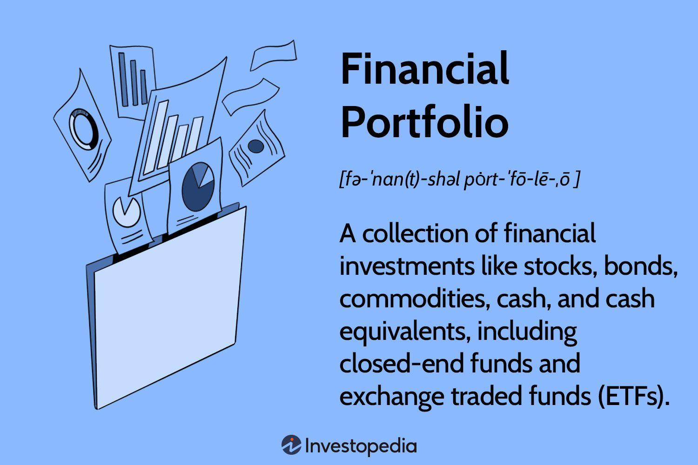

## Table of Contents

## What is a financial portfolio and why is it important?

A financial portfolio is a collection of different investments like stocks, bonds, and other assets that someone owns. It's like a basket where you put all your financial eggs. People create portfolios to grow their money over time and to reach their financial goals, like saving for retirement or buying a house.

Having a financial portfolio is important because it helps spread out risk. Instead of putting all your money into one thing, you can invest in many different things. This way, if one investment does badly, the others might do well and balance it out. Also, a well-managed portfolio can help your money grow faster than if you just kept it in a savings account. This can make a big difference in reaching your financial goals.

## How do you start building a financial portfolio from scratch?

To start building a financial portfolio from scratch, the first thing you need to do is set clear financial goals. Ask yourself what you want to achieve with your money. Are you saving for retirement, buying a house, or just growing your wealth? Once you know your goals, you can decide how much risk you're willing to take. If you're young and saving for something far in the future, you might be okay with riskier investments like stocks. But if you need the money soon, you might want safer options like bonds.

Next, you'll need to open an investment account. This could be a brokerage account, a retirement account like an IRA, or even a simple savings account if you're starting small. Once your account is set up, you can start adding different types of investments to your portfolio. A good way to begin is by investing in a mix of stocks, bonds, and maybe some mutual funds or ETFs. These can help spread out your risk. As you get more comfortable, you can look into other types of investments like real estate or commodities. Remember, the key is to keep learning and adjusting your portfolio over time to match your goals and how much risk you're willing to take.

## What are the different types of assets you can include in a portfolio?

There are many different types of assets you can put in your financial portfolio. The most common ones are stocks, which are pieces of ownership in a company. When you buy a stock, you hope the company does well and the stock price goes up. Another common asset is bonds, which are like loans you give to a company or government. They pay you back with interest over time. You can also include mutual funds, which are baskets of stocks or bonds managed by professionals, and exchange-traded funds (ETFs), which are similar but trade like stocks.

Other types of assets you might consider are real estate, which means owning property like houses or buildings. Real estate can give you rental income and might go up in value over time. Commodities are another option, like gold or oil, which you can buy and sell. Some people also invest in things like art or collectibles, hoping they will become more valuable. Lastly, cash and cash equivalents, like savings accounts or money market funds, are very safe but usually don't grow as much as other investments.

Putting together a mix of these different assets can help you balance risk and reward. It's important to think about your goals and how much risk you're okay with when choosing what to include in your portfolio.

## How should a beginner allocate their investments across different asset classes?

When you're new to investing, a good way to start is by spreading your money across different types of investments. This is called diversification, and it helps lower your risk. A simple way for beginners to do this is by using the "60/40 rule." This means putting 60% of your money into stocks and 40% into bonds. Stocks can grow your money faster but they're riskier, while bonds are safer but grow slower. This mix can help balance out the ups and downs of the stock market.

As you get more comfortable with investing, you can start adding other types of assets to your portfolio. You might want to put some money into real estate investment trusts (REITs) if you're interested in property, or maybe some commodities like gold if you want to protect against inflation. But don't forget to keep your overall goals in mind. If you're saving for something in the next few years, you might want to keep more of your money in safer investments like bonds or cash. The key is to keep learning and adjusting your investments over time to make sure they match what you want to achieve.

## What are the risks associated with different types of investments?

Every type of investment has its own risks. Stocks can go up and down a lot. If a company you own stock in does badly, the price of your stock can drop a lot and you might lose money. This is called market risk. Also, if everyone starts selling stocks at the same time, like during a big economic problem, your stocks can lose value fast. This is called liquidity risk. But if you keep your stocks for a long time, they might grow and make you money.

Bonds are usually safer than stocks, but they have risks too. If the company or government you lent money to can't pay you back, you could lose your money. This is called default risk. Also, if interest rates go up, the value of your bonds can go down. This is called interest rate risk. But bonds are less likely to lose all their value compared to stocks, so they're often seen as safer.

Other types of investments like real estate and commodities have their own risks too. Real estate can be hard to sell quickly if you need money fast, and its value can go down if the housing market crashes. Commodities like gold can be very unpredictable because their prices can change a lot based on things like world events or supply and demand. It's important to understand these risks and think about how much you're okay with losing before you invest your money.

## How can diversification help in managing a financial portfolio?

Diversification means spreading your money across different types of investments. It's like not putting all your eggs in one basket. When you diversify, you can lower the risk of losing a lot of money if one investment does badly. For example, if you only invest in one company's stock and that company goes bankrupt, you could lose all your money. But if you also have money in bonds, real estate, and other stocks, those other investments might do well and help balance out the loss.

By having a mix of different investments, you can protect your portfolio from big ups and downs. Different types of investments often do well at different times. When stocks are going down, maybe bonds or real estate are going up. This can help smooth out the overall performance of your portfolio. Over time, this can lead to more steady growth and help you reach your financial goals without taking too much risk.

## What is the role of asset allocation in portfolio management?

Asset allocation is about deciding how to spread your money across different types of investments like stocks, bonds, and real estate. It's a key part of managing your financial portfolio because it helps you balance risk and reward. When you choose how much to put into each type of investment, you're thinking about your goals and how much risk you're okay with. For example, if you're young and saving for retirement, you might put more money into stocks because they can grow a lot over time, even though they're riskier.

The right asset allocation can make a big difference in how your portfolio does over time. By spreading your money across different investments, you can lower the risk of losing a lot if one type of investment does badly. For instance, if the stock market goes down, your bonds might still be doing okay, which can help balance things out. As you get older or your goals change, you might want to change your asset allocation too. Maybe you'll move more money into safer investments like bonds as you get closer to needing the money. The key is to keep checking and adjusting your asset allocation to make sure it still fits with what you want to achieve.

## How often should you review and rebalance your portfolio?

You should review your portfolio at least once a year. This helps you see if your investments are still doing what you want them to do. If your goals have changed, or if one type of investment has grown a lot more than the others, it might be time to make some changes. Checking your portfolio regularly also helps you stay on track with your financial goals.

Rebalancing your portfolio means adjusting it to keep the right mix of investments. You might want to do this once a year, or if your investments have shifted a lot from your original plan. For example, if stocks have done really well and now make up a bigger part of your portfolio than you wanted, you might sell some stocks and buy more bonds to get back to your original plan. Rebalancing helps keep your risk at the level you're comfortable with and can help your portfolio perform better over time.

## What advanced strategies can be used to optimize portfolio performance?

One advanced strategy to optimize portfolio performance is using tax-efficient investing. This means thinking about how much you'll have to pay in taxes on your investments. For example, you might put investments that grow a lot in tax-advantaged accounts like an IRA or 401(k). This can help you keep more of your money. Another way is to use tax-loss harvesting, where you sell investments that have gone down in value to offset the taxes on your gains. This can help lower your tax bill and make your portfolio grow faster.

Another strategy is using tactical asset allocation. This means changing your investments based on what's happening in the market. If you think stocks will do well in the next few months, you might put more money into them. But if you think they'll go down, you might move money into safer investments like bonds. This can help you take advantage of market trends and protect your portfolio from big drops. It's a bit more complicated and requires keeping a close eye on the market, but it can help improve your portfolio's performance over time.

Lastly, you can use options and derivatives to hedge your investments. This means using these financial tools to protect your portfolio from big losses. For example, you might buy a put option on a stock you own. If the stock price drops a lot, the put option can help you make some money back. These strategies can be tricky and might need help from a financial advisor, but they can help manage risk and boost your portfolio's performance.

## How do tax considerations affect portfolio management decisions?

Tax considerations play a big role in how you manage your portfolio. When you make money from your investments, you have to pay taxes on it. But there are ways to make sure you don't pay too much. One way is to put your money into accounts like an IRA or 401(k). These accounts let your investments grow without being taxed right away. This can help your money grow faster because you're not losing part of it to taxes every year. Another thing you can do is called tax-loss harvesting. This means selling investments that have gone down in value to lower the taxes you owe on the money you made from other investments. It's like using your losses to save money on taxes.

Another tax strategy is thinking about where to put different types of investments. For example, if you have investments that pay a lot of dividends, you might want to put them in a tax-advantaged account. This way, you don't have to pay taxes on the dividends every year. Also, if you're selling investments and making a profit, you need to think about how long you've held them. If you've held them for more than a year, you might pay less in taxes than if you sold them sooner. All these tax strategies can help you keep more of your money and make your portfolio grow faster over time.

## What are the latest trends in portfolio management and investment?

One big trend in portfolio management these days is using technology and data to make better investment choices. People are using things like robo-advisors, which are computer programs that manage your investments for you. They use fancy math to figure out the best way to spread your money across different investments. Also, a lot of investors are looking at big data and using it to find new opportunities. This means they're using lots of information to see patterns and trends that can help them make smarter choices.

Another trend is focusing more on environmental, social, and governance (ESG) factors. This means people are choosing investments that are good for the planet, treat workers well, and have strong leadership. More and more investors want to make money and also make the world a better place. This is called sustainable investing, and it's becoming really popular. Companies that do well in these areas are often seen as safer and more likely to do well in the long run.

Lastly, there's a growing interest in alternative investments like cryptocurrencies and private equity. These types of investments can be riskier but also offer the chance for big rewards. People are looking for new ways to grow their money, especially when traditional investments like stocks and bonds might not be doing as well. This trend shows that investors are willing to take on more risk to find new opportunities and keep their portfolios growing.

## How can one use financial software and tools to manage their portfolio effectively?

Using financial software and tools can make managing your portfolio a lot easier. These tools can help you keep track of all your investments in one place. You can see how your stocks, bonds, and other assets are doing without having to check each one separately. Many of these tools also let you set up alerts, so you know right away if something important happens, like a big drop in the value of one of your investments. This can help you make quick decisions to protect your money.

Another way financial software helps is by giving you advice on how to spread your money across different investments. Some tools, like robo-advisors, use fancy math to suggest the best mix of stocks, bonds, and other assets for you based on your goals and how much risk you're okay with. They can also help you rebalance your portfolio, which means making sure your investments stay in line with your plan. This can be a big help, especially if you're new to investing and want to make sure you're doing things right.

## What is Understanding Financial Portfolios?

A financial portfolio is a collection of investments that an individual or institution holds across various asset classes such as stocks, bonds, and commodities. The primary purpose of a financial portfolio is to achieve an optimal balance between risk and return through diversification. This strategy minimizes the potential negative impact of a single asset's poor performance on the overall investment returns, thereby stabilizing the portfolio's performance over time.

Diversification is achieved by allocating investments among different asset classes and sectors, which are expected to react differently to economic events. For instance, stocks may offer high returns but come with higher volatility, while bonds generally provide stable income with lower risk. The theory can be mathematically modeled using the principles of Modern Portfolio Theory (MPT), introduced by Harry Markowitz in 1952, which optimizes the expected return of a portfolio for a given level of risk. The formula to calculate the expected return of a portfolio is:

$$
E(R_p) = \sum_{i=1}^{n} w_i \cdot E(R_i)
$$

where $E(R_p)$ is the expected return of the portfolio, $w_i$ is the weight of each asset in the portfolio, and $E(R_i)$ is the expected return of each asset.

Different types of portfolios cater to a variety of investor objectives and risk tolerances. Aggressive portfolios, for example, consist predominantly of equities and are designed for investors with a high risk tolerance, aiming for substantial capital gains. Defensive portfolios, on the other hand, emphasize capital preservation and income through lower-risk investments like bonds and dividend-paying stocks, catering to investors with moderate to low risk tolerance.

Income-focused portfolios prioritize generating steady income streams. These portfolios typically consist of bonds, preferred stocks, and other income-generating securities and are suitable for investors seeking regular cash flow rather than capital appreciation.

Ultimately, the composition of a financial portfolio is driven by factors such as the investor's financial goals, time horizon, and risk appetite. By strategically combining different types of investments, a diversified portfolio aims to achieve a desired balance between risk and return, aligning with the specific needs and objectives of the investor.

## What are Portfolio Management Strategies?

Portfolio management encompasses the strategic allocation of assets with the dual aim of meeting investment targets and managing risk. At its core, portfolio management seeks to maximize returns while minimizing risks through a well-considered mix of asset classes, such as equities, fixed-income securities, real estate, and alternative investments.

### Key Strategies

**Diversification**

Diversification is a fundamental strategy for balancing risk and return. By spreading investments across various asset classes, sectors, or geographic regions, investors can reduce unsystematic risk — the type of risk that is unique to a specific company or industry. This strategy is eloquently captured by the adage, "Don't put all your eggs in one basket." A well-diversified portfolio might include a mix of domestic and international stocks, bonds of varying maturities and credit qualities, real estate investments, and commodities.

**Regular Monitoring and Rebalancing**

Regular portfolio monitoring is essential for responding to market fluctuations and ensuring alignment with the investor's strategic objectives. Rebalancing involves adjusting the portfolio to maintain a desired asset allocation. For instance, if an investor's target allocation is 60% equities and 40% bonds, and a stock market rally causes equities to constitute 70% of the portfolio, rebalancing would involve selling some equities or buying more bonds to restore the original allocation.

The rebalancing process can be mathematically represented as follows:

$$
\text{Rebalanced Asset} = \frac{\text{Current Value of Portfolio} \times \text{Target Allocation Percentage}}{\text{Current Price of Asset}}
$$

**Qualitative and Quantitative Methods**

Effective portfolio managers leverage both qualitative and quantitative methods to optimize asset allocation. Qualitative methods may include [fundamental analysis](/wiki/fundamental-analysis), which evaluates an asset's intrinsic value based on economic indicators, industry conditions, and company-specific factors. Quantitative methods, on the other hand, often involve statistical models and algorithms to identify patterns and trends in market data.

A simple quantitative model might use a moving average crossover strategy, which signals buy or sell decisions based on the crossing of short-term and long-term moving averages. This can be implemented in Python as follows:

```python
import pandas as pd

# Assuming 'data' is a DataFrame with a 'Close' column for closing prices
short_window = 40
long_window = 100

signals = pd.DataFrame(index=data.index)
signals['Signal'] = 0.0

signals['Short_MA'] = data['Close'].rolling(window=short_window, min_periods=1).mean()
signals['Long_MA'] = data['Close'].rolling(window=long_window, min_periods=1).mean()

signals['Signal'][short_window:] = np.where(signals['Short_MA'][short_window:] 
                                               > signals['Long_MA'][short_window:], 1.0, 0.0)
signals['Positions'] = signals['Signal'].diff()
```

In conclusion, successful portfolio management requires a thoughtful combination of strategies to navigate market uncertainties and meet individual investment goals. By employing diversification, regular monitoring, and both qualitative and quantitative analysis, investors can optimize their portfolios for better risk-adjusted returns.

## References & Further Reading

[1]: Markowitz, H. (1952). ["Portfolio Selection,"](https://onlinelibrary.wiley.com/doi/abs/10.1111/j.1540-6261.1952.tb01525.x) The Journal of Finance, 7(1), 77–91.

[2]: Lopez de Prado, M. (2018). ["Advances in Financial Machine Learning."](https://www.amazon.com/Advances-Financial-Machine-Learning-Marcos/dp/1119482089) Wiley.

[3]: Aronson, D. (2006). ["Evidence-Based Technical Analysis: Applying the Scientific Method and Statistical Inference to Trading Signals."](https://www.amazon.com/Evidence-Based-Technical-Analysis-Scientific-Statistical/dp/0470008741) Wiley.

[4]: Jansen, S. (2020). ["Machine Learning for Algorithmic Trading,"](https://github.com/stefan-jansen/machine-learning-for-trading) 2nd Edition, Packt Publishing.

[5]: Chan, E. P. (2008). ["Quantitative Trading: How to Build Your Own Algorithmic Trading Business."](https://github.com/ftvision/quant_trading_echan_book) Wiley Trading.