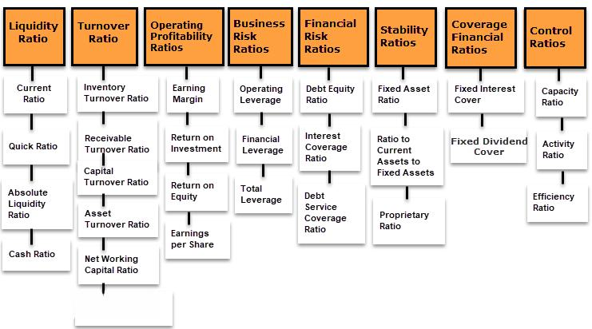

Understanding financial ratios and their analysis is a pivotal aspect for investors, analysts, and financial managers aiming to gain a comprehensive view of a company's financial condition. Financial ratios are quantitative metrics derived from financial statements such as the balance sheet, income statement, and cash flow statement. These ratios offer insights into various aspects of a company's performance, including operational efficiency, profitability, and overall financial health.

Ratio analysis serves as a fundamental tool in financial diagnostics, enabling the identification of trends, strengths, and potential areas of concern within an organization. It provides a structured framework for comparing companies within the same industry, facilitating informed decision-making regarding investments and financial management.



One of the significant advancements in financial analysis is the integration of financial ratios into algorithmic trading. Algorithmic trading, often referred to as algo-trading, relies on computer algorithms to execute trades at a speed and scale that is beyond human capability. These algorithms utilize financial ratios strategically, combining them with technical and fundamental analyses to enhance the decision-making process.

Algorithmic trading uses financial ratios to evaluate a company's economic standing in real-time, enabling the automation of trading decisions based on predefined criteria. These quantitative methods offer the advantage of reducing emotional and psychological biases in trading, providing a systematic approach to capitalizing on market opportunities.

The fusion of traditional financial analysis with advanced algorithmic trading paradigms underscores the evolving nature of modern financial markets. As technology continues to progress, the role of financial ratios in algorithmic trading is expected to expand, offering new opportunities for maximizing investment returns. This article investigates into the significance of ratio analysis in both traditional financial diagnostics and its transformative impact on algorithmic trading strategies.

## Table of Contents

## What is Ratio Analysis?

Ratio analysis is a vital tool in financial analysis that involves the evaluation of financial statement data to provide insights into a company's performance and financial health. By analyzing the various components of financial statements, such as the balance sheet, income statement, and cash flow statement, ratio analysis provides a quantitative basis for assessing a company's strengths, weaknesses, and trends in its operations. 

The primary purpose of ratio analysis is to distill complex financial data into readily interpretable metrics that can highlight the operational efficiency and financial viability of a business. These metrics enable stakeholders, including investors, analysts, and management, to make informed decisions regarding investment, financing, and operational strategies. 

Key categories of financial ratios include:

1. **Liquidity Ratios**: These ratios measure a company's ability to meet its short-term obligations using its current assets. Common liquidity ratios are the Current Ratio and the Quick Ratio. The Current Ratio is calculated as:
$$
   \text{Current Ratio} = \frac{\text{Current Assets}}{\text{Current Liabilities}}

$$

2. **Solvency Ratios**: These ratios assess a company's long-term financial stability by analyzing its debt levels in relation to its assets and equity. A prominent solvency ratio is the Debt to Equity Ratio, calculated as:
$$
   \text{Debt to Equity Ratio} = \frac{\text{Total Debt}}{\text{Shareholders' Equity}}

$$

3. **Profitability Ratios**: These ratios evaluate a company's ability to generate profit relative to its sales, assets, or equity. Examples include the Net Profit Margin and Return on Equity (ROE). The Return on Equity is given by:
$$
   \text{ROE} = \frac{\text{Net Income}}{\text{Shareholders' Equity}}

$$

4. **Efficiency Ratios**: These ratios measure how effectively a company utilizes its assets and liabilities to generate sales and maximize profits. An example is the Asset Turnover Ratio, calculated with:
$$
   \text{Asset Turnover Ratio} = \frac{\text{Net Sales}}{\text{Average Total Assets}}

$$

Each ratio serves a specific purpose and offers distinct insights, which can be used to compare a company's financial health against industry standards or its historical performance. Effective use of these ratios enables stakeholders to identify potential financial issues, improve strategic planning, and ultimately, enhance operational management.

## Types of Financial Ratios and Their Applications

Financial ratios serve as vital indicators in the examination of a company's financial standing and operational efficiency. Each type of financial ratio fulfills a unique role in the financial analysis spectrum, offering stakeholders critical insights into different aspects of a company's performance. 

**Liquidity Ratios**

Liquidity ratios are instrumental in evaluating a company's capacity to meet its short-term liabilities with its short-term assets. The two primary [liquidity](/wiki/liquidity-risk-premium) ratios are the current ratio and the quick ratio. The current ratio is calculated as:

$$
\text{Current Ratio} = \frac{\text{Current Assets}}{\text{Current Liabilities}}
$$

This ratio provides a measure of a company's ability to pay off its short-term obligations. A ratio above 1 indicates that the company has more current assets than current liabilities, signaling a potentially favorable liquidity position.

The quick ratio, or acid-test ratio, refines this evaluation by excluding inventory from current assets, given that inventory can take longer to liquidate. The quick ratio is expressed as:

$$
\text{Quick Ratio} = \frac{\text{Current Assets} - \text{Inventory}}{\text{Current Liabilities}}
$$

**Solvency Ratios**

Solvency ratios assess a company's long-term financial health by examining its ability to meet long-term obligations and sustain operations indefinitely. The debt to equity ratio is a common solvency ratio, calculated as:

$$
\text{Debt to Equity Ratio} = \frac{\text{Total Debt}}{\text{Total Equity}}
$$

This ratio indicates the proportion of company financing that comes from debt versus shareholder equity. A higher value suggests more leverage and potential financial risk.

**Profitability Ratios**

Profitability ratios gauge a company's ability to generate income relative to sales, assets, or equity. The gross margin ratio is one example, determining the percentage of revenue exceeding the cost of goods sold (COGS):

$$
\text{Gross Margin Ratio} = \frac{\text{Revenue} - \text{COGS}}{\text{Revenue}} \times 100
$$

Another key profitability metric is the return on equity (ROE), which measures how effectively management is using a company’s assets to create profits:

$$
\text{ROE} = \frac{\text{Net Income}}{\text{Shareholder's Equity}}
$$

**Efficiency Ratios**

Efficiency ratios evaluate how effectively a company is utilizing its assets and managing liabilities. The inventory turnover ratio, for instance, shows how many times a company's inventory is sold and replaced over a period:

$$
\text{Inventory Turnover} = \frac{\text{COGS}}{\text{Average Inventory}}
$$

Another measure, the asset turnover ratio, assesses how efficiently a company uses its assets to generate sales:

$$
\text{Asset Turnover} = \frac{\text{Net Sales}}{\text{Average Total Assets}}
$$

**Market Prospect Ratios**

Market prospect ratios provide insights into investors' expectations of future earnings growth and market performance. A common ratio is the price to earnings (P/E) ratio:

$$
\text{P/E Ratio} = \frac{\text{Market Value per Share}}{\text{Earnings per Share}}
$$

This ratio reflects investors' perceptions of the company's growth prospects. A high P/E ratio might indicate that the stock is overvalued, or it might reflect high expected growth. 

Each of these ratios plays a crucial role in financial analysis, enabling investors, analysts, and managers to make informed decisions based on a firm's financial health and performance potential.

## How Ratio Analysis Works in Financial Analysis

Ratio analysis is a crucial component of financial analysis, enabling the examination of a company's performance by utilizing historical data derived from financial statements such as the balance sheet, income statement, and cash flow statement. This analysis involves the calculation of various financial ratios, which are then interpreted over time or compared against industry benchmarks to extract meaningful insights.

To begin, analysts collect historical financial data, which provides a basis for evaluating the company's operational efficiency, liquidity, profitability, and solvency. Historical data are represented in key performance metrics, and these metrics are used to calculate specific ratios. The primary financial statements involved include:

- **Balance Sheet:** Provides information on assets, liabilities, and equity.
- **Income Statement:** Offers details on revenue, expenses, profits, and losses during a specific period.
- **Cash Flow Statement:** Shows cash inflows and outflows, highlighting the company’s liquidity position.

The process involves identifying relevant ratios across various categories and using them to evaluate organizational performance. For example:

- **Current Ratio (Liquidity):** \[ \text{Current Ratio} = \frac{\text{Current Assets}}{\text{Current Liabilities}}
$$
- **Debt to Equity Ratio (Solvency):** \[ \text{Debt to Equity Ratio} = \frac{\text{Total Liabilities}}{\text{Shareholder's Equity}}
$$
- **Return on Equity (Profitability):** \[ \text{ROE} = \frac{\text{Net Income}}{\text{Shareholder's Equity}}
$$

Investors and analysts rely on these ratios to evaluate past performance and forecast future financial scenarios. For instance, a higher Return on Equity (ROE) may indicate effective management and a strong potential for future growth, while an elevated debt to equity ratio may signal higher risk due to increased leverage.

Additionally, ratio analysis facilitates comparative evaluation either against industry benchmarks or competitors within the same sector. This benchmarking process allows analysts to assess whether the company is performing better, on par, or worse relative to its peers.

Predictive analysis is another critical use of ratio analysis, as historical data trends can indicate potential future outcomes. Analysts often use these trends in conjunction with qualitative factors to form forecasts about the company's financial health and viability.

In summary, ratio analysis is a fundamental method in financial analysis, transforming raw historical financial data into actionable insights, guiding investment decisions, and predicting future corporate financial scenarios. It equips stakeholders with essential tools for assessing company performance and making informed financial decisions.

## Limitations of Financial Ratio Analysis

Financial ratio analysis, while a crucial tool for assessing a company's financial health, has notable limitations that investors and analysts should consider. Ratios alone do not provide a complete picture; they must be interpreted in the context of industry norms and the unique circumstances of the company being analyzed.

One major limitation is the potential for manipulation. Companies may engage in creative accounting practices to influence their financial statements, thereby skewing ratio results. For example, altering inventory valuation methods or changing depreciation schedules can impact key ratios like inventory turnover and return on assets (ROA). This manipulation highlights the danger of relying heavily on one or two metrics, as they might present a misleading view of a company's true financial position.

Moreover, financial ratios are static and based on historical data, which means they may not adequately reflect current or future economic conditions. Seasonal variations can significantly impact ratios, potentially leading to misinterpretations if such factors are not accounted for. For instance, a retail business might exhibit strong liquidity ratios during the holiday season due to higher sales volumes, which may not be sustainable throughout the year. Thus, the timing of financial statements can skew results, needing adjustments for seasonal patterns.

Economic factors, such as inflation rates, interest rates, and currency fluctuations, also play a critical role in ratio analysis. These factors can alter the context within which ratios are evaluated, affecting their comparability across different periods or industries. For example, a high debt-to-equity ratio may be concerning during periods of high-interest rates but less so when interest rates are low. Additionally, comparing financial ratios between companies operating in different economic environments without adjusting for these factors can lead to erroneous conclusions.

In summary, while financial ratios provide valuable insights into a company's performance, they are not definitive solutions. Users of ratio analysis should interpret these metrics in conjunction with other qualitative and quantitative factors to form a more comprehensive understanding of a company's financial health. This integrated approach helps mitigate the risks of relying solely on financial ratios and enhances decision-making in financial assessments.

## Algorithmic Trading and Financial Ratios

Algorithmic trading employs sophisticated quantitative models to facilitate automated trading decisions that rely heavily on the precise and high-speed computation of various financial metrics. Among these, financial ratios play a pivotal role, offering a streamlined method to assess the financial health and performance of potential investment targets. These ratios, when integrated into trading algorithms, help traders and institutions to swiftly evaluate and respond to market conditions based on quantifiable parameters.

By using financial ratios such as the Price-Earnings (P/E) ratio, Return on Equity (ROE), and Earnings Per Share (EPS), algorithms can construct a more comprehensive profile of a company's performance. These ratios are often combined with technical analysis indicators, such as moving averages or the Relative Strength Index (RSI), to refine trading strategies. A typical quantitative strategy might be formulated as follows:

1. **Selection of Key Ratios**: Identify core ratios relevant to the trading strategy. For example, using the P/E ratio to gauge valuation against industry peers.

2. **Integration with Technical Analysis**: Blend selected financial ratios with technical indicators to capture both fundamental company performance and market behavior trends.

3. **Algorithm Development**: Construct algorithms to process these complex datasets, making buy or sell decisions under specific conditions, such as when a stock's P/E ratio falls below a predetermined benchmark, coupled with a bullish RSI signal.

4. **Data-driven Decisions**: Utilize algorithms for real-time decision making, allowing traders to exploit arbitrage opportunities in milliseconds—far faster than humanly possible.

The formula for calculating a basic P/E ratio, which can be embedded within an algorithm, is:

$$
\text{P/E Ratio} = \frac{\text{Market Price per Share}}{\text{Earnings per Share (EPS)}}
$$

Python, with libraries such as Pandas and NumPy, provides a robust framework for developing such models. An example script for calculating the P/E ratio might look like this:

```python
import pandas as pd

# Assume a DataFrame df with columns 'Market_Price' and 'EPS'
df['P/E Ratio'] = df['Market_Price'] / df['EPS']

# Define a condition for buy signal
buy_signal = df[df['P/E Ratio'] < 15]  # Example threshold for buying
```

These quantitative strategies not only enhance prediction accuracy but also offer a systematic and disciplined approach to trading, minimizing emotional biases. Financial ratios thus serve as vital tools within the broader matrix of [algorithmic trading](/wiki/algorithmic-trading) strategies, giving traders the ability to execute trades with precision and consistency.

## Building Algorithmic Strategies with Financial Ratios

Incorporating financial ratio analysis into algorithmic trading strategies involves leveraging quantitative measures to identify trading opportunities systematically. Financial ratios such as the Price-to-Earnings (P/E) ratio, Earnings per Share (EPS), and Return on Equity (ROE) provide critical insights into a company's valuation, profitability, and financial health, enabling traders to develop robust algorithms that can exploit these metrics.

To start, an algorithmic strategy might utilize the P/E ratio, a popular metric for assessing company valuation. A lower P/E ratio relative to industry peers might indicate an undervalued stock, suggesting a buying opportunity. Conversely, a higher P/E ratio could signal overvaluation, suggesting the potential to sell or short the stock. Incorporating this into an algorithm, the logic could be structured in Python as follows:

```python
def trading_signal(pe_ratio, industry_average_pe):
    if pe_ratio < industry_average_pe:
        return "buy"
    elif pe_ratio > industry_average_pe:
        return "sell"
    else:
        return "hold"
```

Earnings per Share (EPS) is another crucial ratio. High EPS can indicate a profitable company, making it attractive for investment. Algorithms might monitor EPS trends and react to significant changes, signaling possible entry or [exit](/wiki/exit-strategy) points. The use of ROE, which measures financial efficiency, helps to select companies that generate higher returns on shareholders' equity, providing targets for potential investments.

Backtesting these strategies is essential to ensure their practicality in live trading. Backtesting involves applying the algorithm to historical data to evaluate performance, allowing traders to refine their models. The process usually includes the following steps:
1. Gather historical financial data and relevant ratios.
2. Implement the trading strategy with predefined metrics and thresholds.
3. Simulate trades over the historical period.
4. Analyze the results, including returns, drawdowns, and volatility.

A basic [backtesting](/wiki/backtesting) framework in Python might look like this:

```python
import pandas as pd

# Sample data
historical_data = pd.DataFrame({
    "Date": ["2020-01-01", "2020-01-02", "2020-01-03"],
    "PE_Ratio": [15, 14, 16],
    "EPS": [2, 2.1, 2.2],
    "Price": [150, 152, 155]
})

def backtest_strategy(data):
    signals = []
    for index, row in data.iterrows():
        signal = trading_signal(row['PE_Ratio'], industry_average_pe=15)
        signals.append(signal)

    data['Signal'] = signals
    return data

backtest_results = backtest_strategy(historical_data)
print(backtest_results)
```

This simulation can uncover insights into the strategy's effectiveness and necessitate adjustments based on observed results. Employing financial ratios systematically within algorithms forms the bedrock of data-driven, quantifiable trading strategies, crucial for identifying market opportunities and optimizing performance.

## Case Studies and Examples

In exploring examples of algorithmic trading strategies that successfully utilized financial ratios, several case studies stand out, illustrating the practical application of these metrics in real-world trading scenarios.

One prominent example is the use of the Price-to-Earnings (P/E) ratio in [momentum](/wiki/momentum) trading strategies. Momentum traders often rely on the P/E ratio to identify undervalued or overvalued stocks relative to market expectations. By programming algorithms to automatically screen for stocks with P/E ratios below a designated threshold, traders can construct portfolios that aim to capitalize on expected price movements as the market corrects perceived mispricing. This strategy has shown promising results in diverse market conditions, particularly when combined with other momentum indicators such as moving averages.

Another example is the use of Return on Equity (ROE) in quality-focused investment strategies. Algorithms can be designed to prioritize companies with high ROE, signaling efficient management and strong potential for future earnings growth. This has been effective in long-term investment strategies, especially when integrated with other financial metrics like debt-to-equity ratios to ensure sound risk management.

The case of algorithmic pairs trading also demonstrates the role of financial ratios. In pairs trading, traders identify two historically correlated stocks and use algorithms to track divergences in their relationship. Financial ratios such as the debt-to-equity ratio or current ratio can be used to inform the selection of stock pairs, ensuring that both securities are fundamentally sound and complement each other in terms of risk profiles.

Backtesting is crucial in validating these strategies. For instance, in a Python environment, backtesting the momentum trading strategy with historical stock data can be accomplished using libraries such as `pandas` and `numpy` for data manipulation, and `matplotlib` for visualization. Here's a simplified Python script for backtesting a momentum strategy based on the P/E ratio:

```python
import pandas as pd
import numpy as np
import matplotlib.pyplot as plt

# Load historical stock data
data = pd.read_csv('historical_stock_data.csv')

# Calculate the P/E ratio and add it to the DataFrame
data['P/E Ratio'] = data['Price'] / data['Earnings']

# Define the threshold for P/E ratio and initialize a signals DataFrame
pe_threshold = 15
signals = pd.DataFrame(index=data.index)
signals['Signal'] = 0

# Generate buy signals where P/E ratio is below threshold
signals['Signal'][data['P/E Ratio'] < pe_threshold] = 1

# Calculate daily returns
data['Returns'] = data['Price'].pct_change()

# Calculate strategy returns
signals['Strategy Returns'] = signals['Signal'].shift(1) * data['Returns']

# Plot the returns from the strategy
plt.figure(figsize=(12, 6))
plt.plot(data.index, (1 + signals['Strategy Returns']).cumprod(), label='Strategy Returns')
plt.plot(data.index, (1 + data['Returns']).cumprod(), label='Market Returns')
plt.legend()
plt.show()
```

By implementing such strategies and conducting thorough backtesting, investors can evaluate the historical performance and potential risk-adjusted returns of strategies that incorporate financial ratios. These examples underscore the significance of blending quantitative financial metrics with algorithmic trading techniques to enhance potential returns.

## Conclusion

Ratio analysis is an indispensable tool in financial assessments and plays a pivotal role in shaping algorithmic trading strategies. By providing quantitative measures of a company's performance, efficiency, and profitability, ratio analysis aids investors, analysts, and financial managers in discerning relevant insights from a multitude of financial data. It establishes a foundational framework for evaluating financial health and trend analysis, facilitating well-informed investment decisions.

The integration of financial ratio analysis with algorithmic trading paradigms allows for the creation of sophisticated and responsive trading models. These models employ various financial ratios, such as Price-to-Earnings (P/E) ratios, Return on Equity (ROE), and Earnings Per Share (EPS), to quantitatively predict market movements and identify trading opportunities. This synergy enhances the strategic depth of trading systems, paving the way for potential maximization of investment returns.

Continuous evaluation of financial ratios is essential to tailor algorithmic strategies to evolving market conditions. Such evaluation enables the adaptation of algorithms to reflect real-time financial dynamics and macroeconomic factors. Regular reassessment of these ratios, coupled with vigilant market observation, is necessary for developing resilient and adaptive trading strategies that can withstand market [volatility](/wiki/volatility-trading-strategies) and economic shifts. In effect, this blend of traditional financial insights with advanced algorithmic capabilities equips market participants with a robust framework for sustainable and profitable trading.

## References & Further Reading

[1]: ["Financial Ratios and Their Significance"](https://corporatefinanceinstitute.com/resources/accounting/financial-ratios/) at Investopedia.

[2]: Lopez de Prado, M. (2018). ["Advances in Financial Machine Learning."](https://www.amazon.com/Advances-Financial-Machine-Learning-Marcos/dp/1119482089) Wiley.

[3]: Aronson, D. (2007). ["Evidence-Based Technical Analysis: Applying the Scientific Method and Statistical Inference to Trading Signals."](https://www.amazon.com/Evidence-Based-Technical-Analysis-Scientific-Statistical/dp/0470008741) Wiley.

[4]: Jansen, S. (2020). ["Machine Learning for Algorithmic Trading."](https://github.com/stefan-jansen/machine-learning-for-trading) Packt Publishing.

[5]: Chan, E. P. (2009). ["Quantitative Trading: How to Build Your Own Algorithmic Trading Business."](https://github.com/ftvision/quant_trading_echan_book) Wiley.