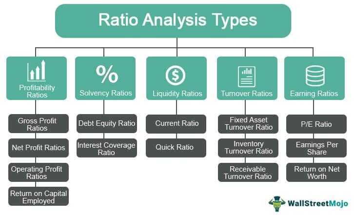

In the rapidly evolving world of finance, understanding key financial ratios is paramount for analyzing tech companies. These companies frequently encounter unique financial conditions, such as substantial research and development (R&D) expenses and initially low profitability, which render traditional financial analysis methods less effective. Financial ratios offer a structured approach to evaluating the financial health of tech companies, covering dimensions such as liquidity, profitability, and leverage.

Liquidity ratios gauge a company's capability to fulfill short-term obligations; profitability ratios assess the efficiency in generating income relative to sales and assets, while leverage ratios evaluate the degree of financial risk by comparing debt levels to equity. In tech firms where intangible assets and rapid reinvestment in innovation are common, these ratios help investors and analysts comprehend their financial dynamics and risks.



Moreover, the advent of algorithmic trading incorporates these financial ratios into trading strategies, employing algorithms to make trading decisions based on predefined criteria derived from these ratios. This integration not only accelerates trade execution but also enhances accuracy, particularly in volatile markets characterized by swift price movements. By automating the decision-making process, algorithmic trading can minimize human emotion-driven biases, improving outcomes based on systematic analysis.

This article examines the intersection of financial ratio analysis and algorithmic trading applied to tech companies, demonstrating how these tools collectively facilitate informed investment decisions in a complex and dynamic market environment.

## Table of Contents

## Understanding Financial Ratios

Financial ratios are quantitative metrics that allow stakeholders to assess a company's financial health and operational efficiency. These ratios provide insights into various dimensions of a company's performance, facilitating a comprehensive understanding of its financial standing. Each ratio is derived from a company's financial statements and serves a distinct purpose, offering glimpses into liquidity, profitability, and leverage, among other aspects.

In the context of liquidity, financial ratios measure a company's ability to meet its short-term obligations. Key liquidity ratios include the current ratio and the cash ratio. The current ratio is calculated as:

$$
\text{Current Ratio} = \frac{\text{Current Assets}}{\text{Current Liabilities}}
$$

This ratio indicates whether a company has enough resources to cover its short-term liabilities with its short-term assets. The cash ratio, a more stringent measure, is given by:

$$
\text{Cash Ratio} = \frac{\text{Cash and Cash Equivalents}}{\text{Current Liabilities}}
$$

This measures the firm's ability to pay off its current liabilities with only its most liquid assets, emphasizing immediate [liquidity](/wiki/liquidity-risk-premium).

Leverage ratios assess the degree to which a company utilizes borrowed funds. A primary example is the debt-to-equity ratio:

$$
\text{Debt-to-Equity Ratio} = \frac{\text{Total Debt}}{\text{Shareholders' Equity}}
$$

This ratio sheds light on the financial leverage of a company, indicating the relative proportion of shareholder equity and debt used to finance its assets. A higher ratio suggests a greater reliance on debt financing, which could entail higher risk.

Profitability ratios indicate a company’s ability to generate earnings relative to its revenue, assets, or equity. Key ratios in this category are the gross profit margin and net profit margin. The gross profit margin is expressed as:

$$
\text{Gross Profit Margin} = \frac{\text{Gross Profit}}{\text{Revenue}}
$$

This ratio reflects the portion of revenue that exceeds the cost of goods sold, offering a view of production efficiency. The net profit margin, calculated as:

$$
\text{Net Profit Margin} = \frac{\text{Net Income}}{\text{Revenue}}
$$

This metric assesses the overall profitability of a company, showing the percentage of revenue that translates into profit after all expenses. 

In the tech industry, these ratios are vital for investors and analysts aiming to make informed decisions. Tech companies frequently encounter unique challenges, such as high research and development costs and rapidly changing market dynamics. Consequently, financial ratios serve as crucial tools, enabling stakeholders to evaluate a company's liquidity position, leverage strategy, and profitability potential. Such analyses help determine a company's ability to navigate its financial obligations and sustain growth.

## Importance of Financial Ratios for Tech Companies

Tech companies stand apart from traditional business models due to their fast-paced growth, reliance on innovation, and significant investment in research and development (R&D). These companies often possess a substantial amount of intangible assets such as intellectual property and patents, which contrasts with the tangible assets typically found in more traditional industries. This unique financial landscape necessitates the use of financial ratios to decode and understand the fiscal health and operational efficiency of tech enterprises.

Tech companies frequently incur substantial R&D expenses, reflecting their commitment to innovation and long-term growth. These R&D investments can impact their immediate profitability but are crucial for maintaining competitive advantage. Financial ratios provide a lens through which investors and analysts can assess whether tech firms are optimizing their spending to fuel sustainable growth.

Moreover, financial ratios such as liquidity ratios play a crucial role in assessing a tech company's ability to meet short-term obligations. Liquidity ratios, including the Current Ratio and Quick Ratio, measure a company's capacity to cover its short-term liabilities with its short-term assets. These metrics are particularly pertinent for tech firms, which may face fluctuations in market demand and need to ensure financial resilience during periods of rapid change.

Analyzing leverage ratios, like the Debt-to-Equity Ratio, helps evaluate how tech companies manage their debt relative to their equity. Proper leverage management is essential as it can influence a company's risk profile and capacity to fund further growth without overextending financially.

Profitability ratios, such as the Gross Profit Margin and Net Profit Margin, offer insights into a tech company's ability to generate earnings relative to its expenditures and sales. These ratios are indicative of the firm's operational efficiency and effectiveness in converting R&D investments and innovative technology into profitable outcomes.

In the fast-evolving technology sector, financial ratios also provide vital information about strategic growth potential. Evaluating these metrics can reveal opportunities for strategic partnerships, mergers, and acquisitions, essential for maintaining a competitive edge. Additionally, financial ratios help determine the financial stability of tech companies amidst market [volatility](/wiki/volatility-trading-strategies) and shifting consumer trends.

In summary, financial ratios are indispensable tools for evaluating whether tech companies can sustain their growth trajectories, leverage their assets effectively, and maintain financial stability. This analysis aids investors, analysts, and company executives in making informed decisions about resource allocation, investment strategies, and operational improvements.

## Key Financial Ratios for Tech Companies

### Key Financial Ratios for Tech Companies

Financial ratios serve as fundamental metrics for assessing tech companies' financial health. These ratios are grouped into categories reflecting different aspects of financial performance: liquidity, leverage, and profitability.

**Liquidity Ratios**

Liquidity ratios are critical for determining a company's capacity to meet its short-term obligations. The two primary liquidity ratios are the Current Ratio and the Cash Ratio.

1. **Current Ratio**: This ratio is calculated by dividing a company's current assets by its current liabilities. It provides a quick view of whether the company has enough resources to cover its short-term liabilities.
$$
   \text{Current Ratio} = \frac{\text{Current Assets}}{\text{Current Liabilities}}

$$

2. **Cash Ratio**: More conservative than the current ratio, the cash ratio considers only the most liquid assets: cash and cash equivalents. It assesses a company's ability to pay off current liabilities without relying on the sale of inventory or receivables.
$$
   \text{Cash Ratio} = \frac{\text{Cash and Cash Equivalents}}{\text{Current Liabilities}}

$$

These ratios are particularly pertinent for tech companies, which might have fluctuations in cash flow due to high R&D expenses or revenue delays from long product development cycles.

**Leverage Ratios**

Leverage ratios provide insights into the extent of a company's debt and its ability to fulfill long-term obligations. A critical leverage ratio for tech firms is the Debt-to-Equity Ratio.

- **Debt-to-Equity Ratio**: This ratio measures the relative proportion of shareholders' equity and debt used to finance a company’s assets. It's calculated by dividing total liabilities by shareholders' equity. A higher ratio indicates greater leverage and thus higher financial risk.
$$
  \text{Debt-to-Equity Ratio} = \frac{\text{Total Liabilities}}{\text{Shareholders' Equity}}

$$

Tech companies need to balance debt with growth opportunities, making this ratio vital for assessing risk levels associated with financial leverage.

**Profitability Ratios**

Profitability ratios assess a company's ability to generate earnings relative to sales, assets, and equity. Key profitability ratios for tech companies include Gross Profit Margin and Net Profit Margin.

1. **Gross Profit Margin**: This metric indicates how well a company utilizes its revenues into gross profit. It is calculated by subtracting the cost of goods sold (COGS) from sales and dividing the result by sales.
$$
   \text{Gross Profit Margin} = \frac{\text{Sales} - \text{COGS}}{\text{Sales}}

$$

2. **Net Profit Margin**: This ratio represents the percentage of revenue that remains as profit after accounting for all expenses, taxes, and costs. It is given by dividing net income by total revenue.
$$
   \text{Net Profit Margin} = \frac{\text{Net Income}}{\text{Total Revenue}}

$$

Profitability ratios are essential indicators of financial performance, especially in the tech sector, where high initial costs can suppress short-term profitability but position companies for long-term growth based on innovation and market capture.

Understanding these key financial ratios enables investors and analysts to evaluate tech companies' short-term viability, long-term solvency, and overall financial health, facilitating better-informed investment and business decisions.

## Algorithmic Trading in Finance

Algorithmic trading uses computer algorithms to execute trades systematically based on predefined criteria, drastically improving the speed and precision of trading in financial markets. These algorithms are driven by a diverse array of data inputs, among which financial ratios play a pivotal role, providing quantifiable metrics for evaluating a company's financial status. By incorporating these ratios, [algorithmic trading](/wiki/algorithmic-trading) achieves a data-driven decision-making process that can identify market inefficiencies and streamline trade execution far beyond human capabilities.

Financial ratios such as the debt-to-equity ratio, current ratio, and gross profit margin serve as inputs for these algorithms, offering insights into a company's liquidity, leverage, and profitability. These ratios help algorithms make informed trading decisions by evaluating the relative financial strengths and weaknesses of a company in real-time. This capability allows traders to effectively assess opportunities for buying undervalued or selling overvalued stocks.

One of the significant advantages of algorithmic trading is its ability to reduce human emotional bias, often a key [factor](/wiki/factor-investing) in trading inefficiencies. By relying on objective financial ratio analysis, algorithms minimize the emotional responses that typically influence human traders, such as fear or greed. This objectivity leads to more consistent trading outcomes and can enhance portfolio performance.

Technological advancements in [artificial intelligence](/wiki/ai-artificial-intelligence) (AI) and [machine learning](/wiki/machine-learning) further amplify the impact of algorithmic trading. AI systems are capable of processing vast amounts of information at high speeds, identifying patterns and making predictions that might elude human analysis. Machine learning models can adapt by learning from historical trading data, refining their strategies for better accuracy and adaptability in predicting stock price movements.

Python is a popular programming language used in algorithmic trading due to its simplicity and extensive libraries geared towards data analysis and machine learning. For example, the following Python code uses the `pandas` library to calculate and optimize trades based on selected financial ratios:

```python
import pandas as pd

# Load financial data
data = pd.read_csv('financial_data.csv')

# Calculate key financial ratios
data['Current_Ratio'] = data['Current_Assets'] / data['Current_Liabilities']
data['Debt_to_Equity'] = data['Total_Debt'] / data['Shareholders_Equity']
data['Gross_Profit_Margin'] = data['Gross_Profit'] / data['Revenue']

# Define trading criteria
def trading_signal(row):
    if row['Current_Ratio'] > 1.5 and row['Debt_to_Equity'] < 2.0 and row['Gross_Profit_Margin'] > 0.3:
        return 'Buy'
    else:
        return 'Sell'

# Apply trading criteria to dataset
data['Signal'] = data.apply(trading_signal, axis=1)

# Output trading signals
print(data[['Company', 'Signal']])
```

This script evaluates companies based on their financial health using key ratios and generates trading signals accordingly. In summary, the integration of financial ratios into algorithmic trading not only optimizes trade execution but also paves the way for leveraging technological advancements, enhancing precision, and achieving superior trading performance.

## Integrating Financial Ratios into Algorithmic Trading

The integration of financial ratio analysis into algorithmic trading provides traders with quantitative metrics that enhance decision-making. At its core, algorithmic trading depends on precise data inputs to inform strategies, and financial ratios offer a valuable source of these inputs due to their ability to distill large volumes of financial data into concise metrics. For example, liquidity ratios such as the current ratio can be used to evaluate a company's short-term financial health, which can subsequently influence the decision to buy or sell securities within an algorithm.

Traders can craft algorithms that monitor these financial ratios in real-time, thereby allowing strategies to be dynamically adjusted according to evolving market conditions. This real-time capability is crucial, as it allows the detection of positions where assets might be undervalued or overvalued. In turn, this enables traders to capitalize on market inefficiencies, aligning algorithmic strategies with value investing principles.

Studies have demonstrated that incorporating financial ratios into algorithms can lead to enhanced trading outcomes. The inclusion of ratios not only improves returns but also serves as an effective tool for risk management. By systematically analyzing ratios like the debt-to-equity ratio or net profit margin, algorithms can identify companies with unsustainable debt loads or declining profitability, alerting traders to potential risks.

For instance, an algorithm might include the following Python snippet to evaluate whether a stock is undervalued based on the Price-to-Earnings (P/E) ratio compared to industry averages:

```python
def evaluate_undervalued_stock(pe_ratio, industry_avg_pe):
    if pe_ratio < industry_avg_pe:
        return True  # Stock might be undervalued
    return False

# Usage
stock_pe_ratio = 15
industry_avg_pe = 20
is_undervalued = evaluate_undervalued_stock(stock_pe_ratio, industry_avg_pe)
```

The ability to programmatically assess these ratios ensures that trades are executed based on objective, data-driven insights, reducing the likelihood of emotional biases affecting trading decisions. As technology progresses, the advanced integration of financial ratios into algorithmic models will be instrumental in refining both the precision and adaptability of trading strategies.

## Challenges and Considerations

Market volatility can greatly affect the usefulness of both financial ratio analysis and algorithmic trading strategies. Fluctuations in the market often lead to sudden changes in stock prices, affecting the predictive power of financial ratios. Algorithms, designed to interpret and act upon these ratios, may face limitations when confronted with unpredictable market swings, which can lead to suboptimal trading decisions.

Ensuring the quality of data and the continual updating of algorithms is crucial for maintaining their effectiveness amid economic shifts. Algorithms rely on accurate, up-to-date information to make informed decisions, and any discrepancies in data quality can result in significant trading errors. Regular data validation and system updates are necessary to adapt to new market conditions and emerging financial information.

Ethical considerations must also be addressed to uphold market integrity. Compliance with financial market regulations and ethical standards is essential to prevent manipulative practices and maintain investor trust. Financial institutions and traders are required to adhere to guidelines set by regulatory bodies, ensuring that algorithmic trading activities are conducted in a fair and transparent manner.

Backtesting remains an important process for verifying the robustness and reliability of algorithmic trading strategies. By simulating trades using historical data, traders can assess the potential effectiveness of their algorithms under varying market conditions. This process helps identify potential weaknesses and improve algorithmic performance before deployment in live trading. Backtesting provides a comprehensive understanding of how a strategy might perform, reducing the risks associated with algorithmic trading in volatile markets.

## Conclusion

Financial ratios serve as critical tools for assessing the financial health of technology companies. These metrics allow investors and analysts to gauge liquidity, profitability, and leverage, providing a comprehensive picture of a company's fiscal status. When financial ratios are integrated with algorithmic trading, there is a significant enhancement in decision-making capabilities, enabling traders to utilize data-driven insights for strategic advantage. 

Algorithmic trading, leveraging computational algorithms to execute trades based on predefined criteria, benefits notably from financial ratio inputs. This integration not only capitalizes on market inefficiencies but also mitigates human emotional biases, resulting in more objective trading outcomes.

The merging of financial analysis with computational trading strategies is indicative of a broader automation trend within finance. This shift underscores the increasing reliance on quantitative metrics and advanced algorithms to streamline trading processes and optimize returns. As technology continues to evolve, combining human insights with algorithmic precision will become increasingly crucial in trading, enhancing both efficiency and effectiveness. 

Financial markets demand a blend of analytical rigor and technological advancement to navigate the complexities of trading environments. Therefore, the continuous integration of financial ratios into algorithmic models is poised to offer traders a powerful toolkit for navigating these challenges and seizing opportunities in an ever-evolving market landscape.

## References & Further Reading

1. **ResearchGate: "Financial Ratio Analysis: A Useful Tool for Investment Analysis."** This research paper highlights the significance of financial ratios in evaluating investment opportunities. It demonstrates how these ratios can assist investors in making informed decisions based on a company's financial health and performance metrics.

2. **Cengage Learning: "Business Analysis and Valuation: Using Financial Statements."** This book serves as a comprehensive guide to understanding financial statements, crucial for evaluating tech companies. It provides detailed methodologies for analyzing financial data, enabling investors to assess company value and performance effectively.

3. **Journal of Finance: "Returns to Buying Winners and Selling Losers: Implications for Stock Market Efficiency."** This article examines the concept of momentum in stock trading, discussing its implications for market efficiency. It provides insights into how systematic trading strategies can exploit these market phenomena for potential gains.

4. **Wiley Trading: "High-Frequency Trading: A Practical Guide to Algorithmic Strategies and Trading Systems."** This guide explores the technical and strategic aspects of high-frequency trading. It discusses how financial ratios can be integrated into algorithmic trading systems to improve trading outcomes and risk management through automated, high-speed execution.

