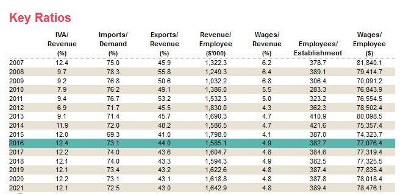

The automotive industry represents a significant portion of the global economy, with an estimated market valuation of $2.7 trillion in 2024. This expansive sector impacts economic structures worldwide, necessitating rigorous financial analysis for investors seeking to make informed decisions. Within this context, financial ratios serve as vital tools for comparing firms' performance across the industry. Three crucial financial ratios—Debt-to-Equity, Inventory Turnover, and Return on Equity—offer insights into a company's financial health, efficiency, and profitability. 

The Debt-to-Equity (D/E) ratio evaluates a company's financial leverage by comparing its total liabilities to its shareholder equity. An example formula is:



$$
\text{Debt-to-Equity Ratio} = \frac{\text{Total Liabilities}}{\text{Shareholder Equity}}
$$

Lower D/E ratios are generally preferred as they indicate a company relies less on borrowed funds, reducing financial risk.

The Inventory Turnover Ratio helps determine how effectively a company manages its inventory and generates sales from it. This ratio is calculated with:

$$
\text{Inventory Turnover Ratio} = \frac{\text{Cost of Goods Sold}}{\text{Average Inventory}}
$$

A high turnover suggests efficient sales and inventory management, while a low ratio may raise concerns about overstocking or weak sales.

Return on Equity (ROE) provides a measure of a company's profitability by illustrating how effectively it utilizes invested capital to generate earnings. Calculated as:

$$
\text{Return on Equity} = \frac{\text{Net Income}}{\text{Shareholder Equity}}
$$

A higher ROE indicates stronger financial performance and efficient use of equity capital.

These ratios offer a snapshot of a company's operational and financial performance, allowing stakeholders to compare it against industry peers. The integration of [algorithmic trading](/wiki/algorithmic-trading) further enhances the financial analysis by utilizing complex computational models to parse extensive datasets. This allows for the swift and precise execution of trades, leveraging patterns in financial data potentially overlooked during manual analysis. The synergy between traditional financial ratios and cutting-edge algorithmic techniques underscores a new era of strategic investment within the automotive market.

## Table of Contents

## Auto Industry Overview

The United States automotive industry is characterized by its substantial size and significant contribution to the national economy. As of 2023, the industry features 16 major auto manufacturers producing over 10.6 million vehicles annually. This output highlights the industrial capacity and technological advancements within the sector. 

A critical feature of the automotive industry is its capital-intensive nature, necessitating considerable investments in research and development (R&D). These investments are pivotal in driving innovation, improving vehicle technology, and maintaining competitive advantages in a rapidly evolving market. The R&D focus often extends to advancements in autonomous driving, electric vehicles (EVs), and connectivity, reflecting shifts in consumer preferences and regulatory demands towards sustainability and smart technology.

The auto industry serves as a barometer for consumer demand and economic well-being, accounting for approximately 3% of the United States' Gross Domestic Product (GDP). This makes the industry an essential contributor to the country's economic landscape, impacting employment, trade balances, and technological progress.

To effectively evaluate such a complex industry, various key financial ratios are employed. These ratios provide insights into the financial stability, profitability, and operational efficiency of firms within the sector. For instance, the Debt-to-Equity ratio assesses a company's financial leverage, while the Inventory Turnover ratio indicates how efficiently a company manages its stock and sales. Such metrics help investors and analysts gauge a company's performance relative to its peers.

The relationships between automakers and Original Equipment Manufacturers (OEMs) are crucial in achieving production efficiency. These partnerships are essential for coordinating supply chain activities and ensuring the seamless integration of components into the final product. Strong collaborations with OEMs can lead to reduced production costs, faster time-to-market, and enhanced product quality, all of which are vital in maintaining a competitive edge in the industry.

In conclusion, the United States automotive industry is a vital force within the economy, distinguished by its production capacity and substantial contributions to GDP. Its capital-intensive nature requires ongoing investments in innovation and strategic relationships with OEMs to sustain growth and adapt to changing market and technological landscapes.

## Understanding Financial Ratio Limitations

Financial ratios are widely used tools for evaluating company performance, but they are not without limitations. One important [factor](/wiki/factor-investing) to consider is that different companies may employ varying accounting methods, which can significantly affect the comparability of financial ratios. For example, differences in inventory valuation methods—such as First-In-First-Out (FIFO) versus Last-In-First-Out (LIFO)—can result in different calculations for metrics such as the Cost of Goods Sold (COGS) and, subsequently, the Inventory Turnover Ratio. This variability can lead to misleading conclusions if not carefully adjusted for.

Moreover, financial ratios are inherently historical, reflecting past performance rather than future prospects. This is particularly relevant as the automotive industry undergoes a considerable shift toward electric vehicles (EVs) and other technological advancements. These industry shifts may not be fully captured by traditional financial ratios, which primarily analyze past data. As a result, relying solely on these ratios may overlook emerging trends and market dynamics that are set to disrupt the industry landscape.

Economic conditions, such as recessions or booms, also play a significant role that is generally not factored into simple financial ratio analysis. For instance, changes in consumer spending habits or regulatory environments can materially affect an automotive company's performance but remain unaddressed within standard ratio frameworks. These economic and market shifts require supplementary qualitative analysis to gain a comprehensive understanding of a company's current and future viability.

A critical aspect often overlooked by financial ratios is the emphasis on short-term performance metrics. Ratios like Return on Equity (ROE) or Current Ratio provide snapshots of a company's health at a particular moment but can obscure longer-term investments such as Research and Development (R&D). The automotive sector relies heavily on R&D to maintain competitive advantage through technological innovation, which might not immediately reflect profitability but is crucial for long-term success.

Startups within the automotive industry add another layer of complexity to ratio analysis. Emerging companies often exhibit financial profiles characterized by high initial debt or negative earnings, which can produce alarming ratio values. These values might misrepresent their growth potential or innovative capabilities, especially when directly compared to established firms with more stable financial statements. For startups, traditional ratio analysis should be complemented with context regarding business model, market position, and future growth strategies.

In summary, while financial ratios offer valuable insights into company performance within the automotive industry, they should not be used in isolation. Adjustments for accounting methods, acknowledgment of historical data limitations, consideration of economic conditions, attention to long-term investments, and tailored analysis for startups are essential to leveraging these tools effectively.

## Key Financial Ratios in the Auto Industry

The financial health of automotive companies can be effectively assessed using key financial ratios, each offering unique insights into different facets of corporate performance. Among the most critical ratios are the Debt-to-Equity Ratio, the Inventory Turnover Ratio, and the Return on Equity (ROE) Ratio. 

### Debt-to-Equity Ratio

The Debt-to-Equity Ratio is a measure of a company's financial leverage, calculated by dividing its total liabilities by shareholders' equity. The formula is:

$$
\text{Debt-to-Equity Ratio} = \frac{\text{Total Liabilities}}{\text{Shareholders' Equity}}
$$

A lower Debt-to-Equity Ratio is generally favored by investors as it indicates a firm is using less borrowed money relative to its equity base, thus implying lower financial risk. In the capital-intensive automotive industry, where significant investments are often financed through debt, this ratio offers insight into a company's leverage and its ability to withstand financial strains.

### Inventory Turnover Ratio

The Inventory Turnover Ratio measures how efficiently a company manages its inventory, calculated by dividing the cost of goods sold (COGS) by the average inventory during a specific period:

$$
\text{Inventory Turnover Ratio} = \frac{\text{Cost of Goods Sold}}{\text{Average Inventory}}
$$

A higher Inventory Turnover Ratio suggests efficient inventory management and strong sales performance. However, an excessively high ratio might indicate insufficient inventory levels, potentially leading to missed sales opportunities. This ratio is crucial for automotive manufacturers, where inventory levels and sales efficiency are critical for operational success.

### Return on Equity Ratio

The Return on Equity (ROE) Ratio represents a company's profitability in relation to shareholders' equity, calculated using the formula:

$$
\text{Return on Equity} = \frac{\text{Net Income}}{\text{Shareholders' Equity}}
$$

ROE is a key indicator of how efficiently a company is generating profits from every unit of shareholder investment. In the automotive sector, which is typically characterized by large capital expenditures, a strong ROE reflects effective capital utilization and can greatly influence investor confidence.

### Contextual Analysis

While these ratios provide valuable snapshots of a company's financial status, a comprehensive analysis requires contextual understanding. Variations in accounting practices, industry conditions, and economic factors can affect these metrics, potentially skewing comparative evaluations. Additionally, the cyclical nature of the automotive industry necessitates a broader perspective when interpreting these figures.

### Alternative Metrics

Besides the primary ratios, other metrics such as Return on Assets (ROA) and Days Sales of Inventory (DSI) offer additional insights. ROA evaluates a company's ability to generate earnings from its assets, while DSI measures the average time inventory remains unsold. These alternative metrics can complement traditional ratios, providing a more rounded financial assessment.

Understanding and interpreting these key financial ratios is pivotal for stakeholders aiming to navigate the complexities of the automotive industry successfully. They not only help gauge company performance but also aid in recognizing potential financial risks and opportunities.

## Algorithmic Trading in the Auto Industry

Algorithmic trading, or algo trading, plays a transformative role in the auto industry by leveraging computational models for executing trades with minimal human intervention. This technique utilizes advanced algorithms that can analyze massive data sets swiftly, thereby significantly enhancing investment decisions within the automotive sector. In a market characterized by rapid changes and high complexity, the ability to process and interpret large volumes of financial information is crucial.

One of the primary advantages of algorithmic trading is its capacity to identify subtle patterns in financial data that might elude human analysis. By employing sophisticated modeling techniques, algorithms can discern trends and correlations that inform more accurate predictions of market movements. For instance, changes in key financial ratios such as Debt-to-Equity or Return on Equity can be evaluated in real time, allowing for timely investment decisions.

Moreover, algorithmic trading significantly boosts the speed and efficiency of trading activities based on financial ratio performance. Traditional trading, which relies heavily on manual analysis, is often slower and susceptible to human error. In contrast, algorithms can execute trades within milliseconds, capitalizing on market opportunities as they arise. This rapid execution capability is particularly beneficial in the auto industry, where market conditions can shift swiftly due to factors like technological advancements and regulatory changes.

Algorithmic trading provides a competitive edge in investment strategies by optimizing trade execution and reducing transaction costs. Algorithms can be programmed to minimize market impact, calculate optimal trade timing, and execute split orders to achieve the best possible return. Python, a popular programming language, is often employed to develop these algorithms due to its extensive libraries and ease of use for data analysis.

```python
import numpy as np
import pandas as pd
from sklearn.linear_model import LinearRegression

# Example: Quick analysis of historical financial data to predict stock price
data = pd.read_csv('historical_data.csv')
X = data[['Debt_to_Equity', 'Inventory_Turnover', 'Return_on_Equity']]
y = data['Stock_Price']

model = LinearRegression()
model.fit(X, y)

predicted_price = model.predict(np.array([[0.5, 5.0, 0.2]]))  # Sample input values for financial ratios
print("Predicted Stock Price:", predicted_price)
```

In summary, algorithmic trading is a powerful tool that enhances investment decision-making by rapidly processing complex financial data. When used effectively, it not only improves the accuracy of predicting market trends but also provides a strategic advantage by ensuring efficient trade execution. As the auto industry continues to evolve, integrating algorithmic trading with financial ratio analysis will become increasingly vital for investors seeking to optimize their portfolios.

## Conclusion

Financial ratios are indispensable tools for evaluating the financial health of automotive companies. These metrics, such as Debt-to-Equity, Inventory Turnover, and Return on Equity, provide a quick overview of a company's operational efficiency, financial leverage, and profitability. However, their effective application requires a thorough understanding of their inherent limitations. Financial ratios are based on historical data and can be influenced by accounting practices, which may not necessarily predict future trends, particularly with the industry's rapid shift towards electric vehicles.

Algorithmic trading marks a significant advancement in financial analysis, leveraging computational models to execute trades with minimal human intervention. By analyzing extensive datasets, algorithms can detect patterns and insights that might escape human scrutiny, leading to more informed and quicker investment decisions. In the automotive sector, this capability allows investors to rapidly adapt to changes in financial ratios, providing a competitive edge.

The integration of financial ratio analysis with algorithmic techniques exemplifies a modern approach to investment strategy. By combining these tools, investors can enhance their decision-making processes, achieving a more nuanced understanding of the automotive industry. This synergy between traditional financial metrics and modern computational methods ensures that strategic insights are both robust and responsive to the evolving market landscape, ultimately facilitating more effective investment strategies.

## References & Further Reading

[1]: ["Evaluating Financial Health with Financial Ratios"](https://www.investopedia.com/articles/investing/061916/what-best-measure-companys-financial-health.asp) by CFA Institute

[2]: Damodaran, A. (2012). ["Investment Valuation: Tools and Techniques for Determining the Value of Any Asset"](https://www.amazon.com/Investment-Valuation-Tools-Techniques-Determining/dp/111801152X). Wiley Finance.

[3]: ["Automobile Industry Value Chain – A Demystification"](https://www2.deloitte.com/us/en/insights/industry/automotive/automotive-industry-value-chain.html) by Alok Raj and Puneet Saraswat

[4]: ["Advances in Financial Machine Learning"](https://www.wiley.com/en-us/Advances+in+Financial+Machine+Learning-p-9781119482086) by Marcos Lopez de Prado

[5]: ["Algorithmic Trading: Winning Strategies and Their Rationale"](https://www.wiley.com/en-us/Algorithmic+Trading%3A+Winning+Strategies+and+Their+Rationale-p-9781118460146) by Ernest P. Chan