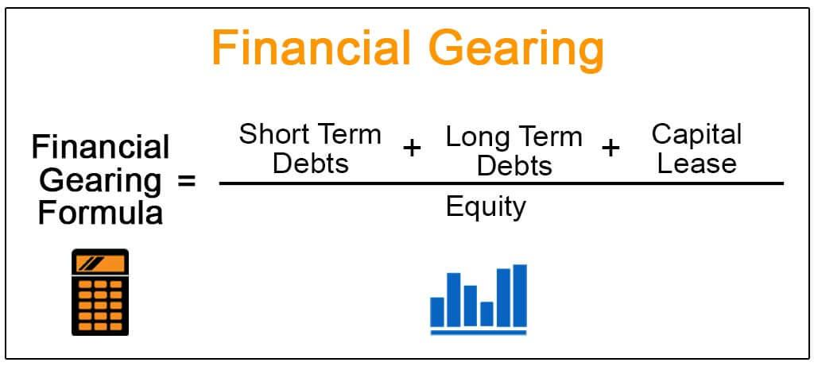

## Table of Contents

## What are financial ratios and why are they important in the automotive industry?

Financial ratios are numbers that help people understand a company's financial health by comparing different parts of its financial statements. They show things like how much money a company makes, how much it owes, and how well it uses its resources. In the automotive industry, these ratios are important because making cars is expensive and involves a lot of money. Companies need to know if they are making enough money to pay for their costs and if they can keep making cars in the future.

In the automotive industry, financial ratios help investors and managers see if a company is doing well. For example, the debt-to-equity ratio shows how much money a company has borrowed compared to what it owns. If this number is too high, it might mean the company is taking too many risks. Another important ratio is the profit margin, which shows how much money the company keeps from each car it sells. A good profit margin means the company is efficient and can grow. By looking at these ratios, people in the automotive industry can make better decisions about where to invest and how to manage their business.

## How do financial ratios help in assessing the financial health of automotive companies?

Financial ratios help in assessing the financial health of automotive companies by giving a clear picture of their performance and stability. For example, the current ratio, which compares a company's current assets to its current liabilities, shows if the company can pay its short-term debts. If the current ratio is high, it means the company has enough money to cover its bills, which is good. If it's low, the company might struggle to pay what it owes, which is a warning sign.

Another important ratio is the return on assets (ROA), which tells us how well a company is using its resources to make money. In the automotive industry, where factories and machinery are expensive, a high ROA means the company is doing a good job of turning its investments into profits. On the other hand, the debt-to-equity ratio helps us understand how much the company relies on borrowed money. A high debt-to-equity ratio might mean the company is taking on too much risk, which could be dangerous if the car market changes.

By looking at these ratios, investors and managers can see if an automotive company is strong or if it needs to make changes. For instance, if a company's profit margin is low, it might need to find ways to cut costs or increase the prices of its cars. These ratios give a quick and easy way to compare different companies and make smart decisions about where to invest or how to improve the business.

## What are the most common financial ratios used in the automotive sector?

In the automotive sector, some of the most common financial ratios used are the current ratio, debt-to-equity ratio, and profit margin. The current ratio helps to see if a company can pay its short-term bills by comparing its current assets to its current liabilities. A high current ratio means the company has enough money to cover its debts, which is good. The debt-to-equity ratio shows how much money a company has borrowed compared to what it owns. If this ratio is high, it might mean the company is taking too many risks by borrowing a lot of money.

Another important ratio is the profit margin, which tells us how much money the company keeps from each car it sells. A high profit margin means the company is efficient and can grow. The return on assets (ROA) is also used a lot in the automotive industry. It shows how well a company is using its resources, like factories and machinery, to make money. A high ROA means the company is doing a good job of turning its investments into profits. These ratios help investors and managers understand if an automotive company is strong or if it needs to make changes to improve its financial health.

## How can liquidity ratios like the current ratio and quick ratio be applied to automotive companies?

Liquidity ratios like the current ratio and quick ratio are important for automotive companies because they show if a company has enough money to pay its short-term bills. The current ratio is found by dividing a company's current assets by its current liabilities. For an automotive company, current assets might include cash, inventory of cars, and parts ready to be used. Current liabilities could be money owed to suppliers or short-term loans. If the current ratio is high, it means the company has more than enough money to pay its bills, which is good. If it's low, the company might struggle to pay what it owes, which could be a problem.

The quick ratio is similar but even stricter. It's calculated by taking current assets but leaving out inventory, and then dividing that by current liabilities. In the automotive industry, inventory includes cars that are ready to be sold or parts waiting to be put together. The quick ratio shows if a company can pay its bills quickly, without having to sell its inventory first. This is important because selling cars can take time, and if a company needs money right away, it might be in trouble if it relies too much on its inventory. By using both the current ratio and the quick ratio, investors and managers can see how well an automotive company can handle its short-term financial needs.

## What do profitability ratios such as gross profit margin and net profit margin tell us about automotive firms?

Profitability ratios like the gross profit margin and net profit margin help us understand how well automotive firms are making money. The gross profit margin shows the money a company keeps after paying for the costs to make the cars. It's found by taking the revenue from selling cars and subtracting the cost of making them, then dividing by the revenue. A high gross profit margin means the company is good at keeping costs low while selling cars for a good price. If it's low, the company might be spending too much to make each car or not charging enough when they sell them.

The net profit margin goes a step further. It tells us how much money the company keeps after paying all its costs, not just the costs to make the cars. This includes things like salaries, rent, and taxes. To find the net profit margin, you take the company's total profit and divide it by its total revenue. A high net profit margin means the company is doing a great job of managing all its costs and still making a good profit. If it's low, the company might need to look at all its expenses and see where it can save money or find ways to increase its revenue. Both these ratios help investors and managers see if an automotive firm is making enough money to stay healthy and grow.

## How do efficiency ratios, like inventory turnover and asset turnover, reflect the operational performance of automotive companies?

Efficiency ratios like inventory turnover and asset turnover tell us how well automotive companies are using their resources to make and sell cars. Inventory turnover shows how quickly a company sells the cars it makes. It's found by dividing the cost of goods sold by the average inventory. A high inventory turnover means the company is selling cars fast, which is good because it means they're not sitting around in the lot. If the inventory turnover is low, it might mean the company is making more cars than people want to buy, or they're not selling them fast enough. This can be a problem because it ties up money in cars that aren't moving.

Asset turnover is another important ratio. It shows how well a company is using all its assets, like factories and machinery, to make money. You find it by dividing the company's total sales by its total assets. A high asset turnover means the company is using its resources well to sell a lot of cars. If it's low, the company might have too many assets that aren't helping to make money. In the automotive industry, where factories and equipment are very expensive, a good asset turnover is important for showing that the company is efficient and can keep making and selling cars profitably.

## What role do solvency ratios, such as debt to equity and interest coverage ratio, play in evaluating automotive industry stability?

Solvency ratios, like the debt to equity ratio and the interest coverage ratio, help us see if automotive companies can pay their long-term debts. The debt to equity ratio shows how much money a company has borrowed compared to what it owns. If this ratio is high, it means the company is using a lot of borrowed money to run its business. This can be risky because if the car market changes, the company might have trouble paying back what it owes. A low debt to equity ratio is better because it means the company is not relying too much on borrowed money and is more stable.

The interest coverage ratio tells us if a company can pay the interest on its debts. It's found by dividing the company's earnings before interest and taxes by the interest it has to pay. A high interest coverage ratio means the company is making enough money to easily pay its interest, which is good. If the ratio is low, the company might struggle to pay its interest, which could be a sign of trouble. In the automotive industry, where making cars costs a lot of money, these solvency ratios are important for showing if a company is stable and can keep going even if things get tough.

## How can investors use market value ratios like P/E ratio and market to book ratio to make decisions in the automotive sector?

Investors use the P/E ratio, which stands for price to earnings ratio, to see if a car company's stock is a good deal. The P/E ratio is found by taking the price of one share of the company's stock and dividing it by the earnings per share. A low P/E ratio might mean the stock is cheap compared to how much money the company makes. This could be a good time to buy the stock. But, a high P/E ratio might mean the stock is expensive. Investors need to be careful because a high P/E ratio could mean the stock is overvalued, or it could mean people expect the company to grow a lot in the future.

The market to book ratio is another tool investors use. It compares the market value of the company to its book value, which is what the company would be worth if it sold all its assets and paid off all its debts. The market to book ratio is calculated by dividing the market value per share by the book value per share. A high market to book ratio might mean investors think the company will do well in the future and are willing to pay more for its stock. A low market to book ratio could mean the stock is undervalued, or it could mean investors are worried about the company's future. By looking at these ratios, investors can make better choices about which car companies to invest in.

## What are some industry-specific financial ratios unique to the automotive industry and how are they calculated?

In the automotive industry, one unique ratio is the sales per employee ratio. This ratio tells us how much money each worker helps the company make. To find it, you take the total sales of the company and divide it by the number of employees. A high sales per employee ratio means the company is good at using its workers to make money. If it's low, the company might need to find ways to help its workers sell more cars or make them more efficient.

Another specific ratio is the vehicle inventory days on hand. This ratio shows how many days it takes for the company to sell all the cars it has in stock. You calculate it by taking the average inventory of vehicles and dividing it by the average daily sales of vehicles. A lower number of days on hand is better because it means the company is selling its cars quickly. If the number is high, it might mean the company is having trouble selling its cars and they're sitting in the lot for too long.

## How have financial ratios in the automotive industry evolved over the past decade, and what trends can we observe?

Over the past decade, financial ratios in the automotive industry have shown some big changes. One trend we see is that companies are trying to be more efficient. The inventory turnover ratio has gone up for many companies, which means they're selling cars faster than before. This is good because it shows that car makers are getting better at matching what they make with what people want to buy. At the same time, the asset turnover ratio has also improved for some companies, showing that they're using their factories and machines more effectively to make money.

Another trend is that the debt to equity ratio has been changing a lot. Some companies have borrowed more money to grow, especially to invest in new technology like electric cars. This has made their debt to equity ratio higher, which can be risky if the car market changes. On the other hand, other companies have tried to pay down their debts to be more stable, which makes their debt to equity ratio lower. Profitability ratios like the gross profit margin and net profit margin have been up and down, depending on how well companies can control their costs and how much people are willing to pay for cars.

## Can you provide a case study of how financial ratios were used to analyze a major automotive company's performance?

Let's look at how financial ratios helped understand the performance of Ford Motor Company over the last few years. Ford, like many car companies, has been trying to make electric cars and keep up with changes in what people want. By looking at the inventory turnover ratio, we can see that Ford has been getting better at selling cars quickly. A few years ago, their inventory turnover was lower, which meant cars were sitting in lots for longer. But as they focused on making cars that people wanted to buy, the inventory turnover went up, showing that Ford was selling cars faster and not keeping too many unsold cars around.

Another important ratio is the debt to equity ratio. Ford has been borrowing money to invest in new technology and electric cars. This made their debt to equity ratio higher than before. While this can be risky because it means Ford has more debt to pay back, it also shows they're trying to grow and stay competitive. On the profitability side, Ford's gross profit margin has been going up and down. A few years ago, it was lower because of high costs to make cars. But as Ford found ways to cut costs and sell cars at better prices, their gross profit margin got better. By looking at these ratios, investors and managers can see that Ford is working hard to be more efficient and keep up with changes in the car industry.

## What advanced analytical techniques can be applied to financial ratios to predict future performance in the automotive industry?

One advanced technique that can help predict future performance in the automotive industry is called trend analysis. This means looking at financial ratios over time to see if they are going up, down, or staying the same. For example, if a car company's inventory turnover ratio has been getting better every year, it might mean they will keep selling cars quickly in the future. By using computers and special math, analysts can make charts and graphs to see these trends more clearly. This helps them guess if a company will do well or if it might have problems.

Another technique is called regression analysis. This is a bit more complicated, but it helps predict how one thing, like a financial ratio, might affect another thing, like how much money a company makes. For example, if a car company's debt to equity ratio goes up, regression analysis can help see if this might make their profits go down in the future. By using this method, analysts can make better guesses about what might happen next. This can help investors decide if they should buy or sell a company's stock, and it can help managers make plans to keep their company strong.

## What are the key financial ratios in the auto industry?

The financial health of automotive companies can be effectively assessed using key financial ratios, each offering unique insights into different facets of corporate performance. Among the most critical ratios are the Debt-to-Equity Ratio, the Inventory Turnover Ratio, and the Return on Equity (ROE) Ratio. 

### Debt-to-Equity Ratio

The Debt-to-Equity Ratio is a measure of a company's financial leverage, calculated by dividing its total liabilities by shareholders' equity. The formula is:

$$
\text{Debt-to-Equity Ratio} = \frac{\text{Total Liabilities}}{\text{Shareholders' Equity}}
$$

A lower Debt-to-Equity Ratio is generally favored by investors as it indicates a firm is using less borrowed money relative to its equity base, thus implying lower financial risk. In the capital-intensive automotive industry, where significant investments are often financed through debt, this ratio offers insight into a company's leverage and its ability to withstand financial strains.

### Inventory Turnover Ratio

The Inventory Turnover Ratio measures how efficiently a company manages its inventory, calculated by dividing the cost of goods sold (COGS) by the average inventory during a specific period:

$$
\text{Inventory Turnover Ratio} = \frac{\text{Cost of Goods Sold}}{\text{Average Inventory}}
$$

A higher Inventory Turnover Ratio suggests efficient inventory management and strong sales performance. However, an excessively high ratio might indicate insufficient inventory levels, potentially leading to missed sales opportunities. This ratio is crucial for automotive manufacturers, where inventory levels and sales efficiency are critical for operational success.

### Return on Equity Ratio

The Return on Equity (ROE) Ratio represents a company's profitability in relation to shareholders' equity, calculated using the formula:

$$
\text{Return on Equity} = \frac{\text{Net Income}}{\text{Shareholders' Equity}}
$$

ROE is a key indicator of how efficiently a company is generating profits from every unit of shareholder investment. In the automotive sector, which is typically characterized by large capital expenditures, a strong ROE reflects effective capital utilization and can greatly influence investor confidence.

### Contextual Analysis

While these ratios provide valuable snapshots of a company's financial status, a comprehensive analysis requires contextual understanding. Variations in accounting practices, industry conditions, and economic factors can affect these metrics, potentially skewing comparative evaluations. Additionally, the cyclical nature of the automotive industry necessitates a broader perspective when interpreting these figures.

### Alternative Metrics

Besides the primary ratios, other metrics such as Return on Assets (ROA) and Days Sales of Inventory (DSI) offer additional insights. ROA evaluates a company's ability to generate earnings from its assets, while DSI measures the average time inventory remains unsold. These alternative metrics can complement traditional ratios, providing a more rounded financial assessment.

Understanding and interpreting these key financial ratios is pivotal for stakeholders aiming to navigate the complexities of the automotive industry successfully. They not only help gauge company performance but also aid in recognizing potential financial risks and opportunities.

## References & Further Reading

[1]: ["Evaluating Financial Health with Financial Ratios"](https://www.investopedia.com/articles/investing/061916/what-best-measure-companys-financial-health.asp) by CFA Institute

[2]: Damodaran, A. (2012). ["Investment Valuation: Tools and Techniques for Determining the Value of Any Asset"](https://www.amazon.com/Investment-Valuation-Tools-Techniques-Determining/dp/111801152X). Wiley Finance.

[3]: ["Automobile Industry Value Chain – A Demystification"](https://www2.deloitte.com/us/en/insights/industry/automotive/automotive-industry-value-chain.html) by Alok Raj and Puneet Saraswat

[4]: ["Advances in Financial Machine Learning"](https://www.wiley.com/en-us/Advances+in+Financial+Machine+Learning-p-9781119482086) by Marcos Lopez de Prado

[5]: ["Algorithmic Trading: Winning Strategies and Their Rationale"](https://www.wiley.com/en-us/Algorithmic+Trading%3A+Winning+Strategies+and+Their+Rationale-p-9781118460146) by Ernest P. Chan